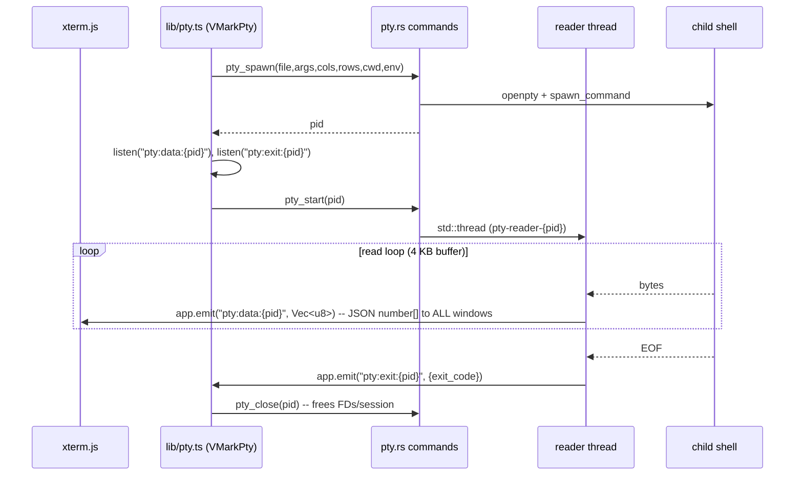

# Terminal Integration Audit — Gaps, Bugs, and the Road to "Industrial Best"

> Created: 2026-05-31
> Status: **Active / Draft** — analysis only, no code changed.
> Scope: VMark's integrated terminal — Rust PTY backend (`src-tauri/src/pty.rs`),
> the event-based IPC wrapper (`src/lib/pty.ts`), the xterm.js factory and its
> addons (`src/components/Terminal/*`), session orchestration, settings, and
> shell discovery (`src-tauri/src/lib.rs`).
> Method: full read of every terminal source file + grep-verified absence claims.
> Findings carry `file:line` evidence. Calibration notes (what was *not* verified)
> are in §8.
> Benchmark bar: VS Code integrated terminal, Ghostty, WezTerm, iTerm2, Warp.

---

## 1. Executive summary

VMark's terminal is **well above the typical "embedded terminal in a desktop
app" bar.** The lifecycle hygiene is genuinely good: two-phase spawn to close
the data-loss race, real `Condvar`-based pause/resume, panic-safe reader threads
that emit a synthetic exit so the UI never hangs, an explicit `pty_close` to
prevent FD leaks (#974), defense-in-depth absolute-shell-path validation,
careful CJK/IME handling, WCAG per-cell contrast lifting, and a dual-layer WebGL
context-loss recovery that is more robust than most shipping terminals.

Measured against *industrial-best* terminals, the gaps fall into four buckets:

1. **Throughput architecture (P0).** PTY output crosses the IPC boundary as a
   JSON array of numbers and is broadcast to every window. This is the real
   performance ceiling; the watermark flow-control is a band-aid over an
   encoding that should not exist.
2. **Process lifecycle (P1).** Force-kill is SIGKILL-on-the-shell only; the
   grace/process-group story is incomplete (though closer to standard behavior
   than first assumed — see §4).
3. **Correctness papercuts (P1).** File links parse `:line:col` then discard it;
   PTY input is `String`-only; sessions don't survive restart.
4. **Missing modern capabilities (P1–P2).** No shell integration (OSC 133), no
   cwd tracking (OSC 7), no OSC 8 hyperlinks, no title/activity surfacing, no
   scrollback persistence (the `SerializeAddon` is loaded but never called), no
   splits, a hard 5-session cap.

None of this is alarming. The foundation is sound enough that the path to
"industrial best" is **additive**, not a rewrite. The single highest-leverage
change is the IPC encoding (T1).

---

## 2. How it works today (data path)

Input path: xterm `onData` / IME commit → `pty_write(pid, String)` →
`writer.write_all(bytes)`. Resize is debounced 100 ms then `pty_resize`.
Flow control: `wirePtyFlowControl` pauses the PTY (`pty_pause`) when pending
`term.write` callbacks exceed a high watermark, resumes below a low watermark.

---

## 3. P0 — Throughput architecture

### T1 — PTY output is serialized as a JSON number array  ⚠️ High impact

**Evidence.** `pty.rs:265` `app.emit(&data_event, buf[..n].to_vec())`. The
frontend's own comment spells out the cost — `spawnPty.ts:128`:
*"Tauri event IPC serializes Rust `Vec<u8>` as a JSON number array, not a typed
array."* `lib/pty.ts:144` listens for `number[]` and `spawnPty.ts:131` coerces
back to `Uint8Array`.

**Mechanism.** Each output byte becomes up to 4 ASCII characters in transit
(`"255,"`) plus JSON-parse allocation and GC pressure on the JS side. A 1 MB
build log or `cat` becomes multiple MB of JSON to encode, transmit, parse, and
re-pack into a typed array. The watermark flow-control in `wirePtyFlowControl`
(`spawnPty.ts:117`) exists primarily to stop xterm choking on this stream — it
is treating a symptom.

**Measured (WI-0.1, `src/bench/terminal.bench.ts`, 2026-05-31).** Quantified
in-process — see `dev-docs/grills/terminal/throughput-baseline.md`:
- **Wire size: a flat 3.66×** blow-up (binary → JSON number array), independent
  of payload size. A 10 MB drain is physically transmitted as ~36.6 MB.
- **Encode CPU (producer): 255× (256 KB) → 1148× (1 MB)** slower than binary
  passthrough.
- **Decode CPU (consumer): 202× (4 KB) → 783× (1 MB)** slower than
  `new Uint8Array(arrayBuffer)`; round-trip 2284× at 256 KB.

These are the isolated encode/parse CPU costs, not end-to-end latency (which the
binary path also helps via 3.66× less data); the practical end-to-end win will
be large but well below the CPU ratios. **The original "5–10×" estimate below
understated the CPU component.**

**Why it matters for "industrial best."** Native terminals push raw bytes from
the PTY to the renderer. VS Code uses a binary protocol; Ghostty/WezTerm are
zero-copy. Anything that emits fast (build tools, `claude-code` redraws, `htop`,
progress bars) is exactly the workload this encoding punishes most.

**Fix.** Move output onto a **Tauri v2 `tauri::ipc::Channel<&[u8]>`** (or a custom
URI-scheme stream). The Channel API transfers an `ArrayBuffer` with no JSON
round-trip — `term.write(Uint8Array)` consumes it directly. There is **no
existing `Channel` precedent in this codebase** (grep: zero hits in `src` and
`src-tauri/src`), so this introduces a new pattern — worth an ADR. Expectation:
most of the flow-control complexity can then be deleted or simplified, because
xterm's own `write(data, callback)` backpressure becomes sufficient.

### T2 — Output is broadcast to every window

**Evidence.** `pty.rs:265` uses `app.emit(...)`, which in Tauri v2 delivers to
**all** webviews. The event name is pid-namespaced, so other windows' listeners
ignore the payload — but they still pay the deserialization cost.

**Mechanism.** With two document windows each running a terminal, every output
chunk of terminal A is JSON-decoded in window B (and discarded). N windows → N×
the wasted IPC.

**Fix.** `app.emit_to(window_label, ...)`. The frontend already knows its label
(`getCurrentWindowLabel()` in `spawnPty.ts:49`); thread it through `pty_spawn`
and store it on `Session`, then target emits. Folds naturally into the T1
Channel migration (a Channel is inherently point-to-point, so T1 fixes T2 for
free).

### T3 — 4 KB reader buffer, no coalescing

**Evidence.** `pty.rs:253` `let mut buf = vec![0u8; 4096];` → one emit per ≤4 KB.

**Mechanism.** High-throughput output fragments into thousands of small events,
each an IPC crossing. A 32–64 KB buffer (and/or a short coalescing window)
cuts event count ~10×. Cheap; compounds with T1/T2.

**Fix.** Enlarge the buffer; optionally accumulate for ≤~2 ms or until a size
threshold before emitting.

---

## 4. P1 — Process lifecycle

### L1 — Force-kill is SIGKILL-on-the-shell; group/grace story incomplete

**Evidence.** `pty_kill` (`pty.rs:332`) calls `killer.kill()`
(`portable-pty 0.9`), which `SIGKILL`s the shell PID. The `Drop` path
(`pty.rs:100`) does the same on app exit.

**Calibrated assessment.** This is **closer to standard behavior than the first
pass implied.** When the master PTY is dropped in `pty_close` (`pty.rs:343`,
removing the `Session` and its `master`), the kernel sends `SIGHUP` to the
terminal's foreground process group — so *foreground* children typically die.
The real residual gap is narrower:

- A `SIGKILL`'d shell never runs its `EXIT`/`trap` handlers, so it can't
  forward signals to its own jobs before dying.
- **Backgrounded / disowned / `setsid` grandchildren** (a `node` server started
  with `&`, a daemonized process) are not in the foreground group and can
  survive as orphans.
- Ordering: `pty_kill` and `pty_close` are separate frontend-driven calls; on
  the natural-exit path `pty_close` runs from the exit handler, but on a forced
  tab-close the SIGHUP-via-master-drop only lands once `pty_close` executes.

**Fix (Unix, best-effort).** Spawn the shell as a session/process-group leader
and, on kill, send `SIGHUP`/`SIGTERM` to the **process group** (`killpg`) with a
short grace before `SIGKILL`. This matches what iTerm2/Terminal.app do on tab
close. Per project policy (macOS primary), gate Windows behavior behind
`cfg!`. **Lower priority than T1** and worth a 5-minute empirical check first
(see §8).

### L2 — `pty_write` accepts only `String`

**Evidence.** `pty.rs:299` `pub async fn pty_write(pid, data: String, ...)`;
`writer.write_all(data.as_bytes())`.

**Mechanism.** Input must be valid UTF-8. Pasting binary content, or forwarding
byte sequences that aren't valid UTF-8, fails silently. Low frequency in
practice (almost all keyboard/paste input is UTF-8), but not strictly correct —
a true terminal is byte-transparent on input.

**Fix.** Accept `Vec<u8>` (bytes) for `pty_write`; the frontend already deals in
`Uint8Array` on the output side, so symmetry is natural. Pairs with T1.

---

## 5. P1 — Correctness papercuts

### C1 — File links parse `:line:col`, then throw it away

**Evidence.** `fileLinkProvider.ts:34` regex captures line (group 2) and column
(group 3). But `fileLinkProvider.ts:94` calls `onActivate(resolved)` with the
**path only**, and `setupFileLinks.ts:48` opens the file via `createTab` +
`initDocument` with no line argument. Clicking `src/main.ts:42:8` opens the file
**at the top**, not line 42.

**Mechanism.** The information is already parsed and discarded — this is a
plumbing gap, not a detection gap. Every modern terminal jumps to
`file:line:col` (it's the primary value of clickable compiler/linter output).

**Fix.** Carry `{ path, line, col }` through `onActivate` → `createTab` → an
editor go-to-line command (the editor already supports caret placement;
the outline/heading navigation proves the capability exists).

### C2 — Relative file links resolve against workspace root, not the shell's cwd

**Evidence.** `fileLinkProvider.ts:47` resolves relative paths against
`useWorkspaceStore.getState().rootPath`.

**Mechanism.** With no cwd tracking (see M2/OSC 7), a relative path like
`./build/foo.ts:3` emitted while the shell is `cd`'d into a subdirectory
resolves against the workspace root and opens the wrong file (or nothing). The
`cd`-injection in `terminalSessionStoreSync.ts:80` is also blind to where the
user has actually navigated.

**Fix.** Track cwd via OSC 7 (M2); resolve relative links against the live cwd,
falling back to workspace root.

### C3 — Terminal sessions do not survive restart

**Evidence.** `useUIStore = create<UIStore>(...)` (`uiStore.ts:273`) — **no
`persist` middleware** (grep: zero `persist`/`partialize`/`createJSONStorage`
hits in `uiStore.ts`). `initialTerminal = { sessions: [], activeSessionId: null }`
(`uiStore.ts`). The "hot-exit restore" comment in `useTerminalSessions.ts:367`
refers to sessions already present *at hook-mount time within a session*, not to
disk persistence.

**Mechanism.** On app restart the terminal panel opens empty — neither tab
count, names, nor (obviously) scrollback are restored. The `SerializeAddon` is
**loaded but never called** (`createTerminalInstance.ts:157` constructs it,
exposes it on the instance, and nothing ever invokes `serialize()` — grep
confirms no `.serialize(` call in non-test code). It is dead weight today.

**Fix (two independent decisions).**
- *Tab/layout restore:* persist the `terminal` slice (session list + active id +
  panel size) — small, high-value.
- *Scrollback restore:* either wire `serializeAddon.serialize()` into the
  persistence path (write on hide/quit, `term.write()` the blob on restore), or
  delete the addon. Don't keep an unused dependency loaded per instance.

---

## 6. P1–P2 — Missing capabilities that define a modern terminal

Ranked by user-visible value. All confirmed absent via grep across `src` +
`src-tauri/src` (`]133`, `]7;`, `]8;`, `registerOscHandler`, `onTitleChange`).

### M1 — Shell integration (OSC 133 / FinalTerm marks)  ★ biggest gap

No command boundaries are tracked. That single absence removes a whole class of
features that VS Code, Warp, WezTerm, and Ghostty all ship:

- jump to previous / next prompt;
- per-command exit-status gutter decorations (green/red);
- command duration;
- "select / copy last command output";
- sticky-scroll of the running command;
- "did command N fail?" surfaced to the UI.

**Mechanism.** Inject `precmd`/`preexec` hooks into the user's rc (zsh/bash/fish)
that emit `OSC 133 ; A|B|C|D`, and register
`term.parser.registerOscHandler(133, handler)` (you already set
`allowProposedApi: true`, `createTerminalInstance.ts:148`). VS Code's
shell-integration scripts are a proven reference design.

**Effort.** Largest item here, but it is *the* feature that earns the
"industrial best" claim.

### M2 — cwd tracking (OSC 7)

cwd is resolved **once at spawn** (`resolveTerminalCwd`, `spawnPty.ts:58`) and
never updated. Consequences cascade into C2 (file links), the workspace-`cd`
injection, and any future "open new terminal in current directory."

**Fix.** `registerOscHandler(7, ...)` to capture `file://host/path`; store live
cwd on the session. Pairs with M1 (same rc-hook mechanism).

### M3 — OSC 8 hyperlinks

`setupWebLinks.ts` only regex-detects bare URLs via `WebLinksAddon`. Explicit
OSC 8 hyperlinks — emitted by `ls --hyperlink`, `gcc`, `npm`, `gh`, and many
modern CLIs — are not rendered clickable.

**Fix.** xterm supports OSC 8 natively under `allowProposedApi`; register a link
handler that reuses the existing `SAFE_LINK_SCHEMES` allowlist
(`setupWebLinks.ts:23`).

### M4 — No title / activity surfacing

OSC 0/2 (window/icon title) and the foreground process name are ignored. Tab
labels are generic `Terminal N` (`uiStore.ts` `generateTerminalLabel`). There is
no bell handling and no "activity/finished in a background terminal" indicator
on the tab.

**Fix.** `registerOscHandler(0/2)` → update tab label; xterm `onBell` → a tab
badge. Low effort, high polish.

### M5 — Hard 5-session cap, no splits, limited management

`MAX_TERMINAL_SESSIONS = 5` (`uiStore.ts:135`); `Cmd+1..5` only
(`terminalKeyHandler.ts:144`). No split panes, no reordering. VS Code allows
splits and effectively unlimited terminals. The cap is arbitrary.

**Fix.** Raise/remove the cap; consider split panes as a later epic (larger UI
work — defer).

### M6 — `PtySize` pixel dimensions hard-coded to 0

`pty_spawn`/`pty_resize` pass `pixel_width: 0, pixel_height: 0`
(`pty.rs:161,322`). TUIs and image protocols (sixel, kitty graphics) that query
pixel size get 0 and can't size images.

**Fix.** Pass real pixel dimensions from xterm's renderer metrics. Niche today;
relevant if image-capable tooling matters later.

---

## 7. P2 — Smaller items

| ID | Item | Evidence | Note |
|----|------|----------|------|
| S1 | Windows reflow | no `windowsPty` option in `createTerminalInstance.ts:134` | ConPTY line reflow on resize is wrong without it. macOS primary → best-effort. |
| S2 | Flow-control heuristic | `spawnPty.ts:134` 100 KB pre-threshold | Small frequent writes never trigger backpressure. Mostly moot after T1. |
| S3 | `EDITOR=vmark` assumes CLI installed | `spawnPty.ts:197` | `$EDITOR`-aware tools fail silently if the `vmark` CLI isn't on PATH. Surface a hint, or detect. |
| S4 | Resize debounce fixed at 100 ms | `useTerminalSessions.ts:54` | Fine; note that programs see a delayed `SIGWINCH`. Acceptable. |
| S5 | Search has no result count UI | `TerminalSearchBar` | Functional (find next/prev) but no "3/12" counter that modern terminals show. |

---

## 8. What I did NOT verify (calibration)

Per the project's independence/calibration norms, explicit about the edges:

- **T1 magnitude.** ~~Not benchmarked; "5–10×" is an estimate.~~ **Resolved
  (2026-05-31):** the in-process encode/parse component is now measured —
  `src/bench/terminal.bench.ts` / `dev-docs/grills/terminal/throughput-baseline.md`.
  Flat 3.66× wire blow-up; 200–2284× encode/decode CPU. The "5–10×" estimate
  understated the CPU cost. **Still pending:** the true end-to-end terminal
  latency (IPC bridge + `term.write`) needs a manual app run (steps in the grill
  doc) — the bench cannot spawn a real PTY.
- **L1 orphan behavior.** I reasoned from `portable-pty 0.9` kill semantics +
  PTY master-drop SIGHUP delivery. I did **not** runtime-confirm which
  descendants survive. Quick empirical check: run `sleep 1000 &` (disowned) in a
  terminal tab, force-close the tab, then `pgrep -f 'sleep 1000'`. If it
  survives, L1 is confirmed for backgrounded jobs.
- **Reflow.** xterm reflows wrapped lines automatically; I did not test the
  Windows ConPTY path (S1) on real hardware.

---

## 9. What is already excellent (keep / don't regress)

- **Spawn race elimination** — two-phase `pty_spawn` + `pty_start` with listener
  registration in between (`pty.rs:14`, `lib/pty.ts:128`).
- **Panic safety** — reader thread `catch_unwind` + synthetic exit so the UI
  never hangs (`pty.rs:252`).
- **FD-leak closure** — explicit `pty_close` on every teardown path, including
  the mid-setup `kill()` race (#974, `lib/pty.ts:163`).
- **Real pause/resume** — `Condvar`, zero-CPU when paused (`pty.rs:41`).
- **Security** — absolute-shell-path validation in both Rust (`pty.rs:172`) and
  TS (`spawnPty.ts:182`); web-link scheme allowlist; file-link 10 MB guard.
- **WebGL robustness** — bounded atlas + dual-layer context-loss recovery
  (`setupWebglRenderer.ts`), ahead of many shipping terminals.
- **CJK/IME** — composition-grace + chunked dedup
  (`terminalSessionInputWiring.ts`), with regression tests.
- **WCAG contrast lift** — `minimumContrastRatio: 4.5`
  (`createTerminalInstance.ts:147`).
- **Honest WezTerm impersonation** — `TERM_PROGRAM=WezTerm` kept truthful by the
  CSI-u Shift+Enter handler (ADR-006, `terminalKeyHandler.ts:79`).

---

## 10. Prioritized backlog

| Pri | ID | Change | Effort | Mechanism it beats |
|-----|----|--------|--------|--------------------|
| P0 | T1 | PTY output → Tauri `Channel<&[u8]>` (ArrayBuffer, no JSON) | M | JSON number-array encoding |
| P0 | T2 | Scope emits to originating window (`emit_to`) — folds into T1 | S | broadcast to all webviews |
| P0 | T3 | 32–64 KB reader buffer + optional coalescing | S | per-4 KB event storm |
| P1 | M1 | Shell integration (OSC 133 rc-hooks + handler) | L | no command awareness |
| P1 | M2 | cwd tracking (OSC 7) | S–M | spawn-time-only cwd |
| P1 | C1 | File-link `:line:col` jump | S | discarded line/col |
| P1 | M3 | OSC 8 hyperlinks | S | regex-only link detection |
| P1 | C3 | Persist terminal slice; decide SerializeAddon's fate | S–M | no restart restore / dead addon |
| P1 | L2 | `pty_write` bytes, not `String` | S | UTF-8-only input |
| P1 | M4 | Title (OSC 0/2) + bell/activity tab badge | S | generic labels, no signal |
| P2 | L1 | Process-group SIGHUP→SIGKILL grace (verify first) | S–M | orphaned backgrounded jobs |
| P2 | C2 | Resolve relative file links against live cwd | S | (depends on M2) |
| P2 | M5 | Raise/remove 5-session cap; splits later | S / L | arbitrary cap |
| P2 | M6 | Real `PtySize` pixel dimensions | S | image-protocol sizing |
| P2 | S1 | Windows `windowsPty` reflow option | S | ConPTY reflow (best-effort) |

**Suggested sequence:**
1. **T1 + T2 + T3** as one backend pass — removes the throughput ceiling and
   lets most flow-control code retire. Add a throughput bench first to quantify.
2. **M2 (OSC 7) + M1 (OSC 133)** — same rc-hook mechanism; unlocks the modern
   feature set. M2 first (cheap, also fixes C2).
3. **C1 + M3 + M4** — small, high-satisfaction polish.
4. **C3** — finish or remove session/scrollback persistence.
5. **L1** — only after the §8 empirical check confirms a real orphan leak.

---

## 11. Appendix — capability matrix vs. reference terminals

| Capability | VMark | VS Code | Ghostty/WezTerm |
|---|---|---|---|
| Raw-byte PTY transport | ✗ (JSON array) | ✓ | ✓ |
| Shell integration (OSC 133) | ✗ | ✓ | ✓ |
| cwd tracking (OSC 7) | ✗ | ✓ | ✓ |
| OSC 8 hyperlinks | ✗ | ✓ | ✓ |
| File-link line jump | ✗ (parsed, discarded) | ✓ | n/a |
| Scrollback persistence | ✗ (addon loaded, unused) | ✓ | partial |
| Splits | ✗ | ✓ | ✓ |
| WebGL context-loss recovery | ✓ (dual-layer) | ✓ | n/a |
| IME/CJK correctness | ✓ | ✓ | ✓ |
| WCAG contrast lift | ✓ | partial | varies |
| Spawn-race / FD-leak hardening | ✓ | ✓ | ✓ |

The takeaway: VMark's **robustness** column already matches or beats the
reference terminals; the gaps are concentrated in **transport efficiency** and
**modern protocol support** (the OSC family). Both are additive.
