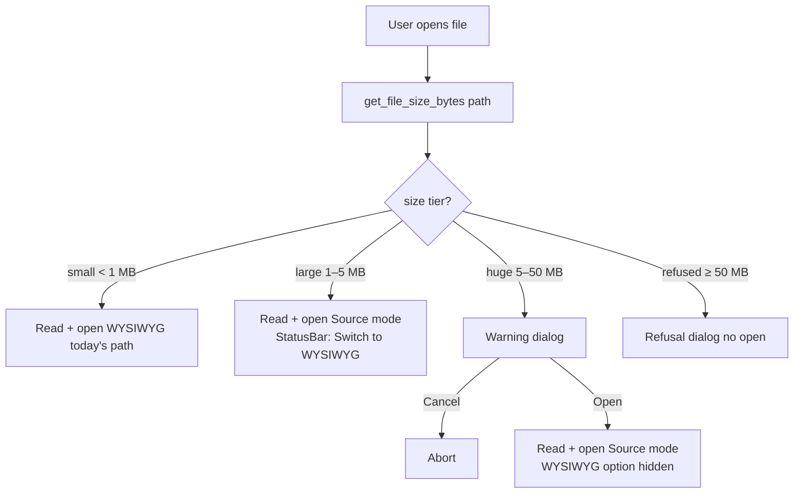

# Large-File Open UX Plan — 2026-04-22

Branch: `feat/large-file-ux`
Worktree: `/Users/joker/github/xiaolai/myprojects/vmark-largefile`

**Revision note (2026-04-22, post-Codex review):** Re-sequenced so the Source-mode path ships **first** (highest value per day). Progress indicator collapsed to a single indeterminate state. The deferred-NodeView work is gated behind a real profile and is NOT committed in this plan — Mermaid/LaTeX/Markmap/SVG previews already render via async widget decorations (`src/plugins/codePreview/renderers/`), so that avenue is partly already taken.

## Goal

Make opening large files *honest*: convert the 15-second silent freeze into either a sub-second open (Source mode) or an explicit, visible wait (WYSIWYG with an indicator). Keep the small-file fast path untouched.

## Measured baseline (1.4 MB / 42,376 lines / 2,250 blocks)

Measured 2026-04-22 in the running Tauri app via MCP instrumentation:

| Milestone                                            |                  Δ from invoke |
| ---------------------------------------------------- | -----------------------------: |
| IPC returns (window exists)                          |                          62 ms |
| Webview nav start                                    |                          90 ms |
| React booted                                         |                         145 ms |
| **First paint (empty editor shell)**                 |                     **476 ms** |
| Main thread blocked (parse + ProseMirror view build) | 420 → 15,909 ms (\~**15.5 s**) |
| **Content rendered (visible)**                       |                **\~16,000 ms** |
| Main thread free for input                           |                    \~16,070 ms |

Bench decomposition (no editor mount, from `src/bench/largeFile.bench.ts`):

- Markdown → ProseMirror parse: 702 ms mean (p99 919 ms)
- Serialize: 16 ms
- Pure PM `state.apply()` per keystroke: \~1.8 µs

So the 15.5-second block is **not parse** — it is **ProseMirror ****`EditorView`**** construction + decoration pass over 2,250 block nodes**. Parse is \~5% of the total. Steady-state typing is already fine (49 ms p50 per keystroke, fixed in commit `8c04fc8a`).

## What the user experiences today

1. Click file → window opens within \~500 ms showing an empty editor shell.
2. **Editor stays blank for \~15 seconds**, no indicator — "did it crash?"
3. Content snaps in, then typing is responsive.

Pain is concentrated on files > 1 MB. Below \~300 KB the open is perceptually instant.

## Scope

Addresses **perceived and actual open latency for large files**. Does NOT address:

- Parse performance (already fast enough at \~700 ms).
- Steady-state editing (already fixed via `.cv-idle`).
- True block virtualization (deferred; see appendix).
- Memory / background-tab behavior.

## Non-goals

- Do NOT rewrite the markdown pipeline.
- Do NOT fork `@tiptap/core` or `prosemirror-view`.
- Do NOT introduce a second editor for large files — Source mode (CodeMirror) already exists; reuse it.
- Do NOT move markdown parse to a Web Worker (saves \~700 ms out of 15,500 ms; not worth the complexity).
- Do NOT ship an indicator that *fakes* sub-phase progress when the main thread is frozen. The indicator must be honestly indeterminate.
- Do NOT add user-visible English strings without all 10 locales.

## Threshold policy (honest limitations)

The byte thresholds below are **proxies** for block count — the real bottleneck. Measuring block count requires parsing, which is \~5% of the pain we're trying to avoid; byte count is free. A 600 KB file with many short blocks can be pathological, and a 1.2 MB file of long paragraphs can be fine. These defaults are calibrated against **one corpus** (the 1.4 MB / 2,250-block test file) and are explicitly subject to revision once we have more data.

| Threshold                   | Default | Purpose                                                                                                | User-togglable? |
| --------------------------- | ------: | ------------------------------------------------------------------------------------------------------ | --------------- |
| `SHOW_PROGRESS_BYTES`       |  300 KB | At/above this, show the indeterminate indicator                                                        | No (cosmetic)   |
| `SOURCE_MODE_DEFAULT_BYTES` |    1 MB | At/above this, auto-open in Source mode                                                                | Yes (setting)   |
| `WARN_BEFORE_OPEN_BYTES`    |    5 MB | At/above this, show a pre-open warning dialog                                                          | Yes (setting)   |
| `HARD_REFUSE_BYTES`         |   50 MB | At/above this, refuse entirely (no WYSIWYG, Source only, no warning path — the refusal IS the warning) | No              |

The `50 MB` hard refuse is a liability floor: even Source mode is unsafe for multi-hundred-MB files (JS string allocation can OOM the webview). Above this cap, the user sees a clear error-style dialog: *"Files above 50 MB cannot be opened in VMark. Use a line-oriented editor like **`less`** or **`bat`**."*

Centralized in `src/utils/fileSizeThresholds.ts`:

```ts
export const FILE_SIZE_THRESHOLDS = {
  SHOW_PROGRESS_BYTES: 300 * 1024,
  SOURCE_MODE_DEFAULT_BYTES: 1024 * 1024,
  WARN_BEFORE_OPEN_BYTES: 5 * 1024 * 1024,
  HARD_REFUSE_BYTES: 50 * 1024 * 1024,
} as const;

export type FileSizeTier = "small" | "large" | "huge" | "refused";

export function classifyFileSize(bytes: number): FileSizeTier {
  if (bytes >= FILE_SIZE_THRESHOLDS.HARD_REFUSE_BYTES) return "refused";
  if (bytes >= FILE_SIZE_THRESHOLDS.WARN_BEFORE_OPEN_BYTES) return "huge";
  if (bytes >= FILE_SIZE_THRESHOLDS.SOURCE_MODE_DEFAULT_BYTES) return "large";
  return "small";
}
```

---

## Phase A — Source-mode auto-open + warning + hard refuse (\~3 days) — SHIPS FIRST

**Why first:** delivers the real user value. A 1.4 MB file opens in < 1 s (Source mode) instead of > 15 s (WYSIWYG). Phase B (indicator) is useful but only labels a problem this phase eliminates for the common case.

### The problem

Tiptap/ProseMirror view construction is O(blocks). No UI polish changes that a 1.4 MB file takes \~15 s to reach interactive. Opening the same file in **Source mode** — CodeMirror with built-in viewport virtualization — is sub-second.

### Design

Before reading the file, we stat it (cheap; no content IO). Based on size tier:



### Resolving the non-goal vs. warning-dialog contradiction

The prior revision said "do NOT ship any blocking modal during open." This still holds for modals that block **while the file is loading** (those are the dishonest fake-progress kind). A pre-open confirmation dialog is different: nothing is happening yet, the user explicitly chose to open this file, and the dialog is the mechanism by which they consent (or decline) to the wait. Clarified non-goal:

> Do NOT ship a modal that appears *during* read/parse/mount. Pre-open confirmation dialogs are allowed and expected for the `huge` tier.

### Per-window override

Source-mode-by-default is a per-open decision, not persisted per-file. If the user switches a 1.4 MB file to WYSIWYG, they get WYSIWYG for that session only. Closing and reopening returns them to Source mode. Predictable; no surprising persistence.

### User settings

Add to `settingsStore.ts`:

```ts
largeFile: {
  autoSourceMode: boolean;   // default: true
  warnAbove5MB: boolean;     // default: true
};
```

Settings UI (Settings → Editor → "Large files"):

- ☑ Open files over 1 MB in Source mode automatically
- ☑ Warn before opening files over 5 MB

The hard 50 MB refusal is **not** user-togglable in this phase. If a user needs larger files, we collect that signal first.

### Tauri command: size-check

```rust
// src-tauri/src/file_ops/size.rs (new, ~60 lines including tests)
#[tauri::command]
pub async fn get_file_size_bytes(path: String) -> Result<u64, String> {
    let metadata = std::fs::metadata(&path)
        .map_err(|e| format!("Failed to stat: {}", e))?;
    Ok(metadata.len())
}
```

Register in `lib.rs`; add `file_ops:allow-get-file-size-bytes` permission to `src-tauri/capabilities/default.json`.

### Files touched

| File                                                  | Change                                        |
| ----------------------------------------------------- | --------------------------------------------- |
| `src/utils/fileSizeThresholds.ts`                     | **new** — thresholds + `classifyFileSize()`   |
| `src/utils/fileSizeThresholds.test.ts`                | **new** — table-driven boundary tests         |
| `src-tauri/src/file_ops/mod.rs`                       | **new** — module                              |
| `src-tauri/src/file_ops/size.rs`                      | **new** — command + unit tests                |
| `src-tauri/src/lib.rs`                                | register command                              |
| `src-tauri/capabilities/default.json`                 | add permission                                |
| `src/stores/settingsStore.ts`                         | add `largeFile.{autoSourceMode,warnAbove5MB}` |
| `src/hooks/useFinderFileOpen.ts`                      | pre-read size check → route to tier           |
| `src/components/LargeFileWarningDialog.tsx`           | **new** — non-modal-during-load confirmation  |
| `src/components/LargeFileWarningDialog.test.tsx`      | **new**                                       |
| `src/components/LargeFileRefusalDialog.tsx`           | **new** — ≥ 50 MB refusal                     |
| `src/components/StatusBar/SourceModeUpgrade.tsx`      | **new** — "Switch to WYSIWYG" offer           |
| `src/components/StatusBar/SourceModeUpgrade.test.tsx` | **new**                                       |
| `src/pages/Settings/EditorSettings.tsx`               | add "Large files" section                     |
| `src/locales/en/dialog.json`                          | 4 keys (see UI copy below)                    |
| `src/locales/{9 others}/dialog.json`                  | translations via `translate-docs` skill       |
| `website/guide/large-files.md`                        | **new** user guide (per rule 21)              |

### UI copy (minimum viable — 4 user-facing strings, 10 locales = 40 translations)

1. `dialog.largeFile.warnTitle` → `"Open {filename}?"`
2. `dialog.largeFile.warnBody` → `"This file is {size}. It will open in Source mode — WYSIWYG is disabled for files this large."`
3. `dialog.largeFile.refuseBody` → `"Files above {limit} cannot be opened in VMark. Use a line-oriented tool such as less, bat, or grep."`
4. `statusBar.largeFile.switchToWysiwyg` → `"Opened in Source mode (large file). Switch to WYSIWYG"` (the last 4 words are the link)

### Acceptance criteria

- 500 KB file: unchanged behavior, WYSIWYG.
- 1.4 MB test file: opens in Source mode in **< 1 s** (measured via perf harness — see Cross-phase § below). StatusBar shows upgrade offer.
- Clicking "Switch to WYSIWYG": triggers the standard mount. With Phase B deployed, the user sees the indeterminate indicator during the \~15 s wait; without Phase B, they see the existing blank-editor state. The mount itself is unchanged.
- 10 MB file: warning dialog appears, "Open" proceeds to Source mode, "Cancel" aborts with no side effects.
- 60 MB file: refusal dialog appears, no read attempted.
- User setting `largeFile.autoSourceMode = false`: behavior reverts to today's (large files open in WYSIWYG; wait is silent unless Phase B is also deployed).
- Missing file / permission denied on size-check: falls through to existing error path; no crash.

### Edge cases

- File grows between size-check and read (e.g., an actively appended log). Behavior: act on the pre-read size. The difference between "just under 1 MB at check, 1.1 MB at read" is not user-visible.
- File shrinks / is deleted between check and read: `readTextFile` fails → existing error path.
- Empty file (0 bytes): `classifyFileSize(0)` → `"small"` → WYSIWYG.
- User opens 10 files at once via drag-drop: each opens in its own window; each does its own size check.
- CJK-heavy files (2-byte-per-char common): cross the 1 MB threshold on fewer visible lines — this is *safer* for Source mode, not worse.
- Symlink to a huge file: `fs::metadata` follows symlinks by default → size-check still reports the real size.

### Tests

- `fileSizeThresholds.test.ts`: table-driven boundaries (`0, 300*1024 - 1, 300*1024, 1024*1024 - 1, 1024*1024, 5*1024*1024 - 1, 5*1024*1024, 50*1024*1024 - 1, 50*1024*1024`).
- `file_ops/size.rs` Rust tests: existing file, missing file, permission denied, symlink-to-existing, symlink-to-missing.
- `useFinderFileOpen.test.ts`: mock `get_file_size_bytes`, verify routing for each tier.
- `LargeFileWarningDialog.test.tsx`: opens, confirms, cancels; keyboard nav (Escape = cancel, Enter = confirm).
- `LargeFileRefusalDialog.test.tsx`: renders correct message with formatted size.
- `SourceModeUpgrade.test.tsx`: click triggers `setSourceMode(false)`, disappears after upgrade.

---

## Phase B — Minimal indeterminate open indicator (\~1 day, optional)

**Why second, optional:** Phase A eliminates the silent wait for the common case (≥ 1 MB → Source mode). Phase B only matters for users who have disabled `autoSourceMode` or who explicitly upgraded to WYSIWYG. It is a cheap additional polish, not a prerequisite.

### The problem

Even after Phase A, a user who clicks "Switch to WYSIWYG" on a 1.4 MB file — or who has `autoSourceMode = false` — still sees an unlabeled blank editor for \~15 s.

### Design — honestly indeterminate

Since the main thread is frozen during parse + view construction, we cannot meaningfully report sub-phase progress. Anything pretending to know "parsing 60%" is a lie. So the indicator is **one label** with an indeterminate visual:

- Text: `"Opening large file ({size})…"`
- Visual: subtle indeterminate spinner (CSS-only, \~16×16 px, `--accent-primary`, 1 s rotate).
- Position: left end of the StatusBar, before existing content.
- Fade-in: 150 ms delay then 150 ms fade (so small files that finish instantly never flash the indicator).
- Shown when: file size ≥ `SHOW_PROGRESS_BYTES` (300 KB) AND we are about to open in WYSIWYG (either small/default or user upgraded).
- Hidden when: `onTransaction` fires on the editor with a non-empty doc, OR on error.

ARIA: `aria-live="polite"` on the container, so screen readers announce the label once. The label does not change during the wait; re-announcing would spam.

### What the indicator is NOT

- NOT a progress bar. No percentages.
- NOT a multi-phase state machine (`reading/parsing/rendering`). We cannot measure those honestly at the granularity that would make the UI useful.
- NOT shown during Source-mode opens (those are sub-second; indicator would flash and confuse).

### Files touched

| File                                                  | Change                                                                      |
| ----------------------------------------------------- | --------------------------------------------------------------------------- |
| `src/stores/fileLoadStore.ts`                         | **new** — tiny store: `{ active: boolean, filename: string, size: number }` |
| `src/stores/fileLoadStore.test.ts`                    | **new** — transitions, concurrent opens                                     |
| `src/components/StatusBar/FileLoadIndicator.tsx`      | **new** — indeterminate spinner + label                                     |
| `src/components/StatusBar/FileLoadIndicator.test.tsx` | **new** — renders/hides by state, ARIA                                      |
| `src/components/StatusBar/StatusBar.tsx`              | mount indicator on the left                                                 |
| `src/components/StatusBar/StatusBar.css`              | spinner animation, color tokens                                             |
| `src/hooks/useFinderFileOpen.ts`                      | set/clear `fileLoadStore` around WYSIWYG opens                              |
| `src/locales/en/statusBar.json`                       | 1 key: `largeFile.opening` → `"Opening large file ({size})…"`               |
| `src/locales/{9 others}/statusBar.json`               | translations (10 strings total)                                             |

### UI copy

One user-facing string: `"Opening large file ({size})…"`. Across 10 locales = 10 translations. No plural variants; no sub-phase labels.

### Acceptance criteria

- 10 KB WYSIWYG file: indicator never appears.
- 1.4 MB WYSIWYG open (user explicitly chose it): indicator appears within 300 ms of the open, stays until first content paint, fades out within 200 ms after.
- 1.4 MB Source-mode open (Phase A default): indicator never appears (too brief to matter).
- Missing file: indicator appears briefly (if at all) then hides cleanly when the error toast fires; no stale indicator.
- Screen reader announces the label once when it appears.
- No indicator visible below 300 KB at any size.

### Tests

- `fileLoadStore.test.ts`: set → clear, concurrent set (second call replaces first's state), error path clears state.
- `FileLoadIndicator.test.tsx`: renders nothing when inactive; renders label + spinner when active; `aria-live="polite"` present.
- Integration: extend `useFinderFileOpen.comprehensive.test.tsx` — assert store is set/cleared at the right moments.

---

## Phase C — Deferred heavy-work during WYSIWYG mount — NOT COMMITTED

**Status:** Not scheduled. The previous revision of this plan specified two-pass NodeView rendering with `requestIdleCallback`; Codex correctly pointed out this was partly duplicating existing code. Revised position:

### What we already have (do not reinvent)

Code previews — Mermaid, LaTeX block math, Markmap, SVG — already render via **widget decorations** with async placeholder → rendered-output swaps. See:

- `src/plugins/codePreview/tiptap.ts` — widget decoration factory
- `src/plugins/codePreview/renderers/renderMermaidPreview.ts` — async Mermaid render
- `src/plugins/codePreview/renderers/renderLatex.ts` — async KaTeX render
- `src/plugins/codePreview/renderers/renderMarkmapPreview.ts`
- `src/plugins/codePreview/renderers/renderSvgPreview.ts`

These are NOT the bottleneck. Any "deferred NodeView upgrade" scheme targeting this area is rediscovering what `codePreview` already does.

### What we would need before committing any Phase C work

A **native Tauri perf profile** of the 1.4 MB WYSIWYG mount, attributing the 15.5 s to concrete call sites. Note: **do not use Chrome DevTools MCP** — VMark is a Tauri app, not a browser app, and per `AGENTS.md` we measure in the running Tauri webview. Use:

- `performance.mark()` / `performance.measure()` around the suspect code paths in `TiptapEditor.tsx`, `parseMarkdown`, and `editorPlugins.tiptap.ts`.
- Extract measurements via MCP: `performance.getEntriesByType("measure")`.
- Cross-reference with `performance.getEntriesByType("paint")` for first-contentful-paint.

The deliverable is a table attributing the 15.5 s block to: ProseMirror `EditorView` construction, decoration pass (codePreview + footnote plugin scan), parse, React reconciliation, other. If the profile shows `EditorView` construction dominating (> 70%), the only real fix is viewport virtualization — and Phase C as a "defer NodeViews" scheme does not help.

### Stop conditions

- If profiling shows `EditorView` construction + decoration pass > 70% of the block: Phase C is abandoned. We either accept Source mode as the large-file answer (ship Phase A + B and stop here) or open a separate plan for actual viewport virtualization.
- If profiling shows a specific non-`codePreview` plugin dominating (e.g., `footnotePopup` doc scan, though we just fixed that): we address that plugin directly in a small surgical change — not a framework-wide NodeView refactor.

### Explicit deliverable (if we ever pursue this)

A new plan document (`dev-docs/plans/YYYYMMDD-large-file-mount-profile.md`) that begins with the profile table. No code changes until the table exists and has been reviewed.

---

## Cross-phase concerns

### Perf harness (NEW — addresses Codex's "wiring theater" finding)

A scripted measurement tool, not a unit test, that produces the acceptance-criteria numbers reproducibly. Without this, `< 1 s Source` and `< 3 s WYSIWYG` are aspirations, not gates.

Deliverables:

1. **Corpus generator** — `scripts/gen-large-fixture.ts` that produces a deterministic N-block markdown file from a seed. Output goes to a gitignored `tmp/` directory (corpus is too large to commit).
2. **Harness** — `scripts/measure-open-latency.ts` driven by the Tauri MCP. For a given fixture path, it:
   - spawns a fresh VMark window with the file,
   - collects `performance.getEntriesByType("measure")` at reliable checkpoints (post-mount, post-first-transaction),
   - writes a JSON report to `tmp/perf/`.
3. **Manual gate** — documented steps in `dev-docs/large-file-perf-qa.md` (local, not website) for running the harness before shipping each phase.

This is NOT wired into `pnpm check:all` (too slow, too environmental). It IS a manual gate that must be green before tagging a release touching open-path code.

### Testing strategy

- Every phase includes RED-first tests per `.claude/rules/10-tdd.md`.
- No phase ships without `pnpm check:all` green.
- The 1.4 MB test fixture is not in the repo. Benchmarks use `VMARK_BENCH_LARGE_FILE` env var (already implemented). The perf harness above generates deterministic fixtures on demand.
- **Test honesty:** the Zustand/boundary/ARIA tests in each phase are wiring correctness tests, not perf regression tests. Perf regressions are caught by the harness above. This plan does not pretend otherwise.

### i18n

All user-facing strings in Phases A & B land in all 10 locales (en, zh-CN, zh-TW, ja, ko, de, es, fr, it, pt-BR) via the `translate-docs` skill, with manual zh-CN / zh-TW review.

**String budget (deliberately minimal):**

- Phase A: 4 strings × 10 locales = 40 translations.
- Phase B: 1 string × 10 locales = 10 translations.
- **Total: 50 translations** for this entire initiative.

### Documentation

- `website/guide/large-files.md` (new, Phase A) — what happens for each tier, how to toggle settings.
- `website/guide/features.md` — add "Large file support" bullet.
- `dev-docs/architecture.md` — update only if the open-path dataflow changes materially (Phase A adds a size-check step; Phase B is StatusBar-only).

### Rollout

No feature flags. Thresholds are conservative; if 1 MB proves too low we raise in a follow-up (settings already let the user opt out). All settings live under Settings → Editor → "Large files".

### Telemetry

None. VMark does not collect usage metrics; we measure our own perf via the benchmark suite + perf harness above.

---

## Order of operations

1. **Phase A** (Source mode + warning + hard refuse): 3 days. Runs the perf harness before ship.
2. **Phase B** (indeterminate indicator): 1 day, optional. Ship if Phase A leaves a visible gap for the WYSIWYG-upgrade path.
3. **Profile for Phase C**: only if user feedback after A+B indicates it is needed. Profile first, plan later.

Stop condition for the whole initiative: if after A+B the 1.4 MB file opens in < 1 s in Source mode and the WYSIWYG upgrade is explicit + labeled, we are done. Phase C is speculative work that should be justified by a profile, not scheduled by default.

## Success metrics

| Metric                                          | Today          | After A                 | After A+B          | After C (if shipped)                 |
| ----------------------------------------------- | -------------- | ----------------------- | ------------------ | ------------------------------------ |
| 1.4 MB default open: time to visible content    | \~16 s         | **< 1 s** (Source mode) | < 1 s              | < 1 s                                |
| 1.4 MB explicit-WYSIWYG open: perceived "blank" | \~16 s silent  | \~15 s silent           | \~15 s **labeled** | \~3 s labeled (if profile justifies) |
| 1.4 MB: time to typeable                        | \~16 s         | **< 1 s** (Source)      | < 1 s              | < 1 s                                |
| 10 MB default: behavior                         | hangs          | warning → Source \~3 s  | same               | same                                 |
| 60 MB: behavior                                 | likely crashes | refusal dialog          | same               | same                                 |
| 300 KB: behavior                                | instant        | instant                 | instant            | instant                              |

Numbers under "After A" and "After A+B" are **targets validated by the perf harness**, not aspirations.

---

## Appendix — Alternatives considered

### Why not true block virtualization (Notion/Linear style)

- ProseMirror's `EditorView` assumes the full DOM mirrors the document. Virtualization breaks selection mapping, contenteditable semantics, find-across-doc.
- Community plugins (`prosemirror-virtual-scroll`) are immature and unmaintained.
- Notion's virtualization took engineering-years; VMark is too small for that investment without proven demand.

Not ruled out forever — just deferred. Source mode already delivers the practical benefit (sub-second open) for the use case users actually report.

### Why not staged visible-first rendering (a narrower virtualization)

A lighter-weight alternative: render only the first N blocks on initial mount, then append the rest in idle chunks. This is a valid direction and is **not** the same as full virtualization. Reasons we are not doing it *now*:

- It still requires changes inside `TiptapEditor.tsx` / the ProseMirror view to defer block insertion.
- It interacts poorly with scroll-restoration (user opens a file that was scrolled to line 20000; the blocks need to exist before we can scroll there).
- Source mode achieves the same user-visible outcome (fast open) with zero ProseMirror surgery.

If Phase A + B ship and users still report large-file WYSIWYG pain, this is the next experiment to try — ahead of a full Phase C refactor.

### Why not chunked parsing that yields to the event loop

Parse is 702 ms of a 15,500 ms block. Even splitting it perfectly into 100 ms event-loop yields saves almost nothing perceived. Not worth the complexity.

### Why not moving parse to a Web Worker

Same reason as above, plus: transferring a \~2,250-node ProseMirror document across the worker boundary requires structured cloning the JSON, which is not cheap, and the schema + mark definitions need to either live in the worker or be re-hydrated. Net savings < 500 ms. Not worth it.
