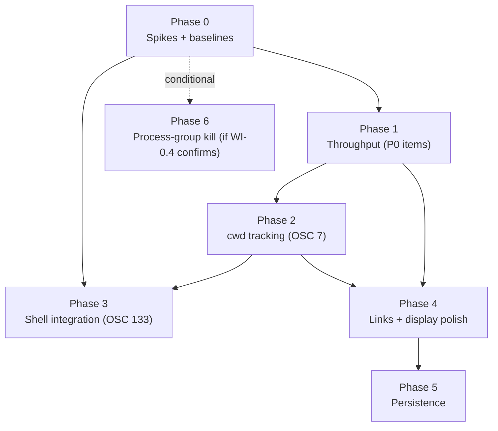

# Terminal — Road to Industrial-Best (Implementation Plan)

> Created: 2026-05-31
> Status: **All phases complete** (branch `terminal-industrial-best`), driven and
> live-verified against a running `pnpm tauri dev` app via Tauri MCP.
> Final gates green: backend `cargo test` **601 passed**, frontend `pnpm test`
> **19,249 passed**; `check-terminal-phase.sh 0..6` all exit 0.
> - **Phase 0** (spikes): WI-0.0/0.1 done; WI-0.2 (Channel) PASS live; WI-0.3
>   (zsh OSC 133) PASS live; WI-0.4 → orphans are intentionally-detached only.
> - **Phase 1** (throughput): WI-1.1 binary Channel + WI-1.2 64 KB + WI-1.4 type
>   narrowing done & live-verified; WI-1.3 N/A (input is always valid UTF-8).
> - **Phase 2** (OSC 7 cwd): done & live-verified (`cd /tmp` → `/tmp`).
> - **Phase 3** (shell integration): zsh WI-3.1–3.4 done & live-verified (OSC 133
>   A/C/D + exit codes); bash/fish + OSC 133 B deferred (Phase 7).
> - **Phase 4** (links/display): WI-4.1 line jump, WI-4.2 OSC 8, WI-4.3 bell
>   activity done; OSC 0/2 title deferred.
> - **Phase 5**: WI-5.2 dead SerializeAddon removed; WI-5.1 session persistence
>   deferred (low value for a side panel).
> - **Phase 6**: ABORTED — detached-process survival is intended behavior.
> - **Pending**: Codex cross-model review (rule 60 §6); proper translations for
>   the new `terminal.shellIntegration` i18n key (currently English in all
>   locales); manual visual QA of decorations/bell in-app.
> - Deferred items tracked in §3 Phase 7 and §6 decisions log.
> Source audit: `dev-docs/audit/20260531-terminal-integration.md` (finding IDs
> T1–T3, L1–L2, C1–C3, M1–M6, S1–S5 below reference that doc).
> Phase-DoD checker: `scripts/check-terminal-phase.sh <N>` (to be created in WI-0.0,
> templated from `scripts/check-gha-phase.sh` per rule 60 §3).
> Branch strategy: per-phase feature branches off `main`; one commit per WI.
> Governance: rules `10-tdd`, `41-keyboard-shortcuts`, `21-website-docs`,
> `60-ai-governance`. **>3 phases → Codex review (`/cc-suite:review-plan`)
> mandatory before Phase 1 commits** (rule 60 §6).

## 1. Executive summary

The audit established that VMark's terminal is robust but trails industrial-best
terminals on **transport efficiency** and **modern OSC protocol support**. This
plan sequences the remediation into **7 phases**, ordered by risk-adjusted value
and de-risked by a Phase-0 spike gate:

- **Phase 0** — spikes + baselines. Validate the two high-risk technology
  assumptions (Tauri binary `Channel`, shell-integration injection) and capture
  the throughput baseline + the L1 orphan-process empirical check *before* any
  production commit. This is rule 60 §7 (spike before commit) applied directly to
  the audit's two "not verified" items (audit §8).
- **Phase 1 (P0)** — throughput architecture: binary transport, window-scoped,
  bigger buffer, byte-transparent input, flow-control simplification.
- **Phase 2** — cwd tracking (OSC 7); unblocks correct relative links.
- **Phase 3** — shell integration (OSC 133): command boundaries, prompt
  navigation, exit-status decorations. The largest feature; gated on the Phase-0
  injection spike.
- **Phase 4** — link & display polish: `:line:col` jump, OSC 8, title/bell.
- **Phase 5** — session/scrollback persistence (and resolve the dead
  `SerializeAddon`).
- **Phase 6** — process-group lifecycle hardening — **conditional** on the
  Phase-0 finding (WI-0.4).
- **Phase 7** — deferred/niche backlog (tracked, not scheduled).

Guiding constraints (inherited from `20260530-audit-remediation.md`):

- Every phase ends `pnpm check:all` **and** `cargo test` green, and is
  independently shippable.
- Behavior-changing WIs are **TDD**: failing test (RED) precedes the change
  (rule 10). Each WI names its RED test.
- No WI mixes a transport refactor with a feature in the same commit.
- New user-facing strings use `t()`/`t!()`; new shortcuts sync all three files
  (rule 41); behavior changes update `website/guide/terminal.md` (rule 21).
- Files stay < ~300 lines — split proactively (AGENTS.md).
- **No new runtime dependencies are anticipated** (Tauri `Channel`, xterm OSC
  handlers, and `SerializeAddon` are all already available), so
  `check-new-deps.sh` should stay green. If a phase introduces one, it requires
  explicit acknowledgment (rule 60 §4).

### Dependency graph (phase ordering)

`cwd tracking (P2)` lands before shell integration (P3) because both share the
OSC-handler + rc-hook mechanism and P3's relative-path features assume live cwd.

---

## 2. Architecture Decision Records

### ADR-T1 — PTY output transport is a binary Tauri `Channel<&[u8]>`

**Status:** Proposed (spike-gated by WI-0.2).
**Context.** Output is emitted as `app.emit("pty:data:{pid}", Vec<u8>)`
(`pty.rs:265`), which Tauri serializes as a JSON array of numbers and broadcasts
to every webview (audit T1/T2). This is the throughput ceiling.
**Decision.** Replace the output event with a per-session
`tauri::ipc::Channel<&[u8]>` passed into `pty_start`. The channel is
point-to-point (fixes T2 for free) and transfers an `ArrayBuffer`
(`term.write(Uint8Array)` consumes it directly, no JSON round-trip).
**Consequences.** New IPC pattern (no `Channel` precedent in-repo). The
`pty:exit` signal stays an event (low frequency, simple payload). Flow-control
likely simplifies (see WI-1.4). Spike WI-0.2 must confirm binary delivery and a
measurable win over the JSON path before Phase 1 commits.

### ADR-T2 — cwd source of truth is OSC 7

**Status:** Proposed.
**Context.** cwd is resolved once at spawn (`spawnPty.ts:58`) and never updated;
relative file links resolve against workspace root, not the shell's location
(audit C2/M2).
**Decision.** Register `term.parser.registerOscHandler(7, ...)`, parse
`file://host/path`, and store live cwd on the session entry. Shell-integration
rc-hooks (ADR-T3) emit OSC 7 on every prompt. "New terminal here", relative-link
resolution, and workspace-`cd` skipping read this value.
**Consequences.** cwd is only as fresh as the last prompt (acceptable —
matches every other terminal). Falls back to workspace root when OSC 7 is absent
(integration disabled or unsupported shell).

### ADR-T3 — Shell integration via non-destructive injected rc-hooks, opt-in

**Status:** Proposed (spike-gated by WI-0.3).
**Context.** No command-boundary awareness (audit M1). The standard mechanism is
injecting `precmd`/`preexec` hooks that emit OSC 133 A/B/C/D + OSC 7.
**Decision.** Ship per-shell integration scripts as Tauri resources and inject
them **without clobbering the user's config**, using each shell's supported hook:
- **zsh:** set `ZDOTDIR` to a temp dir whose `.zshrc` sources the user's real
  `$ZDOTDIR/.zshrc` then appends our hooks.
- **bash:** `--rcfile` pointing at a wrapper that sources the user's `~/.bashrc`
  then appends our hooks.
- **fish:** prepend our snippet via `XDG_DATA_DIRS` / a conf.d entry.
Gate behind a `terminal.shellIntegration` setting (default **on** for zsh/bash/
fish, **off**/no-op for unknown shells). Always degrade gracefully — a failed
injection must never break shell startup.
**Consequences.** Per-shell complexity; macOS-primary (zsh first, then bash, then
fish). WI-0.3 validates the zsh path end-to-end before Phase 3 commits. If the
spike fails for a shell, that shell falls back to no-integration (features hide,
terminal still works).

### ADR-T4 — Scrollback persistence is serialize-on-hide, opt-in; else remove the addon

**Status:** Proposed.
**Context.** `SerializeAddon` is loaded per instance (`createTerminalInstance.ts:157`)
but **never called** — dead weight (audit C3). `uiStore` has no `persist`
middleware, so no terminal state survives restart.
**Decision.** Two independent calls:
1. Persist the lightweight `terminal` slice (session list, active id, panel
   size) via Zustand `persist` (WI-5.1).
2. For scrollback: if WI-0.1's baseline shows acceptable serialize cost, write
   `serializeAddon.serialize()` on hide/quit and replay on restore (WI-5.2);
   otherwise **delete the addon** rather than ship it unused.
**Consequences.** Restart restores tabs/layout cheaply; scrollback restore is a
measured opt-in, not an assumption.

---

## 3. Phases & Work Items

WI linkage (rule 60 §2): commit `feat(terminal): <change> (WI-N.M)` **or** test
header `// WI-N.M — <desc>`. Verify with
`bash scripts/check-wi-linkage.sh dev-docs/plans/20260531-terminal-industrial-best.md --phase=N`.

> **Linkage caveat.** `check-wi-linkage.sh` matches a WI-ID anywhere in a commit
> message — it cannot tell *"implements WI-X"* from *"mentions WI-X"*. So a commit
> that references a future WI in prose makes that WI read as "linked" before any
> work exists (observed for WI-0.2/0.3/0.4, named in WI-0.1's commit body). Rule
> 60 §2 only requires linkage for WIs in a **complete** phase; for an in-progress
> phase the **authoritative** signal is `check-terminal-phase.sh <N>`, not the
> linkage count. Don't read linkage as completion mid-phase.

---

### Phase 0 — Spikes & baselines (de-risk gate)

> No production behavior changes. Output is evidence: benchmarks + spike verdicts
> recorded under `dev-docs/grills/terminal/`. **No later phase commits until its
> dependent Phase-0 spike is PASS.**

| WI | Goal | Output / DoD |
|----|------|--------------|
| WI-0.0 | Create `scripts/check-terminal-phase.sh` from the GHA template; fill per-phase assertions (below). | Script exists **and correctly evaluates phase 0**: it fails (exit 1) while the WI-0.2/0.3 spike verdicts are `PENDING`, and passes (exit 0) once they flip to `PASS`. (It is *meant* to exit 1 today — "phase 0 exits 0" is the Phase-0 **completion gate** below, gated on the spikes, not this checker's own DoD.) |
| WI-0.1 | Throughput baseline harness, in two parts: **(a)** an automated in-process bench isolating the JSON-number-array encode/parse cost (the dominant, app-independent component of T1); **(b)** a *documented* manual end-to-end drain (`cat` a ~10 MB fixture in a running app, record wall-clock + WebView CPU) — the part a bench cannot measure because it needs a real PTY. | `dev-docs/grills/terminal/throughput-baseline.md` with (a)'s numbers + (b)'s repro steps, plus the re-runnable probe `src/bench/terminal.bench.ts`. |
| WI-0.2 | **Spike (ADR-T1):** prove `tauri::ipc::Channel<&[u8]>` delivers binary to the webview as an `ArrayBuffer` and beats the JSON path on the WI-0.1 fixture. | `dev-docs/grills/terminal/channel-spike.md`: PASS/FAIL + measured delta. PASS unblocks Phase 1. |
| WI-0.3 | **Spike (ADR-T3):** zsh integration injection emits OSC 133 A–D + OSC 7 on a real prompt **without** breaking a non-trivial user `.zshrc`. | `dev-docs/grills/terminal/shell-integration-spike.md`: PASS/FAIL + captured escape sequences. PASS unblocks Phase 3. |
| WI-0.4 | **Verify L1 (audit §8):** run `sleep 1000 &` (disowned) in a tab, force-close the tab, `pgrep -f 'sleep 1000'`. Record whether the orphan survives. | Finding recorded in same grill dir. Result decides whether **Phase 6 runs at all**. |

**Phase 0 DoD (machine-checkable):** the four grill docs exist and WI-0.2 +
WI-0.3 verdict lines contain `PASS`. `check-terminal-phase.sh 0` greps for them.

---

### Phase 1 — Throughput architecture (P0: T1, T2, T3, L2)

| WI | Goal | Files | RED test |
|----|------|-------|----------|
| WI-1.1 | PTY output → per-session `Channel<&[u8]>`, point-to-point (T1+T2). `pty_start` takes a `Channel`; reader thread `channel.send(&buf[..n])`. Frontend `lib/pty.ts` wires `onmessage` → `onData(Uint8Array)`. | `pty.rs`, `lib/pty.ts`, `lib.rs` (handler reg) | Rust: reader forwards bytes verbatim incl. non-UTF-8 & CJK. TS: `VMarkPty.onData` fires `Uint8Array` (not `number[]`). |
| WI-1.2 | Enlarge reader buffer to 32–64 KB; optional ≤2 ms coalescing (T3). | `pty.rs` | Rust: a burst > buffer size is delivered in order with no loss. |
| WI-1.3 | `pty_write` accepts `Vec<u8>` bytes, not `String` (L2). Frontend sends bytes. | `pty.rs`, `lib/pty.ts` | Rust: writing a non-UTF-8 byte sequence reaches the PTY unchanged. |
| WI-1.4 | Re-baseline vs WI-0.1; **simplify/retire** the watermark flow-control if xterm's `write(cb)` backpressure now suffices. Keep only if numbers justify. | `spawnPty.ts` | Existing `wirePtyFlowControl` tests still pass (or are deleted with the code, with a recorded rationale). |

**Phase 1 DoD:** WI-0.1 probe re-run shows the channel path ≥ target improvement
recorded in WI-0.2; `grep -q "Channel" src-tauri/src/pty.rs`; **no**
`pty:data:` event emit remains (`! grep -rq 'pty:data:' src-tauri/src` except in
comments); `pnpm check:all` + `cargo test` green.

---

### Phase 2 — cwd tracking (M2 + C2)

| WI | Goal | Files | RED test |
|----|------|-------|----------|
| WI-2.1 | OSC 7 handler → parse `file://host/path`, store live cwd on session entry (ADR-T2). | `createTerminalInstance.ts` (or a new `setupOsc.ts`), session state in `useTerminalSessions.ts` | Handler parses a valid OSC 7 to an absolute path; rejects malformed input without throwing. |
| WI-2.2 | Consumers read live cwd: workspace-`cd` skip logic + a "new terminal opens in active terminal's cwd" path. | `terminalSessionStoreSync.ts`, `spawnPty.ts`/`useTerminalSessions.ts` | New session resolves cwd from the active session's live cwd when present. |
| WI-2.3 | Relative file links resolve against live cwd, fall back to workspace root (C2). | `fileLinkProvider.ts`, `setupFileLinks.ts` | `./build/x.ts` resolves against live cwd, not workspace root. |

**Phase 2 DoD:** `grep -q "registerOscHandler" src/components/Terminal`;
fileLinkProvider tests cover live-cwd resolution; gates green.

---

### Phase 3 — Shell integration (M1) — the big one

> Gated on WI-0.3 PASS. Behind `terminal.shellIntegration` setting. Each WI must
> degrade gracefully when integration is off/unsupported.

| WI | Goal | Files | RED test |
|----|------|-------|----------|
| WI-3.1 | Ship per-shell integration scripts as resources; inject via ADR-T3 mechanism (zsh → bash → fish). Add `terminal.shellIntegration` setting + i18n. | `src-tauri/resources/shell-integration/*`, `spawnPty.ts`, `lib.rs` (resolve resource path), `settingsStore.ts`, `TerminalSettings.tsx`, locale JSON | Spawn env/args for zsh set the wrapper `ZDOTDIR`; unknown shell → no injection, no error. |
| WI-3.2 | OSC 133 A/B/C/D parser → command-boundary state (prompt start, command start, pre-exec, exit code) on the session. | `setupOsc.ts`, session state | Parser transitions states correctly across a full prompt→command→exit cycle; exit code captured. |
| WI-3.3 | Prompt navigation: jump to previous/next command. Add shortcuts (rule 41: `localized.rs` + `shortcutsStore.ts` + `website/guide/shortcuts.md`). | `useTerminalSessions.ts`, `terminalKeyHandler.ts`, the 3 shortcut files | Navigation moves the viewport to the recorded prompt mark; no-op when no marks. |
| WI-3.4 | Exit-status gutter decorations + command duration (xterm decorations API). | `setupOsc.ts`, a new `terminalDecorations.ts`, CSS (tokens only — rule 31) | A failed command (exit≠0) registers an error-token decoration; success registers none/success token. |

> Deferred to a Phase-3 follow-up (noted, not scheduled here): sticky-scroll of
> the running command, "copy last command output", command-aware right-click.

**Phase 3 DoD:** shell-integration resources exist and are registered in
`tauri.conf.json` bundle resources; `terminal.shellIntegration` present in
settings + all 9 locales (rule i18n); shortcuts present in all 3 sync files
(`check` via `grep` for the new accelerator in each); `website/guide/shortcuts.md`
+ `website/guide/terminal.md` updated; gates green.

---

### Phase 4 — Link & display polish (C1, M3, M4)

| WI | Goal | Files | RED test |
|----|------|-------|----------|
| WI-4.1 | File-link `:line:col` jump (C1). Carry `{path,line,col}` through `onActivate` → `createTab` → editor go-to-line. | `fileLinkProvider.ts`, `setupFileLinks.ts`, tab/document open path | Clicking `foo.ts:42:8` opens at line 42, col 8; bare path opens at top. |
| WI-4.2 | OSC 8 hyperlinks (M3) via xterm native API; reuse `SAFE_LINK_SCHEMES` allowlist. | `setupWebLinks.ts` (or new `setupOsc8.ts`) | An OSC-8-wrapped URL is clickable and scheme-filtered; unsafe scheme blocked. |
| WI-4.3 | Title (OSC 0/2) → tab label; bell/`onBell` → background-activity tab badge (M4). | `setupOsc.ts`, `TerminalTabBar.tsx`, `uiStore.ts` (label/activity) | OSC 2 updates the session label; bell on an inactive tab sets an activity flag, cleared on focus. |

**Phase 4 DoD:** fileLink line-jump test green; OSC 8 + OSC 0/2 handler tests
green; `website/guide/terminal.md` updated; gates green.

---

### Phase 5 — Persistence (C3, ADR-T4)

| WI | Goal | Files | RED test |
|----|------|-------|----------|
| WI-5.1 | Persist `terminal` slice (sessions, active id, panel size) via Zustand `persist` + `partialize`. | `uiStore.ts` | Rehydrating restores session list + active id; transient fields (`isAlive`) reset. |
| WI-5.2 | Scrollback: per WI-0.1 cost, either serialize-on-hide/replay-on-restore via `SerializeAddon`, **or delete the addon** (record the decision). | `createTerminalInstance.ts`, `useTerminalSessions.ts` | If kept: restore replays serialized buffer. If removed: instance no longer constructs `SerializeAddon` and a knip/grep check confirms no dead ref. |

**Phase 5 DoD:** `terminal` slice in `persist` whitelist; either a passing
scrollback-restore test **or** zero `SerializeAddon` references outside tests
(grep); gates green.

---

### Phase 6 — Process-group lifecycle hardening (L1) — **ABORTED**

> **ABORTED (2026-05-31)** per the WI-0.4 live verdict. The force-kill path
> already reaps ordinary children (plain `&` job died); the only survivors are
> `disown`/`nohup`/`setsid` processes, which are *meant* to outlive the shell
> and survive on every reference terminal. There is no accidental leak to fix,
> and force-killing detached processes would regress user intent. A graceful
> SIGHUP-before-SIGKILL is a deferred nicety (Phase 7). See §6 + the grill doc.
> The WI below is retained for the record but is **not implemented**.

| WI | Goal | Files | RED test |
|----|------|-------|----------|
| WI-6.1 | Unix: spawn shell as session/process-group leader; on kill send `SIGHUP`→grace→`SIGKILL` to the **group** (`killpg`). `cfg`-gate; preserve Windows behavior. | `pty.rs` | A backgrounded grandchild is reaped on `pty_kill` within the grace window. |

**Phase 6 DoD:** WI-0.4-style repro now shows the orphan reaped; macOS behavior
unchanged for foreground case; `cargo test` green. (Or: phase aborted, decision
in plan §6.)

---

### Phase 7 — Deferred / niche backlog (tracked, not scheduled)

Not committed here; logged so they aren't silently dropped (audit S/M items):

- **M5** — raise/remove `MAX_TERMINAL_SESSIONS` cap; split panes (large UI epic).
- **M6** — real `PtySize` pixel dimensions for image protocols.
- **S1** — Windows `windowsPty` reflow option (best-effort, macOS-primary).
- **S3** — surface a hint when the `vmark` CLI (`EDITOR=vmark`) isn't on PATH.
- **S5** — search result counter ("3/12") in `TerminalSearchBar`.
- **WI-3-bash-fish** — bash (`--rcfile`) and fish (`conf.d`/`XDG`) shell
  integration (zsh shipped in WI-3.1); + OSC 133 `B` prompt-end mark via
  `PROMPT_SUBST`.
- **M4-title** — OSC 0/2 title surfacing for the compact tab bar (tooltip or a
  wider label mode), with a manual-rename-vs-auto policy (deferred from WI-4.3).
- **A11y** — screen-reader announcement for the tab activity indicator.
- **C3-sessions** — terminal session-list restore on restart (deferred from
  WI-5.1): needs id-counter + transient-reset + persist-subscription coordination
  for the modest payoff of empty respawned tabs on a side panel.
- **L1-graceful** — send the shell `SIGHUP` + short grace before `SIGKILL` on
  close (history save / EXIT traps / graceful HUP of non-disowned jobs).
  Respects `disown`/`nohup`. Minor UX polish, not a leak fix (per WI-0.4).

---

## 4. Cross-cutting checklist (applies to every WI)

- [ ] RED test committed before/with the change (rule 10).
- [ ] WI linked in commit message or test header (rule 60 §2).
- [ ] New user-facing strings via `t()`/`t!()`, keys in all locale files.
- [ ] Shortcut changes sync `localized.rs` + `shortcutsStore.ts` +
      `shortcuts.md` (rule 41).
- [ ] Behavior change updates `website/guide/terminal.md` (rule 21).
- [ ] CSS uses tokens only; no hardcoded colors (rule 31); focus indicators
      visible (rule 33); dark-theme parity (rule 34).
- [ ] AI-maintenance header comments updated for touched documented files
      (rule 22).
- [ ] Files kept < ~300 lines; split if exceeded.
- [ ] `pnpm check:all` + `cargo test` green; `check-terminal-phase.sh <N>` exits 0.

## 5. Effort shape (AI-execution units, not person-time)

| Phase | Nature | Notes |
|-------|--------|-------|
| 0 | Mostly **clock-time** (manual app runs for PTY probes) | Spikes need a running Tauri app; can't be fully unit-tested. |
| 1 | Irreducible (transport redesign) + mechanical (call-site swaps) | Highest value; bench-gated. |
| 2 | Small, mechanical | OSC 7 is a well-bounded handler. |
| 3 | **Largest irreducible** (per-shell injection correctness) | Spike-gated; macOS zsh first. |
| 4 | Mechanical + small UI | Quick wins. |
| 5 | Small | One persist call + one measured decision. |
| 6 | Small, conditional | May not run at all. |

Compute-time parallelizes across WIs within a phase (independent files); the
real serial constraint is the **Phase-0 manual app runs** and the Codex review
gate before Phase 1.

## 6. Decisions log (filled as the plan executes)

- **WI-0.2 — Channel spike: PASS** (2026-05-31, live). `Channel<InvokeResponseBody>`
  + `Raw` → binary `ArrayBuffer` in the webview. See `grills/terminal/channel-spike.md`.
- _(WI-0.3 verdict — zsh injection spike: …)_
- **WI-0.4 — Phase 6 ABORTED** (2026-05-31, live). Force-kill reaped the plain
  `&` job; only `disown`/`nohup` survived — which is their documented purpose
  and matches every reference terminal. No accidental leak exists, and
  force-killing detached processes would regress user intent. The original
  "any survivor → run" criterion was wrong (conflated survives vs should-die).
  A graceful SIGHUP-before-SIGKILL is a deferred nicety (Phase 7), not a fix.
  See `grills/terminal/orphan-process-check.md`.
- **WI-1.3 — NOT IMPLEMENTED (unnecessary).** `pty_write(String)` is already
  byte-transparent for every reachable input: all `pty.write()` callers pass JS
  strings (xterm `onData`, IME commits, clipboard text, control sequences like
  `\x1b[13;2u`, `cd` commands), which are always valid UTF-8. There is no
  non-UTF-8 input path in this architecture (xterm/clipboard only yield strings),
  so `Vec<u8>` would add encode-on-JS + `number[]`-IPC cost for an unreachable
  case. First-principles override of the audit's L2 (itself rated "low impact").
- **WI-1.4 — flow control KEPT** (not retired). WI-1.1 removed the IPC-encoding
  bottleneck, but the watermark control guards xterm's *parser/render* rate — a
  separate, still-real limit. WI-1.4 instead narrowed the now-dead `number[]`
  types (`onData`/`PtyPayload` → `Uint8Array`) and dropped the obsolete
  `number[]`→`Uint8Array` coercion, keeping a minimal `instanceof` boundary guard.
- **WI-3.1 — ADR-T3 deviation: embedded, not bundled.** The zsh rc is embedded
  via Rust `include_str!` (compile-time) rather than shipped as a runtime Tauri
  resource. Cleaner: no `tauri.conf.json` bundling, no resource-path resolution,
  no capability config — `prepare_shell_integration` writes it to app-data on
  demand. zsh-only (bash `--rcfile` / fish `conf.d` deferred to Phase 7).
- **WI-3.3 — prompt nav is terminal-scoped, not a menu shortcut.** `Cmd/Ctrl+↑/↓`
  is handled in `terminalKeyHandler` (like the existing `Cmd+K/F/1-5`), NOT via
  the menu/`shortcutsStore` 3-file sync — consistent with how the terminal owns
  its shortcuts. Documented in `website/guide/terminal.md` (not `shortcuts.md`).
- **WI-3.4 — exit-status decorations** via xterm `registerDecoration` on the
  command marker, created on OSC 133;D, styled (green/red bar) by CSS tokens.
- **WI-3 bash/fish — DEFERRED** to Phase 7 (zsh-first per WI-0.3 + macOS-primary).
  OSC 133 `B` (prompt-end) mark also deferred (needs PROMPT_SUBST; A/C/D suffice).
- **WI-4.3 — title→label DEFERRED; bell/activity DONE.** The bell→background-
  activity tab indicator shipped (the valuable half of M4). OSC 0/2 title→label
  is deferred: VMark's tab bar shows single-char/number labels, so a
  live-changing title would flicker the tab and clobber user/default labels —
  low value for this compact UI. Tracked in Phase 7 (L1-graceful sibling list).
- **WI-5.1 — DEFERRED (session-list persistence).** For VMark's side-panel
  terminal, restored tabs come back empty (fresh shell, no scrollback, no
  running process — the useful state can't be restored regardless), panel
  size/ratio already persists via `settingsStore`, and a clean implementation
  must coordinate id-counter management, transient-flag reset, a persist
  subscription, and seed timing across the central `uiStore`. Disproportionate
  cost for marginal value; moved to the deferred backlog (Phase 7).
- **WI-5.2 — DONE: dead `SerializeAddon` removed.** It was constructed per
  instance and never serialized (scrollback restore depended on WI-5.1, now
  deferred). Removed from `createTerminalInstance` + its test mocks.

## 7. Pre-Phase-1 gate

1. Phase 0 complete; WI-0.2 and WI-0.3 verdicts = PASS (or ADRs revised).
2. `/cc-suite:review-plan dev-docs/plans/20260531-terminal-industrial-best.md`
   run; Codex findings on the `Channel` API surface, OSC-injection assumptions,
   and any package/API hallucinations triaged (rule 60 §6).
3. `scripts/check-terminal-phase.sh 0` exits 0.
