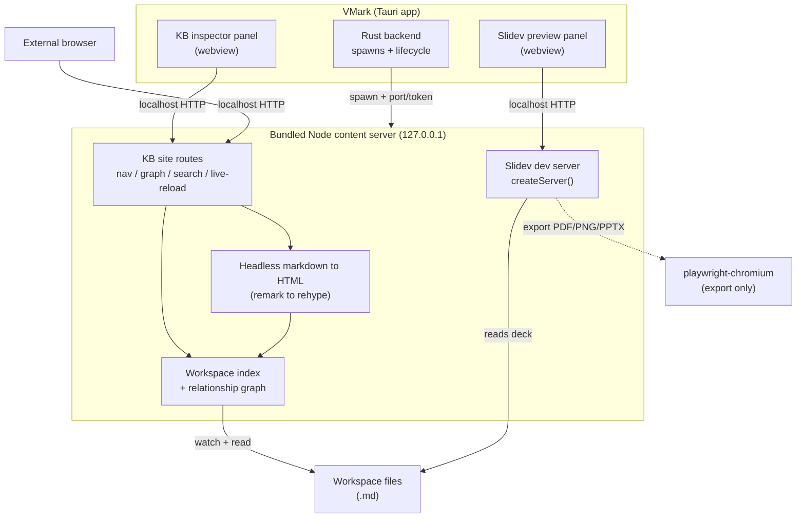

# Slidev Support + Knowledge-Base Content Server

> Created: 2026-06-24
> Revised: 2026-06-25 (post-Codex review — verdict NEEDS REVISION. Reconciled ADR-2 runtime model + split base/Slidev bundles; added ADR-9 auth/origin model; added ADR-10 process supervision; moved threat model + CSP into Phase 0/1; re-sequenced Phase 1 to a vertical slice + early Slidev slice; pinned Node ≥20.12; added Node sanitizer + markdownPipeline package-boundary work; added detection + wiki-link resolution spec tables. Codex thread `019efa12-41ea-7531-ad9c-e6b58208a3a0`.)
> Updated: 2026-06-25 (Phase 0 complete — all 6 spikes run + documented in `dev-docs/grills/slidev-kb/`. S0.2/S0.4 PASS with live evidence; S0.1 server-half PASS; S0.3 export-path confirmed; S0.5 size measured (451 MB Slidev tree); S0.6 threat model written. Built + verified: `vmark-content-server` package (Phases 2/3/4 + Slidev-software 6) with 65 tests; Rust `content_server` provisioning state machine + manager (Phase 1 core) with 11 tests. Full app suite still green (20,050). See "Shipped vs plan" below.)
> Status: **PARTIAL — software phases built & verified; external-infra + UI phases pending.** See the reconciliation table.
> Branch: `feature/content-server-slidev-kb` (created)

## 0. Shipped vs plan (audit-fix, 2026-06-25)

| Phase | Planned | Shipped | Verified by |
|---|---|---|---|
| 0 — Spikes | 6 spikes PASS | 6 run + documented; S0.2/S0.4 PASS (live), S0.1 server-half PASS, S0.3 path PASS, S0.5 measured, S0.6 designed | `dev-docs/grills/slidev-kb/*` |
| 1 — Runtime slice | provisioning SM + manager + spawn + auth | **provisioning state machine + workspace-keyed manager (core)**; auth proven. **Spawn-from-Rust + codesigned Node + downloader = external residue** | 11 cargo tests |
| 1.5 — Slidev slice | detect→provision→preview→teardown | **programmatic boot proven live (S0.2)**; detection + wrapper shipped. Supervisor spawn = residue | S0.2 + 14 tests |
| 2 — Index/graph | walker, resolution, graph, watch | **all shipped** | 16 tests |
| 3 — Headless render | remark→hast, KaTeX, sanitize | **shipped** (Mermaid/Markmap client bundles = Phase 4/8 follow-up) | 24 tests |
| 4 — KB site | routes, cookie auth, SSE, search | **all shipped** | 9 + 2 live tests |
| 5 — In-app panel | AppShell slot + graph + i18n | **status store + service + KnowledgeBasePanel + i18n shipped** (live render in a real window = interactive residue) | store/service/panel tests (16) |
| 6 — Slidev preview | detect + proxy + panel | detect + wrapper shipped; HMR-proxy + panel mount = interactive residue | S0.2 + 14 tests |
| 7 — Slidev export | Chromium provision + export | **export arg-builder + format model shipped & tested**; spawn + Chromium provision = external residue | 3 cargo tests (slidev.rs) |
| 8 — Polish | i18n, docs, security audit, gates | **i18n (10 locales), website guide, security audit (VULN-001 found + FIXED), file-size + i18n gates green**; 9-locale real translation = translate-docs follow-up | lint:i18n + lint:file-size pass |

**Security:** the Phase 8 review (`dev-docs/grills/slidev-kb/phase8-security-review.md`)
found one Medium (VULN-001 — reusable bootstrap token in URL). **Fixed**: `/__auth`
now accepts only single-use, TTL'd nonces minted via a Bearer-authed `/__mint`;
the long-lived token never appears in a URL. Verified by 5 auth tests.

**Honest residue (cannot be completed/verified in an agent session — external infra):**
codesigning + notarizing the in-bundle Node binary; hosting the signed CI-built
tarballs; downloading + bundling `playwright-chromium`; macOS Gatekeeper
quarantine of provisioned trees; and interactive in-app (webview) render
verification on a real macOS build. These are release-pipeline / human-gated and
are tracked in ADR-2 + Phases 1/5/7/8.

**New dependencies added (governance rule 4 acknowledgment — `vmark-content-server`):**
`hono`, `@hono/node-server`, `unified`, `remark-parse`, `remark-gfm`,
`remark-math`, `remark-frontmatter`, `remark-rehype`, `rehype-katex`,
`rehype-stringify`, `hastscript`, `mdast-util-find-and-replace`,
`unist-util-visit`, `katex`, `dompurify`, `jsdom`, `yaml`, `chokidar`. All are
established, high-download packages; the remark/rehype/unified set already
underpins the editor's pipeline.
> Related: `20260506-multi-format-rebrand.md` (format adapter registry — the KB renderer reuses the same markdown pipeline), `20260504-github-actions-workflow-viewer.md` (the `@xyflow/react` + `dagre` graph pattern the relationship graph reuses)

---

## 1. Executive summary

Two user-requested capabilities, delivered as **one project** sharing a single
new subsystem:

1. **Full Slidev support** — in-app preview and export of Slidev presentation
   decks (`.md` files whose headmatter declares a Slidev deck).
2. **A local Knowledge-Base content server** — an embedded HTTP server that
   serves the *whole workspace* as a cross-linked, browsable site with
   wiki-link navigation, a relationship graph (notes, tags, concepts, data
   relations), full-text search, and live-reload — usable both in an in-app
   panel **and** in an external browser (Obsidian/Notion-style inspector).

### 1.1 The unifying architecture

VMark's markdown pipeline is `remark`/`unified` — it runs in **Node natively**.
Slidev is a Node toolchain. Both features therefore share one new long-lived
process: a **bundled Node "content server"** that VMark spawns and
lifecycle-manages. One runtime, two consumers.

### 1.2 What changed after research (read this before reviewing)

Two verified findings reshape the naive approach:

- **VMark's existing sidecar packaging (`@yao-pkg/pkg`) CANNOT bundle Slidev.**
  Slidev is a Vite + Vue + UnoCSS + Shiki toolchain that resolves and transforms
  files at runtime against a real on-disk `node_modules`. `pkg`'s virtual FS +
  ESM-snapshot limits make it unusable here. A **real Node runtime + real
  on-disk `node_modules`** is the only credible path. (High confidence; see
  `dev-docs/grills/slidev-kb/` once Phase 0 runs.)
- **No prior art** exists for embedding Slidev in a desktop app. This is
  greenfield → Phase 0 spikes are mandatory, not optional.

This forces a refinement of the chosen "bundle a Node + Slidev runtime"
direction — see **ADR-2**. We still bundle/provision a runtime; we just do it
via a version-pinned, checksum-verified, download-on-first-use bundle rather
than `pkg`, because `pkg` literally cannot package this toolchain.

### 1.3 What this is NOT

- Not a reimplementation of Slidev rendering inside the Tiptap editor. Slidev's
  Vue/Vite dialect (`<v-click>`, layouts, scoped `<style>`, magic-move) is
  rendered by **Slidev itself**. VMark never tries to approximate it.
- Not a cloud/publish service. The server binds `127.0.0.1` only.
- Not a replacement for the editor's existing inline diagram previews.

### 1.4 Effort shape (AI-execution units)

- **Irreducible thinking:** runtime provisioning + macOS quarantine handling
  (ADR-2), headless render fidelity (ADR-4), graph relation modeling (ADR-5),
  security review of a new local server + spawned binaries (ADR-6/8).
- **Mechanical:** Hono routes, index walker, React panel slots, export menu
  wiring, i18n, docs.
- **Clock-time waits:** runtime/Chromium downloads on first use; cross-platform
  CI bundle builds; mandatory Codex review gate before Phase 1.

Rough delta: ~3,000–4,000 LOC + a per-OS runtime-bundle build pipeline across
9 phases (0–8). Phase 0 is spikes only.

---

## 2. Scope

### 2.1 In scope

| Capability | Phase |
|---|---|
| Phase 0 feasibility spikes (6, all must PASS) incl. threat model | 0 |
| Runtime vertical slice: signed in-bundle Node + provisioning state machine + ContentServerManager + authed `/__health` | 1 |
| Early Slidev vertical slice (detect→provision→preview→teardown) | 1.5 |
| Workspace index: file walk, frontmatter extraction, wiki-link → file resolution | 2 |
| Relationship graph: wiki-links + md links + tags + frontmatter relations, bidirectional | 2 |
| Incremental index updates on file change (watch) | 2 |
| Headless markdown → HTML reusing VMark's remark plugins | 3 |
| KB site routes: index, note render, graph JSON, search, backlinks | 4 |
| Live-reload (SSE) on save | 4 |
| "Open KB in browser" + localhost URL surfacing | 4 |
| In-app KB inspector panel (webview + native `@xyflow/react` graph) | 5 |
| Slidev deck detection + programmatic dev server + in-app preview panel | 6 |
| Slidev export (PDF/PNG/PPTX) via provisioned `playwright-chromium` | 7 |
| i18n, dark theme, a11y, security review, docs, perf, file-size gate | 8 |

### 2.2 Out of scope

- Remote/public hosting or auth beyond localhost + loopback token.
- Editing Slidev decks with WYSIWYG fidelity (source-mode editing only for
  Slidev-specific syntax; VMark already edits the underlying `.md`).
- Multi-workspace simultaneous servers (one server per focused workspace; see
  ADR-6 on lifecycle).
- Real-time collaborative graph editing.
- Bundling Chromium into the installer (provisioned separately on first export).

### 2.3 Runtime constraints

- **macOS is primary** (cross-platform policy). Windows/Linux best-effort.
- The server must bind `127.0.0.1` only and require a per-session token.
- All process spawning routes through `ai_provider::build_command()` +
  `login_shell_path()` (GUI-app minimal PATH; Windows `.cmd` shims).
- First-run provisioning requires network; degrade gracefully offline (KB
  features that don't need Slidev should still work — see ADR-1 fallback).

---

## 3. Architecture Decision Records

### ADR-1 — One bundled Node "content server" hosts both KB and Slidev

**Decision:** A single Node process (spawned by VMark's Rust backend, scoped to
the focused workspace) hosts both the KB site and the Slidev dev server.

**Rationale:** VMark's `remark` pipeline runs in Node; Slidev is Node. Reusing
one runtime avoids a second heavy dependency tree and a second lifecycle.
The KB renderer can reuse the exact remark plugins (`wikiLinks`, alerts,
details, math, gfm, frontmatter) from `src/utils/markdownPipeline/`.

**Consequence / fallback:** The KB core (index, render, search, graph) depends
only on lightweight Node deps and must function **without** the heavy Slidev
tree present. Slidev is a lazily-provisioned add-on: if Slidev isn't installed,
KB features still work; opening a Slidev deck prompts provisioning.

**Alternatives rejected:** Rust HTTP server (axum) — would require
reimplementing the entire remark pipeline + custom plugins in Rust; rejected.
Two separate Node processes — double the lifecycle/port management; rejected.

### ADR-2 — Runtime provisioning: signed in-bundle Node + two signed, version-pinned JS bundles, NOT `pkg`

**Canonical model (one model, no ambiguity):**

1. **Node runtime** (≥ **20.12** — Slidev's floor; do NOT inherit the sidecar's
   Node 18) ships **inside the app bundle and is codesigned by us**. Never
   downloaded.
2. **Two separate JS bundles**, each a pre-built, version-pinned, per-OS tarball
   we host:
   - **Base KB bundle** — Hono + the headless renderer + index/graph deps.
     Small. May ship in-app or download-on-first-use (decide in S0.5 once sized).
   - **Slidev bundle** — the full `@slidev/cli` Vite tree. Large.
     **Download-on-first-use only**, the first time a Slidev deck is opened.
3. **Chromium** (`playwright-chromium`) — separate provisioning on first
   *export* (Phase 7), never bundled.

**Downloaded JS is treated as executable code, not "inert" (corrects the earlier
overconfident claim):** `node_modules` can contain postinstall artifacts, native
addons, and helper binaries. Therefore: (a) we build the tarballs ourselves in
CI from a pinned lockfile (no live `npm install` on the user's machine →
sidesteps governance rule 4's slopsquatting risk); (b) each tarball carries a
**signed manifest** (checksum + version), verified before extraction; (c) the
build **bans native addons / executable payloads** unless individually
justified and signed; (d) on macOS the extracted tree is placed in app-data and
the quarantine xattr handled explicitly (validated in S0.5). We sign the
*manifest*, not each file, and gate execution on manifest verification.

**Rationale:** `@yao-pkg/pkg` cannot package Slidev's Vite toolchain (§1.2). A
signed in-bundle Node keeps the only native executable under our notarized
signature; pinned CI-built tarballs make the JS reproducible and
integrity-checkable without live registry resolution.

**Consequence:** Installer stays small (Node binary only); KB works as soon as
the small base bundle is present; first Slidev use incurs a one-time large
download with a clear, actionable prompt (offline → KB still works, Slidev
deferred). Provisioning is a state machine (see Phase 1 WI-1.1).

### ADR-3 — Slidev is rendered by Slidev (programmatic `createServer`), never VMark's pipeline

**Decision:** Use `@slidev/cli`'s programmatic API:
`createServer(resolveOptions({ entry }, 'dev'), …)` → a Vite `ViteDevServer`
VMark controls (`listen`/`close`/`restart`). Preview = load
`http://127.0.0.1:<port>` in a Tauri webview panel and/or external browser.

**Rationale:** Verified API; gives lifecycle control without fragile CLI
subprocess scraping. Slidev markdown is a Vue/Vite dialect that VMark's
remark→ProseMirror pipeline cannot and should not approximate.

**Uncertainty:** Vite `middlewareMode` to fold Slidev under the KB server's port
is **not a documented Slidev path** → spike S0.2 verifies; default to a separate
sub-port if middleware mode is unreliable.

### ADR-4 — KB HTML rendered headlessly (remark → rehype), diagrams client-side, math server-side

**Decision:** Build a Node headless renderer: reuse VMark's remark plugins to
produce MDAST, then `remark-rehype` + custom rehype handlers for VMark's custom
nodes (wiki-links, alerts, details, sub/superscript) → HTML. KaTeX renders
server-side (`katex.renderToString`); Mermaid/Markmap render **client-side** in
the served page (ship their browser bundles), mirroring how the editor does it.

**Rationale:** Decouples KB rendering from the Tiptap editor (which is
webview-coupled via `ExportSurface.tsx`). The remark *parser* plugins are pure
JS and portable to Node.

**Caveats surfaced by review (do not assume drop-in reuse):**
- **Not all semantics live in remark.** Alert blocks (and similar) are converted
  in the **MDAST→ProseMirror** step (`mdastToProseMirror`), not in a remark
  plugin. The headless path needs its *own* MDAST→HTML handlers for those nodes
  — they cannot be lifted from the ProseMirror conversion. Inventory every
  custom node's conversion site in S0.4.
- **Package boundary required.** `markdownPipeline` uses TS path aliases and
  editor-oriented preprocessing. Extract a Node-safe entry (a `markdownPipeline`
  package/subpath export with no `@/` aliases, no DOM, no editor imports) and
  prove it with a Node-only smoke test **before** building KB routes.
- **Sanitizer needs a DOM in Node.** The existing `src/utils/sanitize.ts` is
  browser-`DOMPurify`-coupled and degrades without `document`. The Node renderer
  must run DOMPurify atop `jsdom` or `happy-dom` (dependency decided in S0.4 /
  Phase 3), and the **same XSS corpus** must pass in both Node and browser.

**Consequence:** Custom rehype handlers + a Node sanitizer setup are net-new and
must be fidelity-tested against the editor's rendering (Phase 3 fixtures).

### ADR-5 — Relationship graph is a Node-built bidirectional index

**Decision:** The index walks the workspace (honoring `workspace.rs` exclude
rules + trust), parses frontmatter with `yaml` (already a dep), extracts:
(a) wiki-links resolved to files, (b) markdown links, (c) tags (`#tag` +
frontmatter `tags:`), (d) explicit frontmatter relations (configurable keys,
e.g. `related:`, `up:`, `links:`). It builds bidirectional edges → backlinks +
graph. Updates incrementally on file watch.

**Rationale:** "Node relations, concept, data" (user) needs more than backlinks.
Frontmatter-declared relations + tags give typed edges (concept/data/relation),
not just link adjacency. Wiki-link → file resolution is the missing piece today
(links are parsed but unresolved — confirmed in exploration).

**Renderer:** Reuse the existing `@xyflow/react` + `@dagrejs/dagre` pattern from
`src/lib/ghaWorkflow/render/` (`toGraph` → `layout` → render). The served page
uses a JS bundle; the in-app panel reuses the React components.

### ADR-6 — Server binds loopback only, session-cookie auth, one-per-workspace, tied to window lifecycle

**Decision:** Bind `127.0.0.1:0` (OS-assigned port). Write port + random
bootstrap token to a file in app-data (reuse the MCP bridge `write_port_file`
pattern). **Auth transport is session-cookie based, not per-request header**
(see ADR-9 — a header-only scheme is impossible for browsers, static assets,
SSE, and Slidev HMR). Start the server when a workspace gains focus; stop on
workspace close / app exit.

**Rationale:** Matches VMark's localhost posture (MCP bridge). Workspace
**trust** gating (`workspaceStore.isWorkspaceTrusted`) must pass before serving
— an untrusted workspace's content is never served.

### ADR-9 — Auth/origin model: one proxied origin, bootstrap-token → HttpOnly session cookie

**Problem (review D1.2):** A "token on every request" rule cannot work for an
external browser, ``/static assets, `EventSource` (SSE), or Slidev's Vite
HMR WebSocket — none can attach custom headers.

**Decision:**
- **Single origin.** The Hono server is the *only* exposed origin. Slidev runs
  on an internal sub-port and is **reverse-proxied** under the KB origin
  (path-prefixed, incl. the HMR WebSocket upgrade). If S0.2 shows Vite
  middleware/proxy of HMR is unreliable, fall back to exposing Slidev on its own
  loopback port with the **same cookie** check.
- **Bootstrap → cookie.** VMark opens `/__auth?t=<bootstrapToken>` (token from
  the port-file); the server validates it once and sets an **HttpOnly,
  SameSite=Strict, loopback-scoped** session cookie. All subsequent requests
  (HTML, assets, APIs, SSE, HMR) authenticate via the cookie. The bootstrap
  token is single-use / short-TTL so it doesn't linger in browser history.
- **CSRF.** State-changing routes (export trigger, etc.) require a
  double-submit token or are POST-only with `SameSite=Strict`; GET routes are
  side-effect-free.

**Consequence:** "Open in browser" performs the bootstrap redirect so the user's
browser gets the cookie. Defined per route class in Phase 1/4 DoD.

### ADR-10 — KB and Slidev are supervised child processes, not one fragile process

**Problem (review D5.4):** One Node process hosting both KB and Slidev is a
single point of failure — a Vite/Slidev crash or memory leak would take down KB.

**Decision:** One *provisioned runtime*, but a thin **supervisor** owns two
child processes: the always-on KB server and an on-demand Slidev server. The
supervisor restarts a crashed child independently, caps Slidev memory, and
reports health to Rust. KB availability never depends on Slidev liveness
(reinforces ADR-1's fallback).

### ADR-7 — In-app surfaces are AppShell slot registrations

**Decision:** The KB inspector panel and Slidev preview panel register as slots
in `src/shell/AppShell.tsx` (ADR-007 compliance) — no edits to `App.tsx`. The
KB graph reuses `@xyflow/react`.

### ADR-8 — Security containment

**Decision:** (a) All file reads are contained to the workspace root —
path-traversal rejected (reuse `content_search.rs` symlink-skip + root-prefix
checks; mirror for the Node server). (b) Rendered HTML is sanitized (DOMPurify
on a Node DOM — see ADR-4). (c) Remote-resource policy per §3bis (CSP + trust),
not a blanket ban. (d) Bundles are signed-manifest-verified before execution
(ADR-2). (e) Auth per ADR-9.

**Security is designed up front, not deferred:** the threat model + CSP/header
table are produced in **S0.6** and implemented in **Phase 1**. Phase 8's
security-review skill pass is the **final audit**, not the first time security
is considered (review D2.4/D5.3).

---

## 3bis. Resolution & detection specs (implementer-facing)

These close the ambiguity findings (D4.1/D4.2/D4.3). Each row needs a JSON
fixture before implementation.

### Slidev deck detection (must avoid false positives on ordinary frontmatter)

A `.md` is a Slidev deck **only if** its headmatter (first YAML block) contains
a Slidev-specific signal AND/OR slide structure. Signals (any one → deck):

| Signal | Example | Notes |
|---|---|---|
| `theme:` in headmatter | `theme: seriph` | Strong signal |
| `layout:` in headmatter | `layout: cover` | Strong signal |
| `mdc: true` / `drawings:` / `transition:` / `fonts:` | — | Slidev-only keys |
| ≥1 slide separator | `\n---\n` between content blocks | Weak alone; combine with a key |
| Explicit override | frontmatter `format: slidev` or file in a `slides/` convention | Authoritative |

**Non-deck regression cases (must NOT trigger):** a note with only
`title:`/`tags:`/`date:` frontmatter; a doc using `---` thematic breaks; a doc
with a `layout` key that's clearly not Slidev (decided by requiring a *second*
Slidev key when only `layout` is present). Fixtures for each.

### Wiki-link resolution (`[[…]]` → file)

| Form | Resolution rule |
|---|---|
| `[[Page]]` | match `Page.md` (then `Page/index.md`) by basename within workspace |
| `[[dir/Page]]` | path-relative from workspace root, then basename fallback |
| `[[Page#Heading]]` | resolve file as above; `#Heading` → slugified anchor |
| `[[Page\|Alias]]` | resolve `Page`; render `Alias` as link text |
| Duplicate basenames | prefer same-dir, then shortest path; record ambiguity in the index |
| Extension given (`[[Page.md]]`) | exact path match |
| Case sensitivity | match case-insensitively on case-insensitive FS; record canonical case |
| CJK / Unicode | NFC-normalize both target and filenames before compare |
| Broken target | render as a "missing" link (distinct class); still create a graph node marked unresolved |

### Remote-resource policy (corrects "no remote fetching")

"No remote fetching by default" applies to **server-side** fetches. The *served
page* still loads normal markdown images, HTML media, Mermaid assets, Slidev
themes/fonts — those load client-side and are governed by CSP (S0.6) and
workspace trust:

| Resource | Untrusted workspace | Trusted workspace |
|---|---|---|
| Local images/files under root | allowed | allowed |
| Remote `https:` images | blocked by CSP `img-src` | allowed |
| Remote scripts | blocked always | blocked unless explicitly allowed |
| Slidev theme/addon/font fetch | n/a (provisioned offline in bundle) | n/a |

---

## 4. Phases

Each phase has a **machine-checkable Definition of Done**. A
`scripts/check-slidev-kb-phase.sh <N>` (templated from `check-gha-phase.sh` per
governance rule 3) must exit 0 before the Status header advances. Every WI links
via commit message (`feat(scope): … (WI-N.M)`) or test-file header
(`// WI-N.M — …`), verified by `scripts/check-wi-linkage.sh`.

### Phase 0 — Feasibility spikes (no production code)

Write-ups land in `dev-docs/grills/slidev-kb/`. **All five must PASS** before
Phase 1.

| Spike | Probe | PASS criteria |
|---|---|---|
| S0.1 | Spawn a signed-in-bundle **Node ≥20.12** binary from Rust (cross-platform helpers); serve HTTP on `127.0.0.1`; perform the ADR-9 bootstrap→cookie handshake; load in both a Tauri webview and an external browser. **Also decide the Phase 5 in-app surface here** (webview/iframe vs native React panel). | both webview and browser render an authed page; cookie handshake works; bad/missing cookie → 401; clean shutdown leaves no orphan; surface decision recorded as an ADR update |
| S0.2 | Programmatic Slidev `createServer()`/`resolveOptions` pointed at an arbitrary `slides.md`; **reverse-proxy it (incl. HMR WebSocket) under the KB origin** per ADR-9; load in a Tauri webview | deck renders + HMR works through the proxy; if proxy of HMR is unreliable, same-cookie sub-port fallback proven; decision recorded |
| S0.3 | Headless export → PDF with provisioned `playwright-chromium`; pin exact Slidev + Node versions; test both CLI export and the browser `/export` route; record exact Chromium provisioning commands, size, and system-Chrome `--executable-path` fallback | a multi-slide PDF is produced; versions pinned; provisioning commands + size + codec/font caveats recorded (note: `--only-shell` is a Playwright install option, not a Slidev flag) |
| S0.4 | Stand up the **Node-safe `markdownPipeline` package boundary** (no `@/` aliases, no DOM, no editor imports); render markdown → HTML headlessly incl. wiki-links + **alerts (whose conversion currently lives in MDAST→ProseMirror, not remark)** + math; run **DOMPurify on jsdom/happy-dom** over the XSS corpus | Node-only smoke test passes; output matches editor rendering on a fixture set (structural diff); inventory of every custom node's conversion site produced; XSS corpus passes in Node |
| S0.5 | Build the **base KB** and **Slidev** tarballs in CI from pinned lockfiles; measure each size; verify signed-manifest verification + native-addon ban; prove macOS quarantine handling on the extracted tree; prove KB starts **offline with no Slidev bundle present** | both sizes recorded; manifest verify + addon scan pass; KB serves offline without Slidev; quarantine mitigation proven on macOS |
| S0.6 | **Threat model + header design** (not deferred to Phase 8): write the threat model for a localhost server exposing workspace files to a browser; define CSP (incl. `connect-src` for SSE/HMR), CORS, cookie flags, path-traversal containment, and remote-resource policy per trust state | written threat model + concrete header/CSP table that Phase 1 implements |

**DoD:** 6 write-ups present in `dev-docs/grills/slidev-kb/`; each states PASS/FAIL
+ evidence; ADR-2/-3/-9 updated with measured numbers + decisions; if any FAIL,
plan is revised before Phase 1.

### Phase 1 — Runtime vertical slice (thin, end-to-end)

Per review D5.1, Phase 1 is a **narrow vertical slice** that proves the whole
trust+lifecycle+auth spine before any broad KB work — *not* the full server.

- **WI-1.1** Provisioning **state machine**
  (`missing→downloading→verifying→extracting→ready│failed`): signed-manifest
  verification, **atomic directory swap**, per-bundle lock file, resumable
  download, interrupted-extraction recovery, stale-partial cleanup, disk-space
  preflight. Base KB bundle only in this phase.
- **WI-1.2** `ContentServerManager` (Rust): workspace-keyed, generation IDs,
  per-workspace port-file naming, crash-restart policy, child stdout/stderr →
  `tauri-plugin-log`, deterministic shutdown + process-tree cleanup. Spawns the
  **supervisor** (ADR-10) via `build_command` + `login_shell_path`.
- **WI-1.3** Supervisor + KB child serving exactly one route: an authed
  `/__health` behind the **ADR-9 bootstrap→cookie** handshake; CSP/headers from
  S0.6 applied.
- **WI-1.4** Tauri commands `content_server_start/stop/status`; capabilities
  (`shell:allow-execute`, fs scope for app-data); settings (enable/disable,
  provisioning state); frontend status store + offline/missing-runtime prompts
  (i18n keys).

**DoD:** on workspace open the server reaches `ready` and `/__health` returns
200 *only* with a valid cookie (401 otherwise) in **both** a webview and an
external browser; multi-window focus changes don't leak ports/processes; kill
leaves no orphan (test); offline first-run shows the actionable prompt and KB
core still boots; `pnpm check:all` + `cargo check` green; verified live on macOS.

### Phase 1.5 — Slidev vertical slice (early de-risk)

Per review D5.2, prove Slidev integration *before* the large KB build, so an API
or provisioning surprise can't invalidate weeks of work.

- **WI-1.5.1** On-demand Slidev bundle provisioning (reuses the Phase 1 state
  machine; large download + prompt).
- **WI-1.5.2** Supervisor starts/stops a Slidev `createServer` child for one
  hard-coded sample deck; reverse-proxied under the KB origin per ADR-9/S0.2.
- **WI-1.5.3** In-app webview panel renders the live deck; clean teardown; KB
  `/__health` stays up if Slidev crashes (ADR-10 proof).

**DoD:** sample deck previews live in-app through the proxied origin; killing the
Slidev child does not affect KB health; provisioning prompt + offline path work.

### Phase 2 — Workspace index + relationship graph (Node core)

- **WI-2.1** File walker with **deterministic, documented rules** (not
  "approximately" — review D2.3): honors `workspace.rs` excludes + trust;
  `.gitignore`; hidden/dot files; symlinked files (skip, mirroring
  `content_search` traversal safety); Unicode (NFC) normalization;
  case-insensitive-FS handling; duplicate basenames; large-file cap; per-file
  permission errors (skip + log, don't abort); watcher-overflow recovery. Caps
  **intentionally mirror** `content_search` constants. One fixture per rule.
- **WI-2.2** Frontmatter extraction (`yaml`) → typed fields (tags, relations).
- **WI-2.3** Wiki-link → file resolution (the missing primitive); md-link +
  `#tag` extraction.
- **WI-2.4** Bidirectional graph builder (typed edges: link/backlink/tag/
  relation) + JSON shape.
- **WI-2.5** Incremental watch updates (debounced).

**DoD:** Vitest suite over fixture workspace (empty, CJK filenames, broken
links, cyclic links, missing targets, huge dir) proves resolution + graph
correctness; performance bench on a synthetic 1k-note workspace recorded.

### Phase 3 — Headless markdown → HTML renderer

- **WI-3.1** `remark-rehype` pipeline + custom handlers (wiki-links, alerts,
  details, sub/sup).
- **WI-3.2** Server-side KaTeX; client bundles for Mermaid/Markmap.
- **WI-3.3** Theme CSS reuse (token CSS) for light/dark parity.
- **WI-3.4** HTML sanitization (DOMPurify).

**DoD:** fidelity fixtures (the `dev-docs/css-reference.md` element set) render
structurally equivalent to the editor; sanitization test for XSS payloads;
light + dark snapshots.

### Phase 4 — KB site (served)

- **WI-4.1** Hono routes: `/`, `/note/*`, `/api/graph`, `/api/search`,
  `/api/backlinks/*` (token-gated, path-contained).
- **WI-4.2** Search backed by the index (or delegated to `content_search`);
  decide in WI.
- **WI-4.3** Live-reload via SSE on save (VMark emits save events → server).
- **WI-4.4** Client graph view (served bundle) + navigation; "Open in browser"
  Tauri command + URL surfacing.

**DoD:** integration tests hit each route with/without token (401 path); SSE
reload proven; manual browser walkthrough documented.

### Phase 5 — In-app KB inspector panel

- **WI-5.1** AppShell slot + panel shell (toggle, menu item, shortcut — sync the
  three shortcut files per rule 41).
- **WI-5.2** Embedded webview/iframe to the KB site **or** native React panel
  calling JSON APIs (pick per S0.1 ergonomics).
- **WI-5.3** Native `@xyflow/react` graph reusing `toGraph`/`layout`.

**DoD:** panel mounts/unmounts cleanly; graph renders the fixture workspace;
dark-theme parity; a11y (focus, aria) per rules 33/30.

### Phase 6 — Slidev preview

- **WI-6.1** Slidev deck detection (headmatter shape) — format-adapter aware
  (coordinate with `src/lib/formats/`).
- **WI-6.2** Start/stop Slidev dev server via `createServer`; bind to content
  server lifecycle.
- **WI-6.3** In-app preview panel (webview) + "Open in browser"; live sync to
  the editor buffer (loadData callback / save).

**DoD:** opening a sample deck shows live slides in-app; editing reflects;
non-deck `.md` is unaffected (regression guard).

### Phase 7 — Slidev export

- **WI-7.1** Provision `playwright-chromium` on first export (separate from the
  Node bundle); progress + failure UX (missing Chromium → actionable prompt).
- **WI-7.2** Export PDF/PNG/PPTX via Slidev; integrate into the existing export
  menu/dialog (`src/export/`).
- **WI-7.3** Cancellation + timeout handling (mirror `ai_provider` cancellation
  token pattern).

**DoD:** each format exports a multi-slide deck; missing-Chromium path is
graceful; export is cancellable.

### Phase 8 — Polish, i18n, a11y, security, docs

- **WI-8.1** i18n keys across React (`src/locales/en/*.json`) + Rust
  (`src-tauri/locales/en.yml`); run `translate-docs` flow.
- **WI-8.2** Website docs: new guide page(s) + update `formats.md`, `settings.md`
  per rule 21.
- **WI-8.3** `security-review` skill pass on the server + provisioner
  (path traversal, token, checksum, sanitization, spawned-binary trust).
- **WI-8.4** Perf benches (index build, render, graph) + file-size gate
  (`pnpm lint:file-size`) + `pnpm check:all` green.

**DoD:** `check-slidev-kb-phase.sh 8` passes; website builds; security review
findings resolved or explicitly accepted; coverage gate holds.

---

## 5. Risks & mitigations

| Risk | Severity | Mitigation |
|---|---|---|
| `pkg` can't bundle Slidev (confirmed) | High | ADR-2: signed in-bundle Node + CI-built JS tarballs; Phase 0 S0.5 |
| Downloaded JS is executable, not inert (postinstall/native addons) | High | ADR-2: CI-built from pinned lockfile, signed manifest, native-addon ban; S0.5 |
| macOS Gatekeeper quarantine | High | ADR-2: only the signed Node binary is executable-from-us; explicit xattr handling on the extracted tree; S0.1/S0.5 |
| Auth can't be header-only for browser/SSE/HMR | High | ADR-9: single proxied origin + bootstrap→HttpOnly cookie; S0.1/S0.2 |
| Slidev needs Node ≥20.12 (sidecar is Node 18) | High | ADR-2: pin Node ≥20.12 independently; do not inherit sidecar target; S0.1/S0.3 |
| Node sanitizer (DOMPurify needs a DOM) | Med | ADR-4: jsdom/happy-dom; same XSS corpus Node+browser; S0.4/Phase 3 |
| Headless reuse not drop-in (alerts in MDAST→PM) | Med | ADR-4: Node package boundary + custom-node handler inventory; S0.4 |
| One process = single point of failure | Med | ADR-10: supervisor + separate KB/Slidev children |
| Chromium ~150 MB/OS + download reliability | Med | First-export only; resumable + verified; system-Chrome `--executable-path` fallback |
| No prior art for embedding Slidev | Med | Phase 0 spikes + Phase 1.5 early vertical slice |
| Slidev API drift breaks embedding | Med | Pin exact version; verify `createServer`/`resolveOptions` at build time; S0.2/S0.3 |
| First-run offline | Low | KB core works without Slidev (ADR-1); split base/Slidev bundles; clear prompts |
| Installer/disk bloat | Med | Only signed Node + small base bundle ship; Slidev/Chromium on demand |

---

## 6. Gate before Phase 1 (governance)

1. Phase 0: all **6** spikes PASS, write-ups in `dev-docs/grills/slidev-kb/`.
2. `scripts/check-new-deps.sh` clears any new npm deps (Hono, Slidev, jsdom, etc.).
3. **Mandatory Codex cross-model review** (`/cc-suite:review-plan`) — **DONE**
   2026-06-25 (verdict NEEDS REVISION; this revision addresses the load-bearing
   findings). Required because the plan spans >3 phases and adds new external
   deps + a bundled runtime (rules 6 + 7).
4. Create `scripts/check-slidev-kb-phase.sh` with per-phase assertions.
5. Branch `feature/content-server-slidev-kb`.

Only after 1–5 does Phase 1 code begin.

---

## 7. Open questions for the user (non-blocking for Phase 0)

- **Slidev export formats priority:** all three (PDF/PNG/PPTX) in Phase 7, or
  PDF-first?
- **Graph relation keys:** which frontmatter keys count as typed relations
  (`related`, `up`, `links`, custom)? Default proposed: `related`, `up`,
  `links`, plus `tags`.
- **Acceptable first-run download size ceiling** before we warn the user
  (proposed: prompt if > 250 MB).
