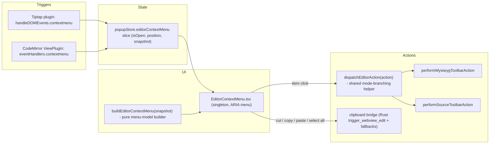

# Editor Right-Click Context Menu (Issue #1111)

Status: All phases (0–4) complete. `bash scripts/check-context-menu-phase.sh <N>`
exits 0 for every phase; `pnpm check:all` green; live E2E verified via the
Tauri MCP bridge (WYSIWYG menu + Bold on selection, table-menu precedence,
Source-mode heading submenu, native paste through the menu with editor
refocus). Clipboard spike decision record:
`dev-docs/grills/editor-context-menu/phase0-clipboard-spike.md`. Design v2
incorporates the mandatory Codex cross-model review (verdict on v1: NEEDS
REVISION; see "Review findings incorporated").

Implementation deviations from the v2 design (recorded per governance §1):
- `dispatchEditorAction(action, surface)` takes an explicit surface instead
  of resolving `selectSourceEditing` internally — the menu triggers know
  their surface, which also settles forced-source tabs; the menuPolicy gate
  moved to the snapshot provider (`getActiveFormatMenuPolicy`), where it
  drives section hiding rather than dispatch-time blocking.
- The source trigger checks `getSourceTableInfo` after the caret move (the
  ownership check needs the moved cursor), not before; the table menu still
  wins via `defaultPrevented` since its extension registers first.
- The WYSIWYG `unlink` adapter case and the full link-aware section shipped
  with the initial implementation instead of trailing in Phase 4 (a dead
  Remove Link item was worse than pulling the work forward).
- `plugins/codemirror/index.ts` does NOT re-export the CM trigger (it links
  the toolbar-adapter graph → import cycle); consumers import the module
  directly.
- SplitPane panes register their CM view with the clipboard bridge
  (`setContextMenuSourceView`) since they live outside editorStore.

WI linkage: all code WIs are linked via test headers
(`scripts/check-wi-linkage.sh`). Three artifact-only WIs — WI-0.4 (spike
decision record), WI-1.6 (phase-check script), WI-4.3 (locale keys) — must
be linked via their commit messages when this work is committed
(governance §2 allows either path).

Post-implementation hardening (5 Codex audit-fix rounds, all fixes
test-covered): source Remove Link handles reference links (new
`sourceUnlink.ts` + nesting-tolerant `findReferenceLinkAtPosition`);
`trigger_webview_edit` reports unhandled responder-chain sends (frontend
fallback engages) and gates on the invoking window being key —
atomically, on the main thread (cross-window clipboard exfiltration/paste
defense); menu activation failures log via `contextMenuError`;
`selectionEmpty` reads live view state (all CM ranges, multi-cursor
aware); stale open menus close on mode switches, split-pane view toggles,
and tab switches; Edit Link re-validates that the captured range is still
one continuous link with the same href before opening the popup; source
adapter actions and Remove Link run IME-safe via
`runOrQueueCodeMirrorAction`; the renderer split into
EditorContextMenu.tsx + MenuItems.tsx keeps both under the size guideline;
the source trigger defers to the table menu order-robustly.

Goal: right-clicking in the WYSIWYG or Source editor shows a context-aware
menu with clipboard, formatting, block, and link operations — visually and
behaviorally consistent with VMark's six existing custom context menus, and
dispatching through the existing action layer (no new command pathway).

## Problem analysis

Right-click in the editor currently does nothing in production because
`useReloadGuard.ts:54-61` globally `preventDefault()`s every `contextmenu`
event to suppress the native WKWebView menu (which contains a state-destroying
"Reload" item). The existing custom menus (table ×2, image, tab, file
explorer, terminal) work because their triggers handle the event before the
global suppressor. So the fix is not "unblock the native menu" — it is adding
a seventh custom menu for the general editor surface.

What already exists and is reusable:

| Concern | Existing artifact |
|---|---|
| Canonical action IDs + per-mode support flags | `src/plugins/actions/` (`ActionId`, `ACTION_DEFINITIONS`) |
| Adapter action strings + icons + enable-contexts | `src/components/Editor/UniversalToolbar/toolbarGroups.ts` |
| Active/disabled predicates per item | `src/plugins/toolbarActions/enableRules.ts` (`getToolbarItemState`) |
| Execution (both modes, same adapter strings) | `wysiwygAdapter.ts` / `sourceAdapter.ts` (`performXToolbarAction`) |
| Mode resolution | `src/stores/selectSourceEditing.ts` + `useEditorStore` |
| Menu dismissal (click-outside + IME-aware Escape) | `src/hooks/useDismissOnOutsideOrEscape.ts` |
| Consolidated popup state (15 slices) | `src/stores/popupStore.ts` (`imageContextMenu` slice is the template) |
| Shortcut display formatting | `formatKeyForDisplay` (`src/stores/settingsStore/keyFormatting.ts`) |
| macOS-style menu CSS + ARIA/keyboard-nav precedent | FileExplorer `ContextMenu.css`, `.claude/rules/32-component-patterns.md` |
| Format policy gate (non-markdown formats) | `isMenuActionAllowedForActiveFormat` (menuPolicy) |

What is missing:

1. A generic `contextmenu` trigger on the editor content surfaces.
2. A single mode-agnostic `dispatch(action)` helper — mode-branching is
   duplicated inline in `UniversalToolbar.handleAction` and
   `useUnifiedMenuCommands`.
3. Cut/Copy/Paste as callable actions — they are native
   `PredefinedMenuItem` roles (`edit_menu.rs:209-212`) that never flow
   through `menu:{id}`; JS cannot trigger a native-fidelity paste.
4. A menu component supporting sections, one-level submenus, checkmarks,
   and shortcut hints.

## ADRs

### ADR-1 — Custom HTML menu, not Tauri native `Menu.popup()`

Tauri v2 can pop native menus from JS, and `PredefinedMenuItem` would give
native clipboard roles for free. Rejected because: (a) all six existing
VMark context menus are custom HTML — a native menu would be the visual odd
one out; (b) context-aware checkmarks/disabled states need synchronous
editor-state reads, not IPC round-trips per popup; (c) custom menus are
unit-testable with Vitest and themeable with design tokens; (d) the one
native advantage (clipboard fidelity) is recovered by ADR-3.

### ADR-2 — Reuse the action layer via an extracted `dispatchEditorAction`

The menu must not become a third dispatch path. Extract the "resolve mode →
build ToolbarContext → call adapter" block from `UniversalToolbar.handleAction`
into `src/plugins/toolbarActions/dispatch.ts`; the toolbar and the context
menu both call it. The helper also applies the two protections the menu
would otherwise silently lose (Codex finding): the
`isMenuActionAllowedForActiveFormat` policy gate and forced-source
resolution. `useUnifiedMenuCommands` keeps its own dispatch (retry/IME-queue
logic the menu doesn't need); aligning it is an optional follow-up. Source
dispatches from the menu wrap in `runOrQueueCodeMirrorAction` (IME guard),
same as the unified-menu path.

### ADR-3 — Clipboard: native responder-chain trigger on macOS, plugin fallback elsewhere

New Tauri command `trigger_webview_edit(action: "cut"|"copy"|"paste"|"selectAll")`:

- **macOS**: `NSApp sendAction:` with the matching selector (`paste:` etc.)
  to the first responder — exactly what the Edit menu's `PredefinedMenuItem`s
  do. Paste flows through the normal webview paste event and all existing
  paste plugins (`htmlPaste`, `markdownPaste`, `codePaste`, CM `smartPaste`)
  with full HTML/image fidelity. One paste pipeline, zero forks.
- **Focus/selection contract** (Codex High finding): the responder chain
  targets the *first responder*, so the editor — not a menu button — must own
  focus when the command fires. The menu closes, calls the surface's
  `focus()` (`editorView.focus()` / `cmView.focus()`; both PM and CM restore
  their DOM selection on refocus), and only then invokes the command.
  Keyboard navigation may move real focus to menu items (ARIA requirement);
  pointer activation uses `mousedown.preventDefault()` so mouse clicks never
  steal focus at all. Phase 0 validates this exact close→refocus→sendAction
  path with a throwaway menu, not just a bare `sendAction` probe.
- **Windows/Linux** (best-effort per cross-platform policy): cut/copy via
  `document.execCommand` (functional in WebView2/WebKitGTK; goes through
  `markdownCopy`'s serializer). Paste fallback, exact APIs per surface:
  WYSIWYG → clipboard-manager `readText()` → `editorView.pasteText(text)`
  (prosemirror-view; verify availability in the pinned version during
  Phase 0, else synthesize a paste `ClipboardEvent` on the contenteditable);
  Source → `cmView.dispatch(cmView.state.replaceSelection(text))`. Image
  paste fallback reuses the existing image-save helper from the
  `markdownPaste`/`smartPaste` image path — no new persistence code.

The command rejects unknown action strings (`Result<(), String>`).

### ADR-4 — `editorContextMenu` slice in `popupStore` (not a standalone store)

Popup state was consolidated into `usePopupStore` (15 slices; the old
`imageContextMenuStore` is a `createSliceShim` projection). The new menu
adds an `editorContextMenu` slice (`slices.ts` initial state + `types.ts`
interface + open/close actions in an action-group file) holding
`{ isOpen, position, snapshot }`. New code imports `usePopupStore` directly;
no legacy shim is created. One `<EditorContextMenu/>` singleton subscribes.

### ADR-5 — Trigger precedence: guards before ownership, order specified

The generic triggers must not steal events from the table/image menus
(which `preventDefault()` but do not `stopPropagation()`):

- **WYSIWYG**: the trigger is a ProseMirror `handleDOMEvents.contextmenu`
  in a new plugin registered *after* `tableUI` in the extension assembly.
  Guard order: bail if `event.defaultPrevented`; bail if `isInTable(view)`;
  bail if the event target closest-matches an image node view. Only then
  claim the event.
- **Source**: CM `ViewPlugin` `eventHandlers.contextmenu`. Check
  `getSourceTableInfo` at the click position *before* moving the cursor
  (the source-table menu moves the cursor first today — the generic handler
  must not repeat that pattern); bail if the table menu owns the region or
  `event.defaultPrevented`.
- Registration-order regression tests cover both "generic before specific"
  and "specific before generic" orderings.
- `useReloadGuard`'s global suppressor stays as the outermost fallback for
  non-editor surfaces. Dev mode keeps the native menu outside the editor.

### ADR-6 — Explicit item descriptors + normalized context snapshot

Two action vocabularies coexist (Codex High finding): `TOOLBAR_GROUPS` uses
adapter strings (`heading:1`, `insertCodeBlock`) while `ACTION_DEFINITIONS`
uses canonical IDs (`setHeading`, `codeBlock`). The menu therefore defines
its own explicit descriptor per item — nothing is derived blindly:

```ts
interface ContextMenuItemDescriptor {
  id: string;                 // stable menu item id
  labelKey: string;           // editor:contextMenu.* i18n key
  adapterAction: string;      // performXToolbarAction vocabulary
  actionId?: ActionId;        // canonical id, for supports{} filtering
  shortcutId?: string;        // settingsStore shortcut id (explicit — toolbar
                              // ids like "h1" do NOT match shortcut ids)
  enabledIn: EnabledContext[];
}
```

A dev-time consistency test asserts every descriptor's `adapterAction` is
accepted by both adapters (or flagged wysiwyg/source-only) and every
`shortcutId` exists in the shortcut definitions — drift fails CI.

`buildEditorContextMenu(snapshot): MenuSection[]` is a pure function over a
normalized snapshot — the fixed contract between per-surface providers
(Phases 2–3) and the builder (Phase 1), which is what lets Phase 1 test all
contexts before the providers exist:

```ts
interface EditorContextMenuSnapshot {
  surface: "wysiwyg" | "source";
  selectionEmpty: boolean;
  multiSelection: boolean;
  formatPolicy: "markdown" | "restricted"; // menuPolicy verdict, precomputed
  block: { type: "paragraph" | "heading" | "codeblock" | "other"; headingLevel?: number };
  list: { type: "bullet" | "ordered" | "task" } | null;
  inBlockquote: boolean;
  link: { href: string | null } | null;    // null = not on a link;
                                            // href null = target unresolved
  activeActions: ReadonlySet<string>;       // adapterAction strings currently active
  disabledActions: ReadonlySet<string>;     // from getToolbarItemState
}
```

**Hide vs disable policy** (explicit): a *section* whose items are all
inapplicable to the snapshot is hidden (e.g. inline-format + block sections
inside a code block or under `formatPolicy: "restricted"`); an individually
inapplicable item inside an otherwise-applicable section renders disabled.
The policy lives in the builder, not in `enableRules` (which only knows
per-item disabled state).

## Feature specification

Default menu (markdown text block, either mode):

| Section | Items | Notes |
|---|---|---|
| Clipboard | Cut ⌘X, Copy ⌘C, Paste ⌘V | Cut/Copy disabled on empty selection |
| Selection | Select All ⌘A | |
| Inline format | Bold ⌘B, Italic ⌘I, Strikethrough, Inline Code | Checkmark when active |
| Block | Heading ▸ (Paragraph, H1–H6), List ▸ (Bullet, Ordered, Task), Blockquote, Code Block | Checkmark on current state |
| Link | Insert Link… ⌘K — or, on a link: Edit Link…, Copy Link, Remove Link | See link spec below |

Context awareness:

- **Inside a table / on an image** — existing menus take over untouched (ADR-5).
- **Inside a code block** — inline-format and block sections hidden;
  clipboard + Select All remain.
- **Non-markdown formats** (SplitPane source panes) — reduced menu:
  clipboard + Select All only (see Phase 3; the full markdown menu is NOT
  claimed there — `SourcePane` builds its own minimal extension list).
- **Forced-source large files** — source menu; wysiwyg-only items filtered
  via descriptors' `actionId.supports`.
- **Multi-cursor** — adapters' multi-selection policies apply via
  `disabledActions`.

Link section, concretely (Codex High finding):

- **WYSIWYG**: link mark at the click position provides `href`.
  Edit Link… opens the existing `linkPopup`; Copy Link → clipboard-manager
  `writeText(href)`; Remove Link → new `unlink` case in `wysiwygAdapter`
  (Tiptap `unsetLink`), mirroring the `unlink` that already exists in
  `sourceAdapter`.
- **Source**: `cursorContext.inLink` exists but its `href` is currently a
  placeholder. Phase 4 adds a bounded `getLinkTargetAtCursor` parser
  (WI-4.2); Copy Link is enabled only when it resolves (`link.href !== null`),
  Remove Link uses the existing source `unlink`, Edit Link… is
  wysiwyg-only until the source link popup path is evaluated (descoped —
  recorded as follow-up).

Interaction details:

- Right-click inside an existing selection preserves it; outside, the cursor
  moves to the click position first (only after ownership guards pass —
  ADR-5).
- Shortcut hints show the user's actual bindings: descriptor `shortcutId` →
  `useShortcutsStore.getShortcut()` → `formatKeyForDisplay`. No new
  formatting util.
- Full ARIA menu semantics + keyboard nav (roving focus, arrows/Home/End
  skip separators and disabled items, Escape/Tab close, focus returns to the
  editor on close); submenus via `aria-haspopup`/`aria-expanded`. Same bar
  as FileExplorer menu (#475).
- Positioned inside the editor popup host, `--z-context-menu` (1000),
  viewport-clamped. Dismissal: `useDismissOnOutsideOrEscape` **plus**
  explicit close-on-scroll / close-on-resize / close-on-window-blur
  listeners designed and tested in Phase 1 (not deferred to a sweep).
- Styling: existing `.context-menu` macOS-style pattern — tokens only,
  dark theme via `.dark-theme`.
- i18n: new `contextMenu.*` keys in `src/locales/en/editor.json`; all 9
  locales via the translate-docs flow.

## Architecture



New files (each < 300 lines):

| File | Responsibility |
|---|---|
| `src/stores/popupStore/…` | `editorContextMenu` slice: initial state, types, open/close actions |
| `src/components/Editor/EditorContextMenu/EditorContextMenu.tsx` | Renderer: sections, submenus, ARIA, keyboard nav, dismissal |
| `src/components/Editor/EditorContextMenu/menuModel.ts` | Descriptors, `EditorContextMenuSnapshot`, `buildEditorContextMenu` |
| `src/components/Editor/EditorContextMenu/clipboardBridge.ts` | Clipboard section: refocus contract, Rust invoke, platform fallbacks |
| `src/components/Editor/EditorContextMenu/editor-context-menu.css` | Styles (token-only, extends `.context-menu` pattern) |
| `src/plugins/editorContextMenu/tiptap.ts` | WYSIWYG trigger (guards, snapshot capture, open) |
| `src/plugins/codemirror/editorContextMenu.ts` | Source trigger (ViewPlugin, destroy-safe per #283) |
| `src/plugins/toolbarActions/dispatch.ts` | Extracted `dispatchEditorAction` (ADR-2) |
| `src-tauri/src/webview_edit.rs` | `trigger_webview_edit` (macOS responder chain; cfg-gated) |

Modified: `UniversalToolbar.tsx` (use extracted dispatch), `wysiwygAdapter.ts`
(`unlink` case), editor mounts (singleton + trigger registration),
`SplitPaneEditor` source-pane extensions (reduced-menu extension), `lib.rs`
(command registration), `useReloadGuard.ts` (comment only), locales,
website docs.

## Phases

### Phase 0 — Clipboard spike (governance §7)

- WI-0.1 Probe: Rust `sendAction` (`paste:`/`cut:`/`copy:`/`selectAll:`)
  reaches the focused WKWebView and fires the existing PM paste plugins
  (browser-copied HTML verified end-to-end).
- WI-0.2 Probe: the full menu path — right-click preserving selection →
  throwaway menu → item activation → close → `editorView.focus()` →
  `sendAction` — selection intact, paste lands at the right position. Both
  pointer (mousedown-prevented) and keyboard (real focus on menu item)
  activation.
- WI-0.3 Probe: `document.execCommand("copy"/"cut")` triggers
  `markdownCopy`'s serializer; confirm `editorView.pasteText` exists in the
  pinned prosemirror-view (else pick the synthetic-event fallback).
- WI-0.4 Decision record under `dev-docs/grills/editor-context-menu/` —
  confirm or amend ADR-3.

DoD: probes runnable and documented PASS/FAIL; ADR-3 confirmed or amended;
`pnpm check:cross` green.

### Phase 1 — Menu infrastructure (no editor wiring)

- WI-1.1 `editorContextMenu` popupStore slice (tests: open/close/reposition).
- WI-1.2 `menuModel.ts`: descriptors, snapshot type, builder — table-driven
  tests for every context in the feature spec (all expressible as snapshots:
  code block, link on/off/unresolved, empty selection, restricted format,
  forced source, multi-cursor, hide-vs-disable policy).
- WI-1.3 Descriptor consistency test: adapter-action and shortcut-id drift
  fails CI.
- WI-1.4 `EditorContextMenu.tsx`: sections, submenu, checkmarks, disabled,
  shortcut hints (`formatKeyForDisplay`); ARIA + keyboard nav; dismissal
  incl. scroll/resize/blur (component tests by role).
- WI-1.5 Extract `dispatchEditorAction` (with menuPolicy gate + forced-source
  resolution); refactor `UniversalToolbar` onto it (existing tests green).
- WI-1.6 Copy `scripts/check-gha-phase.sh` → `scripts/check-context-menu-phase.sh`.

DoD: `pnpm check:all` green; `bash scripts/check-context-menu-phase.sh 1` exits 0.

### Phase 2 — WYSIWYG wiring + clipboard bridge

- WI-2.1 Tiptap trigger plugin: ADR-5 guard order, selection-preserve vs
  cursor-move, snapshot capture (incl. link href from mark), open.
- WI-2.2 Rust `trigger_webview_edit` + registration/capability; input
  validation tests; non-macOS cfg fallback path.
- WI-2.3 `clipboardBridge.ts` wired per ADR-3 (refocus contract from the
  Phase 0 probe; platform fallbacks).
- WI-2.4 Precedence regression tests: table and image menus unaffected in
  both registration orders; reload-guard comment updated.

DoD: Tauri MCP E2E on macOS — right-click in WYSIWYG applies bold/heading/
list; browser-copied HTML pastes with fidelity; table/image menus intact.

### Phase 3 — Source mode + SplitPane

- WI-3.1 CM trigger ViewPlugin (destroy-safe; `getSourceTableInfo` guard
  before any cursor movement), snapshot from `sourceContextDetection`.
- WI-3.2 Source dispatch through the shared helper (IME-safe via
  `runOrQueueCodeMirrorAction`).
- WI-3.3 SplitPane `SourcePane`: dedicated reduced-menu extension
  (clipboard + Select All only) added to `sourcePaneExtensions` — the
  markdown-source extension list is not shared there.
- WI-3.4 Forced-source and restricted-format reductions verified.

DoD: Tauri MCP E2E in Source mode; split-view both panes correct; a JSON
tab's source pane shows the reduced menu.

### Phase 4 — Link section, i18n, docs, edge cases

- WI-4.1 WYSIWYG link section (Edit/Copy/Remove; `unlink` adapter case).
- WI-4.2 Source `getLinkTargetAtCursor` parser (bounded: inline links,
  reference links resolved against the doc; tests incl. CJK/nested
  brackets); Copy Link gated on resolution.
- WI-4.3 `contextMenu.*` locale keys + 9-locale translation pass.
- WI-4.4 Website docs: `website/guide/features.md`; dev-docs architecture note.
- WI-4.5 Edge-case sweep tests: viewport clamping, rapid re-invoke
  (reposition), CJK label widths, empty-clipboard paste no-op, window-blur
  close.

DoD: `pnpm check:all` + website build green; issue #1111 checklist fully
covered; close via `Closes #1111` in the final PR.

## Review findings incorporated (Codex, v1 → v2)

| Finding | Resolution |
|---|---|
| Action vocabulary mismatch (High) | ADR-6 explicit descriptors + CI drift test |
| Standalone store diverges from popupStore consolidation | ADR-4: slice, no shim |
| SplitPane source panes not on the markdown extension path (High) | WI-3.3 dedicated reduced-menu extension; feature spec no longer claims full menu there |
| Link actions underspecified / source href placeholder (High) | Concrete link spec; WYSIWYG full, source Copy Link gated on WI-4.2 parser; source Edit Link descoped |
| Clipboard focus-stealing from focused menu (High) | ADR-3 focus/selection contract; WI-0.2 probes the full path |
| Precedence depends on unstated ordering (High) | ADR-5 guard order + both-orders regression tests |
| `menuContext` undefined (High) | `EditorContextMenuSnapshot` interface in ADR-6 |
| Phase 1 tests claim contexts designed later | Snapshot is the Phase 1 contract; providers map to it later |
| Scroll/resize/blur dismissal deferred to sweep | Designed + tested in WI-1.4 |
| Shortcut-id mismatch; redundant new util | Explicit `shortcutId`; reuse `formatKeyForDisplay`; `shortcutDisplay.ts` dropped |
| Hide vs disable ambiguity | Explicit policy in ADR-6 (sections hide, items disable) |
| CM has no `pasteText`; fallback APIs imprecise | ADR-3 names exact per-surface APIs; PM `pasteText` verified in Phase 0 |

## Non-goals / future work

- **Migrating the six existing menus** onto this renderer — follow-up once
  the new component has soaked.
- **Spelling suggestions in the menu** — native suggestions are already
  unavailable in production; a future phase could add NSSpellChecker-backed
  suggestions via Rust.
- **Full-fidelity HTML paste on Windows/Linux** — plain-text/image fallback
  only; revisit if a maintained clipboard-HTML read path appears (§4
  dependency review required).
- **Source-mode Edit Link popup** and **"Paste and Match Style"**
  (`pasteAsPlainText:` selector) — optional later items.
- **Shortcut reference links (`[text]`)** never get a link section in
  source mode: `sourceContextDetection` doesn't mark them as `inLink`
  (audit round 1, finding #2). Likewise, its reference-link regex rejects
  nested-bracket text (`[a [nested] text][ref]`, audit round 5, finding
  #2) even though the menu's own matcher now tolerates one nesting level.
  Both belong to the sourceContextDetection feature (they affect every
  `inLink` consumer — popups included), so they are follow-ups there,
  not context-menu changes.
