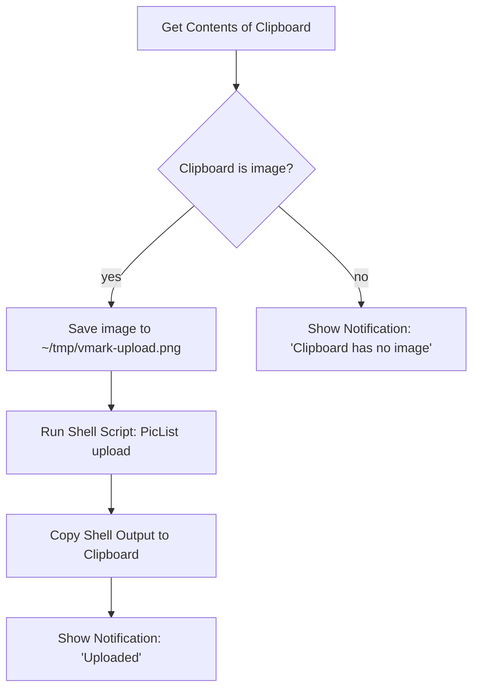

# In der Cloud gehostete Bilder

VMark ist ein lokal arbeitendes Schreibwerkzeug. Es bringt keinen eingebauten Uploader für Bilder mit, die du aus der Zwischenablage einfügst, und es speichert keine Cloud-Anmeldedaten. Wenn dein Markdown öffentliche CDN-URLs enthalten soll (für Blog-Veröffentlichungen, geräteübergreifende Synchronisation, CMS-Posts), läuft der Arbeitsablauf über eine Automatisierung auf Betriebssystemebene *außerhalb* von VMark und gibt das Ergebnis dann an VMark zurück.

Diese Seite erklärt, warum VMark so arbeitet, was bereits ohne Zusatzkonfiguration funktioniert und wie du das Rezept mit Shortcuts.app in etwa zehn Minuten einrichtest.

[[toc]]

## Was VMark bereits unterstützt

VMark unterscheidet beim Umgang mit Bildreferenzen in Markdown zwei Richtungen:

| Richtung | Status | Auslöser | Ausgabe im Markdown |
|----------|--------|----------|--------------------|
| Vorhandene Remote-URL einfügen | Unterstützt | URL `https://…` einfügen oder eintippen | Die URL, unverändert |
| Markdown-Quelltext mit Remote-URL | Unterstützt | Beliebige Person schreibt `` | Wird direkt gerendert |
| Lokales Bild einfügen | Unterstützt | Einfügen, ablegen oder eine Binärdatei einfügen | Kopiert nach `.assets/`, relativer Pfad eingetragen |
| Lokales Bild einfügen, *aber remote speichern* | **Nicht eingebaut** | (Siehe Rezept unten) | — |

Kurz gesagt: Wenn das Bild bereits unter einer URL liegt, füge die URL ein. VMark fügt sie als Markdown-Bildreferenz ein und die Webview lädt sie. Der Lesepfad ist bereits cloud-freundlich.

## Warum VMark keinen nativen Cloud-Upload mitbringt

Die vorgeschlagene Funktion würde bedeuten, dass VMark beim Einfügen ein lokales Bild erkennt, es zu einem Remote-Speicher hochlädt und die zurückgegebene URL anstelle eines `./.assets/…`-Pfads ins Markdown schreibt. Das klingt klein, erweitert aber den Umfang von VMark in drei tragenden Punkten:

1. **Tresor für Anmeldedaten**. Nativer S3-kompatibler Upload verlangt, dass Access Key und Secret Access Key dauerhaft gespeichert werden. VMark hat heute keinerlei langlebige Geheimnisse — keine Entscheidungen zur Verschlüsselung im Ruhezustand, keine Integration mit dem OS-Schlüsselbund, keine UX für Schlüsselrotation, keinen Fehlerfall, in dem Schlüssel versehentlich im Markdown landen. Upload-Unterstützung hinzuzufügen verschiebt VMark über diese Grenze.

2. **Langer Rattenschwanz an Multi-Provider-Unterstützung**. S3, Cloudflare R2, Backblaze B2, MinIO, DigitalOcean Spaces werben alle mit S3-Kompatibilität, aber jeder hat eigene Eigenheiten (Path-Style vs. Virtual-Hosted-Adressierung, ACL-Semantik, regionale Endpunkte, CORS-Regeln). Dass eine einzelne Person diese Fläche pflegt, ist langfristig eine Bürde für ein Schreibwerkzeug.

3. **Komposition vs. Besitz**. Werkzeuge wie [PicList](https://github.com/Kuingsmile/PicList) und [PicGo](https://github.com/Molunerfinn/PicGo) lösen dieses Problem bereits, inklusive providerspezifischer Konfiguration und Speicherung der Anmeldedaten. macOS Shortcuts.app und Keyboard Maestro können diese Werkzeuge in jedes Textfeld des Systems einklinken — nicht nur in VMark. Cloud-Upload in VMark einzubauen würde Code duplizieren, der außerhalb besser aufgehoben ist, und würde nur in VMark funktionieren.

Die Entscheidung lautet daher: **VMark bleibt ein Schreibwerkzeug; das Hochladen von Bildern gehört in die Automatisierungs-Werkzeugkiste auf Betriebssystemebene der Benutzerin oder des Benutzers**. Das Rezept unten konkretisiert den Pfad auf OS-Ebene.

## Rezept: Shortcuts.app + PicList (macOS, kostenlos)

Shortcuts.app wird mit macOS Monterey (12) und neuer ausgeliefert. PicList ist ein kostenloser Open-Source-Bild-Uploader. Zusammen geben sie dir eine Tastenkombination, die das aktuell in der Zwischenablage befindliche Bild nimmt, es per PicList hochlädt (PicList weiß bereits, wie man mit R2, S3, Imgur und Dutzenden weiteren Backends spricht) und die Zwischenablage durch die zurückgegebene URL ersetzt. Danach fügt `Cmd+V` in VMark die URL ein — den Rest erledigt die bereits vorhandene Remote-URL-Erkennung in VMark.

### Voraussetzungen

1. **PicList installiert und konfiguriert.** Lade es von der [PicList-Releases-Seite](https://github.com/Kuingsmile/PicList/releases) herunter, öffne es einmal und konfiguriere unter PicLists *PicBed Settings* mindestens einen Bilderhoster (R2, S3, Imgur, smms usw.). Stelle sicher, dass ein manueller Upload innerhalb von PicList selbst funktioniert, bevor du den Shortcut einrichtest — das trennt die Frage „Funktioniert PicList?“ von der Frage „Ist mein Shortcut korrekt verdrahtet?“.

2. **PicList-CLI verfügbar.** PicList stellt über sein App-Bundle einen `upload`-Unterbefehl bereit. Auf macOS liegt das Binary unter `/Applications/PicList.app/Contents/MacOS/PicList`. Prüfe mit:

   ```sh
   /Applications/PicList.app/Contents/MacOS/PicList upload --help
   ```

   Der Befehl sollte die CLI-Hilfe zurückgeben. Falls nicht, prüfe, ob PicList in `/Applications` installiert ist (nicht `~/Applications` — passe den Pfad gegebenenfalls an).

### Den Shortcut bauen

Öffne `Shortcuts.app` und lege einen neuen Shortcut an. Füge der Reihe nach diese Aktionen hinzu:



Konkrete Schritte im Shortcuts-Editor:

1. **Aktion: Get Contents of Clipboard.** Ziehe sie aus der Seitenleiste hinein. Keine Konfiguration nötig.

2. **Aktion: If.** Bedingung setzen: *Clipboard is Media › Image*. (Wenn das Dropdown *Media* nicht anzeigt, nimm *Contents › has any value* als lockereren Check.)

3. **Im If-Zweig — Aktion: Save File.** Konfiguration:
   - Dienst: *Files*
   - Ziel: `~/tmp/` (lege den Ordner einmal über den Finder an, falls er nicht existiert).
   - Dateiname: `vmark-upload.png` (ein fester Name hält den Pfad für den nächsten Schritt vorhersagbar).
   - Deaktiviere *Ask Where To Save*, damit der Shortcut unbeaufsichtigt durchläuft.

4. **Aktion: Run Shell Script.** Konfiguration:
   - Shell: `/bin/zsh` (Standard auf macOS).
   - Eingabe: *Pass Input as `stdin`* — eigentlich wollen wir `as arguments`. (Beides funktioniert; das Skript unten ignoriert stdin und verwendet einen festen Pfad.)
   - Skriptkörper:

     ```sh
     /Applications/PicList.app/Contents/MacOS/PicList upload "$HOME/tmp/vmark-upload.png" 2>/dev/null | tail -n 1
     ```

   Das `tail -n 1` ist defensiv: PicList druckt unter Umständen informelle Log-Zeilen vor der URL aus. Prüfe einmal die tatsächliche Ausgabeform deiner PicList-Version; gibt PicList nur die URL zurück, ist `tail` ein No-op.

5. **Aktion: Copy to Clipboard.** Setze ihre Eingabe auf das *Shell Script Result*.

6. **Aktion: Show Notification.** Titel: `Uploaded`. Inhalt: *Shell Script Result*. Damit bestätigst du, dass die URL in der Zwischenablage liegt, und siehst, was hochgeladen wurde.

7. **(Optional) Else-Zweig — Aktion: Show Notification.** Titel: `No image on clipboard`. Hilft beim Debuggen, wenn die Tastenkombination ausgelöst wird, die Zwischenablage aber tatsächlich kein Bild enthielt.

### Globale Tastenkombination binden

Klicke im Shortcuts-Editor auf den *(i)*-Info-Button des Shortcuts und dann auf *Add Keyboard Shortcut*. Wähle etwas, das nicht mit VMarks Tastenkombinationen kollidiert — `Control + Option + Command + U` ist eine verbreitete Wahl (keine Konflikte mit macOS, Mnemonik „Upload“).

### Verwendung

1. Mach einen Screenshot mit `Cmd + Shift + Ctrl + 4` (speichert in die Zwischenablage, nicht auf die Festplatte) — oder kopiere ein beliebiges Bild aus einer anderen App.
2. Drücke deine Upload-Tastenkombination (`Ctrl + Opt + Cmd + U`).
3. Warte ~1–3 Sekunden auf die Benachrichtigung.
4. Füge in VMark ein (`Cmd + V`). Das Markdown bekommt ``.

### Was schiefgehen kann

| Symptom | Wahrscheinliche Ursache | Lösung |
|---------|-------------------------|--------|
| Shortcut wird ausgelöst, aber PicList läuft nicht | Falscher Pfad zur PicList-Binary | Prüfe, dass `/Applications/PicList.app/Contents/MacOS/PicList` existiert; passe den Pfad an, falls anders installiert |
| Benachrichtigung erscheint, aber Zwischenablage enthält weiterhin das Bild | Shell-Skript hat leer zurückgegeben | Führe das Shell-Skript manuell mit einem bekannt funktionierenden Dateipfad aus, um PicLists tatsächliche Ausgabe zu sehen |
| URL ist falsch / hat angehängten Leerraum | `tail -n 1` hat eine Log-Zeile erwischt, nicht die URL | Inspiziere PicLists Ausgabe; passe das Parsing an (`grep -oE 'https://[^[:space:]]+' \| tail -n 1` ist eine strengere Alternative) |
| `Cmd + V` in VMark fügt reinen Text statt eines Bildes ein | Die URL endet nicht mit einer Bilddateiendung, die PicList kennt | Stelle sicher, dass die Dateiendung beim Upload erhalten bleibt (R2/S3 bewahren sie typischerweise; prüfe dein Bucket-Key-Template) |

## Alternative: Keyboard Maestro

[Keyboard Maestro](https://www.keyboardmaestro.com/) ist ein kostenpflichtiges macOS-Automatisierungswerkzeug mit höherer Decke als Shortcuts.app. Der wichtigste praktische Vorteil für diesen Arbeitsablauf: KM kann `Cmd + V` direkt abfangen, wenn die Zwischenablage ein Bild enthält, sodass du in einem einzigen Tastendruck hochlädst und einfügst, statt in zweien (Tastenkombination, dann `Cmd + V`).

Das Rezept ist strukturell identisch mit der Shortcuts.app-Variante — Bild aus der Zwischenablage holen, in eine Datei speichern, PicList-CLI ausführen, Zwischenablage ersetzen, optional Paste simulieren. KMs *Trigger*-Makro-Baukasten ist flexibler (Trigger auf Zwischenablageninhalt, app-spezifischer Gültigkeitsbereich), aber der Upload-Schritt ist derselbe.

Wenn du nicht ohnehin schon Keyboard Maestro nutzt, ist Shortcuts.app die günstigere Antwort.

## Alternative: Verarbeitungsskript vor der Veröffentlichung

Für Nutzerinnen und Nutzer mit selbstgehostetem Blog oder einer Static-Site-Pipeline ist die sauberste Antwort oft: Belasse VMarks Standardverhalten (`.assets/`-Relativpfade) und führe ein Build-Zeit-Skript aus, das das Markdown durchläuft, jedes eindeutige Bild hochlädt und den Pfad umschreibt. Damit tauschst du Pro-Bild-Upload-Latenz gegen gebündelten Upload bei der Veröffentlichung — und hältst die Editor-Oberfläche aufgeräumt.

Eine minimale Skizze (Node.js, Pseudocode):

```js
// scan-and-upload.js
const fs = require("fs");
const { execSync } = require("child_process");

const md = fs.readFileSync(process.argv[2], "utf8");
const rewritten = md.replace(/!\[(.*?)\]\((\.\/\.assets\/[^)]+)\)/g, (_, alt, path) => {
  const url = execSync(
    `/Applications/PicList.app/Contents/MacOS/PicList upload "${path}"`,
  ).toString().trim();
  return ``;
});
fs.writeFileSync(process.argv[2].replace(/\.md$/, ".published.md"), rewritten);
```

Mehrere Static-Site-Generatoren (Hugo mit [Page Bundles](https://gohugo.io/content-management/page-bundles/), Jekyll, Astro, Eleventy) verarbeiten relative `.assets/`-Pfade nativ zur Build-Zeit — kein Skript nötig, wenn du auf diesem Weg veröffentlichst.

## Bereits gehostete URLs

Der Vollständigkeit halber: Liegt ein Bild bereits unter einer öffentlichen URL, füge die URL in VMark ein und du bist fertig. Der Detektor für Bildpfade in der Zwischenablage klassifiziert sie als `type: "url"` und schreibt die URL direkt. Kein Upload, keine `.assets/`-Kopie, keine Einstellung zu ändern. Das ist der einfachste Cloud-Bild-Workflow, den VMark unterstützt, und er braucht keine zusätzlichen Werkzeuge.

## Siehe auch

- [Dateien- und Bild-Einstellungen](./settings.md) — automatisches Skalieren, Kopieren in Assets, Aufräumen verwaister Dateien
- [Privatsphäre](./privacy.md) — was VMark lokal speichert und was deinen Rechner verlässt
