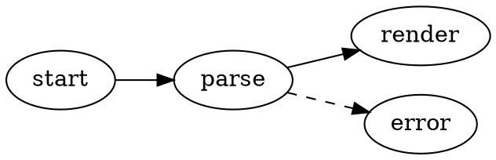
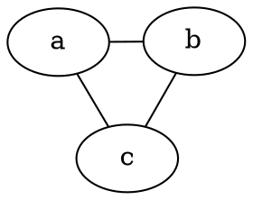

# Graphviz-Diagramme

VMark rendert [Graphviz](https://graphviz.org/)-DOT-Graphen direkt in Ihren Markdown-Dokumenten. Diagramme werden lokal mit dem Graphviz-WASM-Build ([@viz-js/viz](https://github.com/mdaines/viz-js)) gerendert — kein Netzwerkzugriff, keine externen Binärdateien.

[[toc]]

## Ein Diagramm einfügen

Verwenden Sie **Einfügen → Graphviz-Diagramm** in der Menüleiste (oder in der Einfügen-Gruppe der Symbolleiste), um ein Vorlagendiagramm einzufügen — das Tastaturkürzel ist standardmäßig nicht belegt und kann in den Einstellungen angepasst werden. Oder geben Sie einen umzäunten Code-Block mit der Sprachkennung `dot` oder `graphviz` ein:

````markdown

````

Beide Fence-Sprachen verhalten sich identisch:

| Fence | Wird gerendert als |
|-------|--------------------|
| ` ```dot ` | Graphviz-Diagramm |
| ` ```graphviz ` | Graphviz-Diagramm |

## Bearbeitungsmodi

- **WYSIWYG-Modus** — der Code-Block wird als Diagramm gerendert. Doppelklicken Sie darauf, um den DOT-Quellcode mit einer entprellten Live-Vorschau zu bearbeiten; speichern oder abbrechen Sie über die Bearbeitungskopfzeile.
- **Quellmodus** — platzieren Sie den Cursor innerhalb eines ` ```dot `-Fence, um die schwebende Diagrammvorschau zu erhalten (ziehen, Größe ändern, zoomen), genau wie bei Mermaid.

## Schwenken, Zoomen und Exportieren

Gerenderte Diagramme unterstützen dieselben Bedienelemente wie Mermaid-Diagramme:

- **Cmd/Strg + Scrollen** zum Zoomen, Ziehen zum Schwenken, Zurücksetzen-Schaltfläche zum Neuzentrieren
- **Als PNG exportieren** (heller oder dunkler Hintergrund) über die Export-Schaltfläche

## Engine und Layout

Diagramme werden standardmäßig mit der `dot`-Engine (hierarchisches/geschichtetes Layout) angeordnet. Um eine andere Engine zu verwenden, setzen Sie das Standard-Graphviz-Attribut `layout` in Ihrem Graphen — die Wahl wandert mit dem Dokument und funktioniert in jedem anderen Graphviz-Tool:

````markdown

````

| Engine | Layout-Stil |
|--------|-------------|
| `dot` | Hierarchisch / geschichtet (Standard) |
| `neato` | Federmodell (kräftebasiert) |
| `fdp` | Kräftebasiert, größere Graphen |
| `sfdp` | Mehrskalig kräftebasiert, sehr große Graphen |
| `circo` | Kreisförmig |
| `twopi` | Radial |
| `osage` | Geclustert |
| `patchwork` | Treemap (squarified) |

Ein unbekannter `layout`-Wert zeigt den Renderfehler-Zustand an, wie jeder andere DOT-Fehler.

Alle von Graphviz unterstützten Standard-DOT-Funktionen funktionieren: Subgraphen und Cluster, Ränge, Knotenformen, Kantenstile, HTML-ähnliche Beschriftungen und explizite Farben.

## Design-Integration

- Der Diagrammhintergrund ist transparent und folgt daher dem Editor-Design.
- Die Standardfarben für Knoten, Kanten und Text werden aus den Design-Tokens des aktiven Designs abgeleitet, sodass Diagramme in jedem Design (White, Paper, Mint, Sepia, Night, Solarized) nativ wirken und sich beim Designwechsel aktualisieren.
- Explizite Farben in Ihrem DOT-Quellcode haben immer Vorrang vor den Design-Standardwerten — ein Graph, der sein eigenes `bgcolor`, `color` oder `fontcolor` setzt, wird exakt so gerendert wie geschrieben.

## Fehlerbehandlung

Wenn der DOT-Quellcode einen Syntaxfehler enthält, zeigt der Block einen Renderfehler-Zustand statt eines Diagramms. Korrigieren Sie den Quellcode, und die Vorschau wird automatisch neu gerendert.

## HTML- und PDF-Export

Exportierte HTML- und PDF-Dokumente betten das gerenderte SVG ein, sodass Diagramme außerhalb von VMark genauso aussehen.
