# Benutzer als Entwickler

Wie sieben Claude Code Plugins unverzichtbar wurden, indem sie im Feuer der VMark-Entwicklung geschmiedet wurden.

## Die Ausgangslage

VMark ist ein AI-freundlicher Markdown-Editor, gebaut mit Tauri, React und Rust. Über 10 Wochen Entwicklung:

| Kennzahl | Wert |
|--------|-------|
| Commits | 2.180+ |
| Codebase-Umfang | 305.391 Codezeilen |
| Testabdeckung | 99,96 % Lines |
| Test:Produktion-Verhältnis | 1,97:1 |
| Audit-Issues erstellt und gelöst | 292 |
| Automatisierte PRs gemergt | 84 |
| Dokumentationssprachen | 10 |
| MCP-Server-Tools | 12 |

Ein einzelner Entwickler hat es mit Claude Code gebaut. Dabei entstanden sieben Plugins für den Claude Code Marketplace — nicht als Nebenprojekt, sondern als Überlebenswerkzeuge. Jedes Plugin existiert, weil ein konkretes Problem eine Lösung forderte, die es noch nicht gab.

## Die Plugins

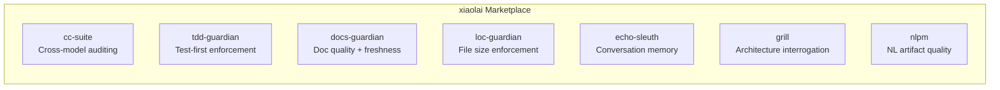

| Plugin | Funktion | Entstanden aus |
|--------|-------------|-----------|
| [cc-suite](https://github.com/xiaolai/cc-suite) | Cross-Model Code-Auditing über OpenAI Codex | „Ich brauche ein zweites Augenpaar, das nicht Claude ist" |
| [tdd-guardian](https://github.com/xiaolai/tdd-guardian-for-claude) | Durchsetzung des Test-First-Workflows | „Die Abdeckung sinkt ständig, wenn ich Tests vergesse" |
| [docs-guardian](https://github.com/xiaolai/docs-guardian-for-claude) | Qualitäts- und Aktualitätsprüfung der Dokumentation | „In meiner Doku steht `com.vmark.app`, aber der tatsächliche Identifier ist `app.vmark`" |
| [loc-guardian](https://github.com/xiaolai/loc-guardian-for-claude) | Durchsetzung der Zeilenlimits pro Datei | „Diese Datei hat 800 Zeilen und niemand hat es bemerkt" |
| [echo-sleuth](https://github.com/xiaolai/echo-sleuth-for-claude) | Konversationshistorie durchsuchen und erinnern | „Was haben wir vor drei Wochen dazu beschlossen?" |
| [grill](https://github.com/xiaolai/grill-for-claude) | Tiefgehende Multi-Perspektiven-Code-Analyse | „Ich brauche ein Architektur-Review, nicht nur Lint" |
| [nlpm](https://github.com/xiaolai/nlpm-for-claude) | Qualität natürlichsprachlicher Programmier-Artefakte | „Sind meine Prompts und Skills tatsächlich gut geschrieben?" |

## Vorher und Nachher

Die Transformation geschah in drei Monaten.

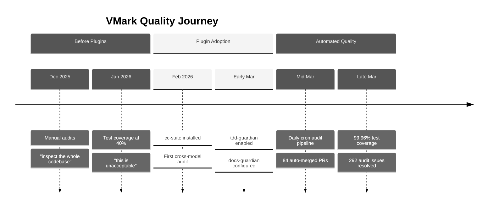

**Vor den Plugins** (Dezember 2025 -- Februar 2026): Manuelle Code-Audits. Der Entwickler sagte Dinge wie „Untersuche die gesamte Codebase, finde mögliche Bugs und Lücken." Die Testabdeckung lag bei etwa 40 % — als „inakzeptabel" bezeichnet. Dokumentation wurde geschrieben und vergessen.

**Nach den Plugins** (März 2026): Jede Entwicklungssitzung lud automatisch 3--4 Plugins. Eine automatisierte Audit-Pipeline lief täglich, erstellte und löste Issues ohne menschliches Eingreifen. Die Testabdeckung erreichte 99,96 % durch eine methodische 26-Phasen-Ratchet-Kampagne. Die Dokumentationsgenauigkeit wurde mechanisch gegen den Code verifiziert.

Die Git-Historie erzählt die Geschichte:

| Kategorie | Commits |
|----------|---------|
| Gesamtcommits | 2.180+ |
| Codex-Audit-Reaktionen | 47 |
| Test/Abdeckung | 52 |
| Sicherheitshärtung | 40 |
| Dokumentation | 128 |
| Abdeckungskampagne-Phasen | 26 |

## cc-suite: Die zweite Meinung

**Verwendet in**: 27 von 28 Plugin-Sitzungen. 200+ Codex-Aufrufe über alle Sitzungen.

Das Wichtigste an cc-suite ist, dass *nicht Claude Claudes Arbeit auditiert*. Es sendet Code an OpenAIs Codex-Modell zur unabhängigen Prüfung. Wenn man tief in einem Feature mit einer AI steckt, fängt ein völlig anderes Modell bei der Überprüfung Dinge auf, die sowohl man selbst als auch die primäre AI übersehen haben.

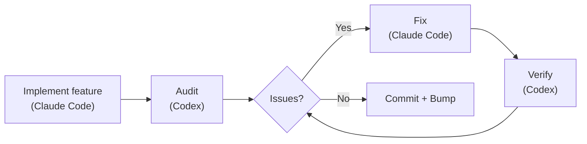

### Was tatsächlich gefunden wurde

292 Audit-Issues. Alle 292 gelöst. Null offen geblieben.

Echte Beispiele aus der Git-Historie:

- **Sicherheit**: 9 Befunde in einem einzigen Audit der Secure-Storage-Migration ([`d1a880a6`](https://github.com/xiaolai/vmark/commit/d1a880a6)). Symlink-Traversal im Resource-Resolver ([`7dfa872d`](https://github.com/xiaolai/vmark/commit/7dfa872d)). Path-to-regexp-Schwachstelle mit hohem Schweregrad ([`8c554cdc`](https://github.com/xiaolai/vmark/commit/8c554cdc)).

- **Barrierefreiheit**: Jedem Popup-Button fehlte `aria-label`. Icon-only-Buttons in FindBar, Sidebar, Terminal und StatusBar hatten keinen Screenreader-Text ([`7acc0bf0`](https://github.com/xiaolai/vmark/commit/7acc0bf0)). Fehlender Fokusindikator am Lint-Badge ([`c4db90d4`](https://github.com/xiaolai/vmark/commit/c4db90d4)).

- **Stiller Logikfehler**: Wenn Multi-Cursor-Bereiche zusammengeführt wurden, fiel der primäre Cursor-Index stillschweigend auf 0 zurück. Benutzer bearbeiteten an Position 50, die Bereiche wurden zusammengeführt, und plötzlich sprang der Cursor an den Dokumentanfang. Gefunden durch Audit, nicht durch Tests.

- **i18n-Spezifikationsprüfung**: Codex überprüfte die Internationalisierungs-Design-Spezifikation und fand, dass „die macOS-Menü-ID-Migration so, wie die Spezifikation es beschreibt, nicht umsetzbar ist" ([`1208c98d`](https://github.com/xiaolai/vmark/commit/1208c98d)). Vier Übersetzungsqualitätsprobleme wurden in Locale-Dateien gefunden ([`af98b5cd`](https://github.com/xiaolai/vmark/commit/af98b5cd)).

- **Mehrrunden-Audit**: Das Lint-Plugin durchlief drei Runden — zuerst 8 Issues ([`7482c347`](https://github.com/xiaolai/vmark/commit/7482c347)), 6 in der zweiten Runde ([`8bfead81`](https://github.com/xiaolai/vmark/commit/8bfead81)), 7 in der letzten ([`84cf67f7`](https://github.com/xiaolai/vmark/commit/84cf67f7)). In jeder Runde fand Codex Issues, die durch die Fixes eingeführt worden waren.

### Die automatisierte Pipeline

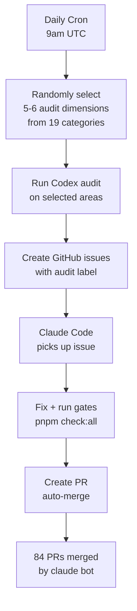

Die ultimative Weiterentwicklung: ein tägliches Cron-Audit, das automatisch um 9 Uhr UTC läuft. Es wählt zufällig 5--6 Dimensionen aus 19 Audit-Kategorien aus, untersucht verschiedene Teile der Codebase, erstellt gelabelte GitHub-Issues und beauftragt Claude Code mit der Behebung. 84 PRs wurden von `claude[bot]` automatisch erstellt, automatisch gefixt und automatisch gemergt — viele davon bevor der Entwickler überhaupt aufgewacht war.

### Das Vertrauenssignal

Wenn der Entwickler ein Audit durchführte und Befunde erhielt, war die Reaktion nie „Lass mich diese Ergebnisse überprüfen." Sie lautete:

> „Alles fixen."

Das ist das Vertrauensniveau, das man erreicht, wenn ein Werkzeug sich hundertfach bewiesen hat.

## tdd-guardian: Der kontroverse Kandidat

**Verwendet in**: 3 expliziten Sitzungen. 5.500+ Hintergrund-Referenzen über 42 Sitzungen.

Die Geschichte von tdd-guardian ist die interessanteste, weil sie auch Scheitern beinhaltet.

### Das Problem mit dem blockierenden Hook

tdd-guardian wurde mit einem PreToolUse-Hook ausgeliefert, der Commits blockierte, wenn die Testabdeckungsschwellen nicht erreicht waren. In der Theorie erzwingt das Test-First-Disziplin. In der Praxis:

> „Der TDD-Guardian — sollten wir den blockierenden Hook entfernen und tdd guardian nur per manuellem Befehl laufen lassen?"

Das Problem war real: Ein veralteter SHA in der State-Datei blockierte unzusammenhängende Commits. Der Entwickler musste `state.json` manuell patchen, um weiterarbeiten zu können. Die blockierenden Hooks waren redundant zu CI-Gates, die bereits `pnpm check:all` bei jedem PR ausführten.

Die Hooks wurden deaktiviert ([`f2fda819`](https://github.com/xiaolai/vmark/commit/f2fda819)). Aber die *Philosophie* überlebte.

### Die 26-Phasen-Abdeckungskampagne

Was tdd-guardian gesät hatte, war die Disziplin, die eine außergewöhnliche Abdeckungskampagne antrieb:

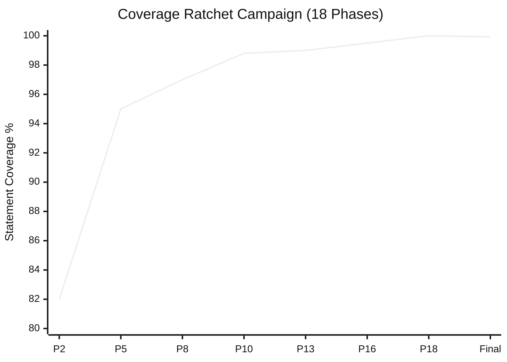

| Phase | Commit | Schwellenwerte |
|-------|--------|-----------|
| Phase 2 | [`1e5cf94a`](https://github.com/xiaolai/vmark/commit/1e5cf94a) | 82/74/86/83 |
| Phase 5 | [`4658d75f`](https://github.com/xiaolai/vmark/commit/4658d75f) | 95/87/95/96 |
| Phase 8 | [`3d7239c3`](https://github.com/xiaolai/vmark/commit/3d7239c3) | tabEscape, codePreview, formatToolbar vertiefen |
| Phase 13 | [`9bec6612`](https://github.com/xiaolai/vmark/commit/9bec6612) | multiCursor, mermaidPreview, listEscape vertiefen |
| Phase 16 | [`730ff139`](https://github.com/xiaolai/vmark/commit/730ff139) | v8-Annotationen über 145 Dateien, 99,5/99/99/99,6 |
| Phase 18 | [`1d996778`](https://github.com/xiaolai/vmark/commit/1d996778) | Ratchet auf 100/99,87/100/100 |
| Final | [`fcf5e00d`](https://github.com/xiaolai/vmark/commit/fcf5e00d) | 99,93 % stmts / 99,96 % lines |

Von ~40 % („Das ist inakzeptabel") auf 99,96 % Zeilenabdeckung, über 18 Phasen, wobei jede die Schwellenwerte höher schraubte, sodass die Abdeckung nie sinken konnte. Das Test:Produktion-Verhältnis erreichte 1,97:1 — fast doppelt so viel Testcode wie Anwendungscode.

### Die Lektion

Die besten Durchsetzungsmechanismen sind diejenigen, die Gewohnheiten ändern und sich dann zurückziehen. Die blockierenden Hooks von tdd-guardian waren zu aggressiv, aber der Entwickler, der sie deaktivierte, schrieb danach mehr Tests als irgendjemand mit aktivierten blockierenden Hooks geschrieben hätte.

## docs-guardian: Der Peinlichkeitsdetektor

**Verwendet in**: 3 Sitzungen. 2 KRITISCHE Issues beim ersten Audit gefunden.

### Der `com.vmark.app`-Vorfall

Der Accuracy-Checker von docs-guardian liest sowohl Code als auch Dokumentation und vergleicht sie dann. Beim ersten vollständigen Audit von VMark stellte er fest, dass der AI-Genies-Guide den Benutzern sagte, ihre Genies seien gespeichert unter:

```
~/Library/Application Support/com.vmark.app/genies/
```

Aber der tatsächliche Tauri-Identifier im Code war `app.vmark`. Der reale Pfad war:

```
~/Library/Application Support/app.vmark/genies/
```

Dies war auf allen drei Plattformen falsch, im englischen Guide und in allen 9 übersetzten Versionen. Kein Test hätte das gefangen. Kein Linter hätte das gefangen. docs-guardian fand es, weil genau das seine Aufgabe ist: Code und Dokumentation mechanisch für jedes gemappte Paar vergleichen.

### Die Gesamtwirkung des Audits

```mermaid
%%{init: {"theme": "neutral"}}%%
xychart-beta
    title "Documentation Health Before vs After"
    x-axis ["Accuracy", "Coverage", "Quality", "Overall"]
    y-axis "Score" 0 --> 100
    bar [78, 64, 83, 74]
    bar [95, 91, 88, 91]
```

| Dimension | Vorher | Nachher | Delta |
|-----------|--------|-------|-------|
| Genauigkeit | 78/100 | 95/100 | +17 |
| Abdeckung | 64 % | 91 % | +27 % |
| Qualität | 83/100 | 88/100 | +5 |
| **Gesamt** | **74/100** | **91/100** | **+17** |

17 undokumentierte Features wurden in einer einzigen Sitzung gefunden und dokumentiert. Die Markdown-Lint-Engine — 15 Regeln, mit Shortcuts und einem Status-Bar-Badge — hatte null Benutzerdokumentation. Der `vmark`-Shell-CLI-Befehl war komplett undokumentiert. Der Nur-Lesen-Modus, die Universal Toolbar, Tab-Drag-to-Detach — alles ausgelieferte Features, die Benutzer nicht entdecken konnten, weil niemand die Dokumentation geschrieben hatte.

Die 19 Code-zu-Doku-Mappings in `config.json` bedeuten, dass docs-guardian jedes Mal, wenn sich `shortcutsStore.ts` ändert, weiß, dass `website/guide/shortcuts.md` aktualisiert werden muss. Dokumentationsdrift wird mechanisch erkennbar.

## loc-guardian: Die 300-Zeilen-Regel

**Verwendet in**: 4 Sitzungen. 14 Dateien markiert, 8 auf Warnstufe.

Die AGENTS.md von VMark enthält die Regel: „Halte Codedateien unter ~300 Zeilen (proaktiv aufteilen)."

Diese Regel stammt nicht aus einem Styleguide. Sie entstand aus loc-guardian-Scans, die immer wieder Dateien mit 500+ Zeilen fanden, die schwer zu navigieren, schwer zu testen und schwer für AI-Assistenten effektiv zu bearbeiten waren. Der schlimmste Übeltäter: `hot_exit/coordinator.rs` mit 756 Zeilen.

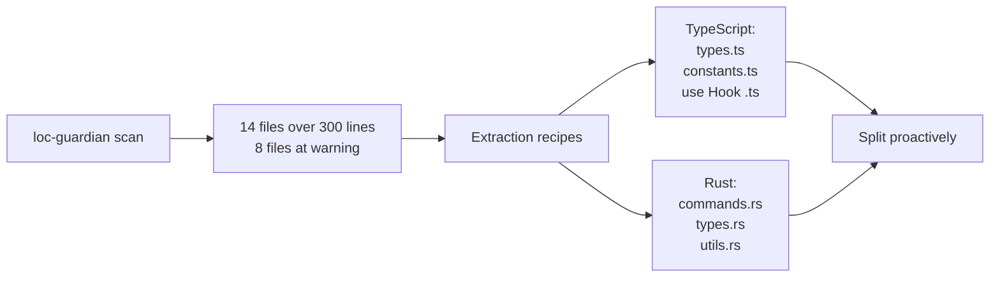

Die LOC-Daten flossen auch in die Projektbewertung ein — als der Entwickler verstehen wollte, „wie viel menschlicher Aufwand würde dieses Projekt darstellen?", war der LOC-Bericht der Ausgangspunkt. Antwort: Investitionsäquivalent von $400K--$600K mit AI-unterstützter Entwicklung.

## echo-sleuth: Das institutionelle Gedächtnis

**Verwendet in**: 6 Sitzungen. Infrastruktur für alles.

echo-sleuth ist das stillste Plugin, aber wohl das fundamentalste. Seine JSONL-Parsing-Skripte sind die Infrastruktur, die Konversationshistorie durchsuchbar macht. Wenn ein anderes Plugin sich erinnern muss, was in einer vergangenen Sitzung passiert ist, erledigt echo-sleuths Werkzeug die eigentliche Arbeit.

Dieser Artikel existiert, weil echo-sleuth 35+ VMark-Sitzungen durchforstet und jeden Plugin-Aufruf, jede Benutzerreaktion und jeden Entscheidungspunkt gefunden hat. Es extrahierte die 292-Issue-Zahl, die 84-PR-Zahl, die Abdeckungskampagne-Timeline und die „Grill dich selbst hart"-Sitzung. Ohne dieses Tool wären die Belege für „Warum sind diese Plugins unverzichtbar?" anekdotisch statt archäologisch.

## grill: Der schonungslose Spiegel

**Installiert in**: jeder VMark-Sitzung. **Explizit zur Selbstbewertung aufgerufen.**

Der denkwürdigste grill-Moment war die Sitzung am 21. März. Der Entwickler fragte:

> „Wenn du dich selbst schonungsloser hinterfragen könntest, ohne dir Sorgen um Zeit und Aufwand zu machen — was würdest du anders machen?"

grill produzierte eine 14-Punkte-Qualitätslückenanalyse — eine Sitzung mit 81 Nachrichten und 863 Tool-Aufrufen, die einen mehrphasigen Qualitätshärtungsplan vorantrieb ([`076dd96c`](https://github.com/xiaolai/vmark/commit/076dd96c), [`5e47e522`](https://github.com/xiaolai/vmark/commit/5e47e522)). Zu den Ergebnissen gehörten:

- Testabdeckung des Rust-Backends lag nur bei 27 %
- WCAG-Barrierefreiheitslücken in modalen Dialogen ([`85dc29fa`](https://github.com/xiaolai/vmark/commit/85dc29fa))
- 104 Dateien über der 300-Zeilen-Konvention
- Console.error-Aufrufe, die strukturierte Logger hätten sein sollen ([`530b5bb7`](https://github.com/xiaolai/vmark/commit/530b5bb7))

Das war kein Linter, der ein fehlendes Semikolon findet. Das war strategisches Qualitätsdenken, das wochenlange Investitionskampagnen antrieb.

## nlpm: Der Wachstumsschmerz

**Aufgerufen in**: 0 Sitzungen explizit. **Verursachte Reibung in**: 1 Sitzung.

nlpms PostToolUse-Hook blockierte eine VMark-Bearbeitungssitzung dreimal hintereinander:

> „PostToolUse:Edit Hook hat die Fortsetzung gestoppt, warum?"
> „Stoppt schon wieder, warum?!"
> „Es ist harmlos... aber es ist Zeitverschwendung."

Der Hook prüfte, ob bearbeitete Dateien NL-Artefakt-Mustern entsprachen. Während eines Bug-Fixes für den Schutz struktureller Zeichen war das reines Rauschen. Das Plugin wurde für diese Sitzung deaktiviert.

Das ist ehrliches Feedback. Nicht jede Plugin-Interaktion ist positiv. Der Entwickler, der nlpm gebaut hat, entdeckte durch VMark, dass PostToolUse-Hooks auf Dateimuster bessere Filterung brauchen — Bug-Fixes sollten kein NL-Artefakt-Linting auslösen.

## Die Fünf-Phasen-Evolution

Die Einführung geschah nicht sofort. Sie folgte einer klaren Entwicklung:

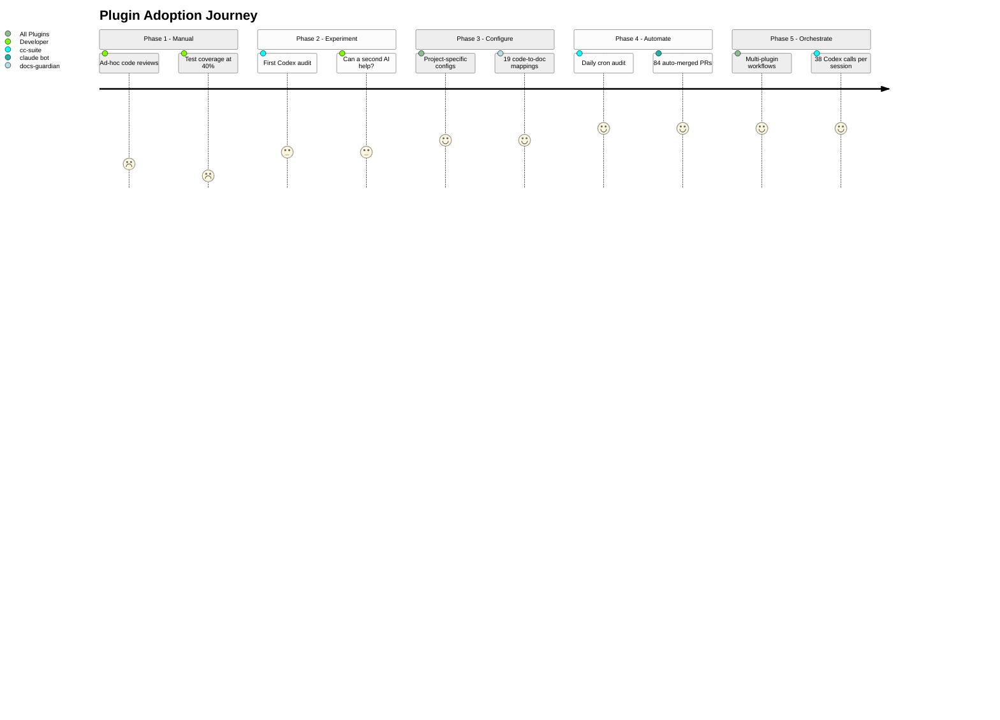

### Phase 1: Manuelles Auditing (Januar 2026)
> „Untersuche die gesamte Codebase, finde mögliche Bugs und Lücken"

Ad-hoc-Reviews. Keine Tools. Testabdeckung bei 40 %.

### Phase 2: Einzelne Plugin-Experimente (Ende Januar -- Anfang Februar)
> „Lass Codex die Codequalität überprüfen"

Erste Nutzung von cc-suite für den MCP-Server. Experimentell. Kann eine zweite AI Dinge finden, die die erste übersehen hat? Erste Installation: [`e6373c7a`](https://github.com/xiaolai/vmark/commit/e6373c7a).

### Phase 3: Konfigurierte Infrastruktur (Anfang März)
Plugins mit projektspezifischen Konfigurationen installiert. tdd-guardian mit strengen Schwellenwerten aktiviert ([`f775f300`](https://github.com/xiaolai/vmark/commit/f775f300)). docs-guardian hat 19 Code-zu-Doku-Mappings. loc-guardian hat 300-Zeilen-Limits mit Extraktionsregeln.

### Phase 4: Automatisierte Pipelines (Mitte März)
Tägliches Cron-Audit um 9 Uhr UTC. Issues automatisch erstellt, automatisch gefixt, automatisch als PR eingereicht, automatisch gemergt. 84 PRs ohne menschliches Eingreifen.

### Phase 5: Multi-Plugin-Orchestrierung (Ende März)
Einzelne Sitzungen, die loc-guardian-Scan -> Performance-Audit -> Subagenten-Implementierung -> cc-suite-Audit -> cc-suite-Verifizierung -> Version-Bump kombinieren. 38 Codex-Aufrufe in einer Sitzung. Plugins fügen sich zu Workflows zusammen.

## Die Feedbackschleife

Das interessanteste Muster ist nicht ein einzelnes Plugin. Es ist die Schleife:

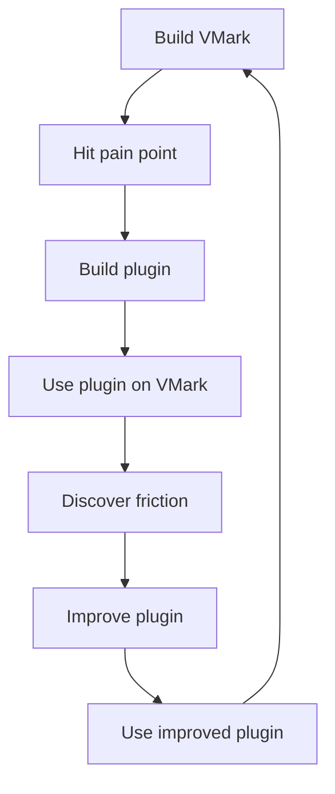

Jedes Plugin entstand beim Bau von VMark:

- **cc-suite** existiert, weil eine AI, die ihre eigene Arbeit überprüft, nicht ausreicht
- **tdd-guardian** existiert, weil die Abdeckung zwischen Sitzungen immer weiter sank
- **docs-guardian** existiert, weil Dokumentation immer vom Code abdriftet
- **loc-guardian** existiert, weil Dateien immer über wartbare Größen hinauswachsen
- **echo-sleuth** existiert, weil Sitzungen vergänglich sind, Entscheidungen aber nicht
- **grill** existiert, weil Architekturprobleme adversariales Review brauchen
- **nlpm** existiert, weil Prompts und Skills auch Code sind

Und jedes Plugin wurde durch den Bau von VMark verbessert:

- Die blockierenden Hooks von tdd-guardian erwiesen sich als zu aggressiv — was zu einem Vorschlag für optionale Durchsetzung führte
- Die Dateimuster-Erkennung von nlpm erwies sich als zu breit — sie blockierte während unzusammenhängender Bug-Fixes
- Die Benennung von cc-suite wurde korrigiert, nachdem mitten in einer Sitzung eine Phantom-Referenz entdeckt wurde
- Der Accuracy-Checker von docs-guardian bewies seinen Wert, indem er den `com.vmark.app`-Bug fand, den kein anderes Tool hätte entdecken können

## Das geschichtete Qualitätssystem

Zusammen bilden die sieben Plugins ein geschichtetes Qualitätssicherungssystem:

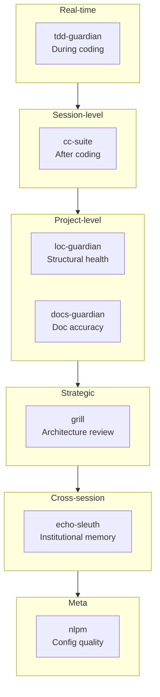

| Ebene | Plugin | Wann es aktiv wird | Was es findet |
|-------|--------|-------------|-----------------|
| Echtzeit-Disziplin | tdd-guardian | Während des Programmierens | Übersprungene Tests, Abdeckungsrückgang |
| Sitzungsebene-Review | cc-suite | Nach dem Programmieren | Bugs, Sicherheit, Barrierefreiheit |
| Strukturelle Gesundheit | loc-guardian | Auf Anfrage | Dateiwachstum, Komplexitätsschleichung |
| Dokumentationssynchronisation | docs-guardian | Auf Anfrage | Veraltete Doku, fehlende Doku, falsche Doku |
| Strategische Bewertung | grill | Periodisch | Architekturlücken, Testlücken, Qualitätsschulden |
| Institutionelles Gedächtnis | echo-sleuth | Sitzungsübergreifend | Verlorene Entscheidungen, vergessener Kontext |
| Konfigurationsqualität | nlpm | Bei Bearbeitung | Schwache Prompts, schwache Skills, defekte Regeln |

Das ist kein „optionales Tooling." Es ist die Governance-Schicht, die rekursive AI-Entwicklung vertrauenswürdig macht — wo AI den Code schreibt, AI den Code auditiert, AI die Audit-Befunde behebt und AI die Fixes verifiziert.

## Warum sie unverzichtbar sind

„Unverzichtbar" ist ein starkes Wort. Hier der Lackmustest: Wie sähe VMark ohne sie aus?

**Ohne cc-suite**: 292 Issues an Bugs, Sicherheitslücken und Barrierefreiheitslücken hätten sich angehäuft. Die automatisierte Pipeline, die Issues innerhalb von 24 Stunden nach Einführung erkennt, würde nicht existieren. Der Entwickler hätte sich auf manuelle periodische Reviews verlassen — die laut den Januar-Sitzungen bestenfalls ad hoc stattfanden.

**Ohne tdd-guardian**: Die 26-Phasen-Abdeckungskampagne wäre möglicherweise nie passiert. Die Disziplin, Schwellenwerte stetig nach oben zu schrauben — sodass die Abdeckung nur steigen, nie sinken kann — kam aus der Denkweise, die tdd-guardian einpflanzte. 99,96 % Abdeckung passiert nicht zufällig.

**Ohne docs-guardian**: Benutzer würden immer noch ihre Genies in einem Verzeichnis suchen, das nicht existiert. 17 Features wären weiterhin nicht auffindbar. Dokumentationsgenauigkeit wäre eine Frage der Hoffnung, nicht der Messung.

**Ohne loc-guardian**: Dateien würden über 500, 800, 1.000 Zeilen hinauswachsen. Die „300-Zeilen-Regel", die die Codebase navigierbar hält, wäre ein Vorschlag statt einer durchgesetzten Beschränkung.

**Ohne echo-sleuth**: Jede Sitzung würde bei null anfangen. „Was haben wir zum Menü-Shortcut-Konflikt beschlossen?" würde manuelles Durchsuchen von Konversationsprotokollen erfordern.

**Ohne grill**: Die Rust-Testlücke (27 %), die WCAG-Barrierefreiheitslücken, die 104 übergroßen Dateien — diese strategischen Qualitätsinvestitionen wurden durch grills adversariale Analyse angetrieben, nicht durch Bug-Reports.

Die Plugins sind nicht unverzichtbar, weil sie clever sind. Sie sind unverzichtbar, weil sie Disziplin kodifizieren, die Menschen (und AIs) zwischen Sitzungen vergessen. Abdeckung geht nur nach oben. Doku stimmt mit Code überein. Dateien bleiben klein. Audits finden vor jedem Release statt. Das sind keine Wunschvorstellungen — sie werden durch Werkzeuge durchgesetzt, die jeden Tag laufen.

## Die Regeln und Skills: Kodifiziertes Wissen

Plugins sind die halbe Geschichte. Die andere Hälfte ist die Wissensinfrastruktur, die parallel dazu aufgebaut wurde.

### 13 Regeln (1.950 Zeilen institutionelles Wissen)

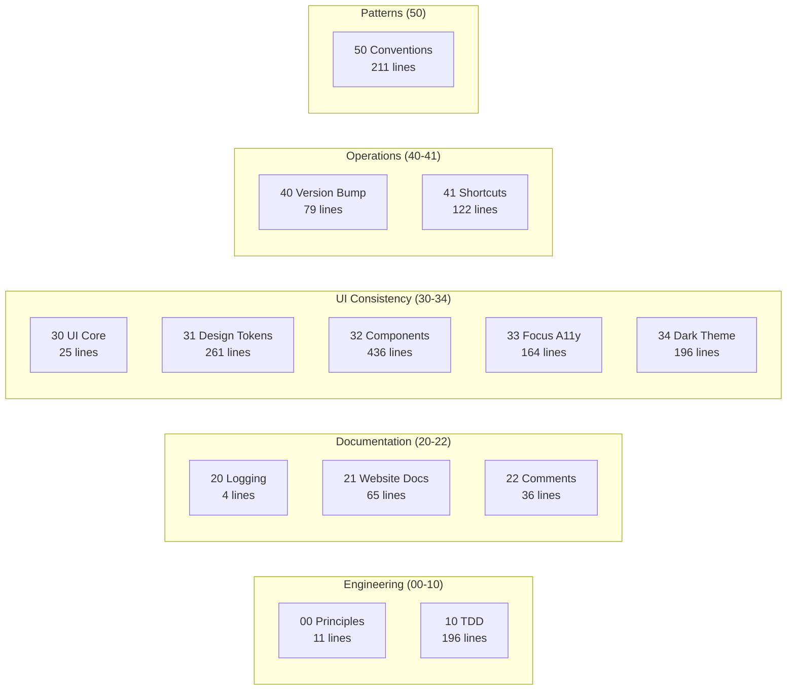

Das Verzeichnis `.claude/rules/` von VMark enthält 13 Regeldateien — keine vagen Richtlinien, sondern spezifische, durchsetzbare Konventionen:

| Regeldatei | Zeilen | Was sie kodifiziert |
|-----------|-------|----------------|
| `00-engineering-principles.md` | 11 | Kernkonventionen (kein Zustand-Destructuring, 300-Zeilen-Limit) |
| `10-tdd.md` | 196 | 5 Testmuster-Vorlagen, Anti-Pattern-Katalog, Abdeckungs-Gates |
| `20-logging-and-docs.md` | 4 | Eine einzige Quelle der Wahrheit pro Thema |
| `21-website-docs.md` | 65 | Code-zu-Doku-Mapping-Tabelle (welche Codeänderungen welche Doku-Updates erfordern) |
| `22-comment-maintenance.md` | 36 | Wann Kommentare aktualisiert/nicht aktualisiert werden, Verrottungsprävention |
| `30-ui-consistency.md` | 25 | Kern-UI-Prinzipien, Querverweise auf Unterregeln |
| `31-design-tokens.md` | 261 | Vollständige CSS-Token-Referenz — jede Farbe, jeder Abstand, Radius, Schatten |
| `32-component-patterns.md` | 436 | Popup-, Toolbar-, Kontextmenü-, Tabellen-, Scrollbar-Muster mit Code |
| `33-focus-indicators.md` | 164 | 6 Fokus-Muster nach Komponententyp (WCAG-Konformität) |
| `34-dark-theme.md` | 196 | Theme-Erkennung, Override-Muster, Migrations-Checkliste |
| `40-version-bump.md` | 79 | 5-Datei-Versionssynchronisierung mit Verifizierungsskript |
| `41-keyboard-shortcuts.md` | 122 | 3-Datei-Sync (Rust/Frontend/Docs), Konfliktprüfung, Konventionen |
| `50-codebase-conventions.md` | 211 | 10 undokumentierte Muster, die bei der Entwicklung entdeckt wurden |

Diese Regeln werden von Claude Code zu Beginn jeder Sitzung gelesen. Sie sind der Grund, warum der 2.180. Commit denselben Konventionen folgt wie der 100.

Regel `50-codebase-conventions.md` ist besonders bemerkenswert — sie dokumentiert Muster, die *niemand entworfen hat*. Sie entstanden organisch während der Entwicklung und wurden dann kodifiziert: Store-Benennungskonventionen, Hook-Cleanup-Muster, Plugin-Struktur, MCP-Bridge-Handler-Signaturen, CSS-Organisation, Fehlerbehandlungs-Idiome.

### 19 Projekt-Skills (Domänenexpertise)

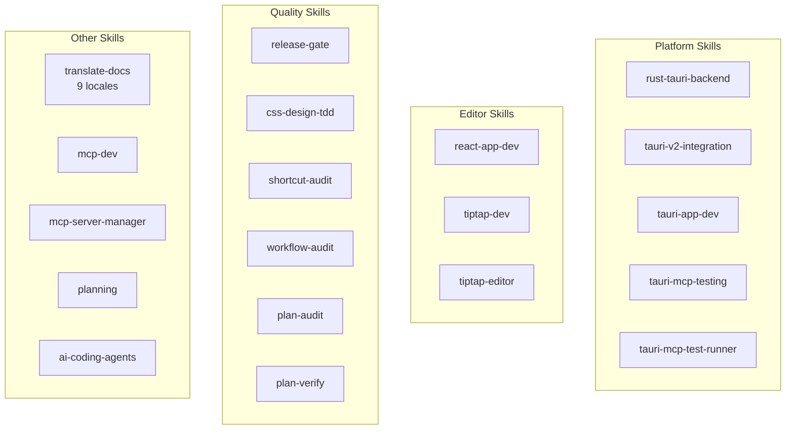

| Kategorie | Skills | Was sie ermöglichen |
|----------|--------|-----------------|
| **Tauri/Rust** | `rust-tauri-backend`, `tauri-v2-integration`, `tauri-app-dev`, `tauri-mcp-testing`, `tauri-mcp-test-runner` | Plattformspezifische Rust-Entwicklung mit Tauri v2-Konventionen |
| **React/Editor** | `react-app-dev`, `tiptap-dev`, `tiptap-editor` | Tiptap/ProseMirror-Editor-Muster, Zustand-Selektor-Regeln |
| **Qualität** | `release-gate`, `css-design-tdd`, `shortcut-audit`, `workflow-audit`, `plan-audit`, `plan-verify` | Automatisierte Qualitätsverifikation auf jeder Ebene |
| **Dokumentation** | `translate-docs` | 9-Locale-Übersetzung mit Subagenten-getriebenem Audit |
| **MCP** | `mcp-dev`, `mcp-server-manager` | MCP-Server-Entwicklung und -Konfiguration |
| **Planung** | `planning` | Implementierungsplangenerierung mit Entscheidungsdokumentation |
| **AI-Tooling** | `ai-coding-agents` | Multi-Agenten-Orchestrierung (Codex CLI, Claude Code, Gemini CLI) |

### 7 Slash-Commands (Workflow-Automatisierung)

| Befehl | Funktion |
|---------|-------------|
| `/bump` | Versions-Bump über 5 Dateien, Commit, Tag, Push |
| `/fix-issue` | End-to-End GitHub-Issue-Löser — Abrufen, Klassifizieren, Fixen, Auditieren, PR |
| `/merge-prs` | Offene PRs sequentiell reviewen und mergen mit Rebase-Handling |
| `/fix` | Issues richtig beheben — keine Patches, keine Abkürzungen, keine Regressionen |
| `/repo-clean-up` | Fehlgeschlagene CI-Läufe und veraltete Remote-Branches entfernen |
| `/feature-workflow` | Gated, agentengesteuerter Feature-Entwicklungs-Workflow End-to-End |
| `/test-guide` | Anleitung für manuelle Tests generieren |

### Der Compounding-Effekt

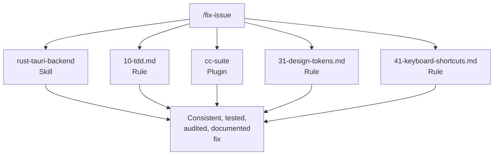

Regeln + Skills + Plugins + Befehle bilden ein zusammengesetztes System. Wenn man `/fix-issue` ausführt, nutzt es den `rust-tauri-backend`-Skill für Rust-Änderungen, folgt der `10-tdd.md`-Regel für Testanforderungen, ruft `cc-suite` für das Audit auf, prüft `31-design-tokens.md` für CSS-Konformität und verifiziert gegen `41-keyboard-shortcuts.md` für Shortcut-Synchronisation.

Kein einzelnes Stück ist revolutionär. Der Compounding-Effekt — 13 Regeln x 19 Skills x 7 Plugins x 7 Befehle, die sich gegenseitig verstärken — das ist es, was das System funktionieren lässt. Jedes Stück wurde hinzugefügt, als eine Lücke entdeckt wurde, in realer Entwicklung getestet und durch Nutzung verfeinert.

## Für Plugin-Entwickler

Wenn Sie darüber nachdenken, Claude Code Plugins zu bauen, hier ist, was VMark uns gelehrt hat:

1. **Bauen Sie zuerst für sich selbst.** Die besten Plugins lösen Ihre tatsächlichen Probleme, nicht hypothetische.

2. **Dogfooden Sie unermüdlich.** Nutzen Sie Ihre Plugins in Ihren realen Projekten. Die Reibung, die Sie entdecken, ist die Reibung, die Ihre Benutzer entdecken werden.

3. **Hooks brauchen Notausgänge.** Blockierende Hooks, die nicht umgangen werden können, werden komplett deaktiviert. Machen Sie Durchsetzung optional oder kontextbewusst.

4. **Cross-Model-Verifizierung funktioniert.** Eine andere AI die Arbeit Ihrer primären AI überprüfen zu lassen, fängt echte Bugs. Das ist nicht redundant — es ist orthogonal.

5. **Kodifizieren Sie Disziplin, nicht Regeln.** Die besten Plugins ändern Gewohnheiten. Die blockierenden Hooks von tdd-guardian wurden entfernt, aber die Abdeckungskampagne, die sie inspirierten, war die wirkungsvollste Qualitätsinvestition im Projekt.

6. **Komponieren statt Monolith.** Sieben fokussierte Plugins schlagen ein Mega-Plugin. Jedes macht eine Sache gut, und sie fügen sich zu Workflows zusammen, die mehr sind als die Summe ihrer Teile.

7. **Vertrauen wird pro Aufruf verdient.** Der Entwickler vertraut cc-suite genug, um „Alles fixen" zu sagen, ohne die Befunde zu überprüfen. Dieses Vertrauen wurde über 27 Sitzungen und 292 gelöste Issues aufgebaut.

---

*VMark ist Open Source unter [github.com/xiaolai/vmark](https://github.com/xiaolai/vmark). Alle sieben Plugins sind im `xiaolai` Claude Code Marketplace verfügbar.*
