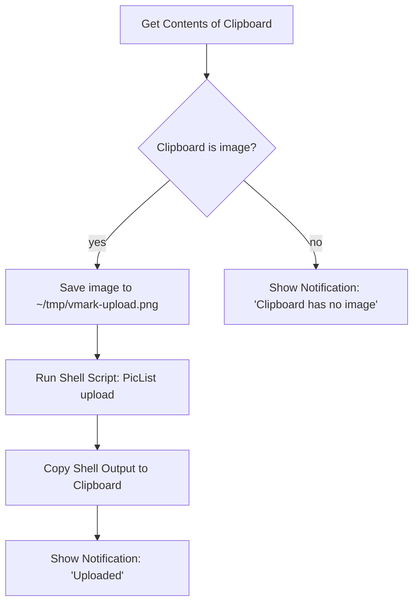

# Imágenes alojadas en la nube

VMark es una herramienta de escritura local-first. No incluye un cargador integrado para las imágenes que pegas desde el portapapeles, y no almacena credenciales de la nube. Si necesitas que tu Markdown contenga URLs públicas de un CDN (para publicar en un blog, sincronizar entre dispositivos, publicar en un CMS), el flujo de trabajo es una automatización a nivel del sistema operativo que se ejecuta *fuera* de VMark y devuelve el resultado.

Esta página explica por qué VMark funciona así, qué ya funciona sin configuración adicional, y cómo conectar la receta de Shortcuts.app en unos diez minutos.

[[toc]]

## Qué admite VMark ya de forma nativa

VMark distingue dos direcciones al gestionar referencias de imágenes en Markdown:

| Dirección | Estado | Disparador | Salida en Markdown |
|-----------|--------|------------|--------------------|
| Insertar una URL remota existente | Admitido | Pegar o escribir una URL `https://…` | La URL, sin cambios |
| Markdown de origen con una URL remota | Admitido | Cualquiera escribe `` | Se renderiza directamente |
| Insertar una imagen local | Admitido | Pegar, arrastrar o insertar un binario | Copiada a `.assets/`, se escribe una ruta relativa |
| Insertar una imagen local *pero almacenarla de forma remota* | **No incluido** | (Ver receta más abajo) | — |

En resumen: si la imagen ya vive en una URL, pega la URL. VMark la inserta como una referencia de imagen Markdown y la webview la descarga. La ruta de lectura ya es compatible con la nube.

## Por qué VMark no incluye carga nativa a la nube

La función propuesta significaría que VMark detecta una imagen local al pegar, la sube a un almacenamiento remoto, y escribe la URL devuelta en el Markdown en lugar de una ruta `./.assets/…`. Eso suena pequeño pero amplía el alcance de VMark de tres maneras significativas:

1. **Bóveda de credenciales**. La carga nativa compatible con S3 requiere que la clave de acceso y la clave secreta del usuario se almacenen en reposo. VMark hoy no tiene secretos de larga duración — no hay decisiones de cifrado en reposo, ni integración con el llavero del SO, ni UX de rotación de claves, ni modo de fallo accidental con la clave en el Markdown. Añadir la carga cruza esa línea.

2. **Cola de soporte multiproveedor**. S3, Cloudflare R2, Backblaze B2, MinIO, DigitalOcean Spaces todos anuncian compatibilidad con S3, pero cada uno tiene sus particularidades (direccionamiento por ruta vs. virtual-hosted, semántica de ACL, endpoints regionales, reglas de CORS). Que un solo mantenedor absorba esa superficie es un impuesto a largo plazo sobre una herramienta de escritura.

3. **Composición vs. propiedad**. Herramientas como [PicList](https://github.com/Kuingsmile/PicList) y [PicGo](https://github.com/Molunerfinn/PicGo) ya resuelven este problema, incluyendo la configuración específica del proveedor y el almacenamiento de credenciales. Shortcuts.app de macOS y Keyboard Maestro pueden integrar esas herramientas en cualquier campo de texto del sistema — no sólo en VMark. Integrar la carga a la nube en VMark duplicaría código que vive mejor fuera de él, y sólo funcionaría dentro de VMark.

Por tanto la decisión es: **VMark sigue siendo una herramienta de escritura; la carga de imágenes vive en la caja de herramientas de automatización a nivel del SO del usuario**. La receta de abajo concreta esa ruta a nivel del SO.

## Receta: Shortcuts.app + PicList (macOS, gratis)

Shortcuts.app viene con macOS Monterey (12) y posteriores. PicList es un cargador de imágenes gratuito y de código abierto. Juntos te dan un atajo de teclado que toma la imagen que esté actualmente en el portapapeles, la sube a través de PicList (que ya sabe cómo hablar con R2, S3, Imgur y docenas de otros backends), y reemplaza el portapapeles con la URL devuelta. Después de eso, `Cmd + V` en VMark inserta la URL — la detección de URL remota existente de VMark se encarga del resto.

### Requisitos previos

1. **PicList instalado y configurado.** Descárgalo desde la [página de releases de PicList](https://github.com/Kuingsmile/PicList/releases), ábrelo una vez, y configura al menos un host de imágenes (R2, S3, Imgur, smms, etc.) en los *PicBed Settings* de PicList. Confirma que una carga manual funciona dentro del propio PicList antes de conectar el Shortcut — eso aísla "¿está funcionando PicList?" de "¿está bien conectado mi Shortcut?"

2. **PicList CLI disponible.** PicList expone un subcomando `upload` a través de su paquete de aplicación. En macOS el binario vive en `/Applications/PicList.app/Contents/MacOS/PicList`. Verifícalo con:

   ```sh
   /Applications/PicList.app/Contents/MacOS/PicList upload --help
   ```

   El comando debería devolver la ayuda de la CLI. Si no lo hace, comprueba que PicList esté instalado en `/Applications` (no en `~/Applications` — ajusta la ruta en ese caso).

### Construir el Shortcut

Abre `Shortcuts.app` y crea un nuevo shortcut. Añade estas acciones en orden:



Pasos concretos en el editor de Shortcuts:

1. **Acción: Obtener contenido del portapapeles.** Arrástrala desde la barra lateral de acciones. Sin configuración.

2. **Acción: Si (If).** Configura la condición: *Clipboard is Media › Image*. (Si el desplegable no muestra *Media*, usa *Contents › has any value* como comprobación más laxa.)

3. **Dentro de la rama If — Acción: Guardar archivo.** Configura:
   - Servicio: *Files*
   - Destino: `~/tmp/` (crea la carpeta una vez desde Finder si no existe).
   - Nombre de archivo: `vmark-upload.png` (un nombre fijo mantiene la ruta predecible para el siguiente paso).
   - Desactiva *Ask Where To Save* para que el shortcut se ejecute desatendido.

4. **Acción: Ejecutar script de shell.** Configura:
   - Shell: `/bin/zsh` (por defecto en macOS).
   - Entrada: *Pass Input as `stdin`* — en realidad queremos `as arguments`. (Cualquiera funciona; el script de abajo ignora stdin y usa una ruta literal.)
   - Cuerpo del script:

     ```sh
     /Applications/PicList.app/Contents/MacOS/PicList upload "$HOME/tmp/vmark-upload.png" 2>/dev/null | tail -n 1
     ```

   El `tail -n 1` es defensivo: PicList puede imprimir líneas de log informativas antes de la URL. Confirma una vez la forma real de la salida según tu versión de PicList; si PicList devuelve sólo la URL, `tail` no tiene efecto.

5. **Acción: Copiar al portapapeles.** Configura su entrada como *Shell Script Result*.

6. **Acción: Mostrar notificación.** Título: `Uploaded`. Cuerpo: *Shell Script Result*. Esto confirma que la URL está en el portapapeles y te muestra qué se ha subido.

7. **(Opcional) Rama Else — Acción: Mostrar notificación.** Título: `No image on clipboard`. Ayuda a depurar cuando se activa el atajo pero el portapapeles no contenía realmente una imagen.

### Asignar un atajo de teclado global

En el editor de Shortcuts, haz clic en el botón de información *(i)* del shortcut, luego en *Add Keyboard Shortcut*. Elige algo que no choque con los atajos de VMark — `Control + Option + Command + U` es una opción común (sin conflictos en macOS, mnemónico "Upload").

### Cómo usarlo

1. Haz una captura de pantalla con `Cmd + Shift + Ctrl + 4` (se guarda en el portapapeles, no en disco) — o copia cualquier imagen desde otra aplicación.
2. Pulsa tu atajo de carga (`Ctrl + Opt + Cmd + U`).
3. Espera ~1–3 segundos a la notificación.
4. Pega en VMark (`Cmd + V`). El Markdown recibe ``.

### Qué puede fallar

| Síntoma | Causa probable | Solución |
|---------|----------------|----------|
| El shortcut se activa pero PicList no se ejecuta | Ruta incorrecta al binario de PicList | Confirma que `/Applications/PicList.app/Contents/MacOS/PicList` existe; ajusta si está instalado en otra ubicación |
| Aparece la notificación pero el portapapeles aún tiene la imagen | El script de shell devolvió vacío | Ejecuta el script de shell manualmente con una ruta de archivo conocida para ver la salida real de PicList |
| La URL es incorrecta / tiene espacios en blanco al final | `tail -n 1` capturó una línea de log, no la URL | Inspecciona la salida de PicList; ajusta el parseo (`grep -oE 'https://[^[:space:]]+' \| tail -n 1` es una alternativa más estricta) |
| `Cmd + V` en VMark inserta texto plano en lugar de una imagen | La URL no termina en una extensión de imagen que PicList reconozca | Confirma que la extensión del archivo se preserva durante la carga (R2/S3 normalmente la preservan; revisa la plantilla de clave de tu bucket) |

## Alternativa: Keyboard Maestro

[Keyboard Maestro](https://www.keyboardmaestro.com/) es una herramienta de automatización de pago para macOS con un techo más alto que Shortcuts.app. La principal ventaja práctica para este flujo: KM puede interceptar `Cmd + V` directamente cuando el portapapeles contiene una imagen, así subes y pegas en una sola pulsación en lugar de dos (atajo, después `Cmd + V`).

La receta es estructuralmente idéntica a la versión de Shortcuts.app — obtener imagen del portapapeles, guardarla en un archivo, ejecutar la CLI de PicList, reemplazar el portapapeles, opcionalmente simular el pegado. El constructor de macros *Trigger* de KM es más flexible (disparador basado en contenido del portapapeles, alcance específico por aplicación), pero el paso de carga es el mismo.

Si todavía no eres usuario de Keyboard Maestro, Shortcuts.app es la respuesta más barata.

## Alternativa: script de procesamiento previo a la publicación

Para usuarios con un blog auto-alojado o una pipeline de sitio estático, la respuesta más limpia suele ser: mantener el comportamiento por defecto de VMark (rutas relativas a `.assets/`), y ejecutar un script en tiempo de build que recorra el Markdown, suba cada imagen única y reescriba la ruta. Esto cambia la latencia por imagen al pegar por una carga por lotes en el momento de publicar, y mantiene la superficie del editor limpia.

Un esbozo mínimo (Node.js, pseudocódigo):

```js
// scan-and-upload.js
const fs = require("fs");
const { execSync } = require("child_process");

const md = fs.readFileSync(process.argv[2], "utf8");
const rewritten = md.replace(/!\[(.*?)\]\((\.\/\.assets\/[^)]+)\)/g, (_, alt, path) => {
  const url = execSync(
    `/Applications/PicList.app/Contents/MacOS/PicList upload "${path}"`,
  ).toString().trim();
  return ``;
});
fs.writeFileSync(process.argv[2].replace(/\.md$/, ".published.md"), rewritten);
```

Varios generadores de sitios estáticos (Hugo con [Page Bundles](https://gohugo.io/content-management/page-bundles/), Jekyll, Astro, Eleventy) manejan las rutas relativas `.assets/` de forma nativa en tiempo de build — no hace falta script si publicas de esa forma.

## URLs ya alojadas

Para que quede completo: si una imagen ya vive en una URL pública, pega la URL en VMark y listo. El detector de rutas de imagen del portapapeles la clasifica como `type: "url"` y escribe la URL directamente. Sin carga, sin copia a `.assets/`, sin ajustes que cambiar. Este es el flujo de imágenes en la nube más simple que VMark admite y no requiere herramientas adicionales.

## Véase también

- [Ajustes de Archivos e Imágenes](./settings.md) — auto-redimensionar, copiar a assets, limpieza de huérfanos
- [Privacidad](./privacy.md) — qué almacena VMark localmente y qué sale de tu máquina
