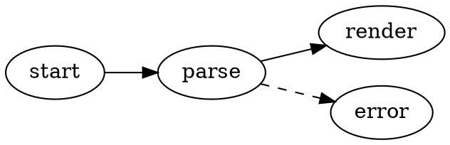
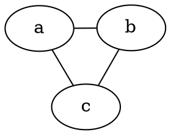

# Diagramas Graphviz

VMark renderiza grafos DOT de [Graphviz](https://graphviz.org/) directamente en tus documentos Markdown. Los diagramas se renderizan localmente con la versión WASM de Graphviz ([@viz-js/viz](https://github.com/mdaines/viz-js)) — sin acceso a la red, sin binarios externos.

[[toc]]

## Insertar un Diagrama

Usa **Insertar → Diagrama Graphviz** desde la barra de menús (o el grupo Insertar de la barra de herramientas) para insertar un diagrama de plantilla — el atajo no está asignado por defecto y puede personalizarse en Configuración. O escribe un bloque de código delimitado con el identificador de lenguaje `dot` o `graphviz`:

````markdown

````

Ambos identificadores de lenguaje se comportan de forma idéntica:

| Delimitador | Se renderiza como |
|-------------|-------------------|
| ` ```dot ` | Diagrama Graphviz |
| ` ```graphviz ` | Diagrama Graphviz |

## Modos de Edición

- **Modo WYSIWYG** — el bloque de código se renderiza como un diagrama. Haz doble clic en él para editar el código fuente DOT con una vista previa en vivo con debounce; guarda o cancela desde el encabezado de edición.
- **Modo Fuente** — coloca el cursor dentro de un bloque ` ```dot ` para obtener la vista previa flotante del diagrama (arrastrar, redimensionar, zoom), igual que con Mermaid.

## Panorámica, Zoom y Exportación

Los diagramas renderizados admiten los mismos controles que los diagramas Mermaid:

- **Cmd/Ctrl + desplazamiento** para hacer zoom, arrastra para la panorámica, botón de restablecimiento para recentrar
- **Exportar como PNG** (fondo claro u oscuro) mediante el botón de exportación

## Motor y Disposición

Los diagramas se disponen con el motor `dot` (disposición jerárquica/por capas) por defecto. Para usar un motor diferente, establece el atributo estándar `layout` de Graphviz en tu grafo — la elección viaja con el documento y funciona en cualquier otra herramienta de Graphviz:

````markdown

````

| Motor | Estilo de disposición |
|-------|-----------------------|
| `dot` | Jerárquico / por capas (predeterminado) |
| `neato` | Modelo de resortes (dirigido por fuerzas) |
| `fdp` | Dirigido por fuerzas, grafos más grandes |
| `sfdp` | Dirigido por fuerzas multiescala, grafos muy grandes |
| `circo` | Circular |
| `twopi` | Radial |
| `osage` | Agrupado |
| `patchwork` | Treemap (squarified) |

Un valor de `layout` desconocido muestra el estado de error de renderizado, como cualquier otro error de DOT.

Todas las características estándar de DOT admitidas por Graphviz funcionan: subgrafos y clústeres, rangos, formas de nodos, estilos de aristas, etiquetas tipo HTML y colores explícitos.

## Temas

- El fondo del diagrama es transparente, por lo que sigue el tema del editor.
- Los colores predeterminados de nodos, aristas y texto se derivan de los tokens de diseño del tema activo, por lo que los diagramas se ven nativos en todos los temas (White, Paper, Mint, Sepia, Night, Solarized) y se actualizan cuando cambias de tema.
- Los colores explícitos en tu código fuente DOT siempre prevalecen sobre los valores predeterminados del tema — un grafo que establece su propio `bgcolor`, `color` o `fontcolor` se renderiza exactamente como está escrito.

## Manejo de Errores

Si el código fuente DOT tiene un error de sintaxis, el bloque muestra un estado de error de renderizado en lugar de un diagrama. Corrige el código fuente y la vista previa se vuelve a renderizar automáticamente.

## Exportar como HTML y PDF

Los documentos HTML y PDF exportados incrustan el SVG renderizado, por lo que los diagramas se ven igual fuera de VMark.
