# Usuarios como Desarrolladores

Cómo siete plugins de Claude Code se volvieron indispensables al ser forjados en el fuego de la construcción de VMark.

## El Contexto

VMark es un editor Markdown amigable con IA construido con Tauri, React y Rust. A lo largo de 10 semanas de desarrollo:

| Métrica | Valor |
|---------|-------|
| Commits | 2,180+ |
| Tamaño del código | 305,391 líneas de código |
| Cobertura de pruebas | 99.96% líneas |
| Ratio pruebas:producción | 1.97:1 |
| Issues de auditoría creados y resueltos | 292 |
| PRs automatizados fusionados | 84 |
| Idiomas de documentación | 10 |
| Herramientas del servidor MCP | 12 |

Un solo desarrollador lo construyó con Claude Code. En el camino, ese desarrollador creó siete plugins para el marketplace de Claude Code — no como un proyecto secundario, sino como herramientas de supervivencia. Cada plugin existe porque un problema específico exigía una solución que aún no existía.

## Los Plugins

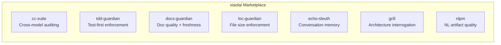

| Plugin | Qué Hace | Nacido De |
|--------|----------|-----------|
| [cc-suite](https://github.com/xiaolai/cc-suite) | Auditoría de código cross-model vía OpenAI Codex | "Necesito un segundo par de ojos que no sea Claude" |
| [tdd-guardian](https://github.com/xiaolai/tdd-guardian-for-claude) | Aplicación del flujo de trabajo test-first | "La cobertura sigue cayendo cuando me olvido de las pruebas" |
| [docs-guardian](https://github.com/xiaolai/docs-guardian-for-claude) | Auditoría de calidad y frescura de documentación | "Mi documentación dice `com.vmark.app` pero el identificador real es `app.vmark`" |
| [loc-guardian](https://github.com/xiaolai/loc-guardian-for-claude) | Control de líneas de código por archivo | "Este archivo tiene 800 líneas y nadie se dio cuenta" |
| [echo-sleuth](https://github.com/xiaolai/echo-sleuth-for-claude) | Minería del historial de conversaciones y memoria | "¿Qué decidimos sobre eso hace tres semanas?" |
| [grill](https://github.com/xiaolai/grill-for-claude) | Interrogación profunda y multiángulo del código | "Necesito una revisión de arquitectura, no solo lint" |
| [nlpm](https://github.com/xiaolai/nlpm-for-claude) | Calidad de artefactos de programación en lenguaje natural | "¿Mis prompts y skills están realmente bien escritos?" |

## Antes y Después

La transformación ocurrió en tres meses.

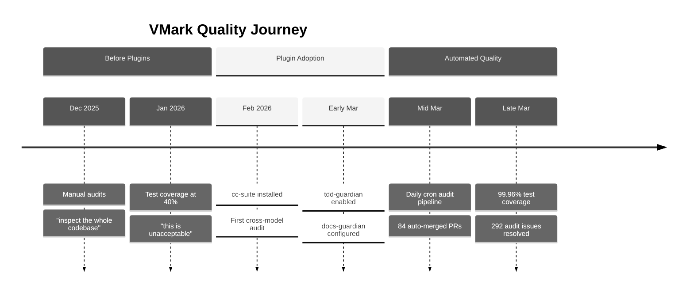

**Antes de los plugins** (diciembre 2025 -- febrero 2026): Auditorías manuales de código. El desarrollador decía cosas como "inspecciona todo el código, identifica posibles bugs y brechas." La cobertura de pruebas rondaba el 40% — descrita como "inaceptable." La documentación se escribía y se olvidaba.

**Después de los plugins** (marzo 2026): Cada sesión de desarrollo cargaba 3--4 plugins automáticamente. Un pipeline de auditoría automatizado se ejecutaba diariamente, creando y resolviendo issues sin intervención humana. La cobertura de pruebas alcanzó el 99.96% a través de una campaña metódica de 26 fases de ajuste progresivo. La precisión de la documentación se verificaba contra el código con precisión mecánica.

El historial de git cuenta la historia:

| Categoría | Commits |
|-----------|---------|
| Total de commits | 2,180+ |
| Respuesta a auditorías Codex | 47 |
| Pruebas/cobertura | 52 |
| Fortalecimiento de seguridad | 40 |
| Documentación | 128 |
| Fases de campaña de cobertura | 26 |

## cc-suite: La Segunda Opinión

**Usado en**: 27 de 28 sesiones con plugins. Más de 200 llamadas a Codex en todas las sesiones.

Lo más importante de cc-suite es que *no es Claude auditando el trabajo de Claude*. Envía código al modelo Codex de OpenAI para una revisión independiente. Cuando has estado inmerso en una funcionalidad con una IA, tener un modelo completamente diferente escrutando el resultado detecta cosas que tanto tú como tu IA principal pasaron por alto.

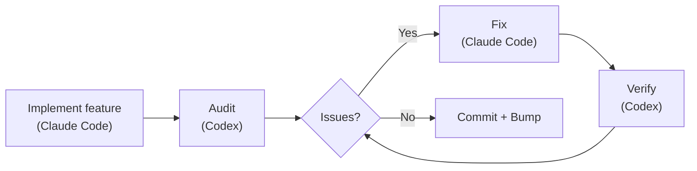

### Lo Que Realmente Encontró

292 issues de auditoría. Los 292 resueltos. Cero sin resolver.

Ejemplos reales del historial de git:

- **Seguridad**: 9 hallazgos en una sola auditoría de la migración de almacenamiento seguro ([`d1a880a6`](https://github.com/xiaolai/vmark/commit/d1a880a6)). Travesía de symlinks en el resolutor de recursos ([`7dfa872d`](https://github.com/xiaolai/vmark/commit/7dfa872d)). Vulnerabilidad de alta severidad en path-to-regexp ([`8c554cdc`](https://github.com/xiaolai/vmark/commit/8c554cdc)).

- **Accesibilidad**: Cada botón de popup carecía de `aria-label`. Los botones de solo icono en FindBar, Sidebar, Terminal y StatusBar no tenían texto para lectores de pantalla ([`7acc0bf0`](https://github.com/xiaolai/vmark/commit/7acc0bf0)). Indicador de foco ausente en la insignia de lint ([`c4db90d4`](https://github.com/xiaolai/vmark/commit/c4db90d4)).

- **Bug de lógica silencioso**: Cuando los rangos de multi-cursor se fusionaban, el índice del cursor principal volvía silenciosamente a 0. Los usuarios estaban editando en la posición 50, los rangos se fusionaban, y de repente el cursor saltaba al inicio del documento. Encontrado por auditoría, no por pruebas.

- **Revisión de especificación i18n**: Codex revisó la especificación de diseño de internacionalización y encontró que "la migración de menu-ID de macOS no es implementable de la manera que dice la especificación" ([`1208c98d`](https://github.com/xiaolai/vmark/commit/1208c98d)). Cuatro problemas de calidad de traducción detectados en archivos de localización ([`af98b5cd`](https://github.com/xiaolai/vmark/commit/af98b5cd)).

- **Auditoría multi-ronda**: El plugin de lint pasó por tres rondas — 8 issues primero ([`7482c347`](https://github.com/xiaolai/vmark/commit/7482c347)), 6 en la segunda ([`8bfead81`](https://github.com/xiaolai/vmark/commit/8bfead81)), 7 en la final ([`84cf67f7`](https://github.com/xiaolai/vmark/commit/84cf67f7)). En cada ronda, Codex encontró problemas que las correcciones habían introducido.

### El Pipeline Automatizado

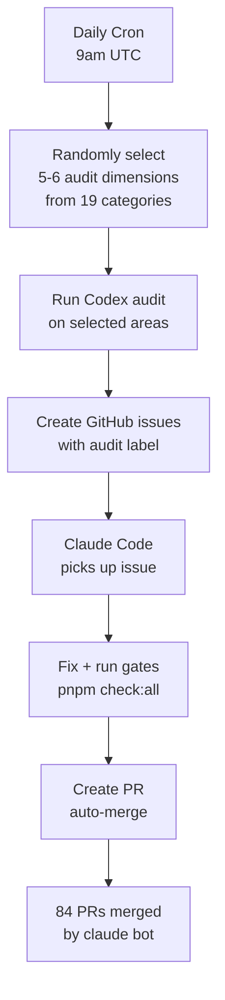

La evolución definitiva: una auditoría cron diaria que se ejecuta automáticamente a las 9am UTC. Selecciona aleatoriamente 5--6 dimensiones de 19 categorías de auditoría, inspecciona diferentes partes del código, crea issues etiquetados en GitHub, y despacha a Claude Code para corregirlos. 84 PRs han sido auto-creados, auto-corregidos y auto-fusionados por `claude[bot]` — muchos antes de que el desarrollador siquiera despertara.

### La Señal de Confianza

Cuando el desarrollador ejecutaba una auditoría y obtenía hallazgos, la respuesta nunca era "déjame revisar estos hallazgos." Era:

> "arregla todo."

Ese es el nivel de confianza que obtienes cuando una herramienta ha demostrado su valor cientos de veces.

## tdd-guardian: El Controversial

**Usado en**: 3 sesiones explícitas. Más de 5,500 referencias en segundo plano en 42 sesiones.

La historia de tdd-guardian es la más interesante porque incluye fracaso.

### El Problema del Hook Bloqueante

tdd-guardian se lanzó con un hook PreToolUse que bloqueaba commits si los umbrales de cobertura de pruebas no se cumplían. En teoría, esto fuerza la disciplina test-first. En la práctica:

> "el TDD-guardian, ¿deberíamos eliminar el blocking hook, dejar que tdd guardian se ejecute por comando manual?"

El problema era real: un SHA obsoleto en el archivo de estado bloqueaba commits no relacionados. El desarrollador tenía que parchear manualmente `state.json` para desbloquear su trabajo. Los hooks bloqueantes eran redundantes con las compuertas de CI que ya ejecutaban `pnpm check:all` en cada PR.

Los hooks fueron deshabilitados ([`f2fda819`](https://github.com/xiaolai/vmark/commit/f2fda819)). Pero la *filosofía* sobrevivió.

### La Campaña de Cobertura de 26 Fases

Lo que tdd-guardian sembró fue la disciplina que impulsó una extraordinaria campaña de cobertura:

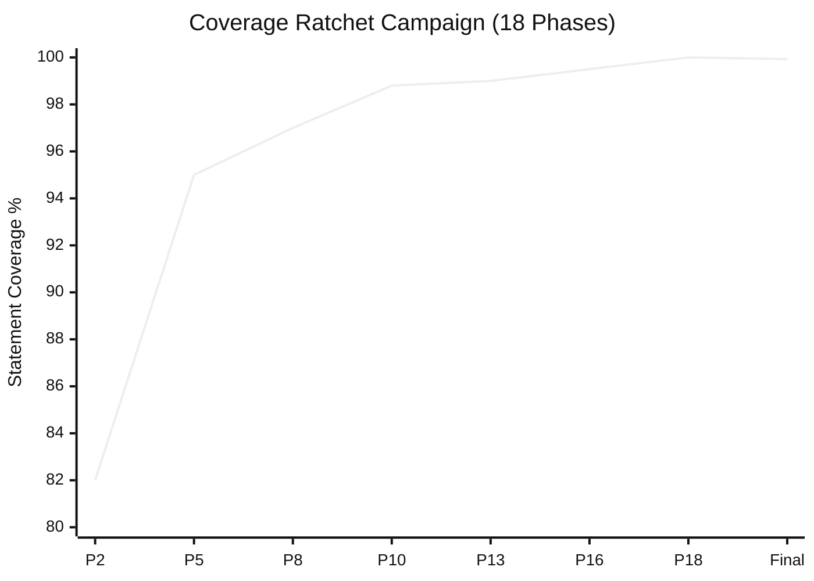

| Fase | Commit | Umbrales |
|------|--------|----------|
| Fase 2 | [`1e5cf94a`](https://github.com/xiaolai/vmark/commit/1e5cf94a) | 82/74/86/83 |
| Fase 5 | [`4658d75f`](https://github.com/xiaolai/vmark/commit/4658d75f) | 95/87/95/96 |
| Fase 8 | [`3d7239c3`](https://github.com/xiaolai/vmark/commit/3d7239c3) | profundizar tabEscape, codePreview, formatToolbar |
| Fase 13 | [`9bec6612`](https://github.com/xiaolai/vmark/commit/9bec6612) | profundizar multiCursor, mermaidPreview, listEscape |
| Fase 16 | [`730ff139`](https://github.com/xiaolai/vmark/commit/730ff139) | anotaciones v8 en 145 archivos, 99.5/99/99/99.6 |
| Fase 18 | [`1d996778`](https://github.com/xiaolai/vmark/commit/1d996778) | ajustar a 100/99.87/100/100 |
| Final | [`fcf5e00d`](https://github.com/xiaolai/vmark/commit/fcf5e00d) | 99.93% stmts / 99.96% líneas |

De ~40% ("esto es inaceptable") a 99.96% de cobertura de líneas, en 18 fases, cada una ajustando los umbrales hacia arriba para que la cobertura nunca pudiera retroceder. El ratio pruebas:producción alcanzó 1.97:1 — casi el doble de código de pruebas que de código de aplicación.

### La Lección

Los mejores mecanismos de aplicación son los que cambian tus hábitos y luego se apartan del camino. Los hooks bloqueantes de tdd-guardian eran demasiado agresivos, pero el desarrollador que los deshabilitó terminó escribiendo más pruebas que cualquiera con hooks bloqueantes habilitados.

## docs-guardian: El Detector de Vergüenzas

**Usado en**: 3 sesiones. Encontró 2 problemas CRÍTICOS en su primera auditoría.

### El Incidente de `com.vmark.app`

El verificador de precisión de docs-guardian lee tanto el código como la documentación y luego los compara. En su primera auditoría completa de VMark, encontró que la guía de AI Genies les decía a los usuarios que sus genies estaban almacenados en:

```
~/Library/Application Support/com.vmark.app/genies/
```

Pero el identificador real de Tauri en el código era `app.vmark`. La ruta real era:

```
~/Library/Application Support/app.vmark/genies/
```

Esto estaba mal en las tres plataformas, en la guía en inglés y en las 9 versiones traducidas. Ninguna prueba detectaría esto. Ningún linter lo detectaría. docs-guardian lo detectó porque eso es literalmente lo que hace: comparar código con documentación, mecánicamente, para cada par mapeado.

### El Impacto Completo de la Auditoría

```mermaid
%%{init: {"theme": "neutral"}}%%
xychart-beta
    title "Documentation Health Before vs After"
    x-axis ["Accuracy", "Coverage", "Quality", "Overall"]
    y-axis "Score" 0 --> 100
    bar [78, 64, 83, 74]
    bar [95, 91, 88, 91]
```

| Dimensión | Antes | Después | Delta |
|-----------|-------|---------|-------|
| Precisión | 78/100 | 95/100 | +17 |
| Cobertura | 64% | 91% | +27% |
| Calidad | 83/100 | 88/100 | +5 |
| **General** | **74/100** | **91/100** | **+17** |

17 funcionalidades no documentadas fueron encontradas y documentadas en una sola sesión. El motor de Markdown Lint — 15 reglas, con atajos de teclado y una insignia en la barra de estado — no tenía documentación para el usuario. El comando de shell `vmark` estaba completamente sin documentar. El Modo de Solo Lectura, la Barra de Herramientas Universal, arrastrar pestañas para separar ventanas — todas funcionalidades lanzadas que los usuarios no podían descubrir porque nadie escribió la documentación.

Los 19 mapeos código-a-documentación en `config.json` significan que cada vez que `shortcutsStore.ts` cambia, docs-guardian sabe que `website/guide/shortcuts.md` necesita actualización. La deriva de la documentación se vuelve mecánicamente detectable.

## loc-guardian: La Regla de las 300 Líneas

**Usado en**: 4 sesiones. 14 archivos marcados, 8 en nivel de advertencia.

El AGENTS.md de VMark contiene la regla: "Mantener los archivos de código bajo ~300 líneas (dividir proactivamente)."

Esta regla no vino de una guía de estilo. Vino de los escaneos de loc-guardian que seguían encontrando archivos de más de 500 líneas que eran difíciles de navegar, difíciles de probar y difíciles de manejar eficientemente para los asistentes de IA. El peor caso: `hot_exit/coordinator.rs` con 756 líneas.

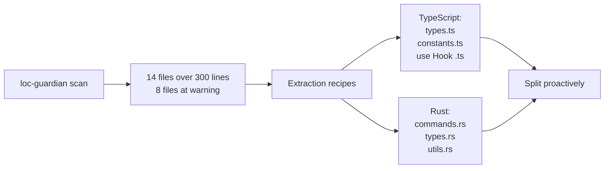

Los datos de LOC también alimentaron la evaluación del proyecto — cuando el desarrollador quiso entender "¿cuánto esfuerzo humano representaría este proyecto?", el informe de LOC fue el dato de entrada. Respuesta: inversión equivalente de $400K--$600K con desarrollo asistido por IA.

## echo-sleuth: La Memoria Institucional

**Usado en**: 6 sesiones. Infraestructura para todo.

echo-sleuth es el plugin más silencioso pero posiblemente el más fundamental. Sus scripts de análisis JSONL son la infraestructura que hace que el historial de conversaciones sea buscable. Cuando cualquier otro plugin necesita recordar lo que sucedió en una sesión pasada, las herramientas de echo-sleuth hacen el trabajo real.

Este artículo existe porque echo-sleuth minó más de 35 sesiones de VMark y encontró cada invocación de plugin, cada reacción del usuario y cada punto de decisión. Extrajo el conteo de 292 issues, el conteo de 84 PRs, la línea temporal de la campaña de cobertura y la sesión de "gríllete a ti mismo duramente". Sin él, la evidencia de "¿por qué son indispensables estos plugins?" sería anecdótica en lugar de arqueológica.

## grill: El Espejo Implacable

**Instalado en**: cada sesión de VMark. **Invocado explícitamente para autoevaluación.**

El momento más memorable de grill fue la sesión del 21 de marzo. El desarrollador preguntó:

> "Si pudieras grillarte a ti mismo más duramente, sin preocuparte por tiempo y esfuerzo, ¿qué harías diferente?"

grill produjo un análisis de brechas de calidad de 14 puntos — una sesión de 81 mensajes y 863 llamadas a herramientas que impulsó un plan de endurecimiento de calidad en múltiples fases ([`076dd96c`](https://github.com/xiaolai/vmark/commit/076dd96c), [`5e47e522`](https://github.com/xiaolai/vmark/commit/5e47e522)). Los hallazgos incluyeron:

- La cobertura de pruebas del backend Rust era solo del 27%
- Brechas de accesibilidad WCAG en diálogos modales ([`85dc29fa`](https://github.com/xiaolai/vmark/commit/85dc29fa))
- 104 archivos excediendo la convención de 300 líneas
- Llamadas a Console.error que deberían haber sido loggers estructurados ([`530b5bb7`](https://github.com/xiaolai/vmark/commit/530b5bb7))

Esto no era un linter encontrando un punto y coma faltante. Era pensamiento estratégico de calidad que impulsó campañas de inversión de una semana.

## nlpm: El Dolor de Crecimiento

**Invocado en**: 0 sesiones explícitamente. **Causó fricción en**: 1 sesión.

El hook PostToolUse de nlpm bloqueó una sesión de edición de VMark tres veces seguidas:

> "El hook PostToolUse:Edit detuvo la continuación, ¿por qué?"
> "¿se detuvo de nuevo, por qué?!"
> "es inofensivo... pero es una pérdida de tiempo."

El hook verificaba si los archivos editados coincidían con patrones de artefactos NL. Durante una corrección de bug para la protección de caracteres estructurales, esto era puro ruido. El plugin fue deshabilitado para esa sesión.

Este es feedback honesto. No toda interacción con un plugin es positiva. El desarrollador que construyó nlpm descubrió a través de VMark que los hooks PostToolUse en patrones de archivos necesitan mejor filtrado — las correcciones de bugs no deberían activar el linting de artefactos NL.

## La Evolución en Cinco Fases

La adopción no fue instantánea. Siguió una trayectoria clara:

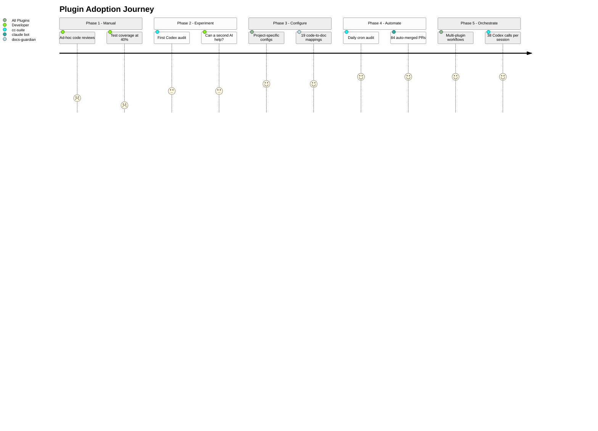

### Fase 1: Auditoría Manual (enero 2026)
> "inspecciona todo el código, identifica posibles bugs y brechas"

Revisiones ad-hoc. Sin herramientas. Cobertura de pruebas al 40%.

### Fase 2: Experimentos con Un Solo Plugin (finales de enero -- principios de febrero)
> "pide a codex que revise la calidad del código"

Primer uso de cc-suite para el servidor MCP. Experimental. ¿Puede una segunda IA detectar cosas que la primera pasó por alto? Primera instalación: [`e6373c7a`](https://github.com/xiaolai/vmark/commit/e6373c7a).

### Fase 3: Infraestructura Configurada (principios de marzo)
Plugins instalados con configuraciones específicas del proyecto. tdd-guardian habilitado con umbrales estrictos ([`f775f300`](https://github.com/xiaolai/vmark/commit/f775f300)). docs-guardian tiene 19 mapeos código-a-documentación. loc-guardian tiene límites de 300 líneas con reglas de extracción.

### Fase 4: Pipelines Automatizados (mediados de marzo)
Auditoría cron diaria a las 9am UTC. Issues auto-creados, auto-corregidos, auto-PR creados, auto-fusionados. 84 PRs sin intervención humana.

### Fase 5: Orquestación Multi-Plugin (finales de marzo)
Sesiones individuales combinando escaneo de loc-guardian -> auditoría de rendimiento -> implementación con subagente -> auditoría de cc-suite -> verificación de cc-suite -> incremento de versión. 38 llamadas a Codex en una sesión. Los plugins se componen en flujos de trabajo.

## El Ciclo de Retroalimentación

El patrón más interesante no es ningún plugin individual. Es el ciclo:

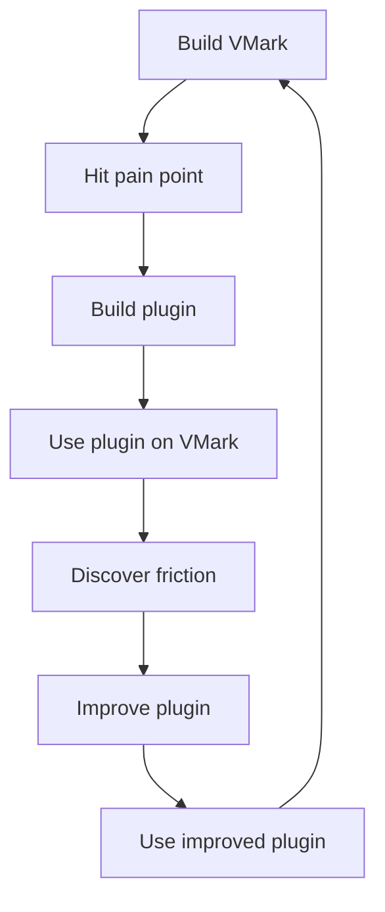

Cada plugin nació de construir VMark:

- **cc-suite** existe porque una sola IA revisando su propio trabajo no es suficiente
- **tdd-guardian** existe porque la cobertura seguía cayendo entre sesiones
- **docs-guardian** existe porque la documentación siempre se desvía del código
- **loc-guardian** existe porque los archivos siempre crecen más allá de tamaños mantenibles
- **echo-sleuth** existe porque las sesiones son efímeras pero las decisiones no
- **grill** existe porque los problemas de arquitectura necesitan revisión adversarial
- **nlpm** existe porque los prompts y los skills también son código

Y cada plugin fue mejorado al construir VMark:

- Los hooks bloqueantes de tdd-guardian resultaron ser demasiado agresivos — lo que llevó a una propuesta de aplicación opcional
- El filtrado de patrones de archivos de nlpm resultó ser demasiado amplio — bloqueando durante correcciones de bugs no relacionadas
- El nombre de cc-suite fue corregido después de que se descubriera una referencia fantasma en medio de una sesión
- El verificador de precisión de docs-guardian demostró su valor al encontrar el bug de `com.vmark.app` que ninguna otra herramienta podría detectar

## El Sistema de Calidad por Capas

Juntos, los siete plugins forman un sistema de aseguramiento de calidad por capas:

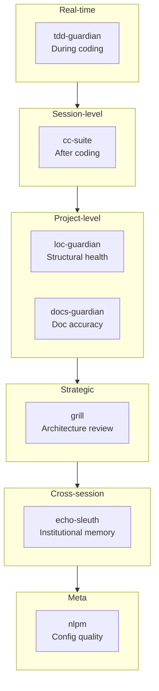

| Capa | Plugin | Cuándo Actúa | Qué Detecta |
|------|--------|--------------|-------------|
| Disciplina en tiempo real | tdd-guardian | Durante la codificación | Pruebas omitidas, regresión de cobertura |
| Revisión a nivel de sesión | cc-suite | Después de codificar | Bugs, seguridad, accesibilidad |
| Salud estructural | loc-guardian | Bajo demanda | Crecimiento de archivos, aumento de complejidad |
| Sincronización de documentación | docs-guardian | Bajo demanda | Docs desactualizados, docs faltantes, docs erróneos |
| Evaluación estratégica | grill | Periódicamente | Brechas de arquitectura, brechas de pruebas, deuda de calidad |
| Memoria institucional | echo-sleuth | Entre sesiones | Decisiones perdidas, contexto olvidado |
| Calidad de configuración | nlpm | Al editar | Prompts deficientes, skills débiles, reglas rotas |

Esto no es "herramientas opcionales." Es la capa de gobernanza que hace confiable el desarrollo recursivo con IA — donde la IA escribe el código, la IA audita el código, la IA corrige los hallazgos de la auditoría, y la IA verifica las correcciones.

## Por Qué Son Indispensables

"Indispensable" es una palabra fuerte. Esta es la prueba: ¿cómo se vería VMark sin ellos?

**Sin cc-suite**: 292 issues de bugs, vulnerabilidades de seguridad y brechas de accesibilidad se habrían acumulado. El pipeline automatizado que detecta problemas dentro de las 24 horas de su introducción no existiría. El desarrollador dependería de revisiones manuales periódicas — que las sesiones de enero muestran que ocurrían de forma ad-hoc en el mejor de los casos.

**Sin tdd-guardian**: La campaña de cobertura de 26 fases podría no haber ocurrido. La disciplina de ajustar los umbrales hacia arriba — donde la cobertura solo puede subir, nunca bajar — vino de la mentalidad que tdd-guardian inculcó. Una cobertura del 99.96% no ocurre por accidente.

**Sin docs-guardian**: Los usuarios seguirían buscando sus genies en un directorio que no existe. 17 funcionalidades permanecerían indetectables. La precisión de la documentación sería una cuestión de esperanza, no de medición.

**Sin loc-guardian**: Los archivos crecerían más allá de 500, 800, 1000 líneas. La "regla de las 300 líneas" que mantiene el código navegable sería una sugerencia en lugar de una restricción aplicada.

**Sin echo-sleuth**: Cada sesión empezaría desde cero. "¿Qué decidimos sobre el conflicto de atajos de teclado del menú?" requeriría buscar manualmente en los logs de conversaciones.

**Sin grill**: La brecha de pruebas en Rust (27%), las brechas de accesibilidad WCAG, los 104 archivos sobredimensionados — estas inversiones estratégicas de calidad fueron impulsadas por el análisis adversarial de grill, no por reportes de bugs.

Los plugins no son indispensables porque sean ingeniosos. Son indispensables porque codifican disciplina que los humanos (y las IAs) olvidan entre sesiones. La cobertura solo sube. La documentación coincide con el código. Los archivos se mantienen pequeños. Las auditorías ocurren antes de cada release. Estas no son aspiraciones — son reglas aplicadas por herramientas que se ejecutan todos los días.

## Las Reglas y los Skills: Conocimiento Codificado

Los plugins son la mitad de la historia. La otra mitad es la infraestructura de conocimiento que se acumuló junto a ellos.

### 13 Reglas (1,950 Líneas de Conocimiento Institucional)

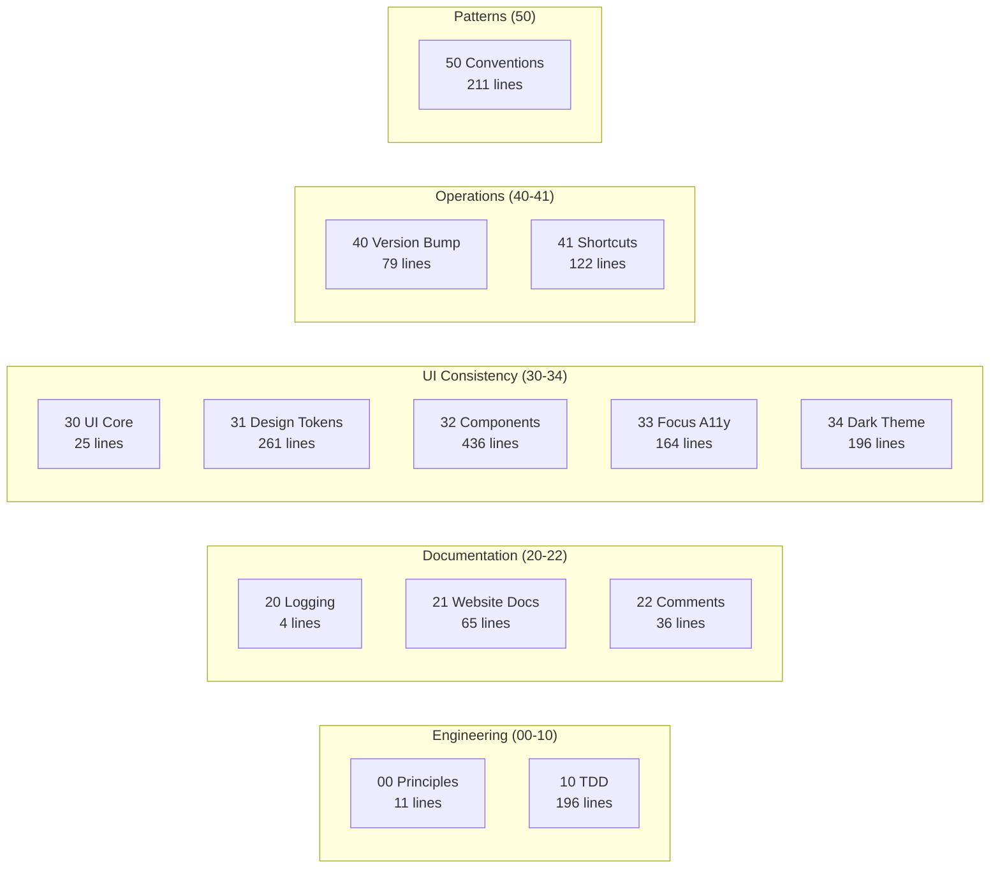

El directorio `.claude/rules/` de VMark contiene 13 archivos de reglas — no directrices vagas, sino convenciones específicas y aplicables:

| Archivo de Regla | Líneas | Qué Codifica |
|------------------|--------|--------------|
| `00-engineering-principles.md` | 11 | Convenciones centrales (sin destructuring de Zustand, límite de 300 líneas) |
| `10-tdd.md` | 196 | 5 plantillas de patrones de prueba, catálogo de anti-patrones, compuertas de cobertura |
| `20-logging-and-docs.md` | 4 | Fuente única de verdad por tema |
| `21-website-docs.md` | 65 | Tabla de mapeo código-a-documentación (qué cambios de código requieren qué actualizaciones de docs) |
| `22-comment-maintenance.md` | 36 | Cuándo actualizar/no actualizar comentarios, prevención de deterioro |
| `30-ui-consistency.md` | 25 | Principios centrales de UI, referencias cruzadas a sub-reglas |
| `31-design-tokens.md` | 261 | Referencia completa de tokens CSS — cada color, espaciado, radio, sombra |
| `32-component-patterns.md` | 436 | Patrones de popup, toolbar, menú contextual, tabla, scrollbar con código |
| `33-focus-indicators.md` | 164 | 6 patrones de foco por tipo de componente (cumplimiento WCAG) |
| `34-dark-theme.md` | 196 | Detección de tema, patrones de sobreescritura, checklist de migración |
| `40-version-bump.md` | 79 | Procedimiento de sincronización de versión en 5 archivos con script de verificación |
| `41-keyboard-shortcuts.md` | 122 | Sincronización de 3 archivos (Rust/Frontend/Docs), verificación de conflictos, convenciones |
| `50-codebase-conventions.md` | 211 | 10 patrones no documentados descubiertos durante el desarrollo |

Estas reglas son leídas por Claude Code al inicio de cada sesión. Son la razón por la que el commit 2,180 sigue las mismas convenciones que el commit 100.

La regla `50-codebase-conventions.md` es particularmente notable — documenta patrones que *nadie diseñó*. Emergieron orgánicamente durante el desarrollo y luego fueron codificados: convenciones de nombres de stores, patrones de limpieza de hooks, estructura de plugins, firmas de handlers del bridge MCP, organización de CSS, modismos de manejo de errores.

### 19 Skills del Proyecto (Expertise del Dominio)

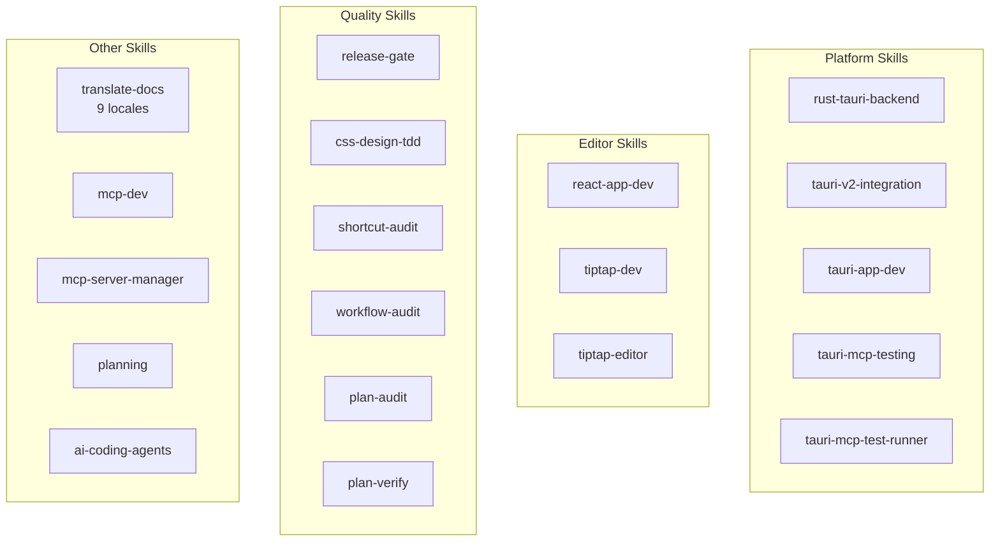

| Categoría | Skills | Qué Habilitan |
|-----------|--------|---------------|
| **Tauri/Rust** | `rust-tauri-backend`, `tauri-v2-integration`, `tauri-app-dev`, `tauri-mcp-testing`, `tauri-mcp-test-runner` | Desarrollo Rust específico de plataforma con convenciones de Tauri v2 |
| **React/Editor** | `react-app-dev`, `tiptap-dev`, `tiptap-editor` | Patrones de editor Tiptap/ProseMirror, reglas de selectores Zustand |
| **Calidad** | `release-gate`, `css-design-tdd`, `shortcut-audit`, `workflow-audit`, `plan-audit`, `plan-verify` | Verificación de calidad automatizada en cada nivel |
| **Documentación** | `translate-docs` | Traducción a 9 locales con auditoría impulsada por subagentes |
| **MCP** | `mcp-dev`, `mcp-server-manager` | Desarrollo y configuración de servidores MCP |
| **Planificación** | `planning` | Generación de planes de implementación con documentación de decisiones |
| **Herramientas IA** | `ai-coding-agents` | Orquestación multi-agente (Codex CLI, Claude Code, Gemini CLI) |

### 7 Comandos Slash (Automatización de Flujos de Trabajo)

| Comando | Qué Hace |
|---------|----------|
| `/bump` | Incremento de versión en 5 archivos, commit, tag, push |
| `/fix-issue` | Resolutor de issues de GitHub de punta a punta — buscar, clasificar, corregir, auditar, PR |
| `/merge-prs` | Revisar y fusionar PRs abiertos secuencialmente con manejo de rebase |
| `/fix` | Corregir problemas correctamente — sin parches, sin atajos, sin regresiones |
| `/repo-clean-up` | Eliminar ejecuciones de CI fallidas y ramas remotas obsoletas |
| `/feature-workflow` | Desarrollo de funcionalidades de punta a punta con compuertas y agentes |
| `/test-guide` | Generar guía de pruebas manuales |

### El Efecto Compuesto

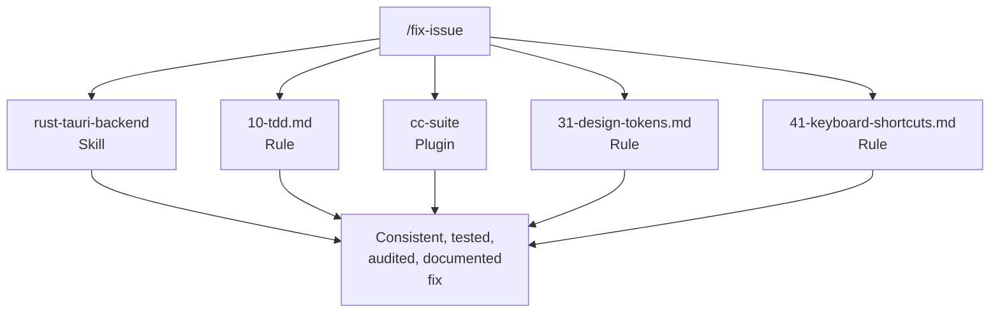

Reglas + skills + plugins + comandos forman un sistema compuesto. Cuando ejecutas `/fix-issue`, usa el skill `rust-tauri-backend` para cambios en Rust, sigue la regla `10-tdd.md` para requisitos de pruebas, invoca `cc-suite` para auditoría, verifica `31-design-tokens.md` para cumplimiento de CSS, y valida contra `41-keyboard-shortcuts.md` para sincronización de atajos de teclado.

Ninguna pieza individual es revolucionaria. El efecto compuesto — 13 reglas x 19 skills x 7 plugins x 7 comandos, todos reforzándose mutuamente — es lo que hace funcionar el sistema. Cada pieza fue agregada cuando se descubrió una brecha, probada en desarrollo real y refinada a través del uso.

## Para Constructores de Plugins

Si estás pensando en construir plugins para Claude Code, esto es lo que VMark nos enseñó:

1. **Construye para ti primero.** Los mejores plugins resuelven tus problemas reales, no los hipotéticos.

2. **Dogfooding implacable.** Usa tus plugins en tus proyectos reales. La fricción que descubras es la fricción que tus usuarios descubrirán.

3. **Los hooks necesitan válvulas de escape.** Los hooks bloqueantes que no pueden ser anulados serán deshabilitados por completo. Haz que la aplicación sea opcional o sensible al contexto.

4. **La verificación cross-model funciona.** Tener una IA diferente revisando el trabajo de tu IA principal detecta bugs reales. No es redundante — es ortogonal.

5. **Codifica disciplina, no reglas.** Los mejores plugins cambian hábitos. Los hooks bloqueantes de tdd-guardian fueron eliminados, pero la campaña de cobertura que inspiraron fue la inversión de calidad más impactante del proyecto.

6. **Compón, no monolites.** Siete plugins enfocados superan a un mega-plugin. Cada uno hace una cosa bien, y se componen en flujos de trabajo mayores que la suma de sus partes.

7. **La confianza se gana en cada invocación.** El desarrollador confía en cc-suite lo suficiente como para decir "arregla todo" sin revisar los hallazgos. Esa confianza se construyó en 27 sesiones y 292 issues resueltos.

---

*VMark es código abierto en [github.com/xiaolai/vmark](https://github.com/xiaolai/vmark). Los siete plugins están disponibles en el marketplace `xiaolai` de Claude Code.*
