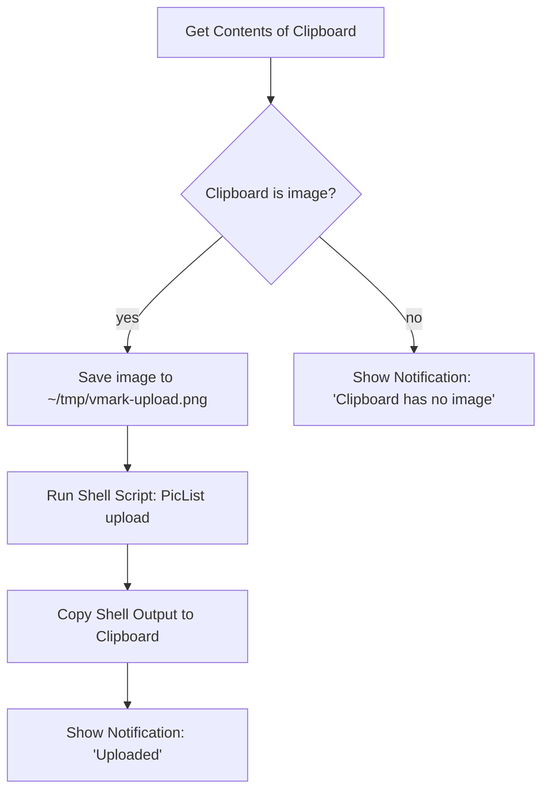

# Images hébergées dans le cloud

VMark est un outil d'écriture local-first. Il n'embarque pas de téléverseur intégré pour les images que vous collez depuis le presse-papiers, et il ne stocke pas d'identifiants cloud. Si vous avez besoin que votre Markdown contienne des URL CDN publiques (pour la publication d'un blog, la synchronisation entre appareils, la publication via CMS), le flux de travail consiste en une automatisation au niveau du système d'exploitation qui s'exécute *en dehors* de VMark et qui réinjecte le résultat.

Cette page explique pourquoi VMark fonctionne ainsi, ce qui fonctionne déjà sans configuration supplémentaire, et comment câbler la recette Shortcuts.app en une dizaine de minutes.

[[toc]]

## Ce que VMark prend déjà en charge

VMark distingue deux directions lorsqu'il gère les références d'images en Markdown :

| Direction | Statut | Déclencheur | Sortie en Markdown |
|-----------|--------|-------------|--------------------|
| Insérer une URL distante existante | Pris en charge | Coller ou saisir une URL `https://…` | L'URL, inchangée |
| Source Markdown avec une URL distante | Pris en charge | Quelqu'un écrit `` | Rendu direct |
| Insérer une image locale | Pris en charge | Coller, déposer ou insérer un binaire | Copiée dans `.assets/`, chemin relatif écrit |
| Insérer une image locale *mais la stocker à distance* | **Non intégré** | (Voir recette ci-dessous) | — |

En résumé : si l'image se trouve déjà à une URL, collez l'URL. VMark l'insère comme référence d'image Markdown et la webview la récupère. Le chemin de lecture est déjà compatible avec le cloud.

## Pourquoi VMark n'inclut pas de téléversement cloud natif

La fonctionnalité proposée signifierait que VMark détecte une image locale au moment du collage, la téléverse vers un stockage distant, et écrit l'URL retournée dans le Markdown à la place d'un chemin `./.assets/…`. Cela semble anodin, mais étend la portée de VMark de trois manières structurelles :

1. **Coffre-fort d'identifiants**. Le téléversement natif compatible S3 nécessite que la clé d'accès et la clé secrète de l'utilisateur soient stockées au repos. VMark ne possède aujourd'hui aucun secret persistant — aucune décision de chiffrement au repos, aucune intégration au trousseau du système d'exploitation, aucune expérience utilisateur de rotation de clés, aucun mode d'échec lié à une clé accidentellement laissée dans le Markdown. Ajouter le téléversement ferait franchir cette ligne à VMark.

2. **Longue traîne de prise en charge multi-fournisseurs**. S3, Cloudflare R2, Backblaze B2, MinIO, DigitalOcean Spaces se présentent tous comme S3-compatible, mais chacun a ses propres particularités (adressage path-style vs virtual-hosted, sémantique des ACL, points de terminaison régionaux, règles CORS). Un seul mainteneur absorbant cette surface représente une dette à long terme pour un outil d'écriture.

3. **Composition vs. propriété**. Des outils comme [PicList](https://github.com/Kuingsmile/PicList) et [PicGo](https://github.com/Molunerfinn/PicGo) résolvent déjà ce problème, y compris la configuration spécifique aux fournisseurs et le stockage des identifiants. Shortcuts.app de macOS et Keyboard Maestro peuvent intégrer ces outils dans n'importe quel champ texte du système — pas seulement VMark. Intégrer le téléversement cloud dans VMark dupliquerait du code qui vit mieux en dehors, et ne fonctionnerait que dans VMark.

La décision est donc la suivante : **VMark reste un outil d'écriture ; le téléversement d'images vit dans la boîte à outils d'automatisation au niveau du système d'exploitation de l'utilisateur**. La recette ci-dessous rend ce chemin au niveau OS concret.

## Recette : Shortcuts.app + PicList (macOS, gratuit)

Shortcuts.app est livré avec macOS Monterey (12) et versions ultérieures. PicList est un téléverseur d'images open source gratuit. Ensemble, ils vous offrent un raccourci clavier qui prend l'image actuellement dans le presse-papiers, la téléverse via PicList (qui sait déjà parler à R2, S3, Imgur et des dizaines d'autres backends) et remplace le presse-papiers par l'URL retournée. Après cela, `Cmd + V` dans VMark insère l'URL — la détection d'URL distantes existante de VMark gère le reste.

### Prérequis

1. **PicList installé et configuré.** Téléchargez-le depuis la [page des releases de PicList](https://github.com/Kuingsmile/PicList/releases), ouvrez-le une fois et configurez au moins un hébergeur d'images (R2, S3, Imgur, smms, etc.) dans les *PicBed Settings* de PicList. Confirmez qu'un téléversement manuel fonctionne dans PicList lui-même avant de câbler le Shortcut — cela isole « PicList fonctionne-t-il » de « mon Shortcut est-il correctement câblé ».

2. **CLI de PicList disponible.** PicList expose une sous-commande `upload` via son bundle d'application. Sur macOS, le binaire se trouve à `/Applications/PicList.app/Contents/MacOS/PicList`. Vérifiez avec :

   ```sh
   /Applications/PicList.app/Contents/MacOS/PicList upload --help
   ```

   La commande devrait afficher l'aide CLI. Si ce n'est pas le cas, vérifiez que PicList est installé dans `/Applications` (et non `~/Applications` — ajustez le chemin si nécessaire).

### Construire le Shortcut

Ouvrez `Shortcuts.app` et créez un nouveau raccourci. Ajoutez ces actions dans l'ordre :



Étapes concrètes dans l'éditeur Shortcuts :

1. **Action : Get Contents of Clipboard.** Glissez cette action depuis la barre latérale des actions. Aucune configuration.

2. **Action : If.** Définissez la condition : *Clipboard is Media › Image*. (Si la liste déroulante n'affiche pas *Media*, utilisez *Contents › has any value* comme vérification plus lâche.)

3. **Dans la branche If — Action : Save File.** Configurez :
   - Service : *Files*
   - Destination : `~/tmp/` (créez le dossier une fois via le Finder s'il n'existe pas).
   - Nom de fichier : `vmark-upload.png` (un nom fixe garde le chemin prévisible pour l'étape suivante).
   - Désactivez *Ask Where To Save* pour que le raccourci s'exécute sans intervention.

4. **Action : Run Shell Script.** Configurez :
   - Shell : `/bin/zsh` (par défaut sur macOS).
   - Input : *Pass Input as `stdin`* — en réalité nous voulons `as arguments`. (Les deux fonctionnent ; le script ci-dessous ignore stdin et utilise un chemin littéral.)
   - Corps du script :

     ```sh
     /Applications/PicList.app/Contents/MacOS/PicList upload "$HOME/tmp/vmark-upload.png" 2>/dev/null | tail -n 1
     ```

   Le `tail -n 1` est défensif : PicList peut afficher des lignes de journal informatives avant l'URL. Confirmez la forme réelle de la sortie de votre version de PicList une fois ; si PicList ne retourne que l'URL, `tail` est sans effet.

5. **Action : Copy to Clipboard.** Définissez son entrée comme *Shell Script Result*.

6. **Action : Show Notification.** Titre : `Uploaded`. Corps : *Shell Script Result*. Cela confirme que l'URL est dans le presse-papiers et vous montre ce qui a été téléversé.

7. **(Optionnel) Branche Else — Action : Show Notification.** Titre : `No image on clipboard`. Aide à déboguer lorsque le raccourci se déclenche mais que le presse-papiers ne contenait pas réellement d'image.

### Lier un raccourci clavier global

Dans l'éditeur Shortcuts, cliquez sur le bouton *(i)* d'information du raccourci, puis sur *Add Keyboard Shortcut*. Choisissez quelque chose qui n'entre pas en conflit avec les raccourcis de VMark — `Control + Option + Command + U` est un choix courant (aucun conflit macOS, mnémonique « Upload »).

### Utilisation

1. Prenez une capture d'écran avec `Cmd + Shift + Ctrl + 4` (sauvegarde dans le presse-papiers, pas sur le disque) — ou copiez n'importe quelle image depuis une autre application.
2. Appuyez sur votre raccourci de téléversement (`Ctrl + Opt + Cmd + U`).
3. Attendez environ 1 à 3 secondes pour la notification.
4. Collez dans VMark (`Cmd + V`). Le Markdown reçoit ``.

### Ce qui peut mal tourner

| Symptôme | Cause probable | Solution |
|----------|----------------|----------|
| Le raccourci se déclenche mais PicList ne s'exécute pas | Chemin incorrect vers le binaire PicList | Confirmez que `/Applications/PicList.app/Contents/MacOS/PicList` existe ; ajustez s'il est installé ailleurs |
| La notification s'affiche mais le presse-papiers contient toujours l'image | Le script shell a retourné une chaîne vide | Exécutez le script shell manuellement avec un chemin de fichier connu pour voir la sortie réelle de PicList |
| L'URL est incorrecte / contient des espaces en fin | `tail -n 1` a capté une ligne de journal, pas l'URL | Inspectez la sortie de PicList ; ajustez le parsing (`grep -oE 'https://[^[:space:]]+' \| tail -n 1` est une alternative plus stricte) |
| `Cmd + V` dans VMark insère du texte brut au lieu d'une image | L'URL ne se termine pas par une extension d'image que PicList connaît | Confirmez que l'extension du fichier est préservée tout au long du téléversement (R2/S3 la préservent généralement ; vérifiez le gabarit de clé de votre bucket) |

## Alternative : Keyboard Maestro

[Keyboard Maestro](https://www.keyboardmaestro.com/) est un outil d'automatisation macOS payant avec un plafond plus élevé que Shortcuts.app. Le principal avantage pratique pour ce flux de travail : KM peut intercepter `Cmd + V` directement lorsque le presse-papiers contient une image, ce qui vous permet de téléverser-et-coller en une seule frappe au lieu de deux (raccourci, puis `Cmd + V`).

La recette est structurellement identique à la version Shortcuts.app — récupérer l'image du presse-papiers, l'enregistrer dans un fichier, exécuter le CLI PicList, remplacer le presse-papiers, éventuellement simuler le collage. Le constructeur de macros *Trigger* de KM est plus flexible (déclencheur sur contenu du presse-papiers, portée spécifique à une application), mais l'étape de téléversement est la même.

Si vous n'êtes pas déjà utilisateur de Keyboard Maestro, Shortcuts.app est la réponse la moins coûteuse.

## Alternative : script de traitement avant publication

Pour les utilisateurs disposant d'un blog auto-hébergé ou d'un pipeline de site statique, la réponse la plus propre est souvent : conserver le comportement par défaut de VMark (chemins relatifs `.assets/`) et exécuter un script au moment de la construction qui parcourt le Markdown, téléverse chaque image unique et réécrit le chemin. Cela échange la latence de téléversement par image contre un téléversement par lots à la publication, et garde la surface de l'éditeur propre.

Une esquisse minimale (Node.js, pseudo-code) :

```js
// scan-and-upload.js
const fs = require("fs");
const { execSync } = require("child_process");

const md = fs.readFileSync(process.argv[2], "utf8");
const rewritten = md.replace(/!\[(.*?)\]\((\.\/\.assets\/[^)]+)\)/g, (_, alt, path) => {
  const url = execSync(
    `/Applications/PicList.app/Contents/MacOS/PicList upload "${path}"`,
  ).toString().trim();
  return ``;
});
fs.writeFileSync(process.argv[2].replace(/\.md$/, ".published.md"), rewritten);
```

Plusieurs générateurs de sites statiques (Hugo avec [Page Bundles](https://gohugo.io/content-management/page-bundles/), Jekyll, Astro, Eleventy) gèrent nativement les chemins relatifs `.assets/` au moment de la construction — aucun script n'est nécessaire si vous publiez de cette manière.

## URL déjà hébergées

Pour être complet : si une image se trouve déjà à une URL publique, collez l'URL dans VMark et c'est terminé. Le détecteur de chemin d'image du presse-papiers la classe comme `type: "url"` et écrit l'URL directement. Aucun téléversement, aucune copie dans `.assets/`, aucun paramètre à modifier. C'est le flux de travail d'image cloud le plus simple que VMark prend en charge et il ne nécessite aucun outil supplémentaire.

## Voir aussi

- [Paramètres Fichiers & Images](./settings.md) — redimensionnement automatique, copie vers assets, nettoyage des orphelins
- [Confidentialité](./privacy.md) — ce que VMark stocke localement et ce qui quitte votre machine
