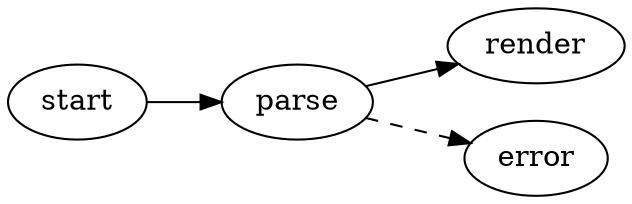
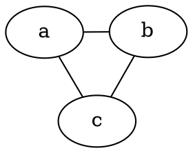

# Diagrammes Graphviz

VMark rend les graphes DOT [Graphviz](https://graphviz.org/) directement dans vos documents Markdown. Les diagrammes sont rendus localement avec la version WASM de Graphviz ([@viz-js/viz](https://github.com/mdaines/viz-js)) — aucun accès réseau, aucun binaire externe.

[[toc]]

## Insérer un diagramme

Utilisez **Insertion → Diagramme Graphviz** dans la barre de menus (ou le groupe Insertion de la barre d'outils) pour insérer un diagramme modèle — le raccourci n'est pas assigné par défaut et peut être personnalisé dans les Paramètres. Vous pouvez aussi taper un bloc de code délimité avec l'identifiant de langage `dot` ou `graphviz` :

````markdown

````

Les deux identifiants de langage se comportent de manière identique :

| Délimiteur | Rendu |
|-------|------------|
| ` ```dot ` | Diagramme Graphviz |
| ` ```graphviz ` | Diagramme Graphviz |

## Modes d'édition

- **Mode WYSIWYG** — le bloc de code est rendu sous forme de diagramme. Double-cliquez dessus pour modifier le source DOT avec une prévisualisation en direct à rebond ; enregistrez ou annulez depuis l'en-tête d'édition.
- **Mode Source** — placez le curseur à l'intérieur d'un bloc ` ```dot ` pour obtenir la prévisualisation flottante du diagramme (glisser, redimensionner, zoomer), comme pour Mermaid.

## Panoramique, zoom et export

Les diagrammes rendus prennent en charge les mêmes contrôles que les diagrammes Mermaid :

- **Cmd/Ctrl + défilement** pour zoomer, glissez pour le panoramique, bouton de réinitialisation pour recentrer
- **Export en PNG** (fond clair ou sombre) via le bouton d'exportation

## Moteur et mise en page

Les diagrammes sont mis en page par défaut avec le moteur `dot` (mise en page hiérarchique/en couches). Pour utiliser un moteur différent, définissez l'attribut Graphviz standard `layout` dans votre graphe — le choix voyage avec le document et fonctionne dans tous les autres outils Graphviz :

````markdown

````

| Moteur | Style de mise en page |
|--------|--------------|
| `dot` | Hiérarchique / en couches (par défaut) |
| `neato` | Modèle à ressorts (dirigé par les forces) |
| `fdp` | Dirigé par les forces, graphes plus grands |
| `sfdp` | Dirigé par les forces multi-échelle, très grands graphes |
| `circo` | Circulaire |
| `twopi` | Radial |
| `osage` | En grappes (clusters) |
| `patchwork` | Treemap (squarifié) |

Une valeur `layout` inconnue affiche l'état d'erreur de rendu, comme toute autre erreur DOT.

Toutes les fonctionnalités DOT standard prises en charge par Graphviz fonctionnent : sous-graphes et clusters, rangs, formes de nœuds, styles d'arêtes, labels de type HTML et couleurs explicites.

## Intégration du thème

- L'arrière-plan du diagramme est transparent, il suit donc le thème de l'éditeur.
- Les couleurs par défaut des nœuds, des arêtes et du texte sont dérivées des jetons de design du thème actif, de sorte que les diagrammes paraissent natifs dans chaque thème (White, Paper, Mint, Sepia, Night, Solarized) et se mettent à jour lorsque vous changez de thème.
- Les couleurs explicites dans votre source DOT l'emportent toujours sur les valeurs par défaut du thème — un graphe qui définit son propre `bgcolor`, `color` ou `fontcolor` est rendu exactement tel qu'écrit.

## Gestion des erreurs

Si le source DOT contient une erreur de syntaxe, le bloc affiche un état d'erreur de rendu au lieu d'un diagramme. Corrigez le source et la prévisualisation se met à jour automatiquement.

## Export HTML et PDF

Les documents HTML et PDF exportés intègrent le SVG rendu, de sorte que les diagrammes s'affichent de la même manière en dehors de VMark.
