# Utilisateurs et développeurs

Comment sept plugins Claude Code sont devenus indispensables en étant forgés dans le feu de la construction de VMark.

## Le contexte

VMark est un éditeur Markdown conçu pour l'AI, construit avec Tauri, React et Rust. Sur 10 semaines de développement :

| Métrique | Valeur |
|--------|-------|
| Commits | 2 180+ |
| Taille de la codebase | 305 391 lignes de code |
| Couverture de tests | 99,96 % lines |
| Ratio Test:Production | 1,97:1 |
| Issues d'audit créées et résolues | 292 |
| PRs automatisées mergées | 84 |
| Langues de documentation | 10 |
| Outils serveur MCP | 12 |

Un seul développeur l'a construit avec Claude Code. En cours de route, ce développeur a créé sept plugins pour le marketplace Claude Code — non pas comme un projet parallèle, mais comme des outils de survie. Chaque plugin existe parce qu'un point de douleur concret exigeait une solution qui n'existait pas encore.

## Les plugins

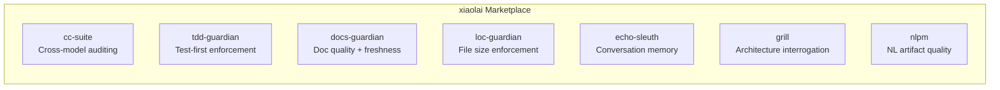

| Plugin | Fonction | Né de |
|--------|-------------|-----------|
| [cc-suite](https://github.com/xiaolai/cc-suite) | Audit de code cross-modèle via OpenAI Codex | « J'ai besoin d'un deuxième regard qui ne soit pas Claude » |
| [tdd-guardian](https://github.com/xiaolai/tdd-guardian-for-claude) | Mise en application du workflow test-first | « La couverture baisse constamment quand j'oublie les tests » |
| [docs-guardian](https://github.com/xiaolai/docs-guardian-for-claude) | Audit de qualité et de fraîcheur de la documentation | « Ma doc dit `com.vmark.app` mais l'identifiant réel est `app.vmark` » |
| [loc-guardian](https://github.com/xiaolai/loc-guardian-for-claude) | Limite du nombre de lignes par fichier | « Ce fichier fait 800 lignes et personne ne l'a remarqué » |
| [echo-sleuth](https://github.com/xiaolai/echo-sleuth-for-claude) | Exploration et mémoire de l'historique des conversations | « Qu'est-ce qu'on avait décidé à ce sujet il y a trois semaines ? » |
| [grill](https://github.com/xiaolai/grill-for-claude) | Interrogation approfondie et multi-angle du code | « J'ai besoin d'une revue d'architecture, pas juste du lint » |
| [nlpm](https://github.com/xiaolai/nlpm-for-claude) | Qualité des artefacts de programmation en langage naturel | « Mes prompts et skills sont-ils réellement bien écrits ? » |

## Avant et après

La transformation s'est produite en trois mois.

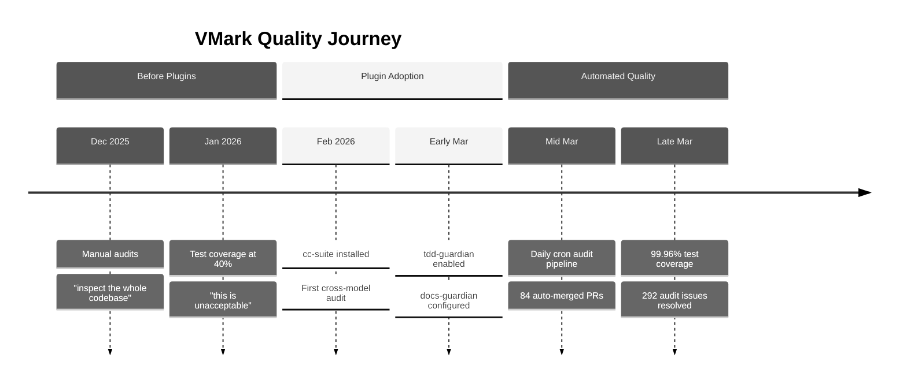

**Avant les plugins** (décembre 2025 -- février 2026) : Audits de code manuels. Le développeur disait des choses comme « Inspecte toute la codebase, trouve les bugs possibles, les lacunes. » La couverture de tests oscillait autour de 40 % — qualifiée d'« inacceptable ». La documentation était écrite puis oubliée.

**Après les plugins** (mars 2026) : Chaque session de développement chargeait automatiquement 3 à 4 plugins. Un pipeline d'audit automatisé tournait quotidiennement, créant et résolvant des issues sans intervention humaine. La couverture de tests a atteint 99,96 % grâce à une campagne méthodique de ratchet en 26 phases. La précision de la documentation était vérifiée mécaniquement par rapport au code.

L'historique git raconte l'histoire :

| Catégorie | Commits |
|----------|---------|
| Total des commits | 2 180+ |
| Réponses aux audits Codex | 47 |
| Tests/couverture | 52 |
| Renforcement sécurité | 40 |
| Documentation | 128 |
| Phases de campagne de couverture | 26 |

## cc-suite : le deuxième avis

**Utilisé dans** : 27 sessions sur 28. Plus de 200 appels Codex sur l'ensemble des sessions.

L'aspect le plus important de cc-suite est que ce n'est *pas Claude qui audite le travail de Claude*. Il envoie le code au modèle Codex d'OpenAI pour une revue indépendante. Quand on est plongé dans une fonctionnalité avec une AI, avoir un modèle complètement différent qui scrute le résultat attrape des choses que vous et votre AI principale avez manquées.

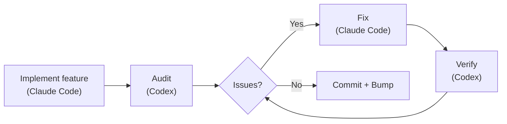

### Ce qu'il a réellement trouvé

292 issues d'audit. Les 292 résolues. Zéro restée ouverte.

Exemples réels tirés de l'historique git :

- **Sécurité** : 9 constats dans un seul audit de la migration du stockage sécurisé ([`d1a880a6`](https://github.com/xiaolai/vmark/commit/d1a880a6)). Traversée de liens symboliques dans le résolveur de ressources ([`7dfa872d`](https://github.com/xiaolai/vmark/commit/7dfa872d)). Vulnérabilité de haute sévérité dans Path-to-regexp ([`8c554cdc`](https://github.com/xiaolai/vmark/commit/8c554cdc)).

- **Accessibilité** : Chaque bouton de popup n'avait pas d'`aria-label`. Les boutons icône seuls dans FindBar, Sidebar, Terminal et StatusBar n'avaient aucun texte pour les lecteurs d'écran ([`7acc0bf0`](https://github.com/xiaolai/vmark/commit/7acc0bf0)). Indicateur de focus manquant sur le badge lint ([`c4db90d4`](https://github.com/xiaolai/vmark/commit/c4db90d4)).

- **Bug logique silencieux** : Quand les plages de multi-curseur fusionnaient, l'index du curseur principal retombait silencieusement à 0. Les utilisateurs éditaient à la position 50, les plages fusionnaient, et soudain le curseur sautait au début du document. Trouvé par l'audit, pas par les tests.

- **Revue de spécification i18n** : Codex a examiné la spécification de conception de l'internationalisation et a trouvé que « la migration des ID de menu macOS n'est pas implémentable de la manière décrite dans la spécification » ([`1208c98d`](https://github.com/xiaolai/vmark/commit/1208c98d)). Quatre problèmes de qualité de traduction trouvés dans les fichiers de locale ([`af98b5cd`](https://github.com/xiaolai/vmark/commit/af98b5cd)).

- **Audit multi-rounds** : Le plugin lint est passé par trois rounds — 8 issues d'abord ([`7482c347`](https://github.com/xiaolai/vmark/commit/7482c347)), 6 au deuxième ([`8bfead81`](https://github.com/xiaolai/vmark/commit/8bfead81)), 7 au dernier ([`84cf67f7`](https://github.com/xiaolai/vmark/commit/84cf67f7)). À chaque round, Codex trouvait des issues que les corrections avaient introduites.

### Le pipeline automatisé

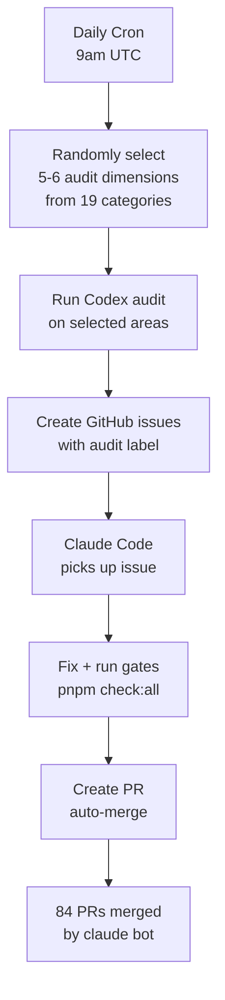

L'évolution ultime : un audit cron quotidien qui tourne automatiquement à 9h UTC. Il sélectionne aléatoirement 5 à 6 dimensions parmi 19 catégories d'audit, inspecte différentes parties de la codebase, crée des issues GitHub étiquetées et envoie Claude Code les corriger. 84 PRs ont été auto-créées, auto-corrigées et auto-mergées par `claude[bot]` — beaucoup avant même que le développeur ne se réveille.

### Le signal de confiance

Quand le développeur lançait un audit et obtenait des résultats, la réaction n'était jamais « Laisse-moi examiner ces résultats. » C'était :

> « Tout corriger. »

C'est le niveau de confiance qu'on atteint quand un outil a fait ses preuves des centaines de fois.

## tdd-guardian : le controversé

**Utilisé dans** : 3 sessions explicites. Plus de 5 500 références en arrière-plan sur 42 sessions.

L'histoire de tdd-guardian est la plus intéressante parce qu'elle inclut l'échec.

### Le problème du hook bloquant

tdd-guardian a été livré avec un hook PreToolUse qui bloquait les commits si les seuils de couverture de tests n'étaient pas atteints. En théorie, cela impose la discipline test-first. En pratique :

> « Le TDD-guardian — on devrait retirer le hook bloquant, et laisser tdd guardian tourner par commande manuelle ? »

Le problème était réel : un SHA obsolète dans le fichier d'état bloquait des commits sans rapport. Le développeur devait patcher manuellement `state.json` pour débloquer son travail. Les hooks bloquants étaient redondants avec les gates CI qui exécutaient déjà `pnpm check:all` à chaque PR.

Les hooks ont été désactivés ([`f2fda819`](https://github.com/xiaolai/vmark/commit/f2fda819)). Mais la *philosophie* a survécu.

### La campagne de couverture en 26 phases

Ce que tdd-guardian avait semé, c'était la discipline qui a alimenté une campagne de couverture extraordinaire :

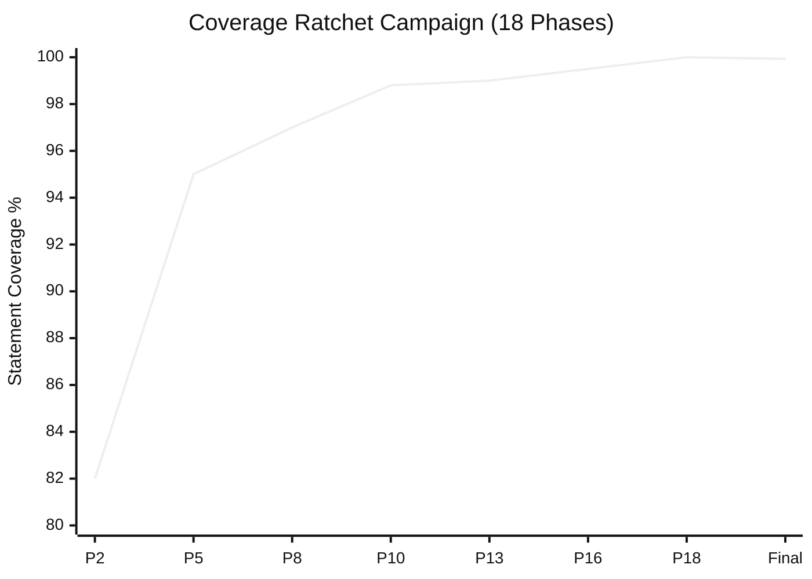

| Phase | Commit | Seuils |
|-------|--------|-----------|
| Phase 2 | [`1e5cf94a`](https://github.com/xiaolai/vmark/commit/1e5cf94a) | 82/74/86/83 |
| Phase 5 | [`4658d75f`](https://github.com/xiaolai/vmark/commit/4658d75f) | 95/87/95/96 |
| Phase 8 | [`3d7239c3`](https://github.com/xiaolai/vmark/commit/3d7239c3) | approfondissement tabEscape, codePreview, formatToolbar |
| Phase 13 | [`9bec6612`](https://github.com/xiaolai/vmark/commit/9bec6612) | approfondissement multiCursor, mermaidPreview, listEscape |
| Phase 16 | [`730ff139`](https://github.com/xiaolai/vmark/commit/730ff139) | annotations v8 sur 145 fichiers, 99,5/99/99/99,6 |
| Phase 18 | [`1d996778`](https://github.com/xiaolai/vmark/commit/1d996778) | ratchet à 100/99,87/100/100 |
| Final | [`fcf5e00d`](https://github.com/xiaolai/vmark/commit/fcf5e00d) | 99,93 % stmts / 99,96 % lines |

De ~40 % (« c'est inacceptable ») à 99,96 % de couverture en lignes, en 18 phases, chacune resserrant les seuils pour que la couverture ne puisse jamais régresser. Le ratio test:production a atteint 1,97:1 — presque deux fois plus de code de test que de code applicatif.

### La leçon

Les meilleurs mécanismes de mise en application sont ceux qui changent les habitudes, puis s'effacent. Les hooks bloquants de tdd-guardian étaient trop agressifs, mais le développeur qui les a désactivés a ensuite écrit plus de tests que quiconque avec des hooks bloquants activés.

## docs-guardian : le détecteur d'embarras

**Utilisé dans** : 3 sessions. 2 issues CRITIQUES trouvées dès le premier audit.

### L'incident `com.vmark.app`

Le vérificateur de précision de docs-guardian lit à la fois le code et la documentation, puis les compare. Lors de son premier audit complet de VMark, il a trouvé que le guide AI Genies indiquait aux utilisateurs que leurs genies étaient stockés dans :

```
~/Library/Application Support/com.vmark.app/genies/
```

Mais l'identifiant Tauri réel dans le code était `app.vmark`. Le vrai chemin était :

```
~/Library/Application Support/app.vmark/genies/
```

C'était faux sur les trois plateformes, dans le guide anglais et dans les 9 versions traduites. Aucun test n'aurait attrapé ça. Aucun linter n'aurait attrapé ça. docs-guardian l'a trouvé parce que c'est littéralement ce qu'il fait : comparer le code à la documentation, mécaniquement, pour chaque paire mappée.

### L'impact complet de l'audit

```mermaid
%%{init: {"theme": "neutral"}}%%
xychart-beta
    title "Documentation Health Before vs After"
    x-axis ["Accuracy", "Coverage", "Quality", "Overall"]
    y-axis "Score" 0 --> 100
    bar [78, 64, 83, 74]
    bar [95, 91, 88, 91]
```

| Dimension | Avant | Après | Delta |
|-----------|--------|-------|-------|
| Précision | 78/100 | 95/100 | +17 |
| Couverture | 64 % | 91 % | +27 % |
| Qualité | 83/100 | 88/100 | +5 |
| **Global** | **74/100** | **91/100** | **+17** |

17 fonctionnalités non documentées ont été trouvées et documentées en une seule session. Le moteur Markdown Lint — 15 règles, avec des raccourcis et un badge dans la barre d'état — n'avait aucune documentation utilisateur. La commande shell CLI `vmark` était complètement non documentée. Le mode lecture seule, la Universal Toolbar, le détachement d'onglet par glisser-déposer — toutes des fonctionnalités livrées que les utilisateurs ne pouvaient pas découvrir parce que personne n'avait écrit la documentation.

Les 19 mappages code-vers-documentation dans `config.json` signifient que chaque fois que `shortcutsStore.ts` change, docs-guardian sait que `website/guide/shortcuts.md` doit être mis à jour. La dérive documentaire devient mécaniquement détectable.

## loc-guardian : la règle des 300 lignes

**Utilisé dans** : 4 sessions. 14 fichiers signalés, 8 au niveau d'avertissement.

Le fichier AGENTS.md de VMark contient la règle : « Garder les fichiers de code sous ~300 lignes (découper de manière proactive). »

Cette règle ne vient pas d'un guide de style. Elle est née des scans de loc-guardian qui trouvaient sans cesse des fichiers de 500+ lignes, difficiles à naviguer, à tester et à exploiter efficacement par les assistants AI. Le pire contrevenant : `hot_exit/coordinator.rs` à 756 lignes.

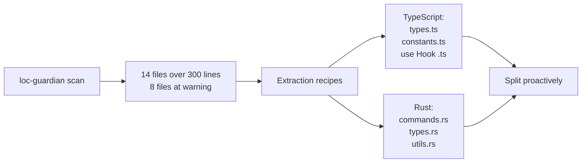

Les données LOC ont aussi alimenté l'évaluation du projet — quand le développeur voulait comprendre « combien d'effort humain ce projet représenterait-il ? », le rapport LOC était le point de départ. Réponse : un investissement équivalent de 400 000 $ à 600 000 $ avec le développement assisté par AI.

## echo-sleuth : la mémoire institutionnelle

**Utilisé dans** : 6 sessions. Infrastructure pour tout le reste.

echo-sleuth est le plugin le plus discret mais sans doute le plus fondamental. Ses scripts d'analyse JSONL sont l'infrastructure qui rend l'historique des conversations interrogeable. Quand un autre plugin a besoin de se rappeler ce qui s'est passé dans une session passée, c'est l'outillage d'echo-sleuth qui fait le travail concret.

Cet article existe parce qu'echo-sleuth a exploré plus de 35 sessions VMark et trouvé chaque invocation de plugin, chaque réaction utilisateur et chaque point de décision. Il a extrait le compte de 292 issues, le compte de 84 PRs, la chronologie de la campagne de couverture et la session « interroge-toi sévèrement ». Sans lui, les preuves de « pourquoi ces plugins sont-ils indispensables ? » seraient anecdotiques plutôt qu'archéologiques.

## grill : le miroir impitoyable

**Installé dans** : chaque session VMark. **Invoqué explicitement pour l'auto-évaluation.**

Le moment grill le plus mémorable fut la session du 21 mars. Le développeur a demandé :

> « Si tu pouvais te soumettre à un interrogatoire plus sévère, sans te soucier du temps ni de l'effort — que ferais-tu différemment ? »

grill a produit une analyse de 14 lacunes qualité — une session de 81 messages et 863 appels d'outils qui a conduit à un plan de renforcement qualité en plusieurs phases ([`076dd96c`](https://github.com/xiaolai/vmark/commit/076dd96c), [`5e47e522`](https://github.com/xiaolai/vmark/commit/5e47e522)). Parmi les constats :

- La couverture de tests du backend Rust n'était que de 27 %
- Des lacunes d'accessibilité WCAG dans les dialogues modaux ([`85dc29fa`](https://github.com/xiaolai/vmark/commit/85dc29fa))
- 104 fichiers dépassant la convention des 300 lignes
- Des appels Console.error qui auraient dû être des loggers structurés ([`530b5bb7`](https://github.com/xiaolai/vmark/commit/530b5bb7))

Ce n'était pas un linter trouvant un point-virgule manquant. C'était de la réflexion stratégique sur la qualité qui a conduit à des campagnes d'investissement sur plusieurs semaines.

## nlpm : la douleur de croissance

**Invoqué dans** : 0 session explicitement. **A causé des frictions dans** : 1 session.

Le hook PostToolUse de nlpm a bloqué une session d'édition VMark trois fois de suite :

> « Le hook PostToolUse:Edit a arrêté la continuation, pourquoi ? »
> « Encore bloqué, pourquoi ?! »
> « C'est inoffensif... mais c'est du temps perdu. »

Le hook vérifiait si les fichiers édités correspondaient à des patterns d'artefacts NL. Pendant une correction de bug pour la protection des caractères structurels, c'était du bruit pur. Le plugin a été désactivé pour cette session.

C'est un retour honnête. Toutes les interactions avec les plugins ne sont pas positives. Le développeur qui a construit nlpm a découvert à travers VMark que les hooks PostToolUse sur les patterns de fichiers ont besoin d'un meilleur filtrage — les corrections de bugs ne devraient pas déclencher le linting des artefacts NL.

## L'évolution en cinq phases

L'adoption n'a pas été instantanée. Elle a suivi une trajectoire claire :

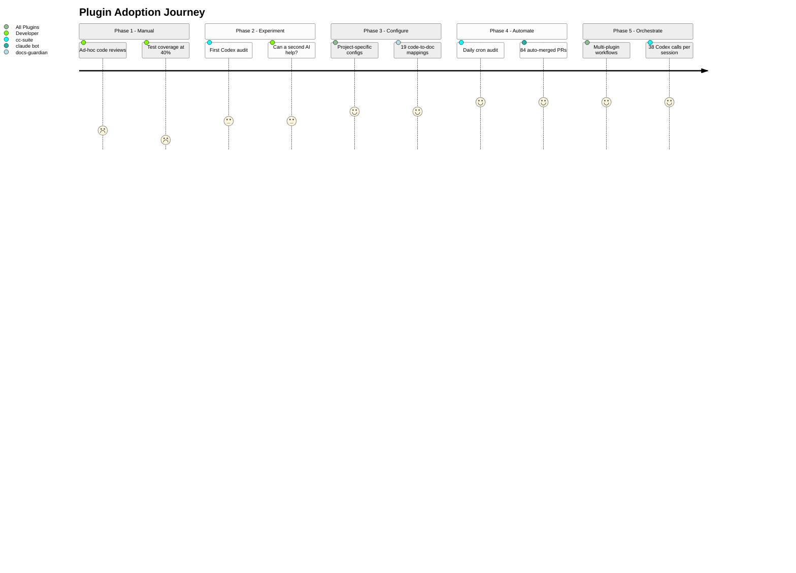

### Phase 1 : Audit manuel (janvier 2026)
> « Inspecte toute la codebase, trouve les bugs possibles, les lacunes »

Revues ad hoc. Aucun outil. Couverture de tests à 40 %.

### Phase 2 : Expérimentations avec un seul plugin (fin janvier -- début février)
> « Demande à Codex de revoir la qualité du code »

Première utilisation de cc-suite pour le serveur MCP. Expérimental. Une deuxième AI peut-elle attraper ce que la première a manqué ? Première installation : [`e6373c7a`](https://github.com/xiaolai/vmark/commit/e6373c7a).

### Phase 3 : Infrastructure configurée (début mars)
Plugins installés avec des configurations spécifiques au projet. tdd-guardian activé avec des seuils stricts ([`f775f300`](https://github.com/xiaolai/vmark/commit/f775f300)). docs-guardian a 19 mappages code-vers-documentation. loc-guardian a des limites de 300 lignes avec des règles d'extraction.

### Phase 4 : Pipelines automatisés (mi-mars)
Audit cron quotidien à 9h UTC. Issues auto-créées, auto-corrigées, auto-PRées, auto-mergées. 84 PRs sans intervention humaine.

### Phase 5 : Orchestration multi-plugins (fin mars)
Sessions uniques combinant scan loc-guardian -> audit de performance -> implémentation par sous-agent -> audit cc-suite -> vérification cc-suite -> version bump. 38 appels Codex en une session. Les plugins se composent en workflows.

## La boucle de rétroaction

Le pattern le plus intéressant n'est pas un plugin individuel. C'est la boucle :

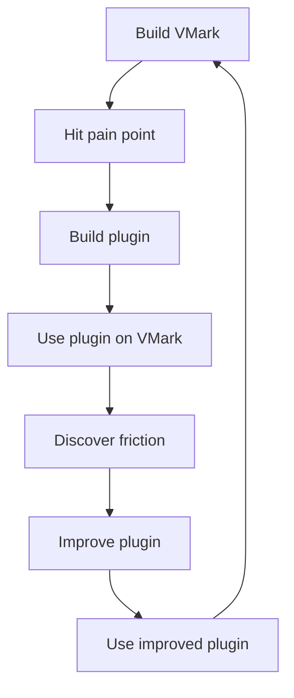

Chaque plugin est né de la construction de VMark :

- **cc-suite** existe parce qu'une seule AI qui revoit son propre travail ne suffit pas
- **tdd-guardian** existe parce que la couverture ne cessait de baisser entre les sessions
- **docs-guardian** existe parce que la documentation dérive toujours par rapport au code
- **loc-guardian** existe parce que les fichiers dépassent toujours les tailles maintenables
- **echo-sleuth** existe parce que les sessions sont éphémères mais les décisions ne le sont pas
- **grill** existe parce que les problèmes d'architecture nécessitent une revue adversariale
- **nlpm** existe parce que les prompts et les skills sont aussi du code

Et chaque plugin a été amélioré en construisant VMark :

- Les hooks bloquants de tdd-guardian se sont révélés trop agressifs — menant à une proposition de mise en application optionnelle
- La correspondance de patterns de fichiers de nlpm s'est révélée trop large — bloquant pendant des corrections de bugs sans rapport
- Le nommage de cc-suite a été corrigé après la découverte d'une référence fantôme en pleine session
- Le vérificateur de précision de docs-guardian a prouvé sa valeur en trouvant le bug `com.vmark.app` qu'aucun autre outil n'aurait pu attraper

## Le système de qualité en couches

Ensemble, les sept plugins forment un système d'assurance qualité en couches :

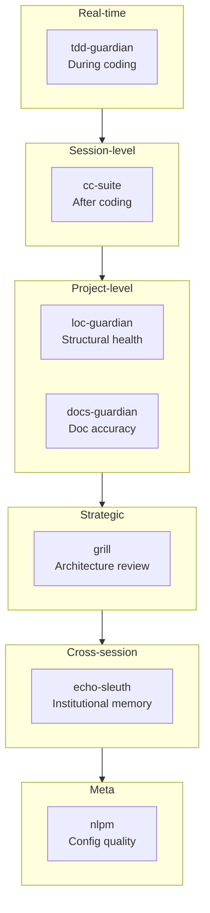

| Couche | Plugin | Quand il agit | Ce qu'il trouve |
|-------|--------|-------------|-----------------|
| Discipline temps réel | tdd-guardian | Pendant le codage | Tests sautés, régression de couverture |
| Revue de session | cc-suite | Après le codage | Bugs, sécurité, accessibilité |
| Santé structurelle | loc-guardian | À la demande | Croissance des fichiers, complexité rampante |
| Synchronisation documentation | docs-guardian | À la demande | Documentation obsolète, manquante, erronée |
| Évaluation stratégique | grill | Périodiquement | Lacunes d'architecture, de tests, dette qualité |
| Mémoire institutionnelle | echo-sleuth | Inter-sessions | Décisions perdues, contexte oublié |
| Qualité de configuration | nlpm | À l'édition | Prompts faibles, skills médiocres, règles cassées |

Ce n'est pas de l'« outillage optionnel ». C'est la couche de gouvernance qui rend le développement récursif par AI digne de confiance — où l'AI écrit le code, l'AI audite le code, l'AI corrige les constats d'audit et l'AI vérifie les corrections.

## Pourquoi ils sont indispensables

« Indispensable » est un mot fort. Voici le test : à quoi ressemblerait VMark sans eux ?

**Sans cc-suite** : 292 issues de bugs, vulnérabilités de sécurité et lacunes d'accessibilité se seraient accumulées. Le pipeline automatisé qui attrape les problèmes dans les 24 heures suivant leur introduction n'existerait pas. Le développeur s'en serait remis à des revues manuelles périodiques — qui, d'après les sessions de janvier, avaient lieu de manière ad hoc au mieux.

**Sans tdd-guardian** : La campagne de couverture en 26 phases n'aurait peut-être jamais eu lieu. La discipline de resserrer les seuils à la hausse — où la couverture ne peut que monter, jamais descendre — est venue de l'état d'esprit que tdd-guardian a instillé. 99,96 % de couverture n'arrive pas par hasard.

**Sans docs-guardian** : Les utilisateurs chercheraient encore leurs genies dans un répertoire qui n'existe pas. 17 fonctionnalités resteraient introuvables. La précision de la documentation serait une question d'espoir, pas de mesure.

**Sans loc-guardian** : Les fichiers s'étendraient au-delà de 500, 800, 1 000 lignes. La « règle des 300 lignes » qui maintient la codebase navigable serait une suggestion plutôt qu'une contrainte appliquée.

**Sans echo-sleuth** : Chaque session repartirait de zéro. « Qu'avons-nous décidé au sujet du conflit de raccourci menu ? » nécessiterait de fouiller manuellement dans les journaux de conversation.

**Sans grill** : La lacune de tests Rust (27 %), les lacunes d'accessibilité WCAG, les 104 fichiers surdimensionnés — ces investissements stratégiques en qualité ont été impulsés par l'analyse adversariale de grill, pas par des rapports de bugs.

Les plugins ne sont pas indispensables parce qu'ils sont astucieux. Ils sont indispensables parce qu'ils codifient une discipline que les humains (et les AIs) oublient entre les sessions. La couverture ne fait que monter. La documentation correspond au code. Les fichiers restent petits. Les audits ont lieu avant chaque release. Ce ne sont pas des aspirations — c'est appliqué par des outils qui tournent chaque jour.

## Les règles et skills : le savoir codifié

Les plugins ne sont que la moitié de l'histoire. L'autre moitié est l'infrastructure de connaissances qui s'est accumulée en parallèle.

### 13 règles (1 950 lignes de savoir institutionnel)

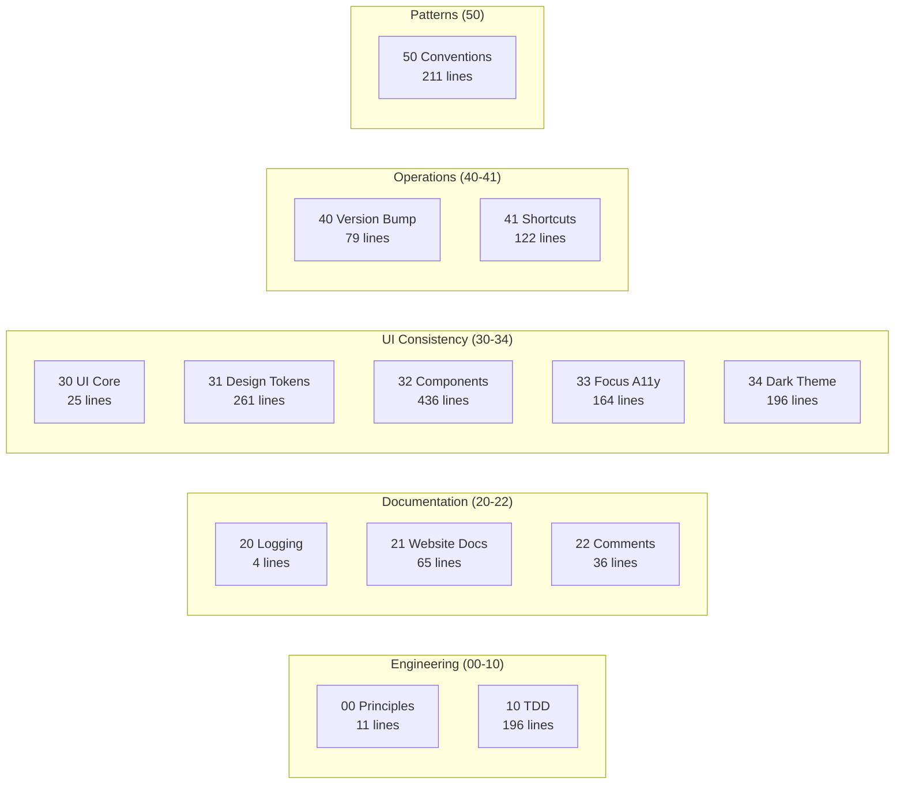

Le répertoire `.claude/rules/` de VMark contient 13 fichiers de règles — pas des directives vagues, mais des conventions spécifiques et applicables :

| Fichier de règle | Lignes | Ce qu'il codifie |
|-----------|-------|----------------|
| `00-engineering-principles.md` | 11 | Conventions fondamentales (pas de destructuration Zustand, limite 300 lignes) |
| `10-tdd.md` | 196 | 5 modèles de tests, catalogue d'anti-patterns, gates de couverture |
| `20-logging-and-docs.md` | 4 | Une seule source de vérité par sujet |
| `21-website-docs.md` | 65 | Table de mappage code-vers-documentation (quels changements de code nécessitent quelles mises à jour de docs) |
| `22-comment-maintenance.md` | 36 | Quand mettre à jour ou non les commentaires, prévention de l'obsolescence |
| `30-ui-consistency.md` | 25 | Principes UI fondamentaux, références croisées vers les sous-règles |
| `31-design-tokens.md` | 261 | Référence complète des tokens CSS — chaque couleur, espacement, rayon, ombre |
| `32-component-patterns.md` | 436 | Patterns de popup, toolbar, menu contextuel, table, scrollbar avec code |
| `33-focus-indicators.md` | 164 | 6 patterns de focus par type de composant (conformité WCAG) |
| `34-dark-theme.md` | 196 | Détection de thème, patterns d'override, checklist de migration |
| `40-version-bump.md` | 79 | Procédure de synchronisation de version sur 5 fichiers avec script de vérification |
| `41-keyboard-shortcuts.md` | 122 | Synchronisation 3 fichiers (Rust/Frontend/Docs), vérification de conflits, conventions |
| `50-codebase-conventions.md` | 211 | 10 patterns non documentés découverts pendant le développement |

Ces règles sont lues par Claude Code au début de chaque session. C'est la raison pour laquelle le 2 180e commit suit les mêmes conventions que le 100e.

La règle `50-codebase-conventions.md` est particulièrement notable — elle documente des patterns que *personne n'a conçus*. Ils sont apparus organiquement pendant le développement puis ont été codifiés : conventions de nommage des stores, patterns de nettoyage des hooks, structure des plugins, signatures des handlers de pont MCP, organisation CSS, idiomes de gestion d'erreurs.

### 19 skills de projet (expertise du domaine)

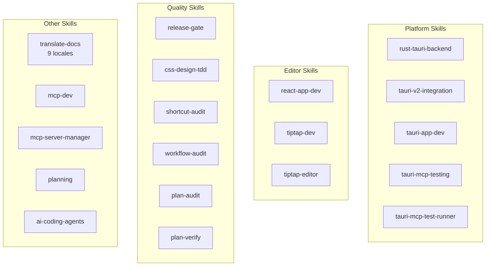

| Catégorie | Skills | Ce qu'ils permettent |
|----------|--------|-----------------|
| **Tauri/Rust** | `rust-tauri-backend`, `tauri-v2-integration`, `tauri-app-dev`, `tauri-mcp-testing`, `tauri-mcp-test-runner` | Développement Rust spécifique à la plateforme avec les conventions Tauri v2 |
| **React/Éditeur** | `react-app-dev`, `tiptap-dev`, `tiptap-editor` | Patterns éditeur Tiptap/ProseMirror, règles de sélecteurs Zustand |
| **Qualité** | `release-gate`, `css-design-tdd`, `shortcut-audit`, `workflow-audit`, `plan-audit`, `plan-verify` | Vérification automatisée de la qualité à chaque niveau |
| **Documentation** | `translate-docs` | Traduction en 9 locales avec audit piloté par sous-agents |
| **MCP** | `mcp-dev`, `mcp-server-manager` | Développement et configuration de serveurs MCP |
| **Planification** | `planning` | Génération de plans d'implémentation avec documentation des décisions |
| **Outillage AI** | `ai-coding-agents` | Orchestration multi-agents (Codex CLI, Claude Code, Gemini CLI) |

### 7 commandes slash (automatisation de workflow)

| Commande | Fonction |
|---------|-------------|
| `/bump` | Montée de version sur 5 fichiers, commit, tag, push |
| `/fix-issue` | Résolution bout-en-bout d'issues GitHub — récupérer, classifier, corriger, auditer, PR |
| `/merge-prs` | Revue et merge séquentiel des PRs ouvertes avec gestion du rebase |
| `/fix` | Corriger les problèmes correctement — pas de patches, pas de raccourcis, pas de régressions |
| `/repo-clean-up` | Supprimer les exécutions CI échouées et les branches distantes obsolètes |
| `/feature-workflow` | Workflow de développement de fonctionnalités piloté par agents, de bout en bout |
| `/test-guide` | Générer un guide de tests manuels |

### L'effet composé

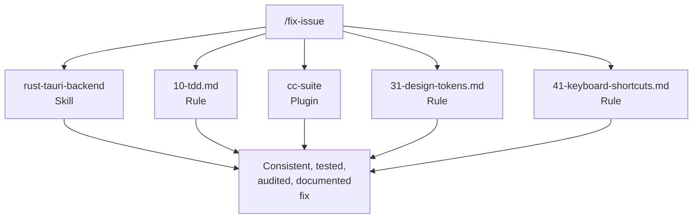

Règles + skills + plugins + commandes forment un système composé. Quand on exécute `/fix-issue`, il utilise le skill `rust-tauri-backend` pour les changements Rust, suit la règle `10-tdd.md` pour les exigences de tests, invoque `cc-suite` pour l'audit, vérifie `31-design-tokens.md` pour la conformité CSS, et valide contre `41-keyboard-shortcuts.md` pour la synchronisation des raccourcis.

Aucune pièce individuelle n'est révolutionnaire. L'effet composé — 13 règles x 19 skills x 7 plugins x 7 commandes, tous se renforçant mutuellement — c'est ce qui fait fonctionner le système. Chaque pièce a été ajoutée quand une lacune a été découverte, testée en développement réel, et affinée par l'usage.

## Pour les créateurs de plugins

Si vous envisagez de créer des plugins Claude Code, voici ce que VMark nous a appris :

1. **Construisez d'abord pour vous-même.** Les meilleurs plugins résolvent vos vrais problèmes, pas des problèmes hypothétiques.

2. **Mangez votre propre cuisine sans relâche.** Utilisez vos plugins sur vos vrais projets. Les frictions que vous découvrez sont celles que vos utilisateurs découvriront.

3. **Les hooks ont besoin de portes de sortie.** Les hooks bloquants qui ne peuvent pas être contournés seront entièrement désactivés. Rendez la mise en application optionnelle ou contextuelle.

4. **La vérification cross-modèle fonctionne.** Faire réviser le travail de votre AI principale par une AI différente attrape de vrais bugs. Ce n'est pas redondant — c'est orthogonal.

5. **Codifiez la discipline, pas les règles.** Les meilleurs plugins changent les habitudes. Les hooks bloquants de tdd-guardian ont été retirés, mais la campagne de couverture qu'ils ont inspirée a été l'investissement qualité le plus impactant du projet.

6. **Composez, ne faites pas un monolithe.** Sept plugins ciblés battent un méga-plugin. Chacun fait bien une chose, et ils se composent en workflows plus grands que la somme de leurs parties.

7. **La confiance se gagne à chaque invocation.** Le développeur fait suffisamment confiance à cc-suite pour dire « tout corriger » sans examiner les constats. Cette confiance s'est construite sur 27 sessions et 292 issues résolues.

---

*VMark est open source sur [github.com/xiaolai/vmark](https://github.com/xiaolai/vmark). Les sept plugins sont tous disponibles sur le marketplace Claude Code `xiaolai`.*
