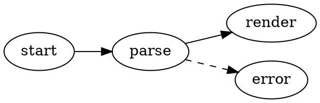
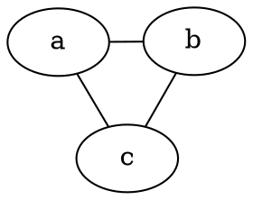

# Graphviz Diagrams

VMark renders [Graphviz](https://graphviz.org/) DOT graphs directly in your Markdown documents. Diagrams are rendered locally with the Graphviz WASM build ([@viz-js/viz](https://github.com/mdaines/viz-js)) — no network access, no external binaries.

[[toc]]

## Inserting a Diagram

Use **Insert → Graphviz Diagram** from the menu bar (or the toolbar's Insert group) to insert a template diagram — the shortcut is unbound by default and can be customized in Settings. Or type a fenced code block with the `dot` or `graphviz` language identifier:

````markdown

````

Both fence languages behave identically:

| Fence | Renders as |
|-------|------------|
| ` ```dot ` | Graphviz diagram |
| ` ```graphviz ` | Graphviz diagram |

## Editing Modes

- **WYSIWYG mode** — the code block renders as a diagram. Double-click it to edit the DOT source with a debounced live preview; save or cancel from the edit header.
- **Source mode** — place the cursor inside a ` ```dot ` fence to get the floating diagram preview (drag, resize, zoom), same as Mermaid.

## Pan, Zoom, and Export

Rendered diagrams support the same controls as Mermaid diagrams:

- **Cmd/Ctrl + scroll** to zoom, drag to pan, reset button to recenter
- **Export as PNG** (light or dark background) via the export button

## Engine and Layout

Diagrams are laid out with the `dot` engine (hierarchical/layered layout) by default. To use a different engine, set the standard Graphviz `layout` attribute in your graph — the choice travels with the document and works in every other Graphviz tool:

````markdown

````

| Engine | Layout style |
|--------|--------------|
| `dot` | Hierarchical / layered (default) |
| `neato` | Spring model (force-directed) |
| `fdp` | Force-directed, larger graphs |
| `sfdp` | Multiscale force-directed, very large graphs |
| `circo` | Circular |
| `twopi` | Radial |
| `osage` | Clustered |
| `patchwork` | Treemap (squarified) |

An unknown `layout` value shows the render-error state, like any other DOT error.

All standard DOT features supported by Graphviz work: subgraphs and clusters, ranks, node shapes, edge styles, HTML-like labels, and explicit colors.

## Theming

- The diagram background is transparent, so it follows the editor theme.
- Default node, edge, and text colors are derived from the active theme's design tokens, so diagrams look native in every theme (White, Paper, Mint, Sepia, Night, Solarized) and update when you switch themes.
- Explicit colors in your DOT source always win over the theme defaults — a graph that sets its own `bgcolor`, `color`, or `fontcolor` renders exactly as written.

## Error Handling

If the DOT source has a syntax error, the block shows a render-error state instead of a diagram. Fix the source and the preview re-renders automatically.

## HTML and PDF Export

Exported HTML and PDF documents embed the rendered SVG, so diagrams look the same outside VMark.
