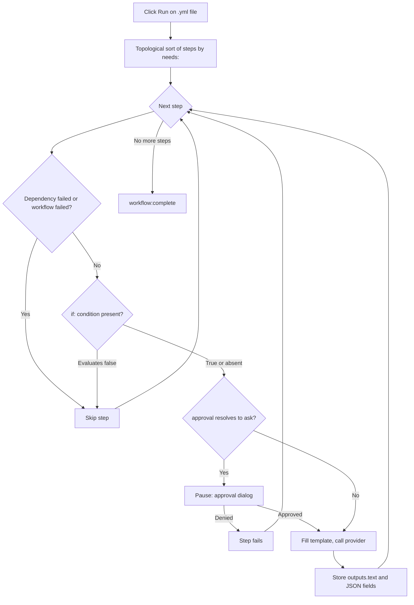

<script setup>
// Skip Vue template processing for the whole page so ${{ }} expressions
// in code spans and fenced YAML blocks are not interpreted as Vue bindings.
</script>

<div v-pre>

# Genie Workflows

A **genie workflow** is a YAML file that chains several AI steps into one pipeline. Where a single [AI Genie](/guide/ai-genies) runs one prompt against your text, a workflow runs an ordered graph of steps — each step can call a genie, pass its output to the next step, ask for your approval, or run a small built-in action — and shows you the whole pipeline as a live diagram while it runs.

::: tip Feature flag
Genie workflows are gated behind an opt-in setting. Turn on **Settings → Advanced → Workflow Engine** to make `.yml` / `.yaml` files open as workflows with a Run / Cancel side panel. With the flag off, YAML files open as plain text.
:::

## When to use a workflow

| Need | Use |
|------|-----|
| A single transformation (rewrite, translate, summarize) | A markdown [genie](/guide/ai-genies) |
| Outline → draft → polish, with each stage feeding the next | A workflow |
| Different AI models for different stages | A workflow |
| A human-approval gate before an expensive or sensitive step | A workflow |
| Structured (JSON) output that downstream steps read field-by-field | A workflow |

If one prompt does the job, write a markdown genie. Reach for a workflow only when you need to compose stages, route data between them, or pause for approval.

## Writing a workflow

A workflow is a YAML file with a name, optional defaults, and an ordered list of steps. Here is a complete, runnable example — it mirrors the `outline-and-polish.yml` sample that ships with VMark:

```yaml
name: Outline and Polish
description: Generate an outline, then polish the output for clarity.

defaults:
  approval: auto

steps:
  - id: outline
    uses: genie/outline
    with:
      input: "Replace this seed with your topic before running."

  - id: polish
    uses: genie/polish
    needs: outline
    with:
      input: ${{ steps.outline.outputs.text }}
```

This workflow has two steps. `outline` calls the bundled `genie/outline` markdown genie on the seed text. `polish` waits for `outline` to finish (`needs: outline`), then feeds `outline`'s text output into `genie/polish`. The result is a two-node graph that runs left to right.

### Top-level fields

| Field | Required | Purpose |
|-------|----------|---------|
| `name` | Yes | Human-readable label for the workflow. |
| `description` | No | One-line summary. |
| `defaults` | No | Default `model`, `approval`, and `limits` applied to every step (see [Per-step settings](#per-step-settings)). |
| `env` | No | Environment variables, readable in `with:` values as `${{ env.NAME }}` or `${VAR}`. |
| `steps` | Yes | The ordered list of steps. |

### Step fields

```yaml
- id: my-step           # required; unique within the workflow
  uses: genie/<name>    # required; what this step runs (see Step types)
  with:                 # inputs to the step
    input: "text or an ${{ ... }} expression"
  needs: prior-step     # optional; a single id or a list of ids
  if: ${{ success() }}  # optional condition (see Conditions)
  approval: ask         # optional; "auto" (default) or "ask"
  model: claude-sonnet  # optional; overrides defaults / genie default
  limits:
    timeout: 120s       # optional; default 300s
    max_tokens: 4096    # optional; REST providers only
```

### Step types

The `uses:` prefix decides what a step does.

| `uses:` prefix | Behavior |
|----------------|----------|
| `genie/<name>` | Loads the matching markdown genie, fills its prompt template from the step's `with:` map, and calls the active AI provider. |
| `action/read-file` | Reads a workspace-relative path. The file body becomes the step's text output. |
| `action/save-file` | Writes `with.input` to `with.path` (workspace-relative). |
| `action/notify` | Logs `with.message`. |
| `action/copy` | Returns `with.input` unchanged — handy for renaming or fanning out a value. |

::: warning
`webhook/*` steps are not supported yet — a workflow that uses one is rejected before it runs. File-output genies (`output.type: file` / `files`) are likewise deferred.
:::

## Genie steps and `with:` aliasing

When a `genie/<name>` step runs, VMark loads that genie's markdown template and fills its `{{...}}` placeholders from the step's `with:` map. This is the bridge that lets **existing markdown genies run unchanged inside workflows**.

The binding rules, in precedence order:

| Placeholder | Resolves to | If missing |
|-------------|-------------|-----------|
| `{{input}}` | `with.input` | Unbound → step fails |
| `{{content}}` | `with.content`, else `with.input` | Fatal only if neither is present |
| `{{context}}` | `with.context`, else empty string | Never fatal — degrades to `""` |
| `{{any-other-key}}` | `with.<key>` | Unbound → step fails |

Whitespace inside braces is tolerated: `{{ key }}` works the same as `{{key}}`.

**The `{{content}}` alias is the key to compatibility.** Markdown genies written for the editor use `{{content}}` for the selected text. In a workflow there is no selection, so you supply `with: { input: "..." }` and the `{{content}}` placeholder picks it up through the alias chain. That is exactly what the sample above relies on — `genie/outline` and `genie/polish` both use `{{content}}` in their templates, yet the workflow only ever sets `input`.

::: danger Unbound placeholders are fatal
If a template contains a placeholder that nothing in `with:` resolves — for example `{{topic}}` with no `with.topic` — the step fails **before any AI call is made**, with an error listing every unresolved name (`Unbound placeholders: {{topic}}`). This is deliberate: shipping a prompt that still contains literal `{{topic}}` would silently produce garbage and falsely report success. The only safe relaxations are the two aliases above (`{{content}}` and `{{context}}`).
:::

### `{{context}}` in workflows

In the editor, `{{context}}` is filled with the text surrounding your selection. A workflow has no editor, so `{{context}}` degrades to the empty string unless you supply `with.context` explicitly. Genies that genuinely depend on surrounding context must pass it in:

```yaml
- id: rewrite
  uses: genie/fit-to-surroundings
  with:
    input: ${{ steps.draft.outputs.text }}
    context: "House style: terse, present tense, no marketing language."
```

## Wiring steps together: expressions

Inside any `with:` value, you can reference earlier steps and environment variables.

| Syntax | Resolves to |
|--------|-------------|
| `${{ steps.ID.outputs.FIELD }}` | A specific output field of a prior step. |
| `${{ steps.ID.output }}` | Shorthand for `${{ steps.ID.outputs.text }}`. |
| `${{ env.NAME }}` | A workflow `env:` value. |
| `${VAR}` | The same as `${{ env.VAR }}`, legacy form. |
| `stepId.output` (whole value only) | Legacy alias for `${{ steps.stepId.outputs.text }}`. |

References are resolved before any AI call. A reference to an unknown step (`${{ steps.typo.outputs.text }}`) or to a field a step never produced (`${{ steps.outline.outputs.missing }}`) fails the step with a clear message — it never silently passes an empty value. The one exception: a step that legitimately produced an empty response resolves to the empty string, not an error.

## Structured outputs

By default, a genie step stores its result under `outputs.text`, and `${{ steps.ID.output }}` reads it. A genie can also declare a structured (JSON) output in its frontmatter:

```yaml
output:
  type: json
  schema:
    title: string
    tags: array
```

When such a genie runs in a workflow, VMark parses the response as JSON, checks that each declared field is present with the right primitive type, and exposes every top-level field individually:

```yaml
- id: classify
  uses: genie/extract-metadata
  with:
    input: ${{ steps.read.output }}

- id: save
  uses: action/save-file
  needs: classify
  with:
    path: "meta.txt"
    input: ${{ steps.classify.outputs.title }}
```

Schema validation is intentionally minimal — it confirms that required keys exist and that their types match. It does not enforce lengths, patterns, or nested shapes. If the response is not valid JSON, or a required field is missing, the step fails with a specific error. Only `text` and `json` output types are supported today; `file`, `files`, and `pipe` are not.

## Conditions

A step may carry an `if:` condition. If it evaluates to false, the step is skipped (not failed); if it evaluates to true or is absent, the step runs. Three status functions are available:

| Condition | Meaning |
|-----------|---------|
| `success()` | True when no prior step has failed. |
| `failure()` | True when a prior step has failed. |
| `always()` | Always true. |

You can combine references and comparisons, e.g. `${{ steps.classify.outputs.title == "Draft" }}`. A malformed or unsupported condition **fails the step loudly** rather than silently passing — there is no "assume true on error" fallback.

::: warning Current limitation: failure() and always() do not yet fire
The runner skips every remaining step as soon as any step fails — that skip happens **before** the `if:` condition is evaluated. As a result, `success()` works as written, but `failure()` and `always()` conditions are currently latent: a step guarded by them is skipped along with everything else once a failure occurs, so it never gets the chance to run on the failure path. Treat `failure()` / `always()` as reserved syntax for now. Use `success()` (or no condition) for steps you expect to run on the happy path.
:::

## Per-step settings

`model`, `approval`, and `limits` can be set at three levels. The most specific wins.

| Field | Precedence (highest first) |
|-------|----------------------------|
| `model` | step `model:` → genie's own `model` → workflow `defaults.model` → provider default |
| `approval` | step `approval:` → genie's `approval` → workflow `defaults.approval` → `auto` |
| `timeout` | step `limits.timeout` → workflow `defaults.limits.timeout` → 300 s |
| `max_tokens` | step `limits.max_tokens` → `defaults.limits.max_tokens` → provider default (**REST providers only**) |

`max_tokens` is enforced only for REST providers (Anthropic, OpenAI, Google AI, Ollama). CLI providers (claude, codex, gemini) accept the field but do not enforce it; a single warning is logged per run if any CLI step sets it.

### Timeouts

Each step is wrapped in its effective timeout. On expiry the step fails with `Timed out after Xs`: a CLI provider's child process is killed; an in-flight REST request is dropped. Downstream steps that depend on a timed-out step are skipped. There is also a hard 5 MB cap on a single step's collected output — a runaway provider is cancelled with `Provider output exceeded 5 MB cap`.

## Approvals

Set `approval: ask` on a step (or `defaults.approval: ask` for the whole workflow) to pause before that step calls the provider. The runner emits an approval request and a dialog appears showing:

- The step id.
- The resolved model.
- A preview of the filled prompt (first 500 characters).

Choose **Approve** to run the step, or **Deny** (Esc also denies) to fail it with `Approval denied by user`. The approval waits for the shorter of the step's timeout and a 10-minute ceiling; if it expires, the step fails with `Approval timed out`. Closing the window or otherwise dropping the dialog is treated as a denial.

## Running a workflow

Open a `.yml` / `.yaml` workflow file in a workspace (workflows require an open workspace — action steps validate paths against the workspace root). The workflow side panel opens alongside the editor and renders the steps as an interactive graph.

| Control | Icon | Action |
|---------|------|--------|
| Run | ▶ | Starts the workflow. Disabled while a parse error is present, while a run is in progress, or with no workspace open. |
| Cancel | ◼ | Replaces Run while a workflow is executing. Stops the run, kills any in-flight CLI child, and drops in-flight REST requests. |

As the run proceeds, each node updates live — running, succeeded, skipped, or errored — so you can watch the pipeline advance and see exactly which step failed if one does. Only one workflow runs per window at a time.

### Execution flow



## Sharing the diagram

The same React Flow canvas that renders genie workflows also backs the [GitHub Actions Workflow Viewer](/guide/workflow-viewer), which provides an export control on the canvas with three options:

| Export | Result |
|--------|--------|
| Copy as Mermaid | Copies a Mermaid `flowchart` of the graph to the clipboard (a lossy text approximation). |
| Export as SVG | Saves the rendered canvas as a vector SVG. |
| Export as PNG | Saves the rendered canvas as a raster PNG. |

Mermaid and SVG are noted as lossy approximations of the live canvas; PNG is a pixel snapshot.

## See also

- [AI Genies](/guide/ai-genies) — the markdown genie format and how to author one.
- [AI Providers](/guide/ai-providers) — configuring the CLI or REST provider that workflow steps call.
- [GitHub Actions Workflow Viewer](/guide/workflow-viewer) — the shared canvas and its export control.

</div>
