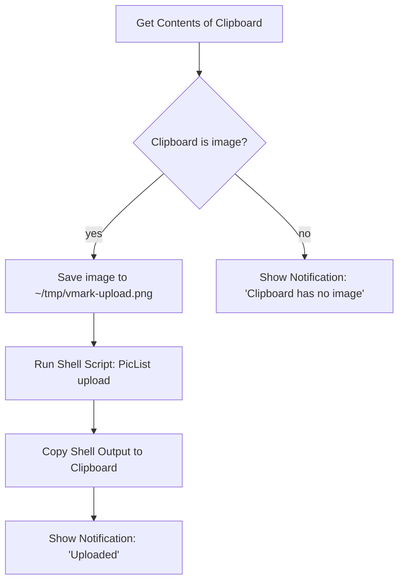

# Immagini ospitate nel cloud

VMark è uno strumento di scrittura local-first. Non include un uploader integrato per le immagini incollate dagli appunti e non memorizza credenziali cloud. Se hai bisogno che il tuo Markdown contenga URL pubblici di CDN (per la pubblicazione su blog, la sincronizzazione tra dispositivi, la pubblicazione su un CMS), il flusso di lavoro è un'automazione a livello di sistema operativo che viene eseguita *al di fuori* di VMark e restituisce il risultato al suo interno.

Questa pagina spiega perché VMark funziona così, cosa già funziona senza alcuna configurazione aggiuntiva, e come predisporre la ricetta basata su Shortcuts.app in circa dieci minuti.

[[toc]]

## Cosa supporta già VMark

VMark distingue due direzioni nella gestione dei riferimenti a immagini in Markdown:

| Direzione | Stato | Trigger | Output in Markdown |
|-----------|-------|---------|--------------------|
| Inserire un URL remoto esistente | Supportato | Incollare o digitare un URL `https://…` | L'URL, invariato |
| Sorgente Markdown con URL remoto | Supportato | Chiunque scriva `` | Reso direttamente |
| Inserire un'immagine locale | Supportato | Incollare, trascinare o inserire un binario | Copiata in `.assets/`, scritto un percorso relativo |
| Inserire un'immagine locale *ma archiviarla in remoto* | **Non integrato** | (Vedi ricetta sotto) | — |

In breve: se l'immagine vive già a un URL, incolla l'URL. VMark lo inserisce come riferimento immagine Markdown e la webview lo recupera. Il percorso di lettura è già compatibile con il cloud.

## Perché VMark non include il caricamento cloud nativo

La funzionalità proposta significherebbe che VMark rileva un'immagine locale al momento dell'incollaggio, la carica su uno storage remoto e scrive l'URL restituito nel Markdown al posto di un percorso `./.assets/…`. Suona piccolo ma estende l'ambito di VMark in tre modi portanti:

1. **Caveau delle credenziali**. Il caricamento nativo S3-compatible richiede la memorizzazione a riposo della access key e della secret access key dell'utente. VMark oggi non ha alcun segreto persistente — nessuna decisione sulla cifratura a riposo, nessuna integrazione con il portachiavi del sistema operativo, nessuna UX per la rotazione delle chiavi, nessun rischio di chiave finita per errore nel Markdown. Aggiungere il caricamento sposterebbe VMark oltre quel confine.

2. **Coda di supporto multi-provider**. S3, Cloudflare R2, Backblaze B2, MinIO, DigitalOcean Spaces pubblicizzano tutti la compatibilità S3-compatible ma ognuno ha le sue peculiarità (path-style vs virtual-hosted addressing, semantica ACL, endpoint regionali, regole CORS). Un singolo manutentore che assorbe quella superficie è una tassa a lungo termine su uno strumento di scrittura.

3. **Composizione vs. proprietà**. Strumenti come [PicList](https://github.com/Kuingsmile/PicList) e [PicGo](https://github.com/Molunerfinn/PicGo) risolvono già questo problema, inclusa la configurazione specifica per provider e la memorizzazione delle credenziali. Shortcuts.app di macOS e Keyboard Maestro possono collegare quegli strumenti a qualsiasi campo di testo del sistema — non solo a VMark. Integrare il caricamento cloud in VMark duplicherebbe codice che vive meglio al di fuori, e funzionerebbe solo in VMark.

La decisione è quindi: **VMark resta uno strumento di scrittura; il caricamento delle immagini vive nella cassetta degli attrezzi di automazione a livello di sistema operativo dell'utente**. La ricetta qui sotto rende concreto il percorso a livello di sistema operativo.

## Ricetta: Shortcuts.app + PicList (macOS, gratuito)

Shortcuts.app è incluso in macOS Monterey (12) e versioni successive. PicList è un uploader di immagini open-source gratuito. Insieme ti offrono una scorciatoia da tastiera che prende qualsiasi immagine attualmente negli appunti, la carica tramite PicList (che già sa come comunicare con R2, S3, Imgur e decine di altri backend) e sostituisce gli appunti con l'URL restituito. Dopo di ciò, `Cmd + V` in VMark inserisce l'URL — il rilevamento di URL remoti già presente in VMark si occupa del resto.

### Prerequisiti

1. **PicList installato e configurato.** Scarica dalla [pagina dei rilasci di PicList](https://github.com/Kuingsmile/PicList/releases), aprilo una volta e configura almeno un host di immagini (R2, S3, Imgur, smms, ecc.) in *PicBed Settings* di PicList. Verifica che un caricamento manuale funzioni all'interno di PicList prima di collegare la Shortcut — questo isola "PicList funziona" da "la mia Shortcut è collegata correttamente".

2. **PicList CLI disponibile.** PicList espone un sottocomando `upload` tramite il suo app bundle. Su macOS il binario si trova in `/Applications/PicList.app/Contents/MacOS/PicList`. Verifica con:

   ```sh
   /Applications/PicList.app/Contents/MacOS/PicList upload --help
   ```

   Il comando dovrebbe restituire l'help della CLI. In caso contrario, verifica che PicList sia installato in `/Applications` (non in `~/Applications` — in tal caso adatta il percorso).

### Costruire la Shortcut

Apri `Shortcuts.app` e crea una nuova scorciatoia. Aggiungi queste azioni in ordine:



Passaggi concreti nell'editor di Shortcuts:

1. **Azione: Get Contents of Clipboard.** Trascinala dalla barra laterale delle azioni. Nessuna configurazione.

2. **Azione: If.** Imposta la condizione: *Clipboard is Media › Image*. (Se il menu a discesa non mostra *Media*, usa *Contents › has any value* come controllo più lasco.)

3. **All'interno del ramo If — Azione: Save File.** Configura:
   - Servizio: *Files*
   - Destinazione: `~/tmp/` (crea la cartella una volta tramite Finder se non esiste).
   - Nome file: `vmark-upload.png` (un nome fisso mantiene il percorso prevedibile per il passaggio successivo).
   - Disattiva *Ask Where To Save* in modo che la scorciatoia venga eseguita senza intervento.

4. **Azione: Run Shell Script.** Configura:
   - Shell: `/bin/zsh` (predefinita su macOS).
   - Input: *Pass Input as `stdin`* — in realtà vogliamo `as arguments`. (Entrambi funzionano; lo script seguente ignora stdin e usa un percorso letterale.)
   - Corpo dello script:

     ```sh
     /Applications/PicList.app/Contents/MacOS/PicList upload "$HOME/tmp/vmark-upload.png" 2>/dev/null | tail -n 1
     ```

   Il `tail -n 1` è difensivo: PicList potrebbe stampare righe di log informative prima dell'URL. Verifica una volta la forma effettiva dell'output rispetto alla tua versione di PicList; se PicList restituisce solo l'URL, `tail` non ha effetti.

5. **Azione: Copy to Clipboard.** Imposta il suo input su *Shell Script Result*.

6. **Azione: Show Notification.** Titolo: `Uploaded`. Corpo: *Shell Script Result*. Questo conferma che l'URL è negli appunti e mostra cosa è stato caricato.

7. **(Opzionale) Ramo Else — Azione: Show Notification.** Titolo: `No image on clipboard`. Aiuta a fare debug quando la scorciatoia si attiva ma gli appunti non contenevano effettivamente un'immagine.

### Associare una scorciatoia da tastiera globale

Nell'editor di Shortcuts, fai clic sul pulsante info *(i)* della scorciatoia, poi su *Add Keyboard Shortcut*. Scegli qualcosa che non vada in conflitto con le scorciatoie di VMark — `Control + Option + Command + U` è una scelta comune (nessun conflitto su macOS, mnemonico "Upload").

### Come usarla

1. Scatta uno screenshot con `Cmd + Shift + Ctrl + 4` (salva negli appunti, non su disco) — oppure copia qualsiasi immagine da un'altra app.
2. Premi la scorciatoia di caricamento (`Ctrl + Opt + Cmd + U`).
3. Attendi ~1–3 secondi la notifica.
4. Incolla in VMark (`Cmd + V`). Il Markdown ottiene ``.

### Cosa può andare storto

| Sintomo | Causa probabile | Soluzione |
|---------|-----------------|-----------|
| La scorciatoia si attiva ma PicList non viene eseguito | Percorso errato al binario di PicList | Conferma che `/Applications/PicList.app/Contents/MacOS/PicList` esista; adatta se installato altrove |
| La notifica appare ma gli appunti contengono ancora l'immagine | Lo script di shell ha restituito vuoto | Esegui manualmente lo script di shell con un percorso file noto e funzionante per vedere l'output effettivo di PicList |
| L'URL è sbagliato / ha spazi finali | `tail -n 1` ha catturato una riga di log, non l'URL | Ispeziona l'output di PicList; adatta il parsing (`grep -oE 'https://[^[:space:]]+' \| tail -n 1` è un'alternativa più rigorosa) |
| `Cmd + V` in VMark inserisce testo semplice anziché un'immagine | L'URL non termina con un'estensione di immagine che PicList riconosce | Conferma che l'estensione del file sia preservata durante il caricamento (R2/S3 di solito la preservano; controlla il template della chiave del tuo bucket) |

## Alternativa: Keyboard Maestro

[Keyboard Maestro](https://www.keyboardmaestro.com/) è uno strumento di automazione macOS a pagamento con un soffitto più alto rispetto a Shortcuts.app. Il principale vantaggio pratico per questo flusso di lavoro: KM può intercettare `Cmd + V` direttamente quando gli appunti contengono un'immagine, così da caricare-e-incollare in un solo tasto invece di due (scorciatoia, poi `Cmd + V`).

La ricetta è strutturalmente identica alla versione con Shortcuts.app — ottenere l'immagine dagli appunti, salvarla su file, eseguire la CLI di PicList, sostituire gli appunti, opzionalmente simulare l'incollaggio. Il costruttore di macro *Trigger* di KM è più flessibile (trigger basato sul contenuto degli appunti, scope specifico per app) ma il passo di caricamento è lo stesso.

Se non sei già un utente di Keyboard Maestro, Shortcuts.app è la risposta più economica.

## Alternativa: script di elaborazione pre-pubblicazione

Per gli utenti con un blog auto-ospitato o una pipeline per siti statici, la risposta più pulita è spesso: mantenere il comportamento predefinito di VMark (percorsi relativi `.assets/`) ed eseguire al momento della build uno script che attraversa il Markdown, carica ogni immagine unica e riscrive il percorso. Questo scambia la latenza di caricamento per-immagine con un caricamento in batch al momento della pubblicazione e mantiene la superficie dell'editor pulita.

Uno schizzo minimale (Node.js, pseudocodice):

```js
// scan-and-upload.js
const fs = require("fs");
const { execSync } = require("child_process");

const md = fs.readFileSync(process.argv[2], "utf8");
const rewritten = md.replace(/!\[(.*?)\]\((\.\/\.assets\/[^)]+)\)/g, (_, alt, path) => {
  const url = execSync(
    `/Applications/PicList.app/Contents/MacOS/PicList upload "${path}"`,
  ).toString().trim();
  return ``;
});
fs.writeFileSync(process.argv[2].replace(/\.md$/, ".published.md"), rewritten);
```

Diversi generatori di siti statici (Hugo con [Page Bundles](https://gohugo.io/content-management/page-bundles/), Jekyll, Astro, Eleventy) gestiscono nativamente i percorsi relativi `.assets/` al momento della build — nessuno script necessario se pubblichi in quel modo.

## URL già ospitati

Per completezza: se un'immagine vive già a un URL pubblico, incolla l'URL in VMark e hai finito. Il rilevatore di percorsi immagine degli appunti la classifica come `type: "url"` e scrive l'URL direttamente. Nessun caricamento, nessuna copia in `.assets/`, nessuna impostazione da cambiare. Questo è il flusso di lavoro per immagini cloud più semplice che VMark supporta e non richiede strumenti aggiuntivi.

## Vedi anche

- [Impostazioni File e immagini](./settings.md) — ridimensionamento automatico, copia in assets, pulizia degli orfani
- [Privacy](./privacy.md) — cosa VMark memorizza localmente e cosa lascia la tua macchina
