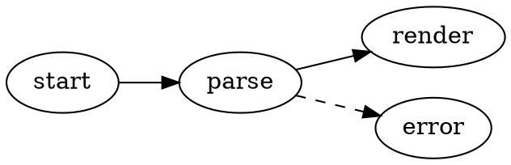
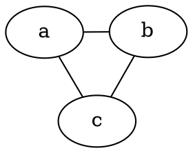

# Diagrammi Graphviz

VMark renderizza i grafi DOT di [Graphviz](https://graphviz.org/) direttamente nei tuoi documenti Markdown. I diagrammi vengono renderizzati localmente con la build WASM di Graphviz ([@viz-js/viz](https://github.com/mdaines/viz-js)) — nessun accesso alla rete, nessun binario esterno.

[[toc]]

## Inserimento di un Diagramma

Usa **Inserisci → Diagramma Graphviz** dalla barra dei menu (o dal gruppo Inserisci della barra degli strumenti) per inserire un diagramma template — la scorciatoia non è assegnata per impostazione predefinita e può essere personalizzata nelle Impostazioni. Oppure digita un blocco di codice delimitato con l'identificatore di linguaggio `dot` o `graphviz`:

````markdown

````

Entrambi gli identificatori di linguaggio si comportano in modo identico:

| Delimitatore | Renderizzato come |
|-------|------------|
| ` ```dot ` | Diagramma Graphviz |
| ` ```graphviz ` | Diagramma Graphviz |

## Modalità di Modifica

- **Modalità WYSIWYG** — il blocco di codice viene renderizzato come diagramma. Fai doppio clic per modificare il sorgente DOT con un'anteprima live con debounce; salva o annulla dall'intestazione di modifica.
- **Modalità Sorgente** — posiziona il cursore all'interno di un blocco ` ```dot ` per ottenere l'anteprima fluttuante del diagramma (trascina, ridimensiona, zoom), come per Mermaid.

## Pan, Zoom ed Esportazione

I diagrammi renderizzati supportano gli stessi controlli dei diagrammi Mermaid:

- **Cmd/Ctrl + scorrimento** per lo zoom, trascina per il pan, pulsante reset per ricentrare
- **Esporta come PNG** (sfondo chiaro o scuro) tramite il pulsante di esportazione

## Engine e Layout

I diagrammi vengono disposti con l'engine `dot` (layout gerarchico/a livelli) per impostazione predefinita. Per usare un engine diverso, imposta l'attributo standard `layout` di Graphviz nel tuo grafo — la scelta viaggia con il documento e funziona in qualsiasi altro strumento Graphviz:

````markdown

````

| Engine | Stile di layout |
|--------|--------------|
| `dot` | Gerarchico / a livelli (predefinito) |
| `neato` | Modello a molle (force-directed) |
| `fdp` | Force-directed, grafi più grandi |
| `sfdp` | Force-directed multiscala, grafi molto grandi |
| `circo` | Circolare |
| `twopi` | Radiale |
| `osage` | A cluster |
| `patchwork` | Treemap (squarified) |

Un valore `layout` sconosciuto mostra lo stato di errore di rendering, come qualsiasi altro errore DOT.

Tutte le funzionalità DOT standard supportate da Graphviz funzionano: sottografi e cluster, rank, forme dei nodi, stili degli archi, etichette in stile HTML e colori espliciti.

## Integrazione del Tema

- Lo sfondo del diagramma è trasparente, quindi segue il tema dell'editor.
- I colori predefiniti di nodi, archi e testo derivano dai design token del tema attivo, quindi i diagrammi appaiono nativi in ogni tema (White, Paper, Mint, Sepia, Night, Solarized) e si aggiornano quando cambi tema.
- I colori espliciti nel tuo sorgente DOT hanno sempre la precedenza sui valori predefiniti del tema — un grafo che imposta i propri `bgcolor`, `color` o `fontcolor` viene renderizzato esattamente come scritto.

## Gestione degli Errori

Se il sorgente DOT contiene un errore di sintassi, il blocco mostra uno stato di errore di rendering invece di un diagramma. Correggi il sorgente e l'anteprima viene ri-renderizzata automaticamente.

## Esportazione HTML e PDF

I documenti HTML e PDF esportati incorporano l'SVG renderizzato, quindi i diagrammi appaiono identici anche fuori da VMark.
