# Utenti come Sviluppatori

Come sette plugin di Claude Code sono diventati indispensabili, forgiati nel fuoco della costruzione di VMark.

## Il Contesto

VMark è un editor Markdown AI-friendly costruito con Tauri, React e Rust. In 10 settimane di sviluppo:

| Metrica | Valore |
|---------|--------|
| Commit | 2,180+ |
| Dimensione del codice | 305,391 righe di codice |
| Copertura dei test | 99.96% righe |
| Rapporto test:produzione | 1.97:1 |
| Issue di audit creati e risolti | 292 |
| PR automatizzate unite | 84 |
| Lingue della documentazione | 10 |
| Strumenti del server MCP | 12 |

Un solo sviluppatore lo ha costruito con Claude Code. Nel percorso, quello sviluppatore ha creato sette plugin per il marketplace di Claude Code — non come progetto secondario, ma come strumenti di sopravvivenza. Ogni plugin esiste perché un problema specifico richiedeva una soluzione che ancora non esisteva.

## I Plugin

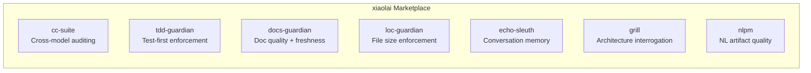

| Plugin | Cosa Fa | Nato Da |
|--------|---------|---------|
| [cc-suite](https://github.com/xiaolai/cc-suite) | Audit del codice cross-model tramite OpenAI Codex | "Ho bisogno di un secondo paio di occhi che non sia Claude" |
| [tdd-guardian](https://github.com/xiaolai/tdd-guardian-for-claude) | Imposizione del workflow test-first | "La copertura continua a calare quando dimentico i test" |
| [docs-guardian](https://github.com/xiaolai/docs-guardian-for-claude) | Audit della qualità e freschezza della documentazione | "La mia documentazione dice `com.vmark.app` ma l'identificatore reale è `app.vmark`" |
| [loc-guardian](https://github.com/xiaolai/loc-guardian-for-claude) | Controllo del numero di righe per file | "Questo file ha 800 righe e nessuno se n'è accorto" |
| [echo-sleuth](https://github.com/xiaolai/echo-sleuth-for-claude) | Mining della cronologia delle conversazioni e memoria | "Cosa avevamo deciso tre settimane fa?" |
| [grill](https://github.com/xiaolai/grill-for-claude) | Interrogazione profonda e multi-angolo del codice | "Ho bisogno di una revisione dell'architettura, non solo del lint" |
| [nlpm](https://github.com/xiaolai/nlpm-for-claude) | Qualità degli artefatti di programmazione in linguaggio naturale | "I miei prompt e skill sono davvero ben scritti?" |

## Prima e Dopo

La trasformazione è avvenuta in tre mesi.

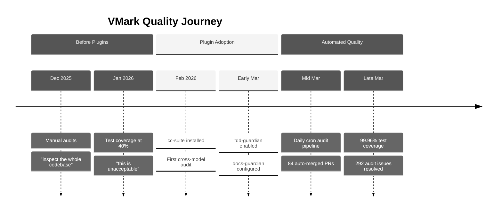

**Prima dei plugin** (dicembre 2025 -- febbraio 2026): Audit manuali del codice. Lo sviluppatore diceva cose come "ispeziona tutto il codice, individua possibili bug e lacune." La copertura dei test si aggirava intorno al 40% — descritta come "inaccettabile." La documentazione veniva scritta e dimenticata.

**Dopo i plugin** (marzo 2026): Ogni sessione di sviluppo caricava automaticamente 3--4 plugin. Una pipeline di audit automatizzata veniva eseguita quotidianamente, creando e risolvendo issue senza intervento umano. La copertura dei test ha raggiunto il 99.96% attraverso una campagna metodica di 26 fasi di innalzamento progressivo. L'accuratezza della documentazione veniva verificata rispetto al codice con precisione meccanica.

La cronologia git racconta la storia:

| Categoria | Commit |
|-----------|--------|
| Commit totali | 2,180+ |
| Risposta ad audit Codex | 47 |
| Test/copertura | 52 |
| Rafforzamento della sicurezza | 40 |
| Documentazione | 128 |
| Fasi della campagna di copertura | 26 |

## cc-suite: La Seconda Opinione

**Usato in**: 27 di 28 sessioni con plugin. Oltre 200 chiamate Codex in tutte le sessioni.

La cosa più importante di cc-suite è che *non è Claude che audita il lavoro di Claude*. Invia il codice al modello Codex di OpenAI per una revisione indipendente. Quando sei stato immerso in una funzionalità con un'IA, avere un modello completamente diverso che esamina il risultato individua cose che sia tu che la tua IA principale avete trascurato.

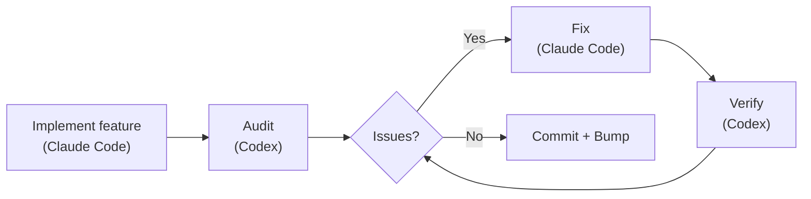

### Cosa Ha Effettivamente Trovato

292 issue di audit. Tutti e 292 risolti. Zero rimasti aperti.

Esempi reali dalla cronologia git:

- **Sicurezza**: 9 risultati in un singolo audit della migrazione dello storage sicuro ([`d1a880a6`](https://github.com/xiaolai/vmark/commit/d1a880a6)). Traversal di symlink nel resolver delle risorse ([`7dfa872d`](https://github.com/xiaolai/vmark/commit/7dfa872d)). Vulnerabilità ad alta severità in path-to-regexp ([`8c554cdc`](https://github.com/xiaolai/vmark/commit/8c554cdc)).

- **Accessibilità**: Ogni pulsante popup era privo di `aria-label`. I pulsanti con solo icona in FindBar, Sidebar, Terminal e StatusBar non avevano testo per screen reader ([`7acc0bf0`](https://github.com/xiaolai/vmark/commit/7acc0bf0)). Indicatore di focus mancante sul badge del lint ([`c4db90d4`](https://github.com/xiaolai/vmark/commit/c4db90d4)).

- **Bug di logica silenzioso**: Quando i range del multi-cursor si fondevano, l'indice del cursore principale tornava silenziosamente a 0. Gli utenti stavano modificando alla posizione 50, i range si fondevano, e improvvisamente il cursore saltava all'inizio del documento. Trovato dall'audit, non dai test.

- **Revisione delle specifiche i18n**: Codex ha esaminato le specifiche di design dell'internazionalizzazione e ha scoperto che "la migrazione dei menu-ID di macOS non è implementabile nel modo in cui le specifiche descrivono" ([`1208c98d`](https://github.com/xiaolai/vmark/commit/1208c98d)). Quattro problemi di qualità della traduzione individuati nei file di localizzazione ([`af98b5cd`](https://github.com/xiaolai/vmark/commit/af98b5cd)).

- **Audit multi-round**: Il plugin del lint ha attraversato tre round — 8 issue nel primo ([`7482c347`](https://github.com/xiaolai/vmark/commit/7482c347)), 6 nel secondo ([`8bfead81`](https://github.com/xiaolai/vmark/commit/8bfead81)), 7 nell'ultimo ([`84cf67f7`](https://github.com/xiaolai/vmark/commit/84cf67f7)). In ogni round, Codex ha trovato problemi introdotti dalle correzioni stesse.

### La Pipeline Automatizzata

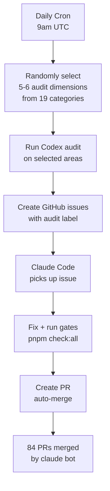

L'evoluzione definitiva: un audit cron giornaliero che viene eseguito automaticamente alle 9am UTC. Seleziona casualmente 5--6 dimensioni da 19 categorie di audit, ispeziona diverse parti del codice, crea issue etichettati su GitHub e despaccia Claude Code per correggerli. 84 PR sono state auto-create, auto-corrette e auto-unite da `claude[bot]` — molte prima ancora che lo sviluppatore si svegliasse.

### Il Segnale di Fiducia

Quando lo sviluppatore eseguiva un audit e otteneva risultati, la risposta non era mai "fammi esaminare questi risultati." Era:

> "correggi tutto."

Questo è il livello di fiducia che si ottiene quando uno strumento ha dimostrato il suo valore centinaia di volte.

## tdd-guardian: Il Controverso

**Usato in**: 3 sessioni esplicite. Oltre 5,500 riferimenti in background in 42 sessioni.

La storia di tdd-guardian è la più interessante perché include il fallimento.

### Il Problema dell'Hook Bloccante

tdd-guardian è stato rilasciato con un hook PreToolUse che bloccava i commit se le soglie di copertura dei test non venivano raggiunte. In teoria, questo impone la disciplina test-first. In pratica:

> "il TDD-guardian, dovremmo rimuovere il blocking hook, lasciare che tdd guardian venga eseguito tramite comando manuale?"

Il problema era reale: uno SHA obsoleto nel file di stato bloccava commit non correlati. Lo sviluppatore doveva modificare manualmente `state.json` per sbloccare il lavoro. Gli hook bloccanti erano ridondanti rispetto ai gate CI che già eseguivano `pnpm check:all` su ogni PR.

Gli hook sono stati disabilitati ([`f2fda819`](https://github.com/xiaolai/vmark/commit/f2fda819)). Ma la *filosofia* è sopravvissuta.

### La Campagna di Copertura in 26 Fasi

Ciò che tdd-guardian ha seminato è stata la disciplina che ha guidato una straordinaria campagna di copertura:

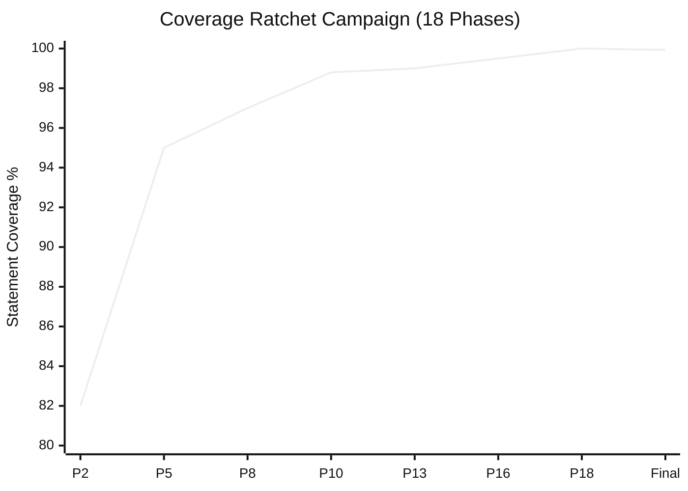

| Fase | Commit | Soglie |
|------|--------|--------|
| Fase 2 | [`1e5cf94a`](https://github.com/xiaolai/vmark/commit/1e5cf94a) | 82/74/86/83 |
| Fase 5 | [`4658d75f`](https://github.com/xiaolai/vmark/commit/4658d75f) | 95/87/95/96 |
| Fase 8 | [`3d7239c3`](https://github.com/xiaolai/vmark/commit/3d7239c3) | approfondire tabEscape, codePreview, formatToolbar |
| Fase 13 | [`9bec6612`](https://github.com/xiaolai/vmark/commit/9bec6612) | approfondire multiCursor, mermaidPreview, listEscape |
| Fase 16 | [`730ff139`](https://github.com/xiaolai/vmark/commit/730ff139) | annotazioni v8 su 145 file, 99.5/99/99/99.6 |
| Fase 18 | [`1d996778`](https://github.com/xiaolai/vmark/commit/1d996778) | innalzamento a 100/99.87/100/100 |
| Finale | [`fcf5e00d`](https://github.com/xiaolai/vmark/commit/fcf5e00d) | 99.93% stmts / 99.96% righe |

Da ~40% ("questo è inaccettabile") al 99.96% di copertura delle righe, in 18 fasi, ciascuna delle quali innalzava le soglie in modo che la copertura non potesse mai regredire. Il rapporto test:produzione ha raggiunto 1.97:1 — quasi il doppio di codice di test rispetto al codice applicativo.

### La Lezione

I migliori meccanismi di applicazione sono quelli che cambiano le abitudini e poi si tolgono di mezzo. Gli hook bloccanti di tdd-guardian erano troppo aggressivi, ma lo sviluppatore che li ha disabilitati ha finito per scrivere più test di chiunque avesse gli hook bloccanti attivati.

## docs-guardian: Il Rilevatore di Figuracce

**Usato in**: 3 sessioni. Ha trovato 2 problemi CRITICI al primo audit.

### L'Incidente di `com.vmark.app`

Il verificatore di accuratezza di docs-guardian legge sia il codice che la documentazione e poi li confronta. Al suo primo audit completo di VMark, ha scoperto che la guida AI Genies diceva agli utenti che i loro genies erano memorizzati in:

```
~/Library/Application Support/com.vmark.app/genies/
```

Ma l'identificatore Tauri effettivo nel codice era `app.vmark`. Il percorso reale era:

```
~/Library/Application Support/app.vmark/genies/
```

Questo era sbagliato su tutte e tre le piattaforme, nella guida in inglese e in tutte le 9 versioni tradotte. Nessun test lo avrebbe individuato. Nessun linter lo avrebbe individuato. docs-guardian lo ha individuato perché è letteralmente ciò che fa: confrontare codice e documentazione, meccanicamente, per ogni coppia mappata.

### L'Impatto Completo dell'Audit

```mermaid
%%{init: {"theme": "neutral"}}%%
xychart-beta
    title "Documentation Health Before vs After"
    x-axis ["Accuracy", "Coverage", "Quality", "Overall"]
    y-axis "Score" 0 --> 100
    bar [78, 64, 83, 74]
    bar [95, 91, 88, 91]
```

| Dimensione | Prima | Dopo | Delta |
|------------|-------|------|-------|
| Accuratezza | 78/100 | 95/100 | +17 |
| Copertura | 64% | 91% | +27% |
| Qualità | 83/100 | 88/100 | +5 |
| **Complessivo** | **74/100** | **91/100** | **+17** |

17 funzionalità non documentate sono state trovate e documentate in una singola sessione. Il motore Markdown Lint — 15 regole, con scorciatoie e un badge nella barra di stato — non aveva alcuna documentazione per l'utente. Il comando shell `vmark` era completamente non documentato. La Modalità Sola Lettura, la Barra degli Strumenti Universale, il trascinamento delle schede per separare le finestre — tutte funzionalità rilasciate che gli utenti non potevano scoprire perché nessuno aveva scritto la documentazione.

Le 19 mappature codice-documentazione in `config.json` significano che ogni volta che `shortcutsStore.ts` cambia, docs-guardian sa che `website/guide/shortcuts.md` necessita di aggiornamento. La deriva della documentazione diventa meccanicamente rilevabile.

## loc-guardian: La Regola delle 300 Righe

**Usato in**: 4 sessioni. 14 file segnalati, 8 a livello di avvertimento.

L'AGENTS.md di VMark contiene la regola: "Mantenere i file di codice sotto le ~300 righe (dividere proattivamente)."

Questa regola non proviene da una guida di stile. Proviene dalle scansioni di loc-guardian che continuavano a trovare file oltre le 500 righe, difficili da navigare, da testare e da gestire efficacemente per gli assistenti IA. Il caso peggiore: `hot_exit/coordinator.rs` con 756 righe.

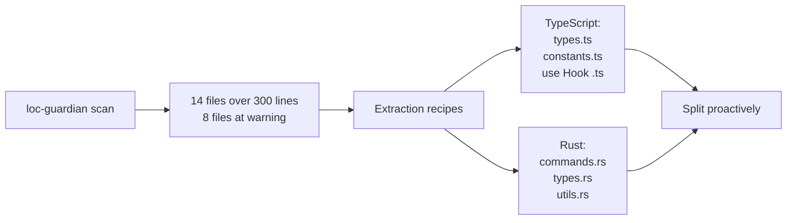

I dati LOC hanno anche alimentato la valutazione del progetto — quando lo sviluppatore voleva capire "quanto sforzo umano rappresenterebbe questo progetto?", il report LOC è stato il dato di partenza. Risposta: investimento equivalente di $400K--$600K con sviluppo assistito dall'IA.

## echo-sleuth: La Memoria Istituzionale

**Usato in**: 6 sessioni. Infrastruttura per tutto.

echo-sleuth è il plugin più silenzioso ma probabilmente il più fondamentale. I suoi script di parsing JSONL sono l'infrastruttura che rende la cronologia delle conversazioni ricercabile. Quando qualsiasi altro plugin ha bisogno di ricordare cosa è successo in una sessione passata, gli strumenti di echo-sleuth fanno il lavoro effettivo.

Questo articolo esiste perché echo-sleuth ha minato oltre 35 sessioni di VMark e ha trovato ogni invocazione di plugin, ogni reazione dell'utente e ogni punto decisionale. Ha estratto il conteggio di 292 issue, il conteggio di 84 PR, la timeline della campagna di copertura e la sessione "grigliati duramente". Senza di esso, le prove del "perché questi plugin sono indispensabili?" sarebbero aneddotiche piuttosto che archeologiche.

## grill: Lo Specchio Spietato

**Installato in**: ogni sessione VMark. **Invocato esplicitamente per autovalutazione.**

Il momento più memorabile di grill è stata la sessione del 21 marzo. Lo sviluppatore ha chiesto:

> "Se potessi grigliarti più duramente, senza preoccuparti di tempo e sforzo, cosa faresti diversamente?"

grill ha prodotto un'analisi delle lacune di qualità in 14 punti — una sessione di 81 messaggi e 863 chiamate a strumenti che ha guidato un piano di rafforzamento della qualità in più fasi ([`076dd96c`](https://github.com/xiaolai/vmark/commit/076dd96c), [`5e47e522`](https://github.com/xiaolai/vmark/commit/5e47e522)). I risultati includevano:

- La copertura dei test del backend Rust era solo al 27%
- Lacune di accessibilità WCAG nei dialoghi modali ([`85dc29fa`](https://github.com/xiaolai/vmark/commit/85dc29fa))
- 104 file che superavano la convenzione delle 300 righe
- Chiamate a Console.error che avrebbero dovuto essere logger strutturati ([`530b5bb7`](https://github.com/xiaolai/vmark/commit/530b5bb7))

Questo non era un linter che trovava un punto e virgola mancante. Era pensiero strategico sulla qualità che ha guidato campagne di investimento di una settimana.

## nlpm: Il Dolore della Crescita

**Invocato in**: 0 sessioni esplicitamente. **Ha causato attrito in**: 1 sessione.

L'hook PostToolUse di nlpm ha bloccato una sessione di editing VMark tre volte di fila:

> "L'hook PostToolUse:Edit ha interrotto la continuazione, perché?"
> "si è fermato di nuovo, perché?!"
> "è innocuo... ma è una perdita di tempo."

L'hook verificava se i file modificati corrispondevano a pattern di artefatti NL. Durante una correzione di bug per la protezione dei caratteri strutturali, era puro rumore. Il plugin è stato disabilitato per quella sessione.

Questo è feedback onesto. Non ogni interazione con un plugin è positiva. Lo sviluppatore che ha costruito nlpm ha scoperto attraverso VMark che gli hook PostToolUse sui pattern dei file necessitano di un filtraggio migliore — le correzioni di bug non dovrebbero attivare il linting degli artefatti NL.

## L'Evoluzione in Cinque Fasi

L'adozione non è stata istantanea. Ha seguito una traiettoria chiara:

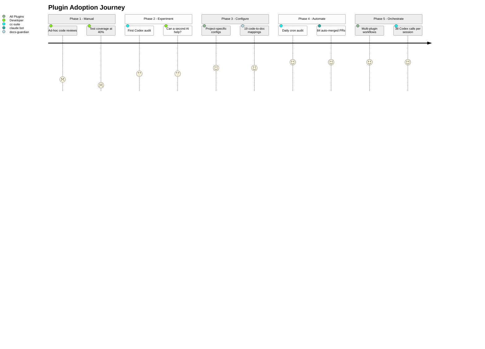

### Fase 1: Audit Manuale (gennaio 2026)
> "ispeziona tutto il codice, individua possibili bug e lacune"

Revisioni ad-hoc. Nessuno strumento. Copertura dei test al 40%.

### Fase 2: Esperimenti con Singolo Plugin (fine gennaio -- inizio febbraio)
> "chiedi a codex di verificare la qualità del codice"

Primo utilizzo di cc-suite per il server MCP. Sperimentale. Può una seconda IA individuare cose che la prima ha trascurato? Prima installazione: [`e6373c7a`](https://github.com/xiaolai/vmark/commit/e6373c7a).

### Fase 3: Infrastruttura Configurata (inizio marzo)
Plugin installati con configurazioni specifiche del progetto. tdd-guardian abilitato con soglie rigorose ([`f775f300`](https://github.com/xiaolai/vmark/commit/f775f300)). docs-guardian ha 19 mappature codice-documentazione. loc-guardian ha limiti di 300 righe con regole di estrazione.

### Fase 4: Pipeline Automatizzate (metà marzo)
Audit cron giornaliero alle 9am UTC. Issue auto-creati, auto-corretti, auto-PR creati, auto-uniti. 84 PR senza intervento umano.

### Fase 5: Orchestrazione Multi-Plugin (fine marzo)
Singole sessioni che combinano scansione loc-guardian -> audit delle prestazioni -> implementazione con subagent -> audit cc-suite -> verifica cc-suite -> incremento versione. 38 chiamate Codex in una sessione. I plugin si compongono in workflow.

## Il Ciclo di Feedback

Il pattern più interessante non è nessun plugin individuale. È il ciclo:

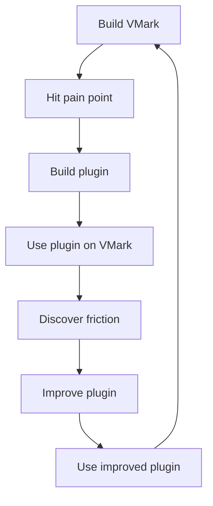

Ogni plugin è nato dalla costruzione di VMark:

- **cc-suite** esiste perché un'unica IA che revisiona il proprio lavoro non è sufficiente
- **tdd-guardian** esiste perché la copertura continuava a calare tra una sessione e l'altra
- **docs-guardian** esiste perché la documentazione diverge sempre dal codice
- **loc-guardian** esiste perché i file crescono sempre oltre dimensioni mantenibili
- **echo-sleuth** esiste perché le sessioni sono effimere ma le decisioni no
- **grill** esiste perché i problemi architetturali necessitano di revisione avversariale
- **nlpm** esiste perché i prompt e gli skill sono anch'essi codice

E ogni plugin è stato migliorato costruendo VMark:

- Gli hook bloccanti di tdd-guardian si sono rivelati troppo aggressivi — portando a una proposta di applicazione opt-in
- Il pattern matching sui file di nlpm si è rivelato troppo ampio — bloccando durante correzioni di bug non correlate
- Il nome di cc-suite è stato corretto dopo che un riferimento fantasma è stato scoperto durante una sessione
- Il verificatore di accuratezza di docs-guardian ha dimostrato il suo valore trovando il bug di `com.vmark.app` che nessun altro strumento avrebbe potuto individuare

## Il Sistema di Qualità a Strati

Insieme, i sette plugin formano un sistema di garanzia della qualità a strati:

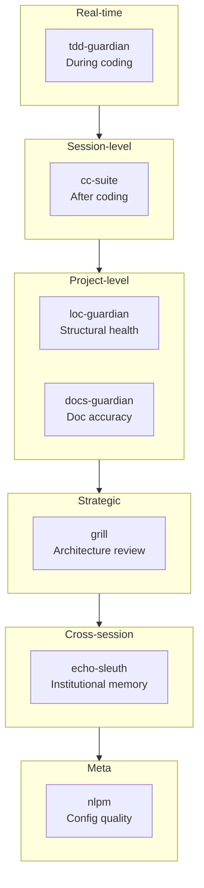

| Strato | Plugin | Quando Agisce | Cosa Individua |
|--------|--------|---------------|----------------|
| Disciplina in tempo reale | tdd-guardian | Durante la codifica | Test saltati, regressione della copertura |
| Revisione a livello sessione | cc-suite | Dopo la codifica | Bug, sicurezza, accessibilità |
| Salute strutturale | loc-guardian | Su richiesta | Crescita dei file, aumento della complessità |
| Sincronizzazione della documentazione | docs-guardian | Su richiesta | Docs obsoleti, docs mancanti, docs errati |
| Valutazione strategica | grill | Periodicamente | Lacune architetturali, lacune nei test, debito di qualità |
| Memoria istituzionale | echo-sleuth | Tra sessioni | Decisioni perse, contesto dimenticato |
| Qualità della configurazione | nlpm | Alla modifica | Prompt scadenti, skill deboli, regole non funzionanti |

Questo non è "tooling opzionale." È lo strato di governance che rende affidabile lo sviluppo ricorsivo con IA — dove l'IA scrive il codice, l'IA audita il codice, l'IA corregge i risultati dell'audit e l'IA verifica le correzioni.

## Perché Sono Indispensabili

"Indispensabile" è una parola forte. Ecco il test: come sarebbe VMark senza di essi?

**Senza cc-suite**: 292 issue tra bug, vulnerabilità di sicurezza e lacune di accessibilità si sarebbero accumulati. La pipeline automatizzata che individua problemi entro 24 ore dalla loro introduzione non esisterebbe. Lo sviluppatore si affiderebbe a revisioni manuali periodiche — che le sessioni di gennaio mostrano avvenivano in modo ad-hoc nel migliore dei casi.

**Senza tdd-guardian**: La campagna di copertura in 26 fasi potrebbe non essere mai avvenuta. La disciplina di innalzare progressivamente le soglie — dove la copertura può solo salire, mai scendere — è nata dalla mentalità che tdd-guardian ha instillato. Una copertura del 99.96% non succede per caso.

**Senza docs-guardian**: Gli utenti starebbero ancora cercando i loro genies in una directory che non esiste. 17 funzionalità rimarrebbero non scopribili. L'accuratezza della documentazione sarebbe una questione di speranza, non di misurazione.

**Senza loc-guardian**: I file crescerebbero oltre le 500, 800, 1000 righe. La "regola delle 300 righe" che mantiene il codice navigabile sarebbe un suggerimento piuttosto che un vincolo applicato.

**Senza echo-sleuth**: Ogni sessione partirebbe da zero. "Cosa avevamo deciso sul conflitto delle scorciatoie del menu?" richiederebbe di cercare manualmente nei log delle conversazioni.

**Senza grill**: La lacuna nei test Rust (27%), le lacune di accessibilità WCAG, i 104 file sovradimensionati — questi investimenti strategici nella qualità sono stati guidati dall'analisi avversariale di grill, non dai report di bug.

I plugin non sono indispensabili perché sono ingegnosi. Sono indispensabili perché codificano disciplina che gli umani (e le IA) dimenticano tra una sessione e l'altra. La copertura può solo salire. La documentazione corrisponde al codice. I file restano piccoli. Gli audit avvengono prima di ogni rilascio. Queste non sono aspirazioni — sono regole imposte da strumenti che vengono eseguiti ogni giorno.

## Le Regole e gli Skill: Conoscenza Codificata

I plugin sono metà della storia. L'altra metà è l'infrastruttura di conoscenza accumulata insieme a essi.

### 13 Regole (1,950 Righe di Conoscenza Istituzionale)

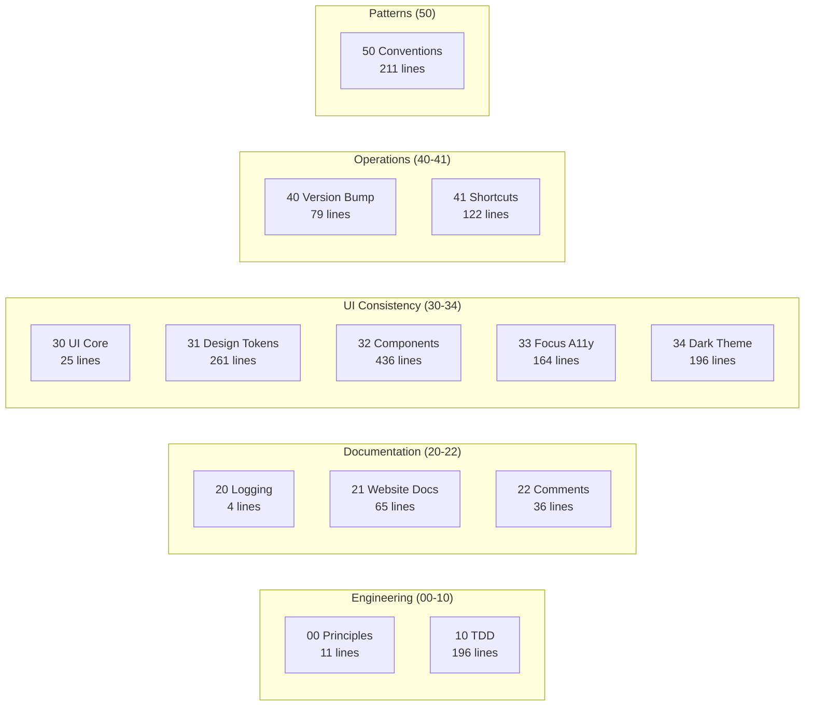

La directory `.claude/rules/` di VMark contiene 13 file di regole — non linee guida vaghe, ma convenzioni specifiche e applicabili:

| File di Regole | Righe | Cosa Codifica |
|----------------|-------|---------------|
| `00-engineering-principles.md` | 11 | Convenzioni fondamentali (niente destructuring di Zustand, limite di 300 righe) |
| `10-tdd.md` | 196 | 5 template di pattern di test, catalogo di anti-pattern, gate di copertura |
| `20-logging-and-docs.md` | 4 | Fonte unica di verità per argomento |
| `21-website-docs.md` | 65 | Tabella di mappatura codice-documentazione (quali cambiamenti di codice richiedono quali aggiornamenti doc) |
| `22-comment-maintenance.md` | 36 | Quando aggiornare/non aggiornare i commenti, prevenzione del deterioramento |
| `30-ui-consistency.md` | 25 | Principi fondamentali dell'UI, riferimenti incrociati alle sotto-regole |
| `31-design-tokens.md` | 261 | Riferimento completo dei token CSS — ogni colore, spaziatura, raggio, ombra |
| `32-component-patterns.md` | 436 | Pattern per popup, toolbar, menu contestuale, tabella, scrollbar con codice |
| `33-focus-indicators.md` | 164 | 6 pattern di focus per tipo di componente (conformità WCAG) |
| `34-dark-theme.md` | 196 | Rilevamento del tema, pattern di override, checklist di migrazione |
| `40-version-bump.md` | 79 | Procedura di sincronizzazione versione su 5 file con script di verifica |
| `41-keyboard-shortcuts.md` | 122 | Sincronizzazione di 3 file (Rust/Frontend/Docs), verifica conflitti, convenzioni |
| `50-codebase-conventions.md` | 211 | 10 pattern non documentati scoperti durante lo sviluppo |

Queste regole vengono lette da Claude Code all'inizio di ogni sessione. Sono il motivo per cui il commit 2,180 segue le stesse convenzioni del commit 100.

La regola `50-codebase-conventions.md` è particolarmente notevole — documenta pattern che *nessuno ha progettato*. Sono emersi organicamente durante lo sviluppo e sono stati poi codificati: convenzioni di denominazione degli store, pattern di pulizia degli hook, struttura dei plugin, firme degli handler del bridge MCP, organizzazione dei CSS, idiomi di gestione degli errori.

### 19 Skill del Progetto (Competenza del Dominio)

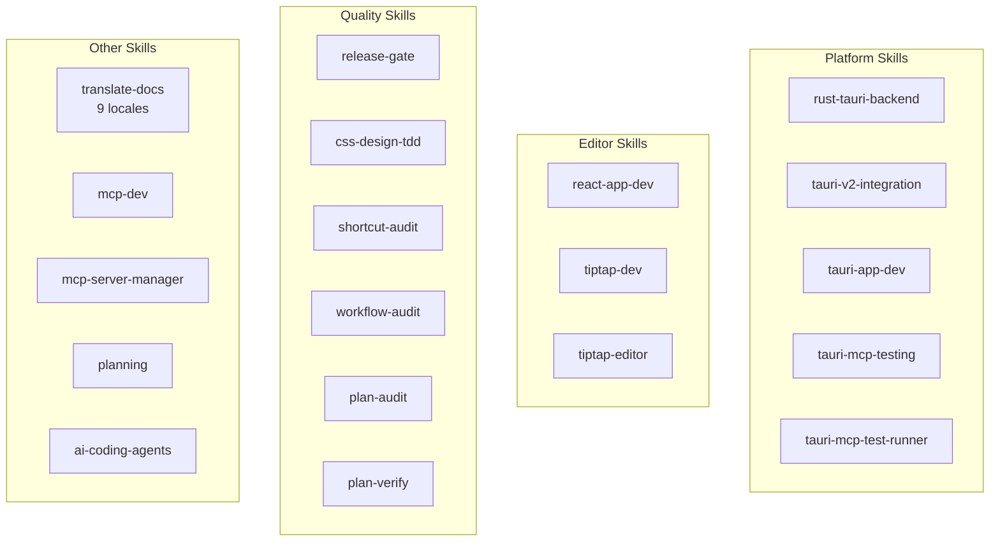

| Categoria | Skill | Cosa Abilitano |
|-----------|-------|----------------|
| **Tauri/Rust** | `rust-tauri-backend`, `tauri-v2-integration`, `tauri-app-dev`, `tauri-mcp-testing`, `tauri-mcp-test-runner` | Sviluppo Rust specifico per piattaforma con convenzioni Tauri v2 |
| **React/Editor** | `react-app-dev`, `tiptap-dev`, `tiptap-editor` | Pattern dell'editor Tiptap/ProseMirror, regole dei selettori Zustand |
| **Qualità** | `release-gate`, `css-design-tdd`, `shortcut-audit`, `workflow-audit`, `plan-audit`, `plan-verify` | Verifica della qualità automatizzata a ogni livello |
| **Documentazione** | `translate-docs` | Traduzione in 9 lingue con audit guidato da subagent |
| **MCP** | `mcp-dev`, `mcp-server-manager` | Sviluppo e configurazione di server MCP |
| **Pianificazione** | `planning` | Generazione di piani di implementazione con documentazione delle decisioni |
| **Strumenti IA** | `ai-coding-agents` | Orchestrazione multi-agente (Codex CLI, Claude Code, Gemini CLI) |

### 7 Comandi Slash (Automazione dei Workflow)

| Comando | Cosa Fa |
|---------|---------|
| `/bump` | Incremento versione su 5 file, commit, tag, push |
| `/fix-issue` | Risolutore di issue GitHub end-to-end — recupero, classificazione, correzione, audit, PR |
| `/merge-prs` | Revisione e unione di PR aperte in sequenza con gestione del rebase |
| `/fix` | Correzione corretta dei problemi — niente patch, niente scorciatoie, niente regressioni |
| `/repo-clean-up` | Rimozione di esecuzioni CI fallite e branch remoti obsoleti |
| `/feature-workflow` | Sviluppo di funzionalità end-to-end con gate e agenti |
| `/test-guide` | Generazione guida per test manuali |

### L'Effetto Composto

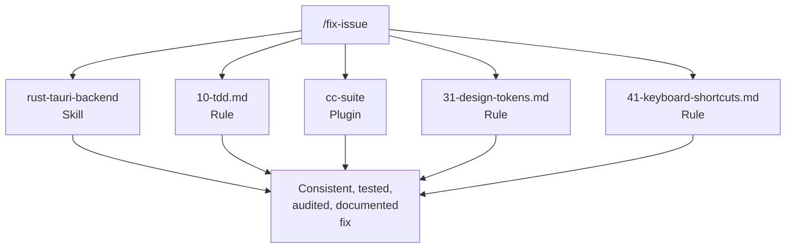

Regole + skill + plugin + comandi formano un sistema composto. Quando esegui `/fix-issue`, usa lo skill `rust-tauri-backend` per le modifiche Rust, segue la regola `10-tdd.md` per i requisiti di test, invoca `cc-suite` per l'audit, verifica `31-design-tokens.md` per la conformità CSS e controlla `41-keyboard-shortcuts.md` per la sincronizzazione delle scorciatoie.

Nessun singolo pezzo è rivoluzionario. L'effetto composto — 13 regole x 19 skill x 7 plugin x 7 comandi, tutti che si rafforzano a vicenda — è ciò che fa funzionare il sistema. Ogni pezzo è stato aggiunto quando è stata scoperta una lacuna, testato nello sviluppo reale e perfezionato attraverso l'uso.

## Per i Creatori di Plugin

Se stai pensando di costruire plugin per Claude Code, ecco cosa ci ha insegnato VMark:

1. **Costruisci prima per te stesso.** I migliori plugin risolvono i tuoi problemi reali, non quelli ipotetici.

2. **Dogfooding senza sosta.** Usa i tuoi plugin sui tuoi progetti reali. L'attrito che scopri è l'attrito che i tuoi utenti scopriranno.

3. **Gli hook necessitano di vie d'uscita.** Gli hook bloccanti che non possono essere aggirati verranno disabilitati completamente. Rendi l'applicazione opt-in o sensibile al contesto.

4. **La verifica cross-model funziona.** Avere un'IA diversa che revisiona il lavoro della tua IA principale individua bug reali. Non è ridondante — è ortogonale.

5. **Codifica la disciplina, non le regole.** I migliori plugin cambiano le abitudini. Gli hook bloccanti di tdd-guardian sono stati rimossi, ma la campagna di copertura che hanno ispirato è stata l'investimento di qualità più impattante del progetto.

6. **Componi, non creare monoliti.** Sette plugin focalizzati battono un mega-plugin. Ciascuno fa una cosa bene, e si compongono in workflow più grandi della somma delle parti.

7. **La fiducia si guadagna invocazione dopo invocazione.** Lo sviluppatore si fida di cc-suite abbastanza da dire "correggi tutto" senza esaminare i risultati. Quella fiducia è stata costruita in 27 sessioni e 292 issue risolti.

---

*VMark è open source su [github.com/xiaolai/vmark](https://github.com/xiaolai/vmark). Tutti e sette i plugin sono disponibili nel marketplace `xiaolai` di Claude Code.*
