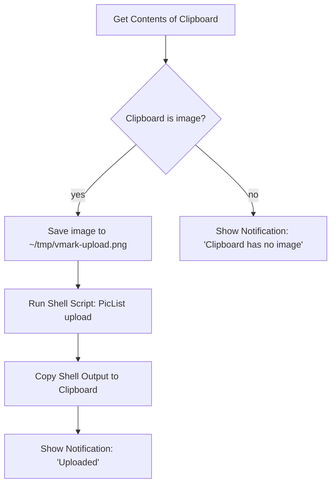

# クラウドホスト画像

VMark はローカルファーストを志向するライティングツールです。クリップボードから貼り付けた画像をアップロードする機能は組み込まれておらず、クラウドの認証情報も保存しません。Markdown に公開 CDN の URL を埋め込みたい場合（ブログ公開、デバイス間同期、CMS への投稿など）は、VMark の*外側*で動く OS レベルの自動化にアップロード処理を任せ、その結果だけを VMark に戻す形になります。

このページでは、VMark がこの方式を採用している理由、追加設定なしで動作する範囲、そして Shortcuts.app を使ったレシピを 10 分ほどで組み立てる手順を説明します。

[[toc]]

## VMark がすでに対応している範囲

VMark は Markdown における画像参照の扱いを、方向ごとに区別しています。

| 方向 | 対応状況 | トリガー | Markdown への書き込み内容 |
|------|---------|---------|--------------------------|
| 既存のリモート URL を挿入 | 対応済み | `https://…` の URL を貼り付け、または入力 | URL をそのまま |
| Markdown ソースにリモート URL が含まれる | 対応済み | `` と書かれている | そのままレンダリング |
| ローカル画像を挿入 | 対応済み | 貼り付け、ドロップ、バイナリ挿入 | `.assets/` にコピーし、相対パスを書き込む |
| ローカル画像を挿入し、かつ*リモートに保存* | **組み込み機能なし** | （後述のレシピを参照） | — |

つまり、画像がすでに URL として存在するのであれば、その URL を貼り付けるだけで済みます。VMark はそれを Markdown の画像参照として挿入し、Webview が画像を取得します。読み込み経路はすでにクラウド対応済みということです。

## VMark にクラウドアップロードを組み込まない理由

検討された機能は次のようなものです。貼り付け時に VMark がローカル画像を検知し、リモートストレージにアップロードしたうえで、`./.assets/…` のパスではなく返された URL を Markdown に書き込む——という挙動です。一見ささやかな機能ですが、これを取り入れると VMark のスコープが 3 つの重要な側面で広がってしまいます。

1. **認証情報の保管**。S3 互換のアップロードをネイティブで行うには、ユーザーのアクセスキーとシークレットキーをアプリ側に保持しておく必要があります。現在の VMark は長期的な秘密情報を一切保存していません——保存時の暗号化方針も、OS キーチェーンとの統合も、キーをローテーションする UX も、Markdown へキーを誤って書き込んでしまう失敗パターンへの備えもありません。アップロード機能を追加するということは、この一線を越えることを意味します。

2. **マルチプロバイダー対応の重荷**。S3、Cloudflare R2、Backblaze B2、MinIO、DigitalOcean Spaces はいずれも S3 互換を謳っていますが、実際にはそれぞれにクセがあります（パス形式とバーチャルホスト形式のアドレッシング、ACL の意味論、リージョン別エンドポイント、CORS ルールなど）。こうした多様な仕様を一人のメンテナーが抱え込むのは、ライティングツールにとって長期的に大きな負担となります。

3. **組み合わせる方が、抱え込むよりよい**。[PicList](https://github.com/Kuingsmile/PicList) や [PicGo](https://github.com/Molunerfinn/PicGo) といったツールは、プロバイダー固有の設定や認証情報の保管も含めて、この問題をすでに解決しています。macOS の Shortcuts.app や Keyboard Maestro を使えば、そうしたツールをシステム上の任意のテキストフィールドと連携させられ、VMark 専用に縛られることもありません。クラウドアップロードを VMark に組み込んでしまうと、本来外部に任せておくべきコードを重複して抱えることになり、しかもその恩恵は VMark の中でしか得られなくなります。

したがって、結論は次のようになります。**VMark はライティングツールに徹し、画像アップロードはユーザーの OS レベル自動化ツールに委ねる**——以下のレシピは、その OS レベルの経路を具体化したものです。

## レシピ：Shortcuts.app + PicList（macOS、無料）

Shortcuts.app は macOS Monterey（12）以降に標準搭載されています。PicList は無料のオープンソース画像アップローダーです。両者を組み合わせると、クリップボード上の画像を取得し、PicList 経由でアップロードし（PicList は R2、S3、Imgur をはじめ多数のバックエンドに対応しています）、クリップボードの中身を返ってきた URL で置き換える——という一連の処理をホットキーひとつで実行できます。あとは VMark で `Cmd + V` を押せば URL が挿入され、VMark 既存のリモート URL 検出機能が後を引き継ぎます。

### 前提条件

1. **PicList のインストールと設定**。[PicList のリリースページ](https://github.com/Kuingsmile/PicList/releases) からダウンロードし、一度起動して *PicBed Settings* で少なくとも 1 つの画像ホスト（R2、S3、Imgur、smms など）を設定します。Shortcut を組み立てる前に、PicList 上で手動アップロードが正常に動作することを必ず確認してください——こうしておくと、「PicList 自体の問題」なのか「Shortcut の接続の問題」なのかを切り分けられます。

2. **PicList CLI が使えること**。PicList はアプリケーションバンドル内に `upload` サブコマンドを同梱しています。macOS では、バイナリは `/Applications/PicList.app/Contents/MacOS/PicList` に配置されています。次のコマンドで確認しましょう。

   ```sh
   /Applications/PicList.app/Contents/MacOS/PicList upload --help
   ```

   CLI のヘルプが表示されれば成功です。表示されない場合は、PicList が `/Applications` にインストールされているかを確認してください（`~/Applications` にある場合はパスを調整します）。

### Shortcut を組み立てる

`Shortcuts.app` を開き、新しいショートカットを作成します。次のアクションを順番に追加していきます。



Shortcuts エディタでの具体的な手順は以下のとおりです。

1. **アクション：Get Contents of Clipboard**。アクションサイドバーからドラッグして追加します。設定は不要です。

2. **アクション：If**。条件を *Clipboard is Media › Image* に設定します。（ドロップダウンに *Media* が出てこない場合は、より緩い条件である *Contents › has any value* で代用してください。）

3. **If ブランチ内 — アクション：Save File**。次のように設定します。
   - サービス：*Files*
   - 保存先：`~/tmp/`（フォルダが存在しなければ、Finder であらかじめ作成しておきます）
   - ファイル名：`vmark-upload.png`（固定名にしておくと、次の手順でパスを決め打ちできます）
   - *Ask Where To Save* をオフにして、ショートカットが無人実行できるようにします。

4. **アクション：Run Shell Script**。次のように設定します。
   - シェル：`/bin/zsh`（macOS のデフォルト）
   - 入力：*Pass Input as `stdin`* ——実用上は `as arguments` のほうが望ましいです。（どちらでも動作します。以下のスクリプトは stdin を読み取らず、パスをリテラルで指定しています。）
   - スクリプト本体：

     ```sh
     /Applications/PicList.app/Contents/MacOS/PicList upload "$HOME/tmp/vmark-upload.png" 2>/dev/null | tail -n 1
     ```

   `tail -n 1` は保険のためのものです。PicList は URL の前に情報ログを 1 行出力することがあります。実際の出力形式は、お使いの PicList のバージョンで一度確認しておきましょう。PicList が URL だけを返すのであれば、`tail` は何の影響もありません。

5. **アクション：Copy to Clipboard**。入力に *Shell Script Result* を指定します。

6. **アクション：Show Notification**。タイトルは `Uploaded`、本文は *Shell Script Result* に設定します。こうしておくと、URL がクリップボードに入ったことを確認でき、何をアップロードしたかも一目で分かります。

7. **（オプション）Else ブランチ — アクション：Show Notification**。タイトルは `No image on clipboard` とします。ホットキーを押したのにクリップボードに画像が入っていなかった場合の切り分けに役立ちます。

### グローバルホットキーを割り当てる

Shortcuts エディタで、対象のショートカットの *(i)* インフォボタンをクリックし、*Add Keyboard Shortcut* を選びます。VMark のショートカットと衝突しないキー組み合わせを選びましょう——`Control + Option + Command + U` は定番の選択肢です（macOS の標準ショートカットと衝突せず、「Upload」の頭文字で覚えやすい）。

### 使い方

1. `Cmd + Shift + Ctrl + 4` でスクリーンショットを撮ります（ディスクではなくクリップボードに保存されます）。もちろん、他のアプリから任意の画像をコピーしても構いません。
2. アップロード用のホットキー（`Ctrl + Opt + Cmd + U`）を押します。
3. 通知が出るまで 1〜3 秒ほど待ちます。
4. VMark で貼り付けます（`Cmd + V`）。Markdown に `` が挿入されます。

### 起こりうる問題

| 症状 | 考えられる原因 | 対処法 |
|------|---------------|--------|
| ショートカットは発火するが PicList が動かない | PicList バイナリのパスが間違っている | `/Applications/PicList.app/Contents/MacOS/PicList` が存在するか確認し、別の場所にインストールされている場合はパスを調整する |
| 通知は表示されるが、クリップボードに画像が残ったまま | シェルスクリプトが空文字列を返している | 確実に存在するファイルパスを指定してシェルスクリプトを手動実行し、PicList の実際の出力を確認する |
| URL が壊れている／末尾に余分な空白が入る | `tail -n 1` が URL ではなくログ行を拾ってしまった | PicList の出力を確認し、パース処理を調整する（より厳密にするなら `grep -oE 'https://[^[:space:]]+' \| tail -n 1` が代替案になります） |
| VMark で `Cmd + V` を押すと、画像ではなくプレーンテキストとして挿入される | URL の末尾が PicList の認識する画像拡張子で終わっていない | アップロード後にファイル拡張子が保持されているか確認する（R2 や S3 では通常保持されますが、バケットのキーテンプレートを念のため見直してください） |

## 代替案：Keyboard Maestro

[Keyboard Maestro](https://www.keyboardmaestro.com/) は有料の macOS 自動化ツールで、Shortcuts.app より柔軟性に優れています。このワークフローにおける実用上の最大の利点は、クリップボードに画像が入っているときに `Cmd + V` を直接フックできる点です。つまり、ホットキーと `Cmd + V` の 2 ストロークではなく、`Cmd + V` の 1 ストロークだけでアップロードと貼り付けを完結させられます。

レシピの構造は Shortcuts.app 版とまったく同じです——クリップボード上の画像を取得し、ファイルに保存し、PicList の CLI を呼び出し、クリップボードを書き換え、必要に応じて貼り付けをシミュレートします。Keyboard Maestro の *Trigger* マクロビルダーはより柔軟で（クリップボード変更トリガーや、アプリ単位でのスコープ設定など）、アップロード自体の手順は変わりません。

すでに Keyboard Maestro を使っているのでなければ、Shortcuts.app のほうが手頃な選択肢です。

## 代替案：公開前処理スクリプト

セルフホスト型のブログや静的サイトのビルドパイプラインを持っているなら、もっともすっきりした解はこうなります——VMark のデフォルト動作（`.assets/` への相対パス）はそのままにしておき、ビルド時に Markdown を走査するスクリプトを走らせ、ユニークな画像をそれぞれアップロードしてパスを書き換える、というやり方です。画像ごとに発生するアップロード待ちを、公開時にまとめて行うバッチアップロードへと付け替える形になり、エディタ側の操作感もすっきり保てます。

最小限のサンプル（Node.js、擬似コード）：

```js
// scan-and-upload.js
const fs = require("fs");
const { execSync } = require("child_process");

const md = fs.readFileSync(process.argv[2], "utf8");
const rewritten = md.replace(/!\[(.*?)\]\((\.\/\.assets\/[^)]+)\)/g, (_, alt, path) => {
  const url = execSync(
    `/Applications/PicList.app/Contents/MacOS/PicList upload "${path}"`,
  ).toString().trim();
  return ``;
});
fs.writeFileSync(process.argv[2].replace(/\.md$/, ".published.md"), rewritten);
```

なお、いくつかの静的サイトジェネレーター（Hugo の [Page Bundles](https://gohugo.io/content-management/page-bundles/)、Jekyll、Astro、Eleventy など）は、相対パスの `.assets/` をビルド時にそのまま扱えます——この方式で公開するのであれば、スクリプトすら不要です。

## すでにホスティング済みの URL

念のため補足しておきます。画像がすでに公開 URL として存在するのであれば、その URL を VMark に貼り付けるだけで完了です。クリップボード上の画像パス検出器はこれを `type: "url"` として認識し、URL を直接書き込みます。アップロードも、`.assets/` へのコピーも、設定変更も一切必要ありません。これは VMark でもっとも単純なクラウド画像ワークフローであり、追加のツールも一切要りません。

## 関連項目

- [ファイルと画像の設定](./settings.md) — 自動リサイズ、アセットへのコピー、孤立ファイルのクリーンアップ
- [プライバシー](./privacy.md) — VMark がローカルに保存するもの、マシンの外に出るもの
