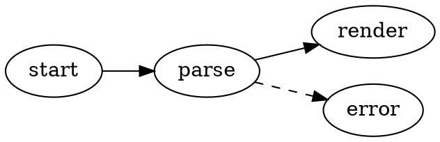
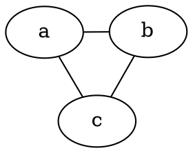

# Graphviz ダイアグラム

VMark は [Graphviz](https://graphviz.org/) の DOT グラフを Markdown ドキュメント内で直接レンダリングします。ダイアグラムは Graphviz の WASM ビルド（[@viz-js/viz](https://github.com/mdaines/viz-js)）でローカルにレンダリングされます — ネットワークアクセスも外部バイナリも不要です。

[[toc]]

## ダイアグラムの挿入

メニューバーの **挿入 → Graphviz ダイアグラム**（またはツールバーの挿入グループ）を使用してテンプレートダイアグラムを挿入します — ショートカットはデフォルトでは未割り当てで、設定でカスタマイズできます。または、`dot` か `graphviz` の言語識別子でフェンスされたコードブロックを入力します:

````markdown

````

どちらのフェンス言語も同じように動作します:

| フェンス | レンダリング結果 |
|-------|------------|
| ` ```dot ` | Graphviz ダイアグラム |
| ` ```graphviz ` | Graphviz ダイアグラム |

## 編集モード

- **WYSIWYG モード** — コードブロックはダイアグラムとしてレンダリングされます。ダブルクリックすると、デバウンス付きのライブプレビューで DOT ソースを編集できます。保存またはキャンセルは編集ヘッダーから行います。
- **ソースモード** — ` ```dot ` フェンス内にカーソルを置くと、Mermaid と同様のフローティングダイアグラムプレビュー（ドラッグ、リサイズ、ズーム）が表示されます。

## パン、ズーム、エクスポート

レンダリングされたダイアグラムは Mermaid ダイアグラムと同じ操作をサポートします:

- **Cmd/Ctrl + スクロール** でズーム、ドラッグでパン、リセットボタンで中央に戻す
- エクスポートボタンから **PNG としてエクスポート**（ライトまたはダークの背景）

## エンジンとレイアウト

ダイアグラムはデフォルトで `dot` エンジン（階層型／レイヤードレイアウト）によってレイアウトされます。別のエンジンを使用するには、グラフに標準の Graphviz `layout` 属性を設定します — この指定はドキュメントと一緒に保存され、ほかの Graphviz ツールでもそのまま機能します:

````markdown

````

| エンジン | レイアウトスタイル |
|--------|--------------|
| `dot` | 階層型／レイヤード（デフォルト） |
| `neato` | スプリングモデル（force-directed） |
| `fdp` | force-directed、より大きなグラフ向け |
| `sfdp` | マルチスケール force-directed、非常に大きなグラフ向け |
| `circo` | 円形 |
| `twopi` | 放射状 |
| `osage` | クラスター型 |
| `patchwork` | ツリーマップ（squarified） |

不明な `layout` 値を指定した場合は、他の DOT エラーと同様にレンダリングエラーとして表示されます。

サブグラフやクラスター、ランク、ノード形状、エッジスタイル、HTML 風ラベル、明示的な色指定など、Graphviz が標準でサポートする DOT の機能はすべて利用できます。

## テーマ統合

- ダイアグラムの背景は透明なので、エディタのテーマに従います。
- ノード、エッジ、テキストのデフォルト色はアクティブなテーマのデザイントークンから導出されるため、どのテーマ（White、Paper、Mint、Sepia、Night、Solarized）でもダイアグラムが自然になじみ、テーマを切り替えると自動的に更新されます。
- DOT ソース内の明示的な色指定は常にテーマのデフォルトより優先されます — 独自の `bgcolor`、`color`、`fontcolor` を設定したグラフは、記述どおりにレンダリングされます。

## エラー処理

DOT ソースに構文エラーがある場合、ブロックにはダイアグラムの代わりにレンダリングエラーが表示されます。ソースを修正するとプレビューは自動的に再レンダリングされます。

## HTML と PDF へのエクスポート

エクスポートされた HTML および PDF ドキュメントにはレンダリングされた SVG が埋め込まれるため、VMark の外でもダイアグラムは同じように表示されます。
