# ユーザーとしての開発者

7 つの Claude Code プラグインが、VMark 開発の炎の中で鍛え上げられ、不可欠な存在になるまでの物語。

## セットアップ

VMark は Tauri、React、Rust で構築された AI フレンドリーな Markdown エディタです。10 週間の開発を経て：

| 指標 | 値 |
|--------|-------|
| コミット数 | 2,180+ |
| コードベース規模 | 305,391 行 |
| テストカバレッジ | 99.96% 行カバレッジ |
| テスト対プロダクションコード比 | 1.97:1 |
| 作成・解決された監査イシュー | 292 |
| 自動マージされた PR | 84 |
| ドキュメント言語数 | 10 |
| MCP サーバーツール | 12 |

一人の開発者が Claude Code を使って構築しました。その過程で、この開発者は Claude Code マーケットプレイス向けに 7 つのプラグインを作成しました——副業としてではなく、生存ツールとして。各プラグインは、まだ存在しない解決策を必要とする特定のペインポイントがあったから生まれたのです。

## プラグイン一覧

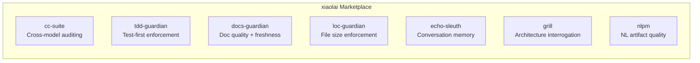

| プラグイン | 機能 | 誕生のきっかけ |
|--------|-------------|-----------|
| [cc-suite](https://github.com/xiaolai/cc-suite) | OpenAI Codex によるクロスモデルコード監査 | 「Claude 以外のセカンドオピニオンが必要だ」 |
| [tdd-guardian](https://github.com/xiaolai/tdd-guardian-for-claude) | テストファーストワークフローの強制 | 「テストを忘れるとカバレッジが下がる」 |
| [docs-guardian](https://github.com/xiaolai/docs-guardian-for-claude) | ドキュメント品質と鮮度の監査 | 「ドキュメントには `com.vmark.app` と書いてあるが、実際の識別子は `app.vmark` だ」 |
| [loc-guardian](https://github.com/xiaolai/loc-guardian-for-claude) | ファイル単位の行数制限の強制 | 「このファイルが 800 行になっていて誰も気づかなかった」 |
| [echo-sleuth](https://github.com/xiaolai/echo-sleuth-for-claude) | 会話履歴のマイニングと記憶 | 「3 週間前にあの件について何を決めたんだっけ？」 |
| [grill](https://github.com/xiaolai/grill-for-claude) | 多角的な深層コードレビュー | 「lint ではなく、アーキテクチャレビューが必要だ」 |
| [nlpm](https://github.com/xiaolai/nlpm-for-claude) | 自然言語プログラミング成果物の品質チェック | 「自分のプロンプトやスキルファイルは本当にうまく書けているのか？」 |

## ビフォー・アフター

変革は 3 か月で起きました。

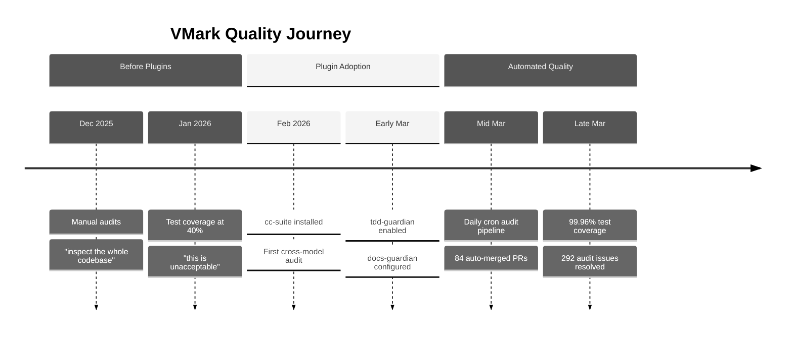

**プラグイン導入前**（2025 年 12 月〜2026 年 2 月）：手動コード監査。開発者は「コードベース全体を検査して、バグや抜けを見つけてくれ」と指示していました。テストカバレッジは 40% 前後を彷徨い——「受け入れがたい」と表現されました。ドキュメントは書かれた後、忘れ去られました。

**プラグイン導入後**（2026 年 3 月）：開発セッションごとに 3〜4 個のプラグインが自動ロード。自動化監査パイプラインが毎日稼働し、人手を介さずにイシューを作成・解決。26 フェーズの体系的なラチェット方式により、テストカバレッジは 99.96% に到達。ドキュメントの正確性は機械的な精度でコードと照合・検証されました。

Git 履歴がこの物語を語っています：

| カテゴリ | コミット数 |
|----------|---------|
| 総コミット数 | 2,180+ |
| Codex 監査対応 | 47 |
| テスト/カバレッジ | 52 |
| セキュリティ強化 | 40 |
| ドキュメント | 128 |
| カバレッジキャンペーンフェーズ | 26 |

## cc-suite：セカンドオピニオン

**使用状況**：28 回のプラグインセッション中 27 回で使用。全セッションで 200 回以上の Codex 呼び出し。

cc-suite で最も重要なのは、*Claude が自分自身の成果を監査するのではない*ということです。コードを OpenAI の Codex モデルに送り、独立したレビューを受けます。一つの AI と深く機能開発を進めているとき、まったく異なるモデルに結果を精査させることで、あなたとメインの AI の両方が見落としていた問題を捕捉できます。

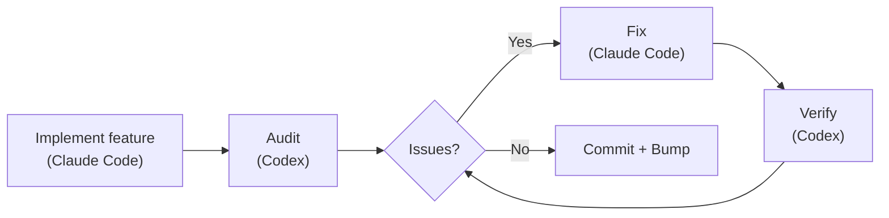

### 実際に発見されたもの

292 件の監査イシュー。全 292 件解決済み。残存ゼロ。

Git 履歴からの実例：

- **セキュリティ**：セキュアストレージ移行の 1 回の監査で 9 件の発見（[`d1a880a6`](https://github.com/xiaolai/vmark/commit/d1a880a6)）。リソースリゾルバにおけるシンボリックリンクトラバーサル（[`7dfa872d`](https://github.com/xiaolai/vmark/commit/7dfa872d)）。path-to-regexp の高深刻度脆弱性（[`8c554cdc`](https://github.com/xiaolai/vmark/commit/8c554cdc)）。

- **アクセシビリティ**：すべてのポップアップボタンに `aria-label` が欠落。FindBar、Sidebar、Terminal、StatusBar のアイコンのみのボタンにスクリーンリーダーテキストがなかった（[`7acc0bf0`](https://github.com/xiaolai/vmark/commit/7acc0bf0)）。Lint バッジにフォーカスインジケータが欠落（[`c4db90d4`](https://github.com/xiaolai/vmark/commit/c4db90d4)）。

- **サイレントロジックバグ**：マルチカーソル範囲がマージされると、プライマリカーソルインデックスがサイレントに 0 にフォールバック。ユーザーが位置 50 で編集中、範囲がマージされるとカーソルが突然ドキュメントの先頭にジャンプ。テストではなく監査で発見されました。

- **i18n 仕様レビュー**：Codex が国際化設計仕様をレビューし、「macOS メニュー ID の移行は仕様に書かれた方法では実装不可能」であることを発見（[`1208c98d`](https://github.com/xiaolai/vmark/commit/1208c98d)）。ロケールファイル全体で 4 件の翻訳品質の問題を検出（[`af98b5cd`](https://github.com/xiaolai/vmark/commit/af98b5cd)）。

- **多ラウンド監査**：Lint プラグインは 3 ラウンドを経験——最初に 8 件（[`7482c347`](https://github.com/xiaolai/vmark/commit/7482c347)）、2 回目に 6 件（[`8bfead81`](https://github.com/xiaolai/vmark/commit/8bfead81)）、最終ラウンドで 7 件（[`84cf67f7`](https://github.com/xiaolai/vmark/commit/84cf67f7)）。各ラウンドで、Codex は修正が新たに導入した問題を発見しました。

### 自動化パイプライン

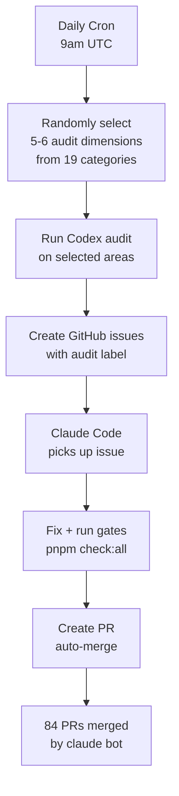

究極の進化形：UTC 午前 9 時に自動実行されるデイリー cron 監査。19 の監査カテゴリから 5〜6 のディメンションをランダムに選択し、コードベースの異なる部分を検査し、ラベル付き GitHub issue を作成し、Claude Code を修正にディスパッチ。84 の PR が `claude[bot]` によって自動作成・自動修正・自動マージされました——その多くは開発者が目覚める前に完了していました。

### 信頼のシグナル

開発者が監査を実行して発見があったとき、反応は「まずこの発見を確認させて」ではなく、常にこうでした：

> 「全部直して。」

これは、ツールが数百回にわたって証明してきたことで得られる信頼のレベルです。

## tdd-guardian：物議を醸したプラグイン

**使用状況**：明示的セッション 3 回。42 セッションで 5,500 回以上のバックグラウンド参照。

tdd-guardian の物語は最も興味深いです。失敗を含んでいるからです。

### ブロッキングフックの問題

tdd-guardian にはテストカバレッジ閾値が満たされないとコミットをブロックする PreToolUse フックが付属していました。理論上、これはテストファーストの規律を強制します。しかし実際には：

> 「tdd-guardian のブロッキングフックは外した方がいいかな、手動コマンドで実行するようにしたら？」

問題は本物でした。ステートファイル内の古い SHA が無関係なコミットをブロック。開発者はワークフローのブロックを解除するために手動で `state.json` にパッチを当てなければなりませんでした。ブロッキングフックは、すべての PR で既に `pnpm check:all` を実行している CI ゲートと冗長でした。

フックは無効化されました（[`f2fda819`](https://github.com/xiaolai/vmark/commit/f2fda819)）。しかし*哲学*は生き残りました。

### 26 フェーズのカバレッジキャンペーン

tdd-guardian が種を蒔いたのは、驚異的なカバレッジキャンペーンを駆動した規律でした：

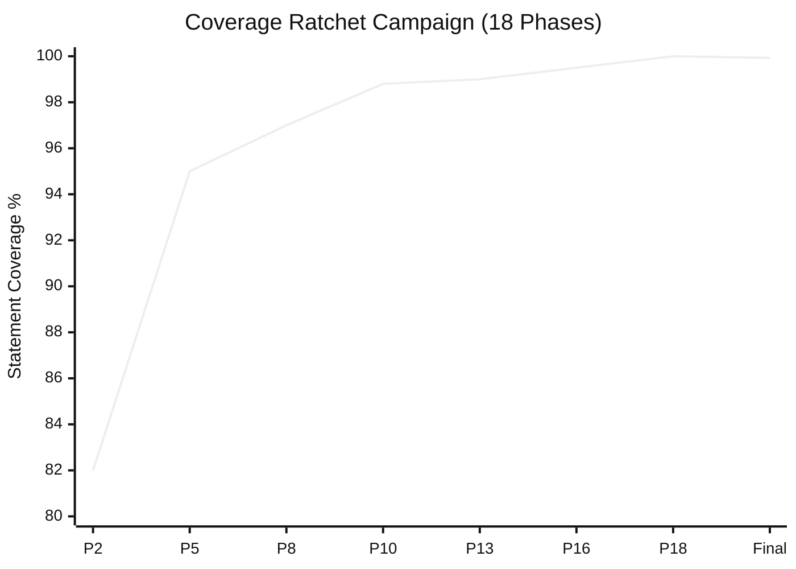

| フェーズ | コミット | 閾値 |
|-------|--------|-----------|
| フェーズ 2 | [`1e5cf94a`](https://github.com/xiaolai/vmark/commit/1e5cf94a) | 82/74/86/83 |
| フェーズ 5 | [`4658d75f`](https://github.com/xiaolai/vmark/commit/4658d75f) | 95/87/95/96 |
| フェーズ 8 | [`3d7239c3`](https://github.com/xiaolai/vmark/commit/3d7239c3) | tabEscape、codePreview、formatToolbar を深掘り |
| フェーズ 13 | [`9bec6612`](https://github.com/xiaolai/vmark/commit/9bec6612) | multiCursor、mermaidPreview、listEscape を深掘り |
| フェーズ 16 | [`730ff139`](https://github.com/xiaolai/vmark/commit/730ff139) | 145 ファイルの v8 アノテーション、99.5/99/99/99.6 |
| フェーズ 18 | [`1d996778`](https://github.com/xiaolai/vmark/commit/1d996778) | 100/99.87/100/100 にラチェット |
| 最終 | [`fcf5e00d`](https://github.com/xiaolai/vmark/commit/fcf5e00d) | 99.93% ステートメント / 99.96% 行 |

約 40%（「受け入れがたい」）から 99.96% の行カバレッジへ、18 フェーズにわたって各フェーズで閾値をさらに引き上げ、カバレッジが決して後退できないようにしました。テスト対プロダクションコード比は 1.97:1 に到達——テストコードはアプリケーションコードのほぼ 2 倍です。

### 教訓

最良の強制メカニズムは、習慣を変え、そしてその後退いてくれるものです。tdd-guardian のブロッキングフックは攻撃的すぎましたが、それを無効にした開発者は、ブロッキングフックを有効にしていた誰よりも多くのテストを書きました。

## docs-guardian：恥ずかしさ検出器

**使用状況**：3 セッション。初回監査で 2 件の重大問題を発見。

### `com.vmark.app` 事件

docs-guardian の正確性チェッカーはコードとドキュメントの両方を読み、比較します。VMark の初回フル監査で、AI Genies ガイドがユーザーに精霊の保存先として次のように案内していることを発見しました：

```
~/Library/Application Support/com.vmark.app/genies/
```

しかしコード内の実際の Tauri 識別子は `app.vmark` でした。本当のパスはこちらです：

```
~/Library/Application Support/app.vmark/genies/
```

これは 3 つのプラットフォームすべてで間違っており、英語ガイドと全 9 翻訳版のすべてで間違っていました。テストではこれを捕捉できません。linter でも捕捉できません。docs-guardian が捕捉できたのは、それがまさにその役割——コードとドキュメントを機械的に、すべてのマッピングペアについて比較すること——だからです。

### フル監査のインパクト

```mermaid
%%{init: {"theme": "neutral"}}%%
xychart-beta
    title "Documentation Health Before vs After"
    x-axis ["Accuracy", "Coverage", "Quality", "Overall"]
    y-axis "Score" 0 --> 100
    bar [78, 64, 83, 74]
    bar [95, 91, 88, 91]
```

| ディメンション | 導入前 | 導入後 | 変化 |
|-----------|--------|-------|-------|
| 正確性 | 78/100 | 95/100 | +17 |
| カバレッジ | 64% | 91% | +27% |
| 品質 | 83/100 | 88/100 | +5 |
| **総合** | **74/100** | **91/100** | **+17** |

1 回のセッションで 17 のドキュメント化されていない機能が発見・文書化されました。Markdown Lint エンジン——15 のルール、ショートカット、ステータスバーバッジを備えた——にはユーザードキュメントが一切ありませんでした。`vmark` シェル CLI コマンドは完全にドキュメント化されていませんでした。読み取り専用モード、ユニバーサルツールバー、タブのドラッグ分離——すべて出荷済みの機能でしたが、ドキュメントを誰も書かなかったためにユーザーが発見できない状態でした。

`config.json` 内の 19 のコード対ドキュメントマッピングにより、`shortcutsStore.ts` が変更されるたびに docs-guardian は `website/guide/shortcuts.md` の更新が必要であることを認識します。ドキュメントのドリフトが機械的に検出可能になりました。

## loc-guardian：300 行ルール

**使用状況**：4 セッション。14 ファイルにフラグ、うち 8 ファイルが警告レベル。

VMark の AGENTS.md にはこのルールがあります：「コードファイルは約 300 行以内に保つ（積極的に分割する）。」

このルールはスタイルガイドから生まれたものではありません。loc-guardian のスキャンから生まれました——500 行以上のファイルが次々と見つかり、それらはナビゲートしにくく、テストしにくく、AI アシスタントが効果的に扱うのが難しいものでした。最悪の違反者：`hot_exit/coordinator.rs` の 756 行。

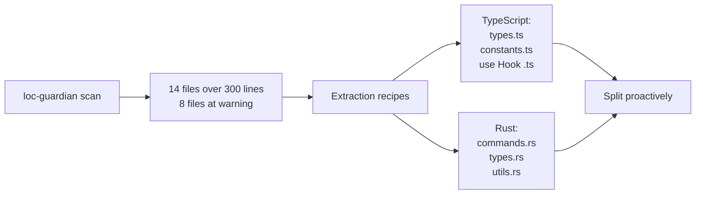

LOC データはプロジェクト評価にも活用されました——開発者が「このプロジェクトはどのくらいの人的工数を表すのか？」を理解したいとき、LOC レポートが出発点でした。答え：AI 支援開発で 40〜60 万ドル相当の投資。

## echo-sleuth：組織の記憶

**使用状況**：6 セッション。すべてのインフラストラクチャの基盤。

echo-sleuth は最も静かなプラグインですが、おそらく最も基盤的です。その JSONL パーシングスクリプトは、会話履歴を検索可能にするインフラストラクチャです。他のプラグインが過去のセッションで何が起きたかを思い出す必要があるとき、echo-sleuth のツーリングが実際の作業を行います。

この記事が存在するのは、echo-sleuth が 35 以上の VMark セッションをマイニングし、すべてのプラグイン呼び出し、すべてのユーザー反応、すべての意思決定ポイントを見つけたからです。292 件のイシュー数、84 件の PR 数、カバレッジキャンペーンのタイムライン、そして「自分自身を厳しく審査する」セッションを抽出しました。echo-sleuth がなければ、「なぜこれらのプラグインが不可欠なのか？」の証拠は逸話的なものに留まり、考古学的なものにはなりえなかったでしょう。

## grill：厳しい鏡

**インストール先**：すべての VMark セッション。**自己評価のために明示的に呼び出し。**

grill の最も印象的な瞬間は 3 月 21 日のセッションでした。開発者はこう尋ねました：

> 「もし時間と労力を気にせず、もっと厳しく自分を審査できるとしたら、何を変えますか？」

grill は 14 項目の品質ギャップ分析を出力しました——81 メッセージ、863 ツール呼び出しのセッションで、多フェーズ品質強化計画を推進しました（[`076dd96c`](https://github.com/xiaolai/vmark/commit/076dd96c)、[`5e47e522`](https://github.com/xiaolai/vmark/commit/5e47e522)）。発見内容：

- Rust バックエンドのテストカバレッジがわずか 27%
- モーダルダイアログにおける WCAG アクセシビリティギャップ（[`85dc29fa`](https://github.com/xiaolai/vmark/commit/85dc29fa)）
- 300 行規約を超える 104 ファイル
- 構造化ロガーにすべき Console.error 呼び出し（[`530b5bb7`](https://github.com/xiaolai/vmark/commit/530b5bb7)）

これはセミコロンの欠落を見つける linter ではありません。1 週間にわたる投資キャンペーンを駆動した戦略的な品質思考です。

## nlpm：成長の痛み

**呼び出し回数**：明示的 0 回。**摩擦を生じさせた**：1 セッション。

nlpm の PostToolUse フックが VMark の編集セッションを連続 3 回ブロックしました：

> 「PostToolUse:Edit フックが続行を止めたのはなぜ？」
> 「また止まった、なぜ？！」
> 「これは無害だが……時間の無駄だ。」

フックは編集されたファイルが自然言語成果物のパターンに一致するかチェックしていました。構造文字保護のバグ修正中、これは純粋なノイズでした。そのセッションでプラグインは無効化されました。

これは正直なフィードバックです。すべてのプラグインインタラクションが前向きなわけではありません。nlpm を構築した開発者は VMark を通じて、ファイルパターンに対する PostToolUse フックにはより良いフィルタリングが必要であること——バグ修正が自然言語成果物の lint をトリガーすべきではないこと——を発見しました。

## 5 フェーズの進化

プラグインの導入は一瞬で起きたわけではありません。明確な軌跡をたどりました：

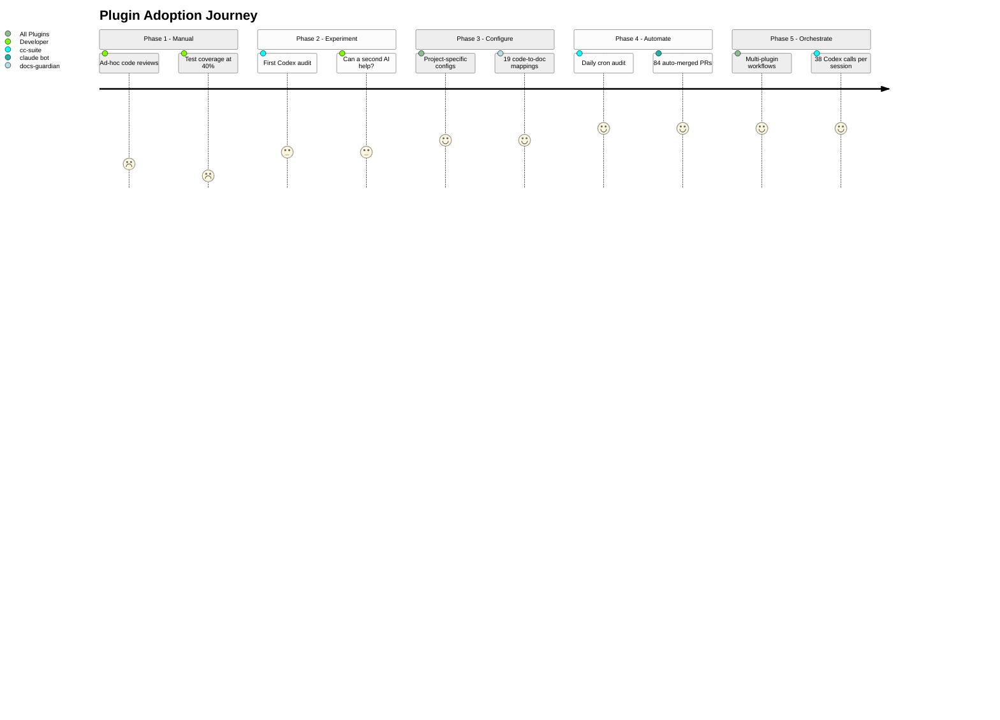

### フェーズ 1：手動監査（2026 年 1 月）
> 「コードベース全体を検査して、バグや抜けを見つけてくれ」

アドホックなレビュー。ツールなし。テストカバレッジ 40%。

### フェーズ 2：単一プラグイン実験（1 月末〜2 月初旬）
> 「Codex にコード品質をレビューさせよう」

MCP サーバーで初めて cc-suite を使用。実験段階。2 つ目の AI は 1 つ目が見落としたものを捕捉できるか？初回インストール：[`e6373c7a`](https://github.com/xiaolai/vmark/commit/e6373c7a)。

### フェーズ 3：設定済みインフラストラクチャ（3 月初旬）
プロジェクト固有の設定でプラグインをインストール。tdd-guardian を厳格な閾値で有効化（[`f775f300`](https://github.com/xiaolai/vmark/commit/f775f300)）。docs-guardian に 19 のコード対ドキュメントマッピングを設定。loc-guardian に 300 行制限と抽出ルールを設定。

### フェーズ 4：自動化パイプライン（3 月中旬）
UTC 午前 9 時のデイリー cron 監査。イシューの自動作成、自動修正、自動 PR、自動マージ。84 の PR が人手を介さずに処理。

### フェーズ 5：マルチプラグインオーケストレーション（3 月下旬）
単一セッション内で loc-guardian スキャン -> パフォーマンス監査 -> サブエージェント実装 -> cc-suite 監査 -> cc-suite 検証 -> バージョンバンプを組み合わせ。1 セッションで 38 回の Codex 呼び出し。プラグインがワークフローに構成されます。

## フィードバックループ

最も興味深いパターンは個々のプラグインではなく、このループです：

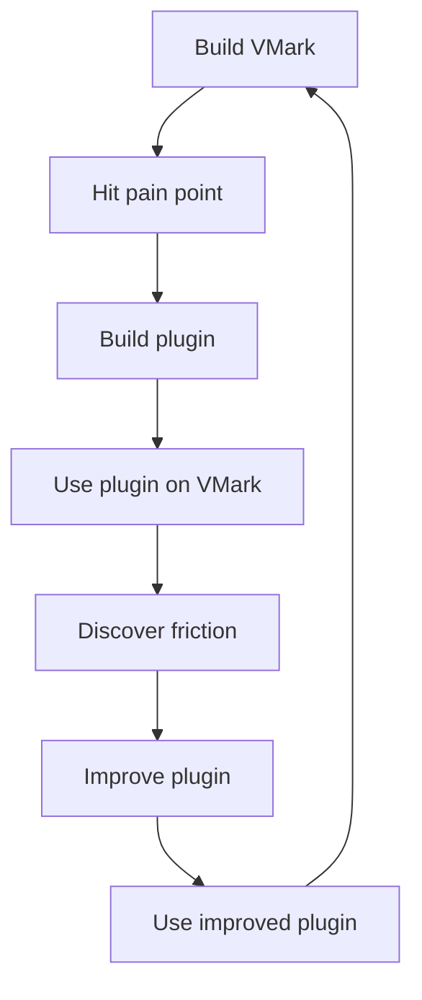

すべてのプラグインは VMark の構築から生まれました：

- **cc-suite** は、1 つの AI が自分の成果をレビューするだけでは不十分だから存在する
- **tdd-guardian** は、セッション間でカバレッジが下がり続けたから存在する
- **docs-guardian** は、ドキュメントが常にコードからドリフトするから存在する
- **loc-guardian** は、ファイルが常にメンテナンス不可能なサイズまで膨張するから存在する
- **echo-sleuth** は、セッションは一時的だが決定はそうではないから存在する
- **grill** は、アーキテクチャの問題には敵対的レビューが必要だから存在する
- **nlpm** は、プロンプトやスキルファイルもコードだから存在する

そしてすべてのプラグインは VMark の構築を通じて改善されました：

- tdd-guardian のブロッキングフックは攻撃的すぎると判明——オプトイン型の強制への提案につながった
- nlpm のファイルパターンマッチングは広すぎると判明——無関係なバグ修正中にブロックを引き起こした
- cc-suite のネーミングはセッション中にファントム参照が発見された後に修正された
- docs-guardian の正確性チェッカーは、他のどのツールにも捕捉できない `com.vmark.app` バグの発見でその価値を証明した

## 多層品質システム

7 つのプラグインは共に、多層の品質保証システムを構成しています：

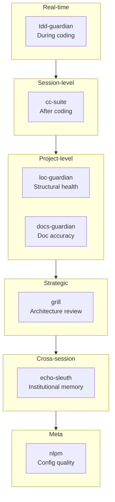

| レイヤー | プラグイン | 作用タイミング | 捕捉対象 |
|-------|--------|-------------|-----------------|
| リアルタイム規律 | tdd-guardian | コーディング中 | テストのスキップ、カバレッジの後退 |
| セッションレベルレビュー | cc-suite | コーディング後 | バグ、セキュリティ、アクセシビリティ |
| 構造的健全性 | loc-guardian | オンデマンド | ファイル肥大、複雑性の増加 |
| ドキュメント同期 | docs-guardian | オンデマンド | 古いドキュメント、不足ドキュメント、誤ったドキュメント |
| 戦略的評価 | grill | 定期的 | アーキテクチャのギャップ、テストのギャップ、品質負債 |
| 組織の記憶 | echo-sleuth | クロスセッション | 失われた決定、忘れられたコンテキスト |
| 設定品質 | nlpm | 編集時 | 低品質なプロンプト、弱いスキル、壊れたルール |

これは「オプションのツール」ではありません。再帰的 AI 開発を信頼に足るものにするガバナンスレイヤーです——AI がコードを書き、AI がコードを監査し、AI が監査結果を修正し、AI が修正を検証します。

## なぜ不可欠なのか

「不可欠」は強い言葉です。テストはこうです：それらなしの VMark はどうなっていたでしょうか？

**cc-suite なし**：292 件分のバグ、セキュリティ脆弱性、アクセシビリティギャップが蓄積していたでしょう。導入から 24 時間以内に問題を捕捉する自動化パイプラインは存在しなかったでしょう。開発者は手動の定期レビューに頼ることになります——1 月のセッションが示すように、せいぜいアドホックに行われる程度です。

**tdd-guardian なし**：26 フェーズのカバレッジキャンペーンは起きなかったかもしれません。閾値をラチェットで引き上げる規律——カバレッジは上がることしかできず、下がることはない——は tdd-guardian が植え付けたマインドセットから生まれました。99.96% のカバレッジは偶然には起きません。

**docs-guardian なし**：ユーザーは今でも存在しないディレクトリで精霊を探しているでしょう。17 の機能は発見不可能なままでしょう。ドキュメントの正確性は測定ではなく、希望に基づくものになっていたでしょう。

**loc-guardian なし**：ファイルは 500、800、1000 行へと膨張していくでしょう。コードベースをナビゲート可能に保つ「300 行ルール」は、強制された制約ではなく、提案に過ぎなくなります。

**echo-sleuth なし**：毎セッション、ゼロからスタート。「メニューショートカットの競合について何を決めたっけ？」は会話ログの手動検索が必要になります。

**grill なし**：Rust のテストギャップ（27%）、WCAG アクセシビリティギャップ、104 の肥大ファイル——これらの戦略的品質投資は grill の敵対的分析によって推進されたものであり、バグ報告によるものではありません。

プラグインが不可欠なのは、巧妙だからではありません。人間（と AI）がセッション間で忘れてしまう規律をエンコードしているから不可欠なのです。カバレッジは上がるのみ。ドキュメントはコードに一致。ファイルは小さく保つ。リリース前に必ず監査。これらは願望ではなく——毎日稼働するツールによって強制されています。

## ルールとスキル：体系化された知識

プラグインは物語の半分です。もう半分は、プラグインとともに蓄積された知識インフラストラクチャです。

### 13 のルール（1,950 行の組織知識）

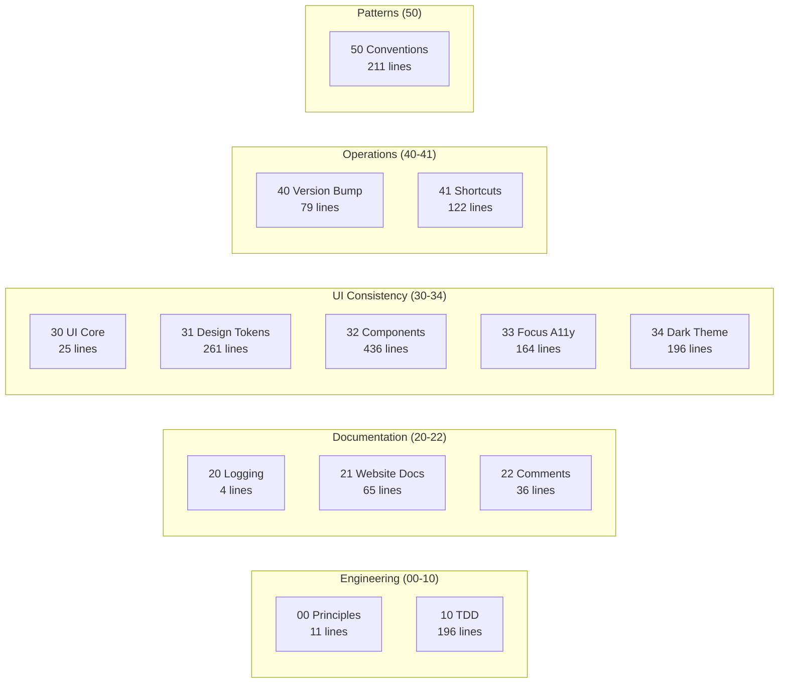

VMark の `.claude/rules/` ディレクトリには 13 のルールファイルがあります——曖昧なガイドラインではなく、具体的で強制可能な規約です：

| ルールファイル | 行数 | 体系化された内容 |
|-----------|-------|----------------|
| `00-engineering-principles.md` | 11 | コア規約（Zustand デストラクチャリング禁止、300 行制限） |
| `10-tdd.md` | 196 | 5 つのテストパターンテンプレート、アンチパターンカタログ、カバレッジゲート |
| `20-logging-and-docs.md` | 4 | トピックごとの単一情報源 |
| `21-website-docs.md` | 65 | コード対ドキュメントマッピングテーブル（どのコード変更がどのドキュメント更新を必要とするか） |
| `22-comment-maintenance.md` | 36 | コメントの更新/非更新のタイミング、コメント腐敗の防止 |
| `30-ui-consistency.md` | 25 | コア UI 原則、サブルールへのクロスリファレンス |
| `31-design-tokens.md` | 261 | 完全な CSS トークンリファレンス——すべてのカラー、スペーシング、ボーダーラディウス、シャドウ |
| `32-component-patterns.md` | 436 | ポップアップ、ツールバー、コンテキストメニュー、テーブル、スクロールバーのパターンとコード |
| `33-focus-indicators.md` | 164 | コンポーネントタイプ別 6 つのフォーカスパターン（WCAG 準拠） |
| `34-dark-theme.md` | 196 | テーマ検出、オーバーライドパターン、移行チェックリスト |
| `40-version-bump.md` | 79 | 5 ファイルバージョン同期手順と検証スクリプト |
| `41-keyboard-shortcuts.md` | 122 | 3 ファイル同期（Rust/フロントエンド/ドキュメント）、競合チェック、規約 |
| `50-codebase-conventions.md` | 211 | 開発中に発見された 10 のドキュメント化されていないパターン |

これらのルールは毎セッションの開始時に Claude Code が読み込みます。だからこそ、2,180 番目のコミットは 100 番目と同じ規約に従っています。

ルール `50-codebase-conventions.md` は特に注目に値します——*誰も設計していない*パターンを文書化しています。開発中に自然に現れ、その後体系化されました：Store 命名規約、Hook クリーンアップパターン、プラグイン構造、MCP ブリッジハンドラシグネチャ、CSS 構成、エラーハンドリングイディオム。

### 19 のプロジェクトスキル（ドメイン専門知識）

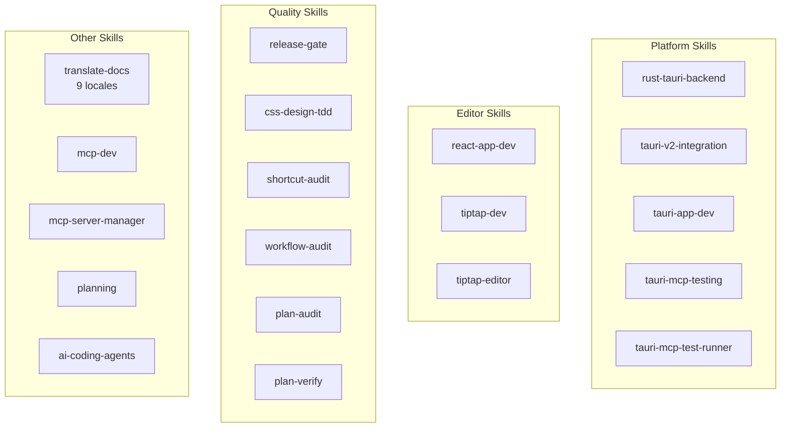

| カテゴリ | スキル | 用途 |
|----------|--------|-----------------|
| **Tauri/Rust** | `rust-tauri-backend`、`tauri-v2-integration`、`tauri-app-dev`、`tauri-mcp-testing`、`tauri-mcp-test-runner` | Tauri v2 規約に準拠したプラットフォーム固有の Rust 開発 |
| **React/エディタ** | `react-app-dev`、`tiptap-dev`、`tiptap-editor` | Tiptap/ProseMirror エディタパターン、Zustand セレクタルール |
| **品質** | `release-gate`、`css-design-tdd`、`shortcut-audit`、`workflow-audit`、`plan-audit`、`plan-verify` | あらゆるレベルでの自動化品質検証 |
| **ドキュメント** | `translate-docs` | サブエージェント駆動監査付き 9 ロケール翻訳 |
| **MCP** | `mcp-dev`、`mcp-server-manager` | MCP サーバー開発と設定 |
| **プランニング** | `planning` | 意思決定ドキュメント付き実装計画の生成 |
| **AI ツール** | `ai-coding-agents` | マルチエージェントオーケストレーション（Codex CLI、Claude Code、Gemini CLI） |

### 7 つのスラッシュコマンド（ワークフロー自動化）

| コマンド | 機能 |
|---------|-------------|
| `/bump` | 5 ファイルにわたるバージョンバンプ、コミット、タグ、プッシュ |
| `/fix-issue` | エンドツーエンド GitHub issue リゾルバ——取得、分類、修正、監査、PR |
| `/merge-prs` | オープンな PR を順次レビュー・マージ、rebase ハンドリング付き |
| `/fix` | 問題を正しく修正——パッチなし、近道なし、リグレッションなし |
| `/repo-clean-up` | 失敗した CI 実行と古いリモートブランチを削除 |
| `/feature-workflow` | ゲート付き、エージェント駆動のエンドツーエンド機能開発 |
| `/test-guide` | 手動テストガイドを生成 |

### 複合効果

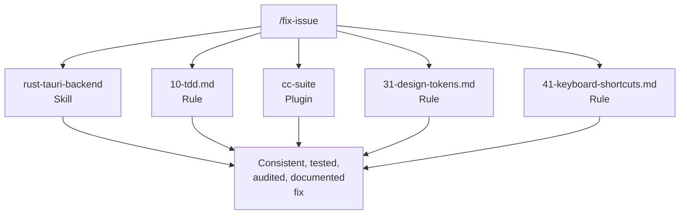

ルール + スキル + プラグイン + コマンドが複合システムを形成します。`/fix-issue` を実行すると、Rust の変更に `rust-tauri-backend` スキルを使用し、テスト要件に `10-tdd.md` ルールに従い、監査に `cc-suite` を呼び出し、CSS 準拠を `31-design-tokens.md` で確認し、ショートカット同期を `41-keyboard-shortcuts.md` で検証します。

単独で革命的な部分はありません。複合効果——13 ルール x 19 スキル x 7 プラグイン x 7 コマンド、すべてが相互に強化——がシステムを機能させるのです。各部品はギャップが発見されたときに追加され、実際の開発でテストされ、使用を通じて洗練されました。

## プラグインビルダーへ

Claude Code プラグインの構築を考えているなら、VMark が教えてくれたことは以下の通りです：

1. **まず自分のために作る。** 最良のプラグインは仮想の問題ではなく、実際の問題を解決します。

2. **徹底的にドッグフーディングする。** 実際のプロジェクトでプラグインを使いましょう。あなたが発見する摩擦は、ユーザーが発見する摩擦です。

3. **フックにはエスケープハッチが必要。** オーバーライドできないブロッキングフックは完全に無効化されます。強制はオプトインまたはコンテキストアウェアにしましょう。

4. **クロスモデル検証は機能する。** 異なる AI にメインの AI の成果をレビューさせると、本物のバグを捕捉します。冗長ではなく——直交的です。

5. **規律をエンコードせよ、ルールではなく。** 最良のプラグインは習慣を変えます。tdd-guardian のブロッキングフックは削除されましたが、それが触発したカバレッジキャンペーンはプロジェクトで最もインパクトのある品質投資でした。

6. **コンポーズせよ、モノリスにするな。** 7 つの特化したプラグインは 1 つの巨大プラグインに勝ります。各々が一つのことをうまくこなし、部分の総和を超えるワークフローに構成されます。

7. **信頼は呼び出しごとに獲得される。** 開発者が cc-suite を信頼して発見をレビューせずに「全部直して」と言えるのは、27 セッションと 292 件の解決済みイシューで築かれた信頼があるからです。

---

*VMark は [github.com/xiaolai/vmark](https://github.com/xiaolai/vmark) でオープンソース公開中。全 7 プラグインは `xiaolai` Claude Code マーケットプレイスで入手可能です。*
