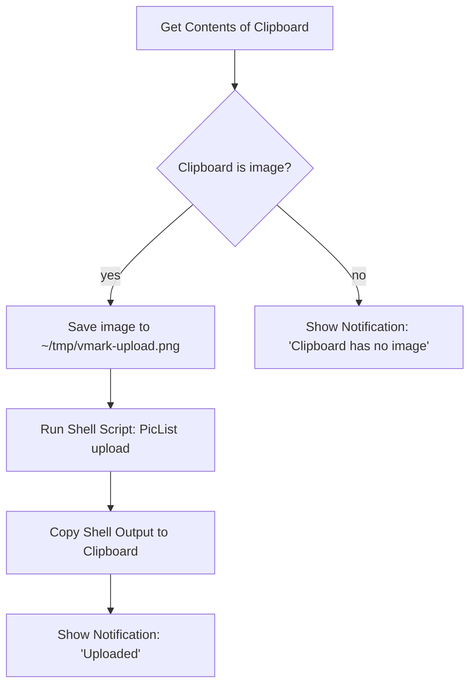

# 클라우드 호스팅 이미지

VMark는 로컬 우선 글쓰기 도구예요. 클립보드에서 붙여 넣는 이미지를 자동으로 업로드해 주는 기능은 내장되어 있지 않고, 클라우드 자격 증명을 저장하지도 않아요. 블로그 게시, 기기 간 동기화, CMS 발행 등의 이유로 Markdown에 공개 CDN URL이 들어가야 한다면, VMark *바깥*에서 동작하는 OS 차원의 자동화로 처리한 뒤 그 결과를 VMark로 다시 가져오는 방식을 권장해요.

이 페이지에서는 VMark가 왜 이렇게 설계되었는지, 별도 설정 없이도 이미 동작하는 부분은 무엇인지, 그리고 Shortcuts.app 레시피를 약 10분 만에 연결하는 방법을 설명해요.

[[toc]]

## VMark가 이미 지원하는 것

VMark는 Markdown에서 이미지 참조를 다룰 때 두 가지 방향을 구분해요.

| 방향 | 상태 | 트리거 | Markdown 결과 |
|-----------|--------|---------|--------------------|
| 기존 원격 URL 삽입 | 지원 | `https://…` URL 붙여 넣기 또는 입력 | URL 그대로 |
| 원격 URL이 포함된 Markdown 소스 | 지원 | 누군가 ``를 작성 | 바로 렌더링됨 |
| 로컬 이미지 삽입 | 지원 | 붙여 넣기, 드롭, 바이너리 삽입 | `.assets/`로 복사되고 상대 경로로 기록됨 |
| 로컬 이미지를 삽입 *하면서 원격에도 저장* | **내장 기능 없음** | (아래 레시피 참고) | — |

요약하자면, 이미지가 이미 URL로 존재한다면 그 URL을 붙여 넣기만 하면 돼요. VMark가 이를 Markdown 이미지 참조로 삽입하고 webview가 이미지를 가져와요. 즉, 읽기 경로는 이미 클라우드 친화적이에요.

## 왜 VMark에는 클라우드 업로드 기능이 내장되어 있지 않을까

만약 이 기능을 내장한다면 VMark는 붙여 넣는 순간 로컬 이미지를 감지해서 원격 저장소에 업로드하고, `./.assets/…` 경로 대신 반환된 URL을 Markdown에 기록하게 될 거예요. 사소해 보이지만, 이는 VMark의 역할을 세 가지 본질적인 방향으로 확장시켜요.

1. **자격 증명 보관 문제.** S3 호환 업로드를 내장하려면 사용자의 access key와 secret access key를 디스크에 저장해야 해요. 그런데 지금 VMark에는 장기 보관되는 비밀 정보가 전혀 없어요. 디스크 암호화 정책도, OS 키체인 연동도, 키 회전 UX도, Markdown에 키가 실수로 노출되는 실패 시나리오도 다뤄 본 적이 없어요. 업로드 기능을 더하는 순간 VMark는 그 경계를 넘어서게 돼요.

2. **다중 공급자 지원의 끝없는 가지치기.** S3, Cloudflare R2, Backblaze B2, MinIO, DigitalOcean Spaces 모두 "S3 호환"을 내세우지만, 저마다 미묘한 차이가 있어요 (path-style과 virtual-hosted 주소 방식, ACL 동작, 지역별 엔드포인트, CORS 규칙 등). 한 명의 메인테이너가 이 모든 표면을 떠안는 일은 글쓰기 도구가 장기적으로 감당하기 어려운 짐이 돼요.

3. **조합이냐, 직접 소유냐.** [PicList](https://github.com/Kuingsmile/PicList)나 [PicGo](https://github.com/Molunerfinn/PicGo) 같은 도구는 공급자별 설정과 자격 증명 저장까지 포함해 이 문제를 이미 잘 해결하고 있어요. macOS의 Shortcuts.app이나 Keyboard Maestro를 쓰면 이런 도구를 시스템의 어떤 텍스트 입력란에든 연결할 수 있어요. VMark 안에서만 통하는 방식이 아니라요. 업로드 기능을 VMark에 내장한다면 외부에 더 적합한 코드를 중복으로 떠안는 셈이고, 그 결과는 VMark 안에서만 동작하게 돼요.

그래서 내린 결론은 이래요. **VMark는 글쓰기 도구로서의 역할에 집중하고, 이미지 업로드는 사용자의 OS 차원 자동화 도구에 맡긴다**는 거예요. 아래 레시피로 그 OS 차원 경로를 구체적으로 보여 드릴게요.

## 레시피: Shortcuts.app + PicList (macOS, 무료)

Shortcuts.app은 macOS Monterey (12) 이상에 기본 탑재되어 있어요. PicList는 무료 오픈소스 이미지 업로더고요. 둘을 함께 쓰면 현재 클립보드에 있는 이미지를 PicList로 업로드한 뒤 (PicList는 이미 R2, S3, Imgur 등 수십 가지 백엔드와 통신할 줄 알아요), 반환된 URL로 클립보드 내용을 교체하는 단축키를 만들 수 있어요. 그다음 VMark에서 `Cmd + V`를 누르면 URL이 삽입되고, 나머지는 VMark의 원격 URL 감지 기능이 알아서 처리해요.

### 사전 준비

1. **PicList 설치 및 설정.** [PicList 릴리스 페이지](https://github.com/Kuingsmile/PicList/releases)에서 내려받은 뒤 한 번 실행해서, *PicBed Settings*에서 이미지 호스트 (R2, S3, Imgur, smms 등) 하나 이상을 설정하세요. 단축어를 연결하기 전에 PicList 안에서 수동 업로드가 정상 동작하는지 먼저 확인하세요. 이렇게 하면 "PicList 자체에 문제가 있는가"와 "단축어 연결에 문제가 있는가"를 분리해서 진단할 수 있어요.

2. **PicList CLI 동작 확인.** PicList는 앱 번들 안에 `upload` 서브커맨드를 제공해요. macOS에서 바이너리 경로는 `/Applications/PicList.app/Contents/MacOS/PicList`예요. 다음 명령으로 확인해 보세요.

   ```sh
   /Applications/PicList.app/Contents/MacOS/PicList upload --help
   ```

   CLI 도움말이 출력되어야 정상이에요. 그렇지 않다면 PicList가 `/Applications`에 설치되어 있는지 확인하세요 (`~/Applications`에 있다면 경로를 그에 맞게 조정하세요).

### 단축어 만들기

`Shortcuts.app`을 열고 새 단축어를 만든 뒤, 아래 작업을 순서대로 추가하세요.



Shortcuts 편집기에서의 구체적인 단계는 다음과 같아요.

1. **작업: Get Contents of Clipboard.** 작업 사이드바에서 끌어다 놓으세요. 별도 설정 없음.

2. **작업: If.** 조건은 *Clipboard is Media › Image*로 설정하세요. (드롭다운에 *Media*가 보이지 않는다면 *Contents › has any value*를 좀 더 느슨한 조건으로 써도 돼요.)

3. **If 분기 안 — 작업: Save File.** 다음과 같이 설정하세요.
   - 서비스: *Files*
   - 대상: `~/tmp/` (폴더가 없다면 Finder에서 한 번 만들어 두세요).
   - 파일 이름: `vmark-upload.png` (이름을 고정해 두면 다음 단계의 경로가 예측 가능해져요).
   - *Ask Where To Save*를 꺼서 단축어가 사용자 개입 없이 실행되도록 하세요.

4. **작업: Run Shell Script.** 다음과 같이 설정하세요.
   - Shell: `/bin/zsh` (macOS 기본값).
   - 입력: *Pass Input as `stdin`*. 사실 의도는 `as arguments`에 가깝지만, 아래 스크립트는 stdin을 무시하고 경로를 직접 박아 두기 때문에 어느 쪽으로 두어도 동작해요.
   - 스크립트 본문:

     ```sh
     /Applications/PicList.app/Contents/MacOS/PicList upload "$HOME/tmp/vmark-upload.png" 2>/dev/null | tail -n 1
     ```

   `tail -n 1`은 안전장치예요. PicList가 URL 앞에 안내성 로그 줄을 함께 출력하는 경우가 있거든요. 사용하시는 PicList 버전의 실제 출력 형태를 한 번 확인해 보세요. URL만 단독으로 반환된다면 `tail`은 아무 일도 하지 않아요.

5. **작업: Copy to Clipboard.** 입력을 *Shell Script Result*로 설정하세요.

6. **작업: Show Notification.** 제목은 `Uploaded`, 본문은 *Shell Script Result*로 설정하세요. URL이 클립보드에 들어갔다는 것도 확인되고, 무엇이 업로드되었는지도 함께 보여 줘요.

7. **(선택) Else 분기 — 작업: Show Notification.** 제목은 `No image on clipboard`. 단축키를 눌렀지만 클립보드에 실제로 이미지가 없었던 경우를 디버깅할 때 도움이 돼요.

### 전역 단축키 지정

Shortcuts 편집기에서 단축어의 *(i)* 정보 버튼을 누른 뒤 *Add Keyboard Shortcut*을 선택하세요. VMark의 단축키와 충돌하지 않는 조합을 골라야 해요. `Control + Option + Command + U`가 자주 쓰이는 선택이에요 (macOS 기본 단축키와 충돌이 없고, "Upload"가 연상돼서 외우기 좋아요).

### 사용 방법

1. `Cmd + Shift + Ctrl + 4`로 스크린샷을 찍으세요 (디스크가 아니라 클립보드에 저장돼요). 다른 앱에서 이미지를 복사해도 돼요.
2. 업로드 단축키 (`Ctrl + Opt + Cmd + U`)를 누르세요.
3. 알림이 뜰 때까지 약 1~3초 기다리세요.
4. VMark에서 `Cmd + V`로 붙여 넣으세요. Markdown에 `` 형태로 들어가요.

### 자주 발생하는 문제

| 증상 | 가능한 원인 | 해결 방법 |
|---------|--------------|-----|
| 단축어는 실행되는데 PicList가 동작하지 않음 | PicList 바이너리 경로가 잘못됨 | `/Applications/PicList.app/Contents/MacOS/PicList` 파일이 있는지 확인하고, 다른 위치에 설치되어 있다면 경로를 그에 맞게 조정하세요 |
| 알림은 뜨는데 클립보드에 여전히 이미지가 들어 있음 | Shell 스크립트가 빈 값을 반환함 | 정상임이 확인된 파일 경로로 shell 스크립트를 수동 실행해서 PicList의 실제 출력을 확인하세요 |
| URL이 잘못되어 있거나 끝에 공백이 붙어 있음 | `tail -n 1`이 URL이 아닌 로그 줄을 잡음 | PicList 출력을 직접 살펴보고 파싱을 조정하세요. 더 엄격한 대안으로 `grep -oE 'https://[^[:space:]]+' \| tail -n 1`을 쓸 수 있어요 |
| VMark에서 `Cmd + V`를 눌렀을 때 이미지가 아니라 일반 텍스트가 삽입됨 | URL이 PicList가 인식하는 이미지 확장자로 끝나지 않음 | 업로드 과정에서 파일 확장자가 유지되는지 확인하세요. R2/S3는 보통 확장자를 유지하지만, 버킷 키 템플릿을 함께 점검해 보세요 |

## 대안: Keyboard Maestro

[Keyboard Maestro](https://www.keyboardmaestro.com/)는 Shortcuts.app보다 자유도가 훨씬 높은 유료 macOS 자동화 도구예요. 이 워크플로에서 가장 실질적인 장점은, 클립보드에 이미지가 들어 있을 때 KM이 `Cmd + V`를 직접 가로챌 수 있다는 점이에요. 덕분에 단축키 한 번, 그다음 `Cmd + V` 한 번으로 두 단계를 거치지 않고, 키 입력 한 번으로 업로드와 붙여 넣기를 끝낼 수 있어요.

레시피 자체는 Shortcuts.app 버전과 구조적으로 같아요. 클립보드 이미지 가져오기, 파일로 저장, PicList CLI 실행, 클립보드 교체, 필요하면 붙여 넣기 동작까지 시뮬레이션하는 순서예요. KM의 *Trigger* 매크로 빌더가 더 유연해서 (클립보드 내용 변화로 트리거, 앱별 범위 지정 등) 활용 폭은 더 넓지만, 업로드 단계 자체는 동일해요.

Keyboard Maestro를 이미 사용하고 있지 않다면, Shortcuts.app이 더 부담 없는 선택이에요.

## 대안: 게시 전 처리 스크립트

자체 호스팅 블로그나 정적 사이트 파이프라인을 가진 사용자에게는 이 방식이 가장 깔끔한 답인 경우가 많아요. VMark의 기본 동작 (`.assets/` 상대 경로)을 그대로 유지하면서, 빌드 시점에 Markdown을 훑어 각 이미지를 업로드하고 경로를 다시 써 주는 스크립트를 돌리는 거예요. 이 방식은 이미지를 붙여 넣을 때마다 발생하는 지연을 게시 시점의 일괄 업로드로 미루는 방식이라, 편집기 자체는 가볍게 유지돼요.

최소 형태의 예시예요 (Node.js, 의사 코드).

```js
// scan-and-upload.js
const fs = require("fs");
const { execSync } = require("child_process");

const md = fs.readFileSync(process.argv[2], "utf8");
const rewritten = md.replace(/!\[(.*?)\]\((\.\/\.assets\/[^)]+)\)/g, (_, alt, path) => {
  const url = execSync(
    `/Applications/PicList.app/Contents/MacOS/PicList upload "${path}"`,
  ).toString().trim();
  return ``;
});
fs.writeFileSync(process.argv[2].replace(/\.md$/, ".published.md"), rewritten);
```

Hugo와 [Page Bundles](https://gohugo.io/content-management/page-bundles/), Jekyll, Astro, Eleventy 같은 여러 정적 사이트 생성기는 빌드 시점에 상대 `.assets/` 경로를 기본적으로 잘 처리해요. 이런 도구로 게시한다면 별도의 스크립트가 필요하지 않아요.

## 이미 호스팅된 URL

마지막으로 덧붙이자면, 이미지가 이미 공개 URL로 존재한다면 그 URL을 VMark에 붙여 넣는 것만으로 끝이에요. 클립보드 이미지 경로 감지기가 이를 `type: "url"`로 분류하고 URL을 그대로 기록해요. 업로드도, `.assets/`로의 복사도, 따로 바꿀 설정도 없어요. 이것이 VMark가 지원하는 가장 단순한 클라우드 이미지 워크플로이고, 별도의 도구도 필요 없어요.

## 관련 문서

- [파일 및 이미지 설정](./settings.md) — 자동 크기 조정, assets 폴더로 복사, 사용하지 않는 파일 정리
- [개인정보 보호](./privacy.md) — VMark가 로컬에 저장하는 것과 기기를 떠나는 것
