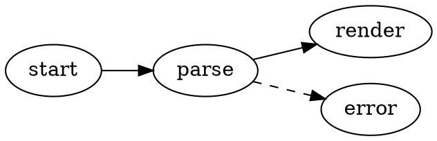
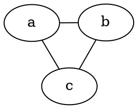

# Graphviz 다이어그램

VMark는 마크다운 문서에서 [Graphviz](https://graphviz.org/) DOT 그래프를 직접 렌더링합니다. 다이어그램은 Graphviz WASM 빌드 ([@viz-js/viz](https://github.com/mdaines/viz-js))로 로컬에서 렌더링됩니다 — 네트워크 접근도, 외부 바이너리도 필요 없습니다.

[[toc]]

## 다이어그램 삽입

메뉴 바의 **삽입 → Graphviz 다이어그램** (또는 툴바의 삽입 그룹)을 사용하여 템플릿 다이어그램을 삽입합니다 — 단축키는 기본적으로 할당되어 있지 않으며 설정에서 사용자 정의할 수 있습니다. 또는 `dot`이나 `graphviz` 언어 식별자와 함께 펜스드 코드 블록을 입력합니다:

````markdown

````

두 펜스 언어는 동일하게 동작합니다:

| 펜스 | 렌더링 결과 |
|-------|------------|
| ` ```dot ` | Graphviz 다이어그램 |
| ` ```graphviz ` | Graphviz 다이어그램 |

## 편집 모드

- **WYSIWYG 모드** — 코드 블록이 다이어그램으로 렌더링됩니다. 더블 클릭하면 디바운스된 실시간 미리보기를 확인하면서 DOT 소스를 편집할 수 있고, 편집 헤더에서 저장하거나 취소합니다.
- **소스 모드** — 커서를 ` ```dot ` 펜스 안에 놓으면 Mermaid와 동일하게 플로팅 다이어그램 미리보기 (드래그, 크기 조정, 줌)가 나타납니다.

## 패닝, 줌 및 내보내기

렌더링된 다이어그램은 Mermaid 다이어그램과 동일한 컨트롤을 지원합니다:

- **Cmd/Ctrl + 스크롤**로 줌, 드래그로 패닝, 초기화 버튼으로 중앙 재정렬
- 내보내기 버튼을 통해 **PNG로 내보내기** (밝은 배경 또는 어두운 배경)

## 엔진 및 레이아웃

다이어그램은 기본적으로 `dot` 엔진 (계층형/레이어드 레이아웃)으로 배치됩니다. 다른 엔진을 사용하려면 그래프에 표준 Graphviz `layout` 속성을 설정하세요 — 이 설정은 문서에 함께 저장되므로 다른 모든 Graphviz 도구에서도 그대로 동작합니다:

````markdown

````

| 엔진 | 레이아웃 스타일 |
|--------|--------------|
| `dot` | 계층형 / 레이어드 (기본값) |
| `neato` | 스프링 모델 (force-directed) |
| `fdp` | Force-directed, 더 큰 그래프용 |
| `sfdp` | 멀티스케일 force-directed, 매우 큰 그래프용 |
| `circo` | 원형 |
| `twopi` | 방사형 |
| `osage` | 클러스터형 |
| `patchwork` | 트리맵 (squarified) |

알 수 없는 `layout` 값을 지정하면 다른 DOT 오류와 마찬가지로 렌더링 오류 상태가 표시됩니다.

서브그래프와 클러스터, 랭크, 노드 모양, 엣지 스타일, HTML 스타일 레이블, 명시적 색상 등 Graphviz가 지원하는 모든 표준 DOT 기능이 그대로 동작합니다.

## 테마 통합

- 다이어그램 배경은 투명하므로 에디터 테마를 따릅니다.
- 기본 노드, 엣지, 텍스트 색상은 활성 테마의 디자인 토큰에서 파생되므로 모든 테마 (White, Paper, Mint, Sepia, Night, Solarized)에서 다이어그램이 자연스럽게 보이고 테마를 전환하면 함께 업데이트됩니다.
- DOT 소스의 명시적 색상은 항상 테마 기본값보다 우선합니다 — `bgcolor`, `color`, `fontcolor`를 직접 설정한 그래프는 작성된 그대로 렌더링됩니다.

## 오류 처리

DOT 소스에 구문 오류가 있으면 다이어그램 대신 렌더링 오류 상태가 표시됩니다. 소스를 수정하면 미리보기가 자동으로 다시 렌더링됩니다.

## HTML 및 PDF 내보내기

내보낸 HTML 및 PDF 문서에는 렌더링된 SVG가 포함되므로 다이어그램이 VMark 외부에서도 동일하게 표시됩니다.
