# 사용자이자 개발자

VMark 를 만드는 과정에서 단련된 일곱 개의 Claude Code 플러그인이 어떻게 없어서는 안 될 도구가 되었는가.

## 시작

VMark 는 Tauri, React, Rust 로 만든 AI 친화적 Markdown 에디터예요. 10 주간의 개발 과정에서:

| 지표 | 값 |
|--------|-------|
| 커밋 | 2,180+ |
| 코드베이스 규모 | 305,391 줄 |
| 테스트 커버리지 | 99.96% lines |
| 테스트:프로덕션 비율 | 1.97:1 |
| 감사 이슈 생성 및 해결 | 292 |
| 자동화된 PR 머지 | 84 |
| 문서 언어 | 10 |
| MCP 서버 도구 | 12 |

한 명의 개발자가 Claude Code 와 함께 이 프로젝트를 만들었어요. 그 과정에서 그 개발자는 Claude Code 마켓플레이스에 일곱 개의 플러그인을 만들었는데——부업이 아니라 생존 도구였어요. 각 플러그인은 아직 존재하지 않는 해결책이 필요한 구체적인 고충에서 탄생했어요.

## 플러그인들

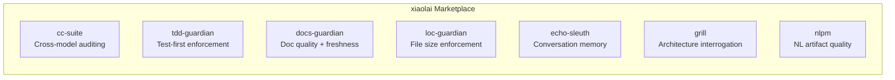

| 플러그인 | 기능 | 탄생 배경 |
|--------|-------------|-----------|
| [cc-suite](https://github.com/xiaolai/cc-suite) | OpenAI Codex 를 통한 크로스 모델 코드 감사 | "Claude 가 아닌 또 다른 눈이 필요해" |
| [tdd-guardian](https://github.com/xiaolai/tdd-guardian-for-claude) | 테스트 우선 워크플로 강제 | "테스트를 잊으면 커버리지가 계속 떨어져" |
| [docs-guardian](https://github.com/xiaolai/docs-guardian-for-claude) | 문서 품질 및 최신성 감사 | "문서에는 `com.vmark.app` 이라고 되어 있는데 실제 식별자는 `app.vmark` 야" |
| [loc-guardian](https://github.com/xiaolai/loc-guardian-for-claude) | 파일별 줄 수 제한 강제 | "이 파일이 800 줄인데 아무도 몰랐어" |
| [echo-sleuth](https://github.com/xiaolai/echo-sleuth-for-claude) | 대화 기록 마이닝 및 기억 | "3 주 전에 그 건에 대해 뭐라고 결정했지?" |
| [grill](https://github.com/xiaolai/grill-for-claude) | 다각도 심층 코드 심문 | "린트가 아니라 아키텍처 리뷰가 필요해" |
| [nlpm](https://github.com/xiaolai/nlpm-for-claude) | 자연어 프로그래밍 아티팩트 품질 | "내 프롬프트와 스킬이 실제로 잘 작성되어 있나?" |

## 전과 후

변화는 3 개월 만에 일어났어요.

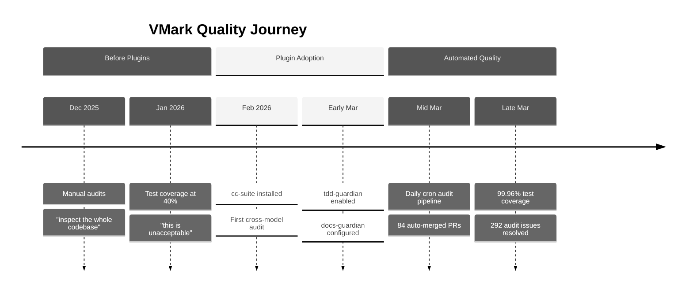

**플러그인 도입 전** (2025 년 12 월 -- 2026 년 2 월): 수동 코드 감사. 개발자는 "전체 코드베이스를 점검하고 가능한 버그와 빈틈을 찾아봐"와 같은 말을 했어요. 테스트 커버리지는 약 40% 에 머물렀고——"받아들일 수 없다"고 표현되었어요. 문서는 작성한 뒤 방치되었어요.

**플러그인 도입 후** (2026 년 3 월): 모든 개발 세션에서 3--4 개 플러그인이 자동으로 로드되었어요. 자동화된 감사 파이프라인이 매일 실행되며 사람의 개입 없이 이슈를 생성하고 해결했어요. 테스트 커버리지는 체계적인 26 단계 래칫 캠페인을 통해 99.96% 에 도달했어요. 문서 정확성은 코드와 기계적으로 대조 검증되었어요.

git 히스토리가 그 이야기를 말해줘요:

| 카테고리 | 커밋 수 |
|----------|---------|
| 총 커밋 | 2,180+ |
| Codex 감사 대응 | 47 |
| 테스트/커버리지 | 52 |
| 보안 강화 | 40 |
| 문서화 | 128 |
| 커버리지 캠페인 단계 | 26 |

## cc-suite: 세컨드 오피니언

**사용 현황**: 28 개 플러그인 세션 중 27 개. 전체 세션에서 200 회 이상 Codex 호출.

cc-suite 에서 가장 중요한 점은 *Claude 가 Claude 의 작업을 감사하는 것이 아니라는* 거예요. 코드를 OpenAI 의 Codex 모델에 보내 독립적으로 리뷰해요. 하나의 AI 와 깊이 작업한 뒤, 완전히 다른 모델이 결과를 면밀히 검토하면 당신과 주 AI 모두가 놓친 것을 잡아내요.

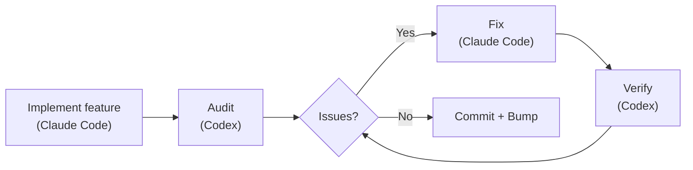

### 실제로 발견한 것들

292 개 감사 이슈. 292 개 전부 해결. 미해결 이슈 제로.

git 히스토리에서 가져온 실제 사례들:

- **보안**: 보안 저장소 마이그레이션에 대한 단일 감사에서 9 개 발견 사항 ([`d1a880a6`](https://github.com/xiaolai/vmark/commit/d1a880a6)). 리소스 리졸버의 심볼릭 링크 순회 ([`7dfa872d`](https://github.com/xiaolai/vmark/commit/7dfa872d)). Path-to-regexp 고위험 취약점 ([`8c554cdc`](https://github.com/xiaolai/vmark/commit/8c554cdc)).

- **접근성**: 모든 팝업 버튼에 `aria-label` 이 누락되어 있었어요. FindBar, Sidebar, Terminal, StatusBar 의 아이콘 전용 버튼에 스크린 리더 텍스트가 없었어요 ([`7acc0bf0`](https://github.com/xiaolai/vmark/commit/7acc0bf0)). 린트 배지에 포커스 인디케이터 누락 ([`c4db90d4`](https://github.com/xiaolai/vmark/commit/c4db90d4)).

- **숨겨진 논리 버그**: 멀티 커서 범위가 병합될 때 기본 커서 인덱스가 조용히 0 으로 돌아갔어요. 사용자가 50 번째 위치에서 편집하다가 범위가 병합되면 갑자기 커서가 문서 시작으로 점프했어요. 테스트가 아닌 감사에 의해 발견되었어요.

- **i18n 사양 리뷰**: Codex 가 국제화 설계 사양을 리뷰하고 "macOS 메뉴 ID 마이그레이션은 사양에 명시된 방식으로 구현할 수 없다"는 것을 발견했어요 ([`1208c98d`](https://github.com/xiaolai/vmark/commit/1208c98d)). 로케일 파일 전반에서 4 개의 번역 품질 문제가 발견되었어요 ([`af98b5cd`](https://github.com/xiaolai/vmark/commit/af98b5cd)).

- **다중 라운드 감사**: 린트 플러그인이 세 차례 라운드를 거쳤어요——처음 8 개 이슈 ([`7482c347`](https://github.com/xiaolai/vmark/commit/7482c347)), 두 번째 6 개 ([`8bfead81`](https://github.com/xiaolai/vmark/commit/8bfead81)), 마지막 7 개 ([`84cf67f7`](https://github.com/xiaolai/vmark/commit/84cf67f7)). 매 라운드마다 Codex 는 수정이 새로 도입한 문제를 발견했어요.

### 자동화 파이프라인

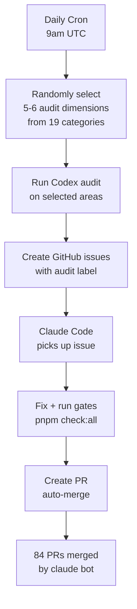

궁극적 진화: 매일 UTC 오전 9 시에 자동으로 실행되는 일일 크론 감사예요. 19 개 감사 카테고리에서 무작위로 5--6 개 차원을 선택하고, 코드베이스의 다양한 부분을 검사하고, 라벨이 붙은 GitHub 이슈를 만들고, Claude Code 에게 수정을 지시해요. 84 개의 PR 이 `claude[bot]` 에 의해 자동 생성, 자동 수정, 자동 머지되었어요——대부분 개발자가 깨기도 전에.

### 신뢰 신호

개발자가 감사를 실행하고 결과를 받았을 때, 반응은 "이 결과들을 한번 검토해 볼게"가 아니었어요. 이랬어요:

> "전부 고쳐."

이것이 도구가 수백 번 스스로를 증명한 뒤 얻게 되는 신뢰 수준이에요.

## tdd-guardian: 논란의 플러그인

**사용 현황**: 3 개 명시적 세션. 42 개 세션에서 5,500 회 이상 백그라운드 참조.

tdd-guardian 의 이야기는 실패를 포함하기 때문에 가장 흥미로워요.

### 블로킹 훅 문제

tdd-guardian 은 테스트 커버리지 임계값이 충족되지 않으면 커밋을 차단하는 PreToolUse 훅을 탑재해서 출시되었어요. 이론적으로는 테스트 우선 규율을 강제하는 것이에요. 실제로는:

> "TDD-guardian 의 블로킹 훅을 제거하고 수동 명령으로만 tdd guardian 을 실행할까?"

문제는 실재했어요: 상태 파일의 오래된 SHA 가 무관한 커밋을 차단했어요. 개발자는 작업을 재개하기 위해 수동으로 `state.json` 을 패치해야 했어요. 블로킹 훅은 이미 모든 PR 에서 `pnpm check:all` 을 실행하는 CI 게이트와 중복되었어요.

훅은 비활성화되었어요 ([`f2fda819`](https://github.com/xiaolai/vmark/commit/f2fda819)). 하지만 *철학*은 살아남았어요.

### 26 단계 커버리지 캠페인

tdd-guardian 이 심은 것은 비범한 커버리지 캠페인을 이끈 규율이었어요:

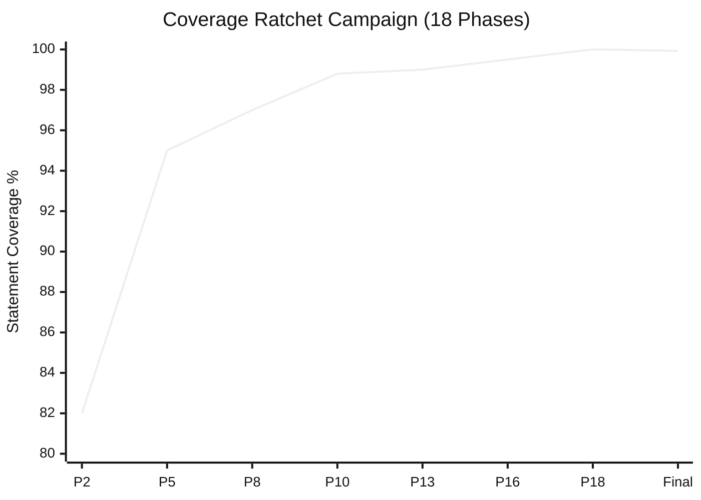

| 단계 | 커밋 | 임계값 |
|-------|--------|-----------|
| Phase 2 | [`1e5cf94a`](https://github.com/xiaolai/vmark/commit/1e5cf94a) | 82/74/86/83 |
| Phase 5 | [`4658d75f`](https://github.com/xiaolai/vmark/commit/4658d75f) | 95/87/95/96 |
| Phase 8 | [`3d7239c3`](https://github.com/xiaolai/vmark/commit/3d7239c3) | tabEscape, codePreview, formatToolbar 심화 |
| Phase 13 | [`9bec6612`](https://github.com/xiaolai/vmark/commit/9bec6612) | multiCursor, mermaidPreview, listEscape 심화 |
| Phase 16 | [`730ff139`](https://github.com/xiaolai/vmark/commit/730ff139) | 145 개 파일에 v8 어노테이션, 99.5/99/99/99.6 |
| Phase 18 | [`1d996778`](https://github.com/xiaolai/vmark/commit/1d996778) | 100/99.87/100/100 으로 래칫 |
| Final | [`fcf5e00d`](https://github.com/xiaolai/vmark/commit/fcf5e00d) | 99.93% stmts / 99.96% lines |

~40%("받아들일 수 없다")에서 99.96% 라인 커버리지까지, 18 개 단계를 거치며 각 단계마다 임계값을 높여 커버리지가 절대 후퇴할 수 없게 만들었어요. 테스트:프로덕션 비율은 1.97:1 에 도달——애플리케이션 코드의 거의 두 배에 달하는 테스트 코드예요.

### 교훈

최고의 강제 메커니즘은 습관을 바꾼 다음 사라지는 것이에요. tdd-guardian 의 블로킹 훅은 너무 공격적이었지만, 그것을 비활성화한 개발자는 블로킹 훅이 활성화된 누구보다도 더 많은 테스트를 작성하게 되었어요.

## docs-guardian: 당혹감 탐지기

**사용 현황**: 3 개 세션. 첫 감사에서 2 개 CRITICAL 이슈 발견.

### `com.vmark.app` 사건

docs-guardian 의 정확성 검사기는 코드와 문서를 모두 읽은 다음 비교해요. VMark 에 대한 첫 번째 전체 감사에서, AI Genies 가이드가 사용자에게 지니가 다음 경로에 저장된다고 알려주고 있었어요:

```
~/Library/Application Support/com.vmark.app/genies/
```

하지만 코드의 실제 Tauri 식별자는 `app.vmark` 였어요. 실제 경로는:

```
~/Library/Application Support/app.vmark/genies/
```

이 오류는 세 플랫폼 모두에서, 영어 가이드와 9 개 번역 버전 모두에서 잘못되어 있었어요. 어떤 테스트도 이것을 잡지 못했을 거예요. 어떤 린터도 이것을 잡지 못했을 거예요. docs-guardian 이 잡아낸 이유는 바로 그것이 하는 일이기 때문이에요: 코드와 문서를 기계적으로, 매핑된 모든 쌍에 대해 비교하는 것.

### 전체 감사 영향

```mermaid
%%{init: {"theme": "neutral"}}%%
xychart-beta
    title "Documentation Health Before vs After"
    x-axis ["Accuracy", "Coverage", "Quality", "Overall"]
    y-axis "Score" 0 --> 100
    bar [78, 64, 83, 74]
    bar [95, 91, 88, 91]
```

| 차원 | 이전 | 이후 | 변화 |
|-----------|--------|-------|-------|
| 정확성 | 78/100 | 95/100 | +17 |
| 커버리지 | 64% | 91% | +27% |
| 품질 | 83/100 | 88/100 | +5 |
| **종합** | **74/100** | **91/100** | **+17** |

17 개의 미문서화된 기능이 단일 세션에서 발견되어 문서화되었어요. Markdown Lint 엔진——15 개 규칙, 단축키 및 상태 바 배지——에는 사용자 문서가 전혀 없었어요. `vmark` 셸 CLI 명령은 완전히 미문서화되어 있었어요. 읽기 전용 모드, Universal Toolbar, 탭 드래그 분리——모두 출시된 기능이지만 아무도 문서를 작성하지 않아 사용자가 발견할 수 없었어요.

`config.json` 의 19 개 코드-문서 매핑은 `shortcutsStore.ts` 가 변경될 때마다 docs-guardian 이 `website/guide/shortcuts.md` 를 업데이트해야 한다는 것을 알게 해줘요. 문서 드리프트가 기계적으로 감지 가능해져요.

## loc-guardian: 300 줄 규칙

**사용 현황**: 4 개 세션. 14 개 파일 플래그, 8 개 경고 수준.

VMark 의 AGENTS.md 에는 다음 규칙이 있어요: "코드 파일을 ~300 줄 이하로 유지 (사전에 분리)."

이 규칙은 스타일 가이드에서 나온 것이 아니에요. loc-guardian 스캔에서 500 줄 이상인 파일이 계속 발견되었고, 이런 파일은 탐색하기 어렵고, 테스트하기 어렵고, AI 어시스턴트가 효과적으로 작업하기 어려웠기 때문에 나온 거예요. 최악의 위반자: 756 줄의 `hot_exit/coordinator.rs`.

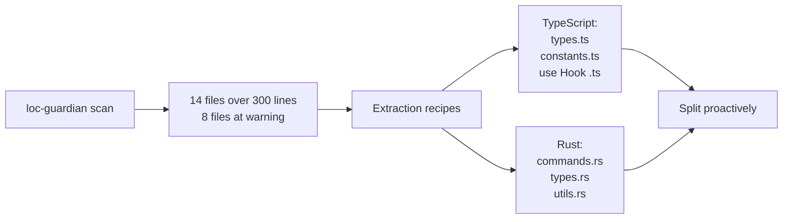

LOC 데이터는 프로젝트 평가에도 활용되었어요——개발자가 "이 프로젝트가 인간 노력으로 얼마나 걸릴까?"를 이해하고 싶었을 때 LOC 보고서가 시작점이었어요. 답: AI 지원 개발로 $400K--$600K 상당의 투자.

## echo-sleuth: 조직의 기억

**사용 현황**: 6 개 세션. 모든 것의 인프라.

echo-sleuth 는 가장 조용한 플러그인이지만 틀림없이 가장 기초적이에요. JSONL 파싱 스크립트가 대화 기록을 검색 가능하게 만드는 인프라예요. 다른 플러그인이 과거 세션에서 무슨 일이 있었는지 회상해야 할 때, echo-sleuth 의 도구가 실제 작업을 해요.

이 글이 존재하는 것은 echo-sleuth 가 35 개 이상의 VMark 세션을 마이닝하여 모든 플러그인 호출, 모든 사용자 반응, 모든 결정 지점을 찾아냈기 때문이에요. 292 개 이슈 수, 84 개 PR 수, 커버리지 캠페인 타임라인, "가혹하게 자기 심문" 세션을 추출해냈어요. 이것이 없었다면 "왜 이 플러그인들이 필수적인가?"에 대한 증거는 일화적이 아닌 고고학적이었을 거예요.

## grill: 가혹한 거울

**설치**: 모든 VMark 세션. **명시적으로 자기 평가를 위해 호출.**

가장 기억에 남는 grill 순간은 3 월 21 일 세션이었어요. 개발자가 물었어요:

> "시간과 노력을 걱정하지 않고 더 가혹하게 자기 심문을 할 수 있다면, 무엇을 다르게 하겠어?"

grill 은 14 개 항목의 품질 갭 분석을 생성했어요——81 개 메시지, 863 개 도구 호출 세션이 다단계 품질 강화 계획을 이끌었어요 ([`076dd96c`](https://github.com/xiaolai/vmark/commit/076dd96c), [`5e47e522`](https://github.com/xiaolai/vmark/commit/5e47e522)). 발견 사항은 다음과 같아요:

- Rust 백엔드 테스트 커버리지가 겨우 27%
- 모달 다이얼로그의 WCAG 접근성 갭 ([`85dc29fa`](https://github.com/xiaolai/vmark/commit/85dc29fa))
- 300 줄 규약을 초과하는 104 개 파일
- 구조화된 로거여야 할 Console.error 호출들 ([`530b5bb7`](https://github.com/xiaolai/vmark/commit/530b5bb7))

이것은 린터가 세미콜론 누락을 찾는 것이 아니었어요. 이것은 주 단위 투자 캠페인을 이끈 전략적 품질 사고였어요.

## nlpm: 성장통

**호출**: 0 개 명시적 세션. **마찰 발생**: 1 개 세션.

nlpm 의 PostToolUse 훅이 VMark 편집 세션을 연속 세 번 차단했어요:

> "PostToolUse:Edit 훅이 계속을 멈추는 이유는?"
> "또 멈춰, 왜?!"
> "해롭지 않은데... 시간 낭비야."

이 훅은 편집된 파일이 NL 아티팩트 패턴과 일치하는지 검사하고 있었어요. 구조 문자 보호를 위한 버그 수정 중에는 순수한 노이즈였어요. 해당 세션에서 플러그인이 비활성화되었어요.

이것은 솔직한 피드백이에요. 모든 플러그인 상호작용이 긍정적인 것은 아니에요. nlpm 을 만든 개발자는 VMark 를 통해 파일 패턴에 대한 PostToolUse 훅에 더 나은 필터링이 필요하다는 것을 발견했어요——버그 수정이 NL 아티팩트 린팅을 트리거해서는 안 돼요.

## 5 단계 진화

도입은 즉각적이지 않았어요. 명확한 궤적을 따랐어요:

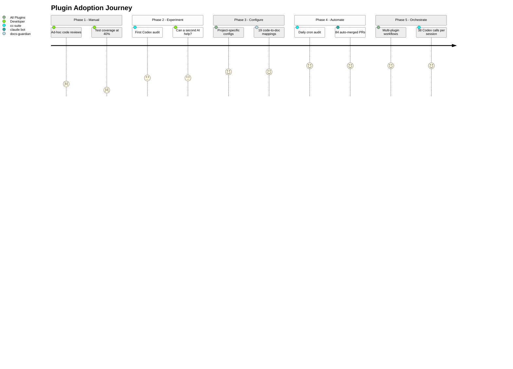

### 1 단계: 수동 감사 (2026 년 1 월)
> "전체 코드베이스를 점검하고 가능한 버그와 빈틈을 찾아봐"

즉흥적 리뷰. 도구 없음. 테스트 커버리지 40%.

### 2 단계: 단일 플러그인 실험 (1 월 말 -- 2 월 초)
> "codex 에게 코드 품질 리뷰를 요청해"

MCP 서버에 대한 첫 cc-suite 사용. 실험적. 두 번째 AI 가 첫 번째가 놓친 것을 잡아낼 수 있을까? 첫 설치: [`e6373c7a`](https://github.com/xiaolai/vmark/commit/e6373c7a).

### 3 단계: 구성된 인프라 (3 월 초)
프로젝트별 설정으로 플러그인 설치. tdd-guardian 이 엄격한 임계값으로 활성화 ([`f775f300`](https://github.com/xiaolai/vmark/commit/f775f300)). docs-guardian 에 19 개 코드-문서 매핑. loc-guardian 에 추출 규칙이 있는 300 줄 제한.

### 4 단계: 자동화된 파이프라인 (3 월 중순)
UTC 오전 9 시 일일 크론 감사. 이슈 자동 생성, 자동 수정, 자동 PR, 자동 머지. 사람 개입 없이 84 개 PR.

### 5 단계: 다중 플러그인 오케스트레이션 (3 월 말)
loc-guardian 스캔 -> 성능 감사 -> 서브에이전트 구현 -> cc-suite 감사 -> cc-suite 검증 -> 버전 범프를 결합하는 단일 세션. 한 세션에서 38 회 Codex 호출. 플러그인이 워크플로로 조합돼요.

## 피드백 루프

가장 흥미로운 패턴은 개별 플러그인이 아니에요. 루프예요:

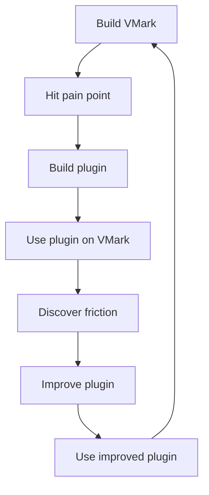

모든 플러그인은 VMark 를 만드는 과정에서 탄생했어요:

- **cc-suite** 는 하나의 AI 가 자기 작업을 리뷰하는 것으로는 충분하지 않기 때문에 존재해요
- **tdd-guardian** 은 세션 사이에 커버리지가 계속 떨어졌기 때문에 존재해요
- **docs-guardian** 은 문서가 항상 코드로부터 표류하기 때문에 존재해요
- **loc-guardian** 은 파일이 항상 유지 가능한 크기를 넘어 성장하기 때문에 존재해요
- **echo-sleuth** 는 세션은 일시적이지만 결정은 그렇지 않기 때문에 존재해요
- **grill** 은 아키텍처 문제에 적대적 리뷰가 필요하기 때문에 존재해요
- **nlpm** 은 프롬프트와 스킬도 코드이기 때문에 존재해요

그리고 모든 플러그인은 VMark 를 만들면서 개선되었어요:

- tdd-guardian 의 블로킹 훅이 너무 공격적인 것으로 밝혀졌고——선택적 강제 제안으로 이어졌어요
- nlpm 의 파일 패턴 매칭이 너무 광범위한 것으로 밝혀졌고——무관한 버그 수정 중 차단되었어요
- cc-suite 의 이름이 세션 중 유령 참조가 발견된 후 수정되었어요
- docs-guardian 의 정확성 검사기가 다른 어떤 도구도 잡지 못하는 `com.vmark.app` 버그를 발견하며 그 가치를 증명했어요

## 계층화된 품질 시스템

일곱 개 플러그인이 함께 계층화된 품질 보증 시스템을 형성해요:

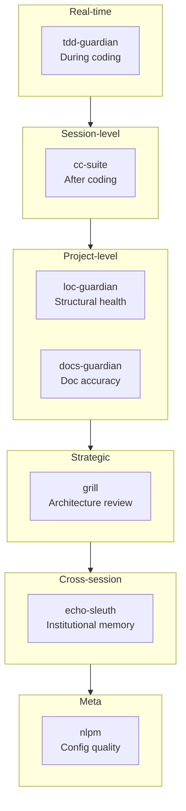

| 계층 | 플러그인 | 작동 시점 | 발견하는 것 |
|-------|--------|-------------|-----------------|
| 실시간 규율 | tdd-guardian | 코딩 중 | 건너뛴 테스트, 커버리지 회귀 |
| 세션 수준 리뷰 | cc-suite | 코딩 후 | 버그, 보안, 접근성 |
| 구조적 건강 | loc-guardian | 요청 시 | 파일 성장, 복잡성 증가 |
| 문서 동기화 | docs-guardian | 요청 시 | 오래된 문서, 누락 문서, 잘못된 문서 |
| 전략적 평가 | grill | 주기적 | 아키텍처 갭, 테스트 갭, 품질 부채 |
| 조직 기억 | echo-sleuth | 세션 간 | 잊혀진 결정, 사라진 맥락 |
| 설정 품질 | nlpm | 편집 시 | 부실한 프롬프트, 약한 스킬, 깨진 규칙 |

이것은 "선택적 도구"가 아니에요. AI 가 코드를 작성하고, AI 가 코드를 감사하고, AI 가 감사 결과를 수정하고, AI 가 수정을 검증하는 재귀적 AI 개발을 신뢰할 수 있게 만드는 거버넌스 계층이에요.

## 왜 필수적인가

"필수적"은 강한 단어예요. 이것이 테스트예요: 플러그인 없이 VMark 는 어떤 모습이었을까?

**cc-suite 없이**: 292 개 이슈 분량의 버그, 보안 취약점, 접근성 갭이 누적되었을 거예요. 도입 후 24 시간 이내에 이슈를 잡아내는 자동화 파이프라인은 존재하지 않았을 거예요. 개발자는 수동 정기 리뷰에 의존했을 것이고——1 월 세션이 보여주듯 그것은 기껏해야 즉흥적이었어요.

**tdd-guardian 없이**: 26 단계 커버리지 캠페인은 일어나지 않았을 수 있어요. 임계값을 계속 높여——커버리지가 올라가기만 하고 절대 내려가지 않는——래칫 규율은 tdd-guardian 이 심어준 마인드셋에서 나왔어요. 99.96% 커버리지는 우연히 일어나지 않아요.

**docs-guardian 없이**: 사용자는 존재하지 않는 디렉토리에서 지니를 찾고 있었을 거예요. 17 개 기능이 발견 불가능한 채 남아 있었을 거예요. 문서 정확성은 측정이 아닌 희망의 문제였을 거예요.

**loc-guardian 없이**: 파일이 500, 800, 1000 줄을 넘어 커졌을 거예요. 코드베이스를 탐색 가능하게 유지하는 "300 줄 규칙"은 강제되는 제약이 아닌 제안에 불과했을 거예요.

**echo-sleuth 없이**: 모든 세션이 처음부터 시작되었을 거예요. "메뉴 단축키 충돌에 대해 뭐라고 결정했지?"는 대화 로그를 수동으로 검색해야 했을 거예요.

**grill 없이**: Rust 테스트 갭 (27%), 접근성 WCAG 갭, 104 개 과대 파일——이러한 전략적 품질 투자는 버그 리포트가 아닌 grill 의 적대적 분석에 의해 추진되었어요.

플러그인이 필수적인 이유는 영리하기 때문이 아니에요. 사람(과 AI)이 세션 사이에 잊는 규율을 코드화하기 때문이에요. 커버리지는 올라가기만 해요. 문서는 코드와 일치해요. 파일은 작게 유지돼요. 감사는 매 릴리스 전에 발생해요. 이것은 열망이 아니에요——매일 실행되는 도구에 의해 강제되는 것이에요.

## 규칙과 스킬: 코드화된 지식

플러그인은 이야기의 절반이에요. 나머지 절반은 플러그인과 함께 축적된 지식 인프라예요.

### 13 개 규칙 (1,950 줄의 조직 지식)

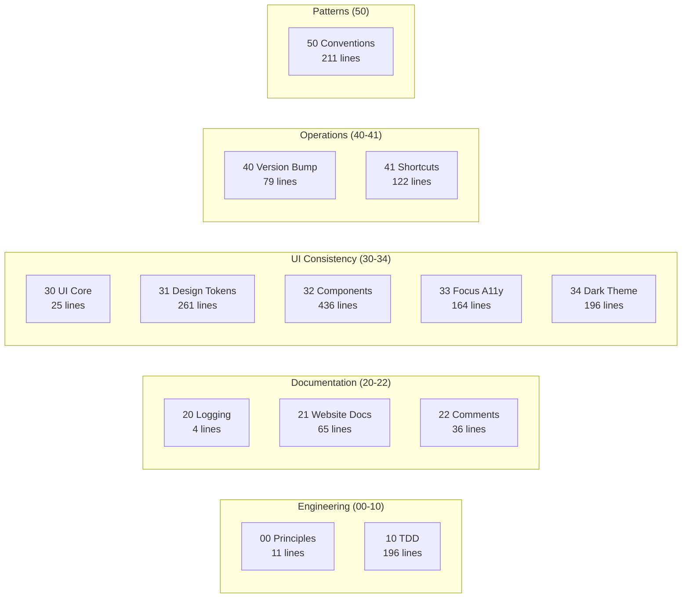

VMark 의 `.claude/rules/` 디렉토리에는 13 개 규칙 파일이 있어요——모호한 가이드라인이 아닌 구체적이고 강제 가능한 규약이에요:

| 규칙 파일 | 줄 수 | 코드화하는 것 |
|-----------|-------|----------------|
| `00-engineering-principles.md` | 11 | 핵심 규약 (Zustand 디스트럭처링 금지, 300 줄 제한) |
| `10-tdd.md` | 196 | 5 개 테스트 패턴 템플릿, 안티패턴 카탈로그, 커버리지 게이트 |
| `20-logging-and-docs.md` | 4 | 주제별 단일 진실 소스 |
| `21-website-docs.md` | 65 | 코드-문서 매핑 테이블 (어떤 코드 변경이 어떤 문서 업데이트를 필요로 하는가) |
| `22-comment-maintenance.md` | 36 | 주석 업데이트 시기/미시기, 부식 방지 |
| `30-ui-consistency.md` | 25 | 핵심 UI 원칙, 하위 규칙 상호 참조 |
| `31-design-tokens.md` | 261 | 완전한 CSS 토큰 레퍼런스——모든 색상, 간격, 반경, 그림자 |
| `32-component-patterns.md` | 436 | 팝업, 툴바, 컨텍스트 메뉴, 테이블, 스크롤바 패턴 코드 포함 |
| `33-focus-indicators.md` | 164 | 컴포넌트 유형별 6 개 포커스 패턴 (WCAG 준수) |
| `34-dark-theme.md` | 196 | 테마 감지, 오버라이드 패턴, 마이그레이션 체크리스트 |
| `40-version-bump.md` | 79 | 5 개 파일 버전 동기화 절차 및 검증 스크립트 |
| `41-keyboard-shortcuts.md` | 122 | 3 파일 동기화 (Rust/Frontend/Docs), 충돌 검사, 규약 |
| `50-codebase-conventions.md` | 211 | 개발 과정에서 발견된 10 개 미문서화 패턴 |

이 규칙들은 모든 세션 시작 시 Claude Code 에 의해 읽혀요. 2,180 번째 커밋이 100 번째와 동일한 규약을 따르는 이유예요.

규칙 `50-codebase-conventions.md` 는 특히 주목할 만해요——*아무도 설계하지 않은* 패턴을 문서화해요. 개발 과정에서 유기적으로 등장한 후 코드화되었어요: 스토어 명명 규약, 훅 정리 패턴, 플러그인 구조, MCP 브릿지 핸들러 시그니처, CSS 조직, 에러 처리 관용구.

### 19 개 프로젝트 스킬 (도메인 전문성)

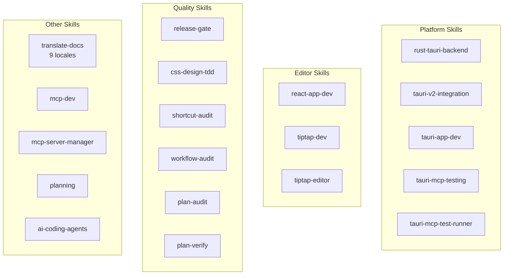

| 카테고리 | 스킬 | 가능하게 하는 것 |
|----------|--------|-----------------|
| **Tauri/Rust** | `rust-tauri-backend`, `tauri-v2-integration`, `tauri-app-dev`, `tauri-mcp-testing`, `tauri-mcp-test-runner` | Tauri v2 규약에 따른 플랫폼별 Rust 개발 |
| **React/Editor** | `react-app-dev`, `tiptap-dev`, `tiptap-editor` | Tiptap/ProseMirror 에디터 패턴, Zustand 셀렉터 규칙 |
| **품질** | `release-gate`, `css-design-tdd`, `shortcut-audit`, `workflow-audit`, `plan-audit`, `plan-verify` | 모든 수준에서 자동화된 품질 검증 |
| **문서** | `translate-docs` | 서브에이전트 기반 감사를 통한 9 개 로케일 번역 |
| **MCP** | `mcp-dev`, `mcp-server-manager` | MCP 서버 개발 및 구성 |
| **기획** | `planning` | 결정 문서화를 포함한 구현 계획 생성 |
| **AI 도구** | `ai-coding-agents` | 다중 에이전트 오케스트레이션 (Codex CLI, Claude Code, Gemini CLI) |

### 7 개 슬래시 명령 (워크플로 자동화)

| 명령 | 기능 |
|---------|-------------|
| `/bump` | 5 개 파일에 걸친 버전 범프, 커밋, 태그, 푸시 |
| `/fix-issue` | 엔드투엔드 GitHub 이슈 해결——가져오기, 분류, 수정, 감사, PR |
| `/merge-prs` | 열린 PR 을 순차적으로 리뷰 및 머지, 리베이스 처리 |
| `/fix` | 이슈를 제대로 수정——패치 없이, 편법 없이, 회귀 없이 |
| `/repo-clean-up` | 실패한 CI 실행 및 오래된 원격 브랜치 제거 |
| `/feature-workflow` | 게이트 기반, 에이전트 주도 기능 개발 엔드투엔드 |
| `/test-guide` | 수동 테스트 가이드 생성 |

### 복합 효과

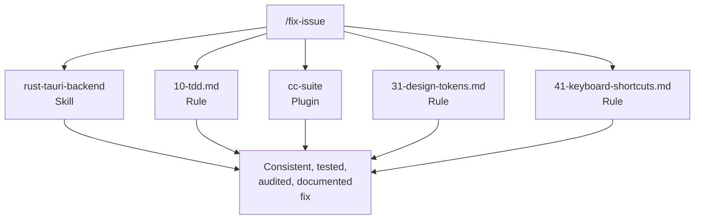

규칙 + 스킬 + 플러그인 + 명령이 복합 시스템을 형성해요. `/fix-issue` 를 실행하면, Rust 변경에는 `rust-tauri-backend` 스킬을 사용하고, 테스트 요구 사항에는 `10-tdd.md` 규칙을 따르고, 감사에는 `cc-suite` 을 호출하고, CSS 준수에는 `31-design-tokens.md` 를 확인하고, 단축키 동기화에는 `41-keyboard-shortcuts.md` 를 검증해요.

어떤 단일 요소도 혁명적이지 않아요. 13 개 규칙 x 19 개 스킬 x 7 개 플러그인 x 7 개 명령이 서로를 강화하는 복합 효과——이것이 시스템을 작동하게 해요. 각 요소는 갭이 발견되었을 때 추가되고, 실제 개발에서 테스트되고, 사용을 통해 정제되었어요.

## 플러그인 빌더를 위한 조언

Claude Code 플러그인을 만들려고 생각하고 있다면, VMark 가 우리에게 가르쳐 준 것들이 있어요:

1. **자기 자신을 위해 먼저 만드세요.** 최고의 플러그인은 가상의 문제가 아닌 실제 문제를 해결해요.

2. **끊임없이 독 푸딩하세요.** 실제 프로젝트에 플러그인을 사용하세요. 당신이 발견하는 마찰이 사용자가 발견할 마찰이에요.

3. **훅에는 탈출구가 필요해요.** 무시할 수 없는 블로킹 훅은 완전히 비활성화될 거예요. 강제를 선택적이거나 문맥 인식적으로 만드세요.

4. **크로스 모델 검증은 효과가 있어요.** 다른 AI 가 주 AI 의 작업을 리뷰하면 실제 버그를 잡아내요. 중복이 아니에요——직교적이에요.

5. **규칙이 아닌 규율을 코드화하세요.** 최고의 플러그인은 습관을 바꿔요. tdd-guardian 의 블로킹 훅은 제거되었지만, 그것이 영감을 준 커버리지 캠페인이 프로젝트에서 가장 영향력 있는 품질 투자였어요.

6. **단일체가 아닌 조합하세요.** 집중된 일곱 개 플러그인이 하나의 거대 플러그인을 이겨요. 각각이 하나를 잘 하고, 부분의 합보다 큰 워크플로로 조합돼요.

7. **신뢰는 호출마다 쌓여요.** 개발자가 cc-suite 을 충분히 신뢰하여 결과를 검토하지 않고 "전부 고쳐"라고 말할 수 있게 되었어요. 그 신뢰는 27 개 세션과 292 개 해결된 이슈를 통해 구축되었어요.

---

*VMark 는 [github.com/xiaolai/vmark](https://github.com/xiaolai/vmark) 에서 오픈소스예요. 일곱 개 플러그인 모두 `xiaolai` Claude Code 마켓플레이스에서 사용 가능해요.*
