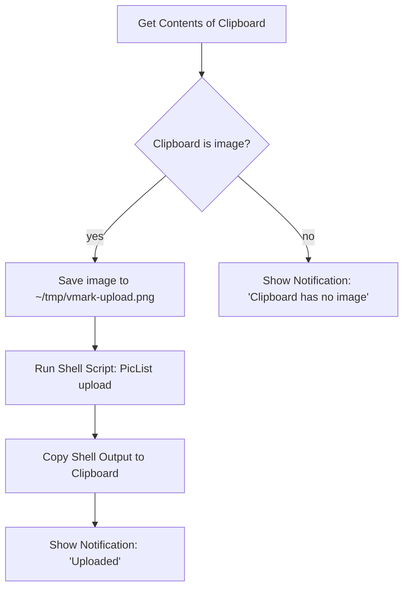

# Imagens hospedadas na nuvem

VMark é uma ferramenta de escrita local-first. Ele não inclui um uploader integrado para imagens coladas da área de transferência e não armazena credenciais de nuvem. Se você precisa que seu Markdown contenha URLs públicas de CDN (para publicação em blog, sincronização entre dispositivos, postagem em CMS), o fluxo é uma automação em nível de sistema operacional que roda *fora* do VMark e devolve o resultado a ele.

Esta página explica por que o VMark funciona desse jeito, o que já funciona sem nenhuma configuração extra e como montar a receita no Shortcuts.app em cerca de dez minutos.

[[toc]]

## O que o VMark já suporta

O VMark distingue duas direções ao lidar com referências de imagem no Markdown:

| Direção | Status | Gatilho | Saída no Markdown |
|---------|--------|---------|-------------------|
| Inserir uma URL remota existente | Suportado | Colar ou digitar uma URL `https://…` | A URL, sem alteração |
| Fonte Markdown com URL remota | Suportado | Qualquer pessoa escreve `` | Renderiza diretamente |
| Inserir uma imagem local | Suportado | Colar, arrastar ou inserir um binário | Copiada para `.assets/`, caminho relativo gravado |
| Inserir uma imagem local *mas armazenando remotamente* | **Não nativo** | (Veja a receita abaixo) | — |

Em resumo: se a imagem já existe em uma URL, cole a URL. O VMark a insere como referência de imagem em Markdown e o webview a busca. O caminho de leitura já é amigável à nuvem.

## Por que o VMark não inclui upload nativo para a nuvem

A funcionalidade proposta significaria que o VMark detecta uma imagem local no momento da colagem, faz o upload para armazenamento remoto e grava a URL retornada no Markdown em vez de um caminho `./.assets/…`. Parece pequeno, mas expande o escopo do VMark em três aspectos críticos:

1. **Cofre de credenciais**. O upload nativo S3-compatible exige que a access key e a secret access key do usuário fiquem armazenadas em repouso. O VMark hoje tem zero segredos de longa duração — nenhuma decisão sobre criptografia em repouso, nenhuma integração com o keychain do SO, nenhuma UX de rotação de chaves, nenhum modo de falha do tipo "chave acidentalmente no Markdown". Adicionar upload cruza essa fronteira.

2. **Cauda de suporte multi-provedor**. S3, Cloudflare R2, Backblaze B2, MinIO, DigitalOcean Spaces todos anunciam compatibilidade com S3, mas cada um tem suas peculiaridades (endereçamento path-style vs virtual-hosted, semântica de ACL, endpoints regionais, regras de CORS). Um único mantenedor absorver essa área de superfície é um imposto de longo prazo sobre uma ferramenta de escrita.

3. **Composição vs. propriedade**. Ferramentas como [PicList](https://github.com/Kuingsmile/PicList) e [PicGo](https://github.com/Molunerfinn/PicGo) já resolvem esse problema, incluindo configuração específica por provedor e armazenamento de credenciais. macOS Shortcuts.app e Keyboard Maestro conseguem encaixar essas ferramentas em qualquer campo de texto do sistema — não apenas no VMark. Construir upload para a nuvem dentro do VMark duplicaria código que vive melhor fora dele e só funcionaria no VMark.

A decisão é, portanto: **o VMark continua sendo uma ferramenta de escrita; o upload de imagens vive na caixa de automação em nível de SO do usuário**. A receita abaixo torna o caminho em nível de SO concreto.

## Receita: Shortcuts.app + PicList (macOS, gratuito)

O Shortcuts.app vem com o macOS Monterey (12) e posteriores. O PicList é um uploader de imagens gratuito e de código aberto. Juntos, eles entregam um atalho que pega qualquer imagem que esteja na área de transferência, faz upload via PicList (que já sabe conversar com R2, S3, Imgur e dezenas de outros backends) e substitui a área de transferência pela URL retornada. Depois disso, `Cmd+V` no VMark insere a URL — a detecção existente de URL remota do VMark cuida do resto.

### Pré-requisitos

1. **PicList instalado e configurado.** Baixe pela [página de releases do PicList](https://github.com/Kuingsmile/PicList/releases), abra-o uma vez e configure pelo menos um host de imagem (R2, S3, Imgur, smms, etc.) em *PicBed Settings* do PicList. Confirme que um upload manual funciona dentro do próprio PicList antes de montar o Shortcut — isso isola "o PicList está funcionando" de "meu Shortcut está montado corretamente."

2. **PicList CLI disponível.** O PicList expõe um subcomando `upload` via seu app bundle. No macOS o binário fica em `/Applications/PicList.app/Contents/MacOS/PicList`. Verifique com:

   ```sh
   /Applications/PicList.app/Contents/MacOS/PicList upload --help
   ```

   O comando deve retornar a ajuda da CLI. Se não retornar, verifique se o PicList está instalado em `/Applications` (e não em `~/Applications` — ajuste o caminho se for o caso).

### Construir o Shortcut

Abra o `Shortcuts.app` e crie um novo shortcut. Adicione estas ações nesta ordem:



Passos concretos no editor do Shortcuts:

1. **Ação: Get Contents of Clipboard.** Arraste-a da barra lateral de ações. Sem configuração.

2. **Ação: If.** Defina a condição: *Clipboard is Media › Image*. (Se o dropdown não mostrar *Media*, use *Contents › has any value* como verificação mais frouxa.)

3. **Dentro do ramo If — Ação: Save File.** Configure:
   - Service: *Files*
   - Destination: `~/tmp/` (crie a pasta uma vez no Finder se ela não existir).
   - File name: `vmark-upload.png` (um nome fixo mantém o caminho previsível para o próximo passo).
   - Desative *Ask Where To Save* para que o shortcut rode sem supervisão.

4. **Ação: Run Shell Script.** Configure:
   - Shell: `/bin/zsh` (padrão no macOS).
   - Input: *Pass Input as `stdin`* — na verdade queremos `as arguments`. (Qualquer um funciona; o script abaixo ignora o stdin e usa um caminho literal.)
   - Corpo do script:

     ```sh
     /Applications/PicList.app/Contents/MacOS/PicList upload "$HOME/tmp/vmark-upload.png" 2>/dev/null | tail -n 1
     ```

   O `tail -n 1` é defensivo: o PicList pode imprimir linhas informativas de log antes da URL. Confirme o formato real da saída na sua versão do PicList uma vez; se o PicList retornar apenas a URL, o `tail` é um no-op.

5. **Ação: Copy to Clipboard.** Defina seu input como *Shell Script Result*.

6. **Ação: Show Notification.** Título: `Uploaded`. Corpo: *Shell Script Result*. Isso confirma que a URL está na área de transferência e mostra o que foi enviado.

7. **(Opcional) Ramo Else — Ação: Show Notification.** Título: `No image on clipboard`. Ajuda a depurar quando o atalho dispara mas a área de transferência não continha de fato uma imagem.

### Vincular um atalho global

No editor do Shortcuts, clique no botão *(i)* de informações do shortcut e depois em *Add Keyboard Shortcut*. Escolha algo que não colida com os atalhos do VMark — `Control + Option + Command + U` é uma escolha comum (sem conflitos no macOS, mnemônico "Upload").

### Como usar

1. Tire um screenshot com `Cmd + Shift + Ctrl + 4` (salva na área de transferência, não em disco) — ou copie qualquer imagem de outro app.
2. Pressione seu atalho de upload (`Ctrl + Opt + Cmd + U`).
3. Aguarde ~1–3 segundos pela notificação.
4. Cole no VMark (`Cmd + V`). O Markdown recebe ``.

### O que pode dar errado

| Sintoma | Causa provável | Correção |
|---------|----------------|----------|
| O Shortcut dispara mas o PicList não roda | Caminho errado para o binário do PicList | Confirme que `/Applications/PicList.app/Contents/MacOS/PicList` existe; ajuste se instalado em outro lugar |
| A notificação aparece mas a área de transferência ainda contém a imagem | O shell script retornou vazio | Rode o shell script manualmente com um arquivo conhecido para ver a saída real do PicList |
| A URL está errada / tem espaços em branco no final | O `tail -n 1` pegou uma linha de log, não a URL | Inspecione a saída do PicList; ajuste o parsing (`grep -oE 'https://[^[:space:]]+' \| tail -n 1` é uma alternativa mais estrita) |
| `Cmd + V` no VMark insere texto puro em vez de uma imagem | A URL não termina com uma extensão de imagem que o PicList conheça | Confirme que a extensão do arquivo é preservada no upload (R2/S3 normalmente preservam; verifique o template de chave do seu bucket) |

## Alternativa: Keyboard Maestro

[Keyboard Maestro](https://www.keyboardmaestro.com/) é uma ferramenta paga de automação para macOS com um teto mais alto que o Shortcuts.app. A principal vantagem prática para este fluxo: o KM consegue interceptar `Cmd + V` diretamente quando a área de transferência contém uma imagem, então você faz upload-e-cola em uma única tecla em vez de duas (atalho e depois `Cmd + V`).

A receita é estruturalmente idêntica à versão do Shortcuts.app — pegar a imagem da área de transferência, salvar em arquivo, rodar o PicList CLI, substituir a área de transferência e, opcionalmente, simular o paste. O construtor de macros *Trigger* do KM é mais flexível (gatilho por conteúdo da área de transferência, escopo específico por app), mas o passo de upload é o mesmo.

Se você ainda não é usuário do Keyboard Maestro, o Shortcuts.app é a resposta mais barata.

## Alternativa: script de processamento pré-publicação

Para usuários com blog auto-hospedado ou pipeline de site estático, a resposta mais limpa muitas vezes é: manter o comportamento padrão do VMark (caminhos relativos em `.assets/`) e rodar um script em tempo de build que percorre o Markdown, faz upload de cada imagem única e reescreve o caminho. Isso troca latência de upload por imagem por upload-em-lote-na-publicação e mantém a superfície do editor limpa.

Um esboço mínimo (Node.js, pseudocódigo):

```js
// scan-and-upload.js
const fs = require("fs");
const { execSync } = require("child_process");

const md = fs.readFileSync(process.argv[2], "utf8");
const rewritten = md.replace(/!\[(.*?)\]\((\.\/\.assets\/[^)]+)\)/g, (_, alt, path) => {
  const url = execSync(
    `/Applications/PicList.app/Contents/MacOS/PicList upload "${path}"`,
  ).toString().trim();
  return ``;
});
fs.writeFileSync(process.argv[2].replace(/\.md$/, ".published.md"), rewritten);
```

Vários geradores de site estático (Hugo com [Page Bundles](https://gohugo.io/content-management/page-bundles/), Jekyll, Astro, Eleventy) lidam nativamente com caminhos relativos `.assets/` em tempo de build — não precisa de script se você publicar dessa forma.

## URLs já hospedadas

Para completude: se uma imagem já existe em uma URL pública, cole a URL no VMark e pronto. O detector de caminho de imagem da área de transferência a classifica como `type: "url"` e grava a URL diretamente. Sem upload, sem cópia para `.assets/`, sem configurações a mudar. Esse é o fluxo de imagem-na-nuvem mais simples que o VMark suporta e ele não exige nenhuma ferramenta extra.

## Veja também

- [Configurações de Arquivos e Imagens](./settings.md) — auto-resize, copy-to-assets, limpeza de órfãos
- [Privacidade](./privacy.md) — o que o VMark armazena localmente e o que sai da sua máquina
