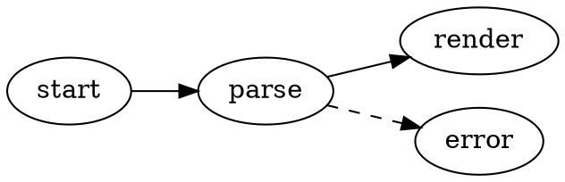
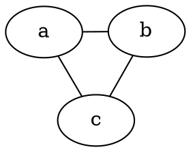

# Diagramas Graphviz

O VMark renderiza grafos DOT do [Graphviz](https://graphviz.org/) diretamente em seus documentos Markdown. Os diagramas são renderizados localmente com o build WASM do Graphviz ([@viz-js/viz](https://github.com/mdaines/viz-js)) — sem acesso à rede, sem binários externos.

[[toc]]

## Inserindo um Diagrama

Use **Inserir → Diagrama Graphviz** na barra de menus (ou no grupo Inserir da barra de ferramentas) para inserir um diagrama modelo — o atalho não tem tecla atribuída por padrão e pode ser personalizado nas Configurações. Ou digite um bloco de código delimitado com o identificador de linguagem `dot` ou `graphviz`:

````markdown

````

Ambas as linguagens de delimitação se comportam de forma idêntica:

| Delimitador | Renderiza como |
|-------|------------|
| ` ```dot ` | Diagrama Graphviz |
| ` ```graphviz ` | Diagrama Graphviz |

## Modos de Edição

- **Modo WYSIWYG** — o bloco de código é renderizado como um diagrama. Dê um duplo clique nele para editar o código-fonte DOT com prévia ao vivo com debounce; salve ou cancele pelo cabeçalho de edição.
- **Modo Fonte** — posicione o cursor dentro de um bloco ` ```dot ` para obter a prévia flutuante do diagrama (arrastar, redimensionar, zoom), igual ao Mermaid.

## Pan, Zoom e Exportação

Diagramas renderizados suportam os mesmos controles dos diagramas Mermaid:

- **Cmd/Ctrl + rolagem** para zoom, arraste para pan, botão de reset para recentralizar
- **Exportar como PNG** (fundo claro ou escuro) via botão de exportação

## Engine e Layout

Os diagramas são dispostos com a engine `dot` (layout hierárquico/em camadas) por padrão. Para usar uma engine diferente, defina o atributo padrão `layout` do Graphviz no seu grafo — a escolha viaja com o documento e funciona em qualquer outra ferramenta Graphviz:

````markdown

````

| Engine | Estilo de layout |
|--------|--------------|
| `dot` | Hierárquico / em camadas (padrão) |
| `neato` | Modelo de molas (direcionado por força) |
| `fdp` | Direcionado por força, grafos maiores |
| `sfdp` | Direcionado por força multiescala, grafos muito grandes |
| `circo` | Circular |
| `twopi` | Radial |
| `osage` | Em clusters |
| `patchwork` | Treemap (squarified) |

Um valor de `layout` desconhecido mostra o estado de erro de renderização, como qualquer outro erro de DOT.

Todos os recursos padrão de DOT suportados pelo Graphviz funcionam: subgrafos e clusters, ranks, formas de nós, estilos de arestas, rótulos estilo HTML e cores explícitas.

## Integração de Tema

- O fundo do diagrama é transparente, então ele acompanha o tema do editor.
- As cores padrão de nós, arestas e texto são derivadas dos tokens de design do tema ativo, para que os diagramas pareçam nativos em todos os temas (White, Paper, Mint, Sepia, Night, Solarized) e sejam atualizados quando você trocar de tema.
- Cores explícitas no seu código-fonte DOT sempre têm prioridade sobre os padrões do tema — um grafo que define seu próprio `bgcolor`, `color` ou `fontcolor` é renderizado exatamente como escrito.

## Tratamento de Erros

Se o código-fonte DOT tiver um erro de sintaxe, o bloco mostra um estado de erro de renderização em vez de um diagrama. Corrija o código-fonte e a prévia é renderizada novamente de forma automática.

## Exportação HTML e PDF

Documentos HTML e PDF exportados incorporam o SVG renderizado, então os diagramas têm a mesma aparência fora do VMark.
