# Usuários como Desenvolvedores

Como sete plugins do Claude Code se tornaram indispensáveis ao serem forjados no fogo da construção do VMark.

## O Contexto

VMark é um editor Markdown amigável para IA construído com Tauri, React e Rust. Ao longo de 10 semanas de desenvolvimento:

| Métrica | Valor |
|---------|-------|
| Commits | 2,180+ |
| Tamanho do código | 305,391 linhas de código |
| Cobertura de testes | 99.96% linhas |
| Proporção testes:produção | 1.97:1 |
| Issues de auditoria criados e resolvidos | 292 |
| PRs automatizados mesclados | 84 |
| Idiomas da documentação | 10 |
| Ferramentas do servidor MCP | 12 |

Um único desenvolvedor construiu tudo com Claude Code. Ao longo do caminho, esse desenvolvedor criou sete plugins para o marketplace do Claude Code — não como um projeto paralelo, mas como ferramentas de sobrevivência. Cada plugin existe porque um problema específico exigia uma solução que ainda não existia.

## Os Plugins

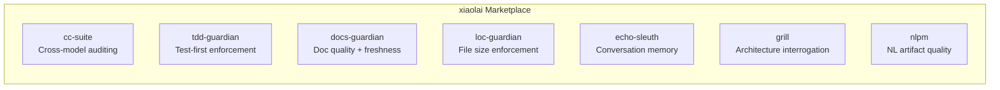

| Plugin | O Que Faz | Nasceu De |
|--------|-----------|-----------|
| [cc-suite](https://github.com/xiaolai/cc-suite) | Auditoria de código cross-model via OpenAI Codex | "Preciso de um segundo par de olhos que não seja o Claude" |
| [tdd-guardian](https://github.com/xiaolai/tdd-guardian-for-claude) | Aplicação do fluxo de trabalho test-first | "A cobertura continua caindo quando esqueço dos testes" |
| [docs-guardian](https://github.com/xiaolai/docs-guardian-for-claude) | Auditoria de qualidade e atualidade da documentação | "Minha documentação diz `com.vmark.app` mas o identificador real é `app.vmark`" |
| [loc-guardian](https://github.com/xiaolai/loc-guardian-for-claude) | Controle de linhas de código por arquivo | "Este arquivo tem 800 linhas e ninguém percebeu" |
| [echo-sleuth](https://github.com/xiaolai/echo-sleuth-for-claude) | Mineração do histórico de conversas e memória | "O que decidimos sobre isso três semanas atrás?" |
| [grill](https://github.com/xiaolai/grill-for-claude) | Interrogação profunda e multiângulo do código | "Preciso de uma revisão de arquitetura, não apenas lint" |
| [nlpm](https://github.com/xiaolai/nlpm-for-claude) | Qualidade de artefatos de programação em linguagem natural | "Meus prompts e skills estão realmente bem escritos?" |

## Antes e Depois

A transformação aconteceu em três meses.

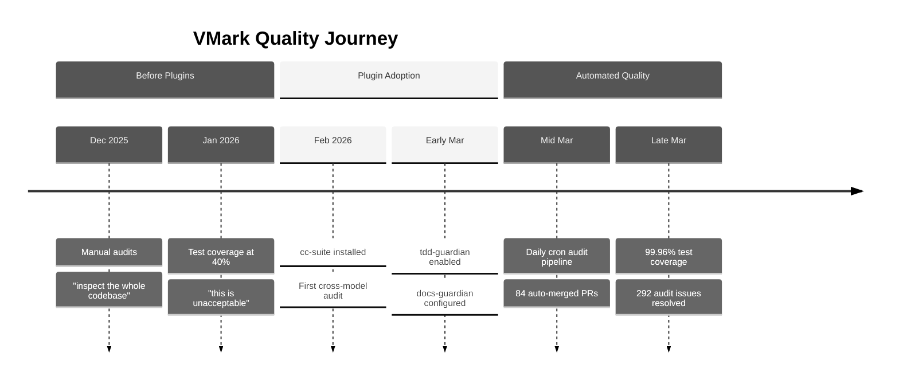

**Antes dos plugins** (dezembro de 2025 -- fevereiro de 2026): Auditorias manuais de código. O desenvolvedor dizia coisas como "inspecione todo o código, descubra quais são os possíveis bugs e lacunas." A cobertura de testes girava em torno de 40% — descrita como "inaceitável." A documentação era escrita e esquecida.

**Depois dos plugins** (março de 2026): Cada sessão de desenvolvimento carregava 3--4 plugins automaticamente. Um pipeline de auditoria automatizado rodava diariamente, criando e resolvendo issues sem intervenção humana. A cobertura de testes atingiu 99.96% através de uma campanha metódica de 26 fases de ajuste progressivo. A precisão da documentação era verificada contra o código com precisão mecânica.

O histórico do git conta a história:

| Categoria | Commits |
|-----------|---------|
| Total de commits | 2,180+ |
| Resposta a auditorias Codex | 47 |
| Testes/cobertura | 52 |
| Fortalecimento de segurança | 40 |
| Documentação | 128 |
| Fases da campanha de cobertura | 26 |

## cc-suite: A Segunda Opinião

**Usado em**: 27 de 28 sessões com plugins. Mais de 200 chamadas ao Codex em todas as sessões.

O mais importante sobre o cc-suite é que *não é o Claude auditando o trabalho do Claude*. Ele envia código para o modelo Codex da OpenAI para uma revisão independente. Quando você está imerso em uma funcionalidade com uma IA, ter um modelo completamente diferente examinando o resultado detecta coisas que tanto você quanto sua IA principal deixaram passar.

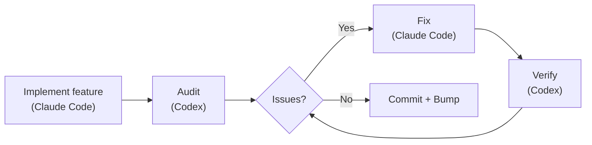

### O Que Realmente Encontrou

292 issues de auditoria. Todos os 292 resolvidos. Zero em aberto.

Exemplos reais do histórico do git:

- **Segurança**: 9 achados em uma única auditoria da migração de armazenamento seguro ([`d1a880a6`](https://github.com/xiaolai/vmark/commit/d1a880a6)). Travessia de symlinks no resolvedor de recursos ([`7dfa872d`](https://github.com/xiaolai/vmark/commit/7dfa872d)). Vulnerabilidade de alta severidade em path-to-regexp ([`8c554cdc`](https://github.com/xiaolai/vmark/commit/8c554cdc)).

- **Acessibilidade**: Todos os botões de popup estavam sem `aria-label`. Botões apenas com ícone no FindBar, Sidebar, Terminal e StatusBar não tinham texto para leitores de tela ([`7acc0bf0`](https://github.com/xiaolai/vmark/commit/7acc0bf0)). Indicador de foco ausente no badge de lint ([`c4db90d4`](https://github.com/xiaolai/vmark/commit/c4db90d4)).

- **Bug de lógica silencioso**: Quando os ranges do multi-cursor se mesclavam, o índice do cursor principal voltava silenciosamente para 0. Os usuários estavam editando na posição 50, os ranges se mesclavam, e de repente o cursor saltava para o início do documento. Encontrado por auditoria, não por testes.

- **Revisão de especificação i18n**: O Codex revisou a especificação de design de internacionalização e descobriu que "a migração de menu-ID do macOS não é implementável da forma que a especificação diz" ([`1208c98d`](https://github.com/xiaolai/vmark/commit/1208c98d)). Quatro problemas de qualidade de tradução detectados nos arquivos de localização ([`af98b5cd`](https://github.com/xiaolai/vmark/commit/af98b5cd)).

- **Auditoria multi-rodada**: O plugin de lint passou por três rodadas — 8 issues na primeira ([`7482c347`](https://github.com/xiaolai/vmark/commit/7482c347)), 6 na segunda ([`8bfead81`](https://github.com/xiaolai/vmark/commit/8bfead81)), 7 na final ([`84cf67f7`](https://github.com/xiaolai/vmark/commit/84cf67f7)). Em cada rodada, o Codex encontrou problemas que as próprias correções tinham introduzido.

### O Pipeline Automatizado

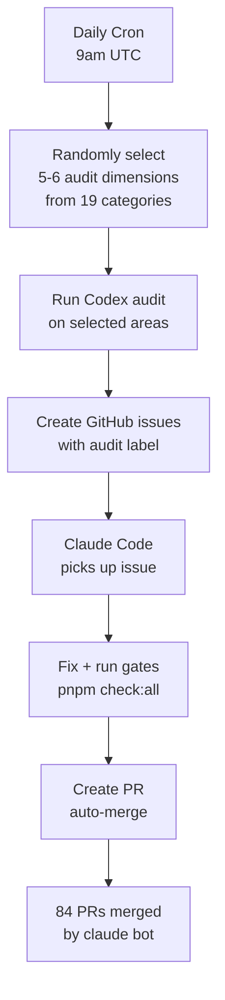

A evolução definitiva: uma auditoria cron diária que roda automaticamente às 9h UTC. Ela seleciona aleatoriamente 5--6 dimensões de 19 categorias de auditoria, inspeciona diferentes partes do código, cria issues rotulados no GitHub e despacha o Claude Code para corrigi-los. 84 PRs foram auto-criados, auto-corrigidos e auto-mesclados pelo `claude[bot]` — muitos antes mesmo do desenvolvedor acordar.

### O Sinal de Confiança

Quando o desenvolvedor rodava uma auditoria e recebia achados, a resposta nunca era "deixa eu analisar esses achados." Era:

> "corrija tudo."

Esse é o nível de confiança que você obtém quando uma ferramenta provou seu valor centenas de vezes.

## tdd-guardian: O Controverso

**Usado em**: 3 sessões explícitas. Mais de 5,500 referências em segundo plano em 42 sessões.

A história do tdd-guardian é a mais interessante porque inclui fracasso.

### O Problema do Hook Bloqueante

O tdd-guardian foi lançado com um hook PreToolUse que bloqueava commits se os limites de cobertura de testes não fossem atingidos. Em teoria, isso impõe a disciplina test-first. Na prática:

> "o TDD-guardian, devemos remover o blocking hook, deixar o tdd guardian rodar por comando manual?"

O problema era real: um SHA obsoleto no arquivo de estado bloqueava commits não relacionados. O desenvolvedor precisava corrigir manualmente o `state.json` para desbloquear seu trabalho. Os hooks bloqueantes eram redundantes com os gates de CI que já rodavam `pnpm check:all` em cada PR.

Os hooks foram desabilitados ([`f2fda819`](https://github.com/xiaolai/vmark/commit/f2fda819)). Mas a *filosofia* sobreviveu.

### A Campanha de Cobertura de 26 Fases

O que o tdd-guardian semeou foi a disciplina que impulsionou uma extraordinária campanha de cobertura:

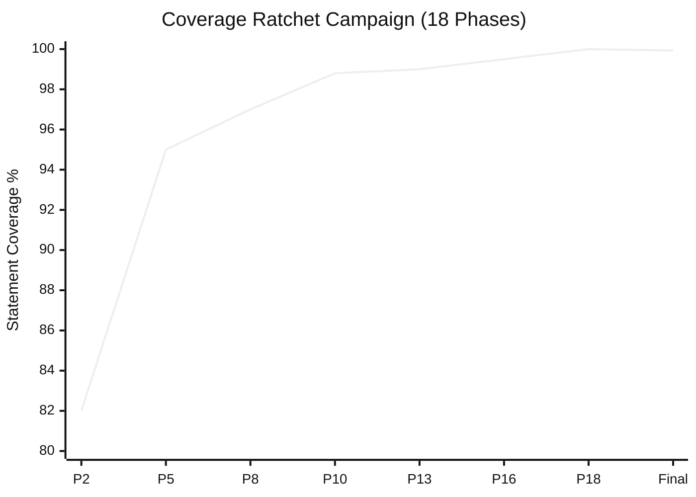

| Fase | Commit | Limites |
|------|--------|---------|
| Fase 2 | [`1e5cf94a`](https://github.com/xiaolai/vmark/commit/1e5cf94a) | 82/74/86/83 |
| Fase 5 | [`4658d75f`](https://github.com/xiaolai/vmark/commit/4658d75f) | 95/87/95/96 |
| Fase 8 | [`3d7239c3`](https://github.com/xiaolai/vmark/commit/3d7239c3) | aprofundar tabEscape, codePreview, formatToolbar |
| Fase 13 | [`9bec6612`](https://github.com/xiaolai/vmark/commit/9bec6612) | aprofundar multiCursor, mermaidPreview, listEscape |
| Fase 16 | [`730ff139`](https://github.com/xiaolai/vmark/commit/730ff139) | anotações v8 em 145 arquivos, 99.5/99/99/99.6 |
| Fase 18 | [`1d996778`](https://github.com/xiaolai/vmark/commit/1d996778) | ajustar para 100/99.87/100/100 |
| Final | [`fcf5e00d`](https://github.com/xiaolai/vmark/commit/fcf5e00d) | 99.93% stmts / 99.96% linhas |

De ~40% ("isso é inaceitável") para 99.96% de cobertura de linhas, em 18 fases, cada uma ajustando os limites para cima de modo que a cobertura nunca pudesse regredir. A proporção testes:produção chegou a 1.97:1 — quase o dobro de código de teste em relação ao código de aplicação.

### A Lição

Os melhores mecanismos de aplicação são aqueles que mudam seus hábitos e depois saem do caminho. Os hooks bloqueantes do tdd-guardian eram agressivos demais, mas o desenvolvedor que os desabilitou acabou escrevendo mais testes do que qualquer um com hooks bloqueantes habilitados.

## docs-guardian: O Detector de Constrangimentos

**Usado em**: 3 sessões. Encontrou 2 problemas CRÍTICOS em sua primeira auditoria.

### O Incidente do `com.vmark.app`

O verificador de precisão do docs-guardian lê tanto o código quanto a documentação e depois os compara. Em sua primeira auditoria completa do VMark, descobriu que o guia do AI Genies dizia aos usuários que seus genies estavam armazenados em:

```
~/Library/Application Support/com.vmark.app/genies/
```

Mas o identificador real do Tauri no código era `app.vmark`. O caminho real era:

```
~/Library/Application Support/app.vmark/genies/
```

Isso estava errado nas três plataformas, no guia em inglês e em todas as 9 versões traduzidas. Nenhum teste detectaria isso. Nenhum linter detectaria isso. O docs-guardian detectou porque é literalmente isso que ele faz: comparar código com documentação, mecanicamente, para cada par mapeado.

### O Impacto Completo da Auditoria

```mermaid
%%{init: {"theme": "neutral"}}%%
xychart-beta
    title "Documentation Health Before vs After"
    x-axis ["Accuracy", "Coverage", "Quality", "Overall"]
    y-axis "Score" 0 --> 100
    bar [78, 64, 83, 74]
    bar [95, 91, 88, 91]
```

| Dimensão | Antes | Depois | Delta |
|----------|-------|--------|-------|
| Precisão | 78/100 | 95/100 | +17 |
| Cobertura | 64% | 91% | +27% |
| Qualidade | 83/100 | 88/100 | +5 |
| **Geral** | **74/100** | **91/100** | **+17** |

17 funcionalidades não documentadas foram encontradas e documentadas em uma única sessão. O motor de Markdown Lint — 15 regras, com atalhos e um badge na barra de status — não tinha documentação para o usuário. O comando de shell `vmark` estava completamente sem documentação. O Modo Somente Leitura, a Barra de Ferramentas Universal, arrastar abas para separar janelas — todas funcionalidades lançadas que os usuários não conseguiam descobrir porque ninguém escreveu a documentação.

Os 19 mapeamentos código-para-documentação no `config.json` significam que toda vez que `shortcutsStore.ts` muda, o docs-guardian sabe que `website/guide/shortcuts.md` precisa de atualização. A divergência da documentação se torna mecanicamente detectável.

## loc-guardian: A Regra das 300 Linhas

**Usado em**: 4 sessões. 14 arquivos sinalizados, 8 em nível de aviso.

O AGENTS.md do VMark contém a regra: "Manter arquivos de código abaixo de ~300 linhas (dividir proativamente)."

Essa regra não veio de um guia de estilo. Veio dos escaneamentos do loc-guardian que continuavam encontrando arquivos de mais de 500 linhas que eram difíceis de navegar, difíceis de testar e difíceis para os assistentes de IA trabalharem de forma eficaz. O pior caso: `hot_exit/coordinator.rs` com 756 linhas.

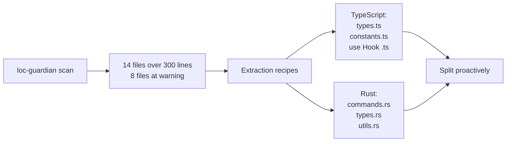

Os dados de LOC também alimentaram a avaliação do projeto — quando o desenvolvedor quis entender "quanto esforço humano esse projeto representaria?", o relatório de LOC foi o dado de entrada. Resposta: investimento equivalente de $400K--$600K com desenvolvimento assistido por IA.

## echo-sleuth: A Memória Institucional

**Usado em**: 6 sessões. Infraestrutura para tudo.

O echo-sleuth é o plugin mais silencioso, mas talvez o mais fundamental. Seus scripts de parsing JSONL são a infraestrutura que torna o histórico de conversas pesquisável. Quando qualquer outro plugin precisa lembrar o que aconteceu em uma sessão passada, as ferramentas do echo-sleuth fazem o trabalho real.

Este artigo existe porque o echo-sleuth minerou mais de 35 sessões do VMark e encontrou cada invocação de plugin, cada reação do usuário e cada ponto de decisão. Ele extraiu a contagem de 292 issues, a contagem de 84 PRs, a linha do tempo da campanha de cobertura e a sessão de "grille a si mesmo duramente". Sem ele, as evidências de "por que esses plugins são indispensáveis?" seriam anedóticas em vez de arqueológicas.

## grill: O Espelho Implacável

**Instalado em**: toda sessão do VMark. **Invocado explicitamente para autoavaliação.**

O momento mais memorável do grill foi a sessão de 21 de março. O desenvolvedor perguntou:

> "Se você pudesse se grillar mais duramente, sem se preocupar com tempo e esforço, o que faria diferente?"

O grill produziu uma análise de lacunas de qualidade em 14 pontos — uma sessão de 81 mensagens e 863 chamadas a ferramentas que impulsionou um plano de fortalecimento de qualidade em múltiplas fases ([`076dd96c`](https://github.com/xiaolai/vmark/commit/076dd96c), [`5e47e522`](https://github.com/xiaolai/vmark/commit/5e47e522)). Os achados incluíram:

- A cobertura de testes do backend Rust era de apenas 27%
- Lacunas de acessibilidade WCAG em diálogos modais ([`85dc29fa`](https://github.com/xiaolai/vmark/commit/85dc29fa))
- 104 arquivos excedendo a convenção de 300 linhas
- Chamadas a Console.error que deveriam ser loggers estruturados ([`530b5bb7`](https://github.com/xiaolai/vmark/commit/530b5bb7))

Isso não era um linter encontrando um ponto e vírgula faltando. Era pensamento estratégico de qualidade que impulsionou campanhas de investimento de uma semana.

## nlpm: A Dor do Crescimento

**Invocado em**: 0 sessões explicitamente. **Causou atrito em**: 1 sessão.

O hook PostToolUse do nlpm bloqueou uma sessão de edição do VMark três vezes seguidas:

> "O hook PostToolUse:Edit interrompeu a continuação, por quê?"
> "parou de novo, por quê?!"
> "é inofensivo... mas é perda de tempo."

O hook verificava se os arquivos editados correspondiam a padrões de artefatos NL. Durante uma correção de bug para proteção de caracteres estruturais, isso era puro ruído. O plugin foi desabilitado para aquela sessão.

Esse é feedback honesto. Nem toda interação com um plugin é positiva. O desenvolvedor que construiu o nlpm descobriu através do VMark que hooks PostToolUse em padrões de arquivo precisam de filtragem melhor — correções de bugs não deveriam acionar o linting de artefatos NL.

## A Evolução em Cinco Fases

A adoção não foi instantânea. Seguiu uma trajetória clara:

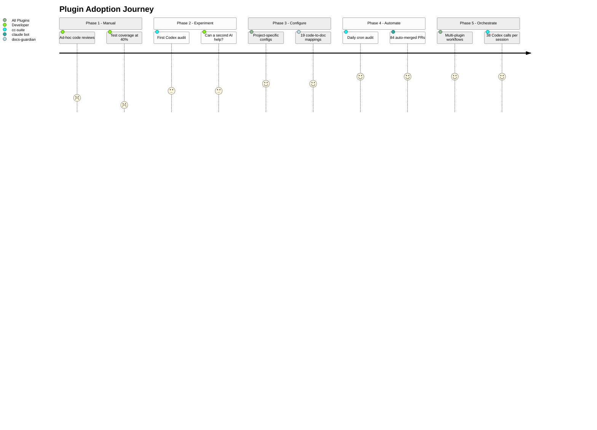

### Fase 1: Auditoria Manual (janeiro de 2026)
> "inspecione todo o código, descubra quais são os possíveis bugs e lacunas"

Revisões ad-hoc. Sem ferramentas. Cobertura de testes em 40%.

### Fase 2: Experimentos com Plugin Único (final de janeiro -- início de fevereiro)
> "peça ao codex para revisar a qualidade do código"

Primeiro uso do cc-suite para o servidor MCP. Experimental. Uma segunda IA pode detectar coisas que a primeira deixou passar? Primeira instalação: [`e6373c7a`](https://github.com/xiaolai/vmark/commit/e6373c7a).

### Fase 3: Infraestrutura Configurada (início de março)
Plugins instalados com configurações específicas do projeto. tdd-guardian habilitado com limites rigorosos ([`f775f300`](https://github.com/xiaolai/vmark/commit/f775f300)). docs-guardian tem 19 mapeamentos código-para-documentação. loc-guardian tem limites de 300 linhas com regras de extração.

### Fase 4: Pipelines Automatizados (meados de março)
Auditoria cron diária às 9h UTC. Issues auto-criados, auto-corrigidos, auto-PR criados, auto-mesclados. 84 PRs sem intervenção humana.

### Fase 5: Orquestração Multi-Plugin (final de março)
Sessões únicas combinando escaneamento do loc-guardian -> auditoria de performance -> implementação com subagente -> auditoria do cc-suite -> verificação do cc-suite -> incremento de versão. 38 chamadas ao Codex em uma sessão. Os plugins se compõem em fluxos de trabalho.

## O Ciclo de Feedback

O padrão mais interessante não é nenhum plugin individual. É o ciclo:

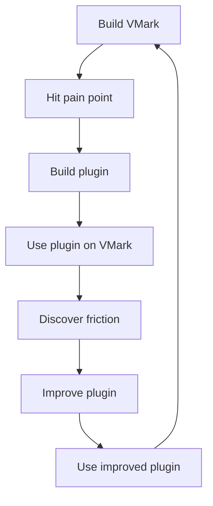

Cada plugin nasceu da construção do VMark:

- **cc-suite** existe porque uma única IA revisando seu próprio trabalho não é suficiente
- **tdd-guardian** existe porque a cobertura continuava caindo entre as sessões
- **docs-guardian** existe porque a documentação sempre diverge do código
- **loc-guardian** existe porque os arquivos sempre crescem além de tamanhos sustentáveis
- **echo-sleuth** existe porque as sessões são efêmeras mas as decisões não
- **grill** existe porque problemas de arquitetura precisam de revisão adversarial
- **nlpm** existe porque prompts e skills também são código

E cada plugin foi melhorado ao construir o VMark:

- Os hooks bloqueantes do tdd-guardian se mostraram agressivos demais — levando a uma proposta de aplicação opt-in
- A correspondência de padrões de arquivo do nlpm se mostrou ampla demais — bloqueando durante correções de bugs não relacionadas
- O nome do cc-suite foi corrigido depois que uma referência fantasma foi descoberta no meio de uma sessão
- O verificador de precisão do docs-guardian provou seu valor ao encontrar o bug do `com.vmark.app` que nenhuma outra ferramenta conseguiria detectar

## O Sistema de Qualidade em Camadas

Juntos, os sete plugins formam um sistema de garantia de qualidade em camadas:

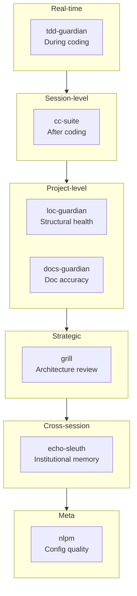

| Camada | Plugin | Quando Age | O Que Detecta |
|--------|--------|------------|---------------|
| Disciplina em tempo real | tdd-guardian | Durante a codificação | Testes pulados, regressão de cobertura |
| Revisão em nível de sessão | cc-suite | Depois de codificar | Bugs, segurança, acessibilidade |
| Saúde estrutural | loc-guardian | Sob demanda | Crescimento de arquivos, aumento de complexidade |
| Sincronização de documentação | docs-guardian | Sob demanda | Docs desatualizados, docs faltantes, docs errados |
| Avaliação estratégica | grill | Periodicamente | Lacunas de arquitetura, lacunas de testes, dívida de qualidade |
| Memória institucional | echo-sleuth | Entre sessões | Decisões perdidas, contexto esquecido |
| Qualidade de configuração | nlpm | Ao editar | Prompts ruins, skills fracos, regras quebradas |

Isso não é "ferramentas opcionais." É a camada de governança que torna o desenvolvimento recursivo com IA confiável — onde a IA escreve o código, a IA audita o código, a IA corrige os achados da auditoria, e a IA verifica as correções.

## Por Que São Indispensáveis

"Indispensável" é uma palavra forte. Aqui está o teste: como seria o VMark sem eles?

**Sem cc-suite**: 292 issues de bugs, vulnerabilidades de segurança e lacunas de acessibilidade teriam se acumulado. O pipeline automatizado que detecta problemas dentro de 24 horas após sua introdução não existiria. O desenvolvedor dependeria de revisões manuais periódicas — que as sessões de janeiro mostram que aconteciam de forma ad-hoc, no melhor dos casos.

**Sem tdd-guardian**: A campanha de cobertura de 26 fases talvez não tivesse acontecido. A disciplina de ajustar os limites para cima — onde a cobertura só pode subir, nunca descer — veio da mentalidade que o tdd-guardian instilou. Uma cobertura de 99.96% não acontece por acidente.

**Sem docs-guardian**: Os usuários ainda estariam procurando seus genies em um diretório que não existe. 17 funcionalidades permaneceriam não descobríveis. A precisão da documentação seria uma questão de esperança, não de medição.

**Sem loc-guardian**: Os arquivos cresceriam além de 500, 800, 1000 linhas. A "regra das 300 linhas" que mantém o código navegável seria uma sugestão em vez de uma restrição aplicada.

**Sem echo-sleuth**: Cada sessão começaria do zero. "O que decidimos sobre o conflito de atalhos do menu?" exigiria buscar manualmente nos logs de conversas.

**Sem grill**: A lacuna de testes no Rust (27%), as lacunas de acessibilidade WCAG, os 104 arquivos sobredimensionados — esses investimentos estratégicos de qualidade foram impulsionados pela análise adversarial do grill, não por relatórios de bugs.

Os plugins não são indispensáveis porque são engenhosos. São indispensáveis porque codificam disciplina que humanos (e IAs) esquecem entre as sessões. A cobertura só sobe. A documentação corresponde ao código. Os arquivos permanecem pequenos. As auditorias acontecem antes de cada release. Essas não são aspirações — são regras aplicadas por ferramentas que rodam todos os dias.

## As Regras e os Skills: Conhecimento Codificado

Os plugins são metade da história. A outra metade é a infraestrutura de conhecimento que se acumulou junto com eles.

### 13 Regras (1,950 Linhas de Conhecimento Institucional)

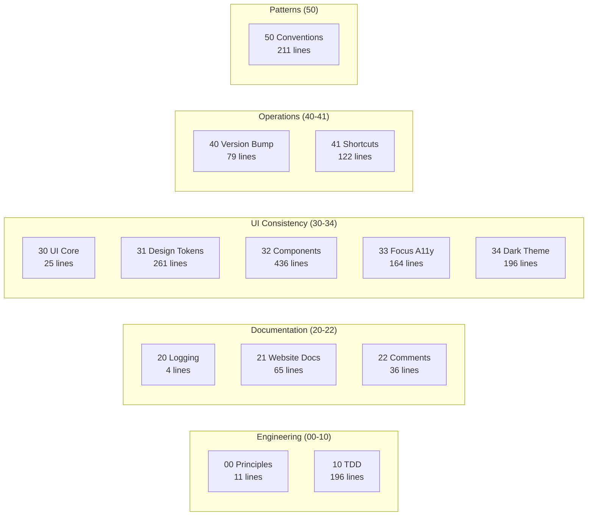

O diretório `.claude/rules/` do VMark contém 13 arquivos de regras — não diretrizes vagas, mas convenções específicas e aplicáveis:

| Arquivo de Regra | Linhas | O Que Codifica |
|------------------|--------|----------------|
| `00-engineering-principles.md` | 11 | Convenções centrais (sem destructuring de Zustand, limite de 300 linhas) |
| `10-tdd.md` | 196 | 5 templates de padrões de teste, catálogo de anti-padrões, gates de cobertura |
| `20-logging-and-docs.md` | 4 | Fonte única de verdade por tópico |
| `21-website-docs.md` | 65 | Tabela de mapeamento código-para-documentação (quais mudanças de código exigem quais atualizações de docs) |
| `22-comment-maintenance.md` | 36 | Quando atualizar/não atualizar comentários, prevenção de deterioração |
| `30-ui-consistency.md` | 25 | Princípios centrais de UI, referências cruzadas para sub-regras |
| `31-design-tokens.md` | 261 | Referência completa de tokens CSS — cada cor, espaçamento, raio, sombra |
| `32-component-patterns.md` | 436 | Padrões de popup, toolbar, menu de contexto, tabela, scrollbar com código |
| `33-focus-indicators.md` | 164 | 6 padrões de foco por tipo de componente (conformidade WCAG) |
| `34-dark-theme.md` | 196 | Detecção de tema, padrões de override, checklist de migração |
| `40-version-bump.md` | 79 | Procedimento de sincronização de versão em 5 arquivos com script de verificação |
| `41-keyboard-shortcuts.md` | 122 | Sincronização de 3 arquivos (Rust/Frontend/Docs), verificação de conflitos, convenções |
| `50-codebase-conventions.md` | 211 | 10 padrões não documentados descobertos durante o desenvolvimento |

Essas regras são lidas pelo Claude Code no início de cada sessão. São a razão pela qual o commit 2,180 segue as mesmas convenções do commit 100.

A regra `50-codebase-conventions.md` é particularmente notável — documenta padrões que *ninguém projetou*. Eles surgiram organicamente durante o desenvolvimento e depois foram codificados: convenções de nomenclatura de stores, padrões de limpeza de hooks, estrutura de plugins, assinaturas de handlers do bridge MCP, organização de CSS, idiomas de tratamento de erros.

### 19 Skills do Projeto (Expertise do Domínio)

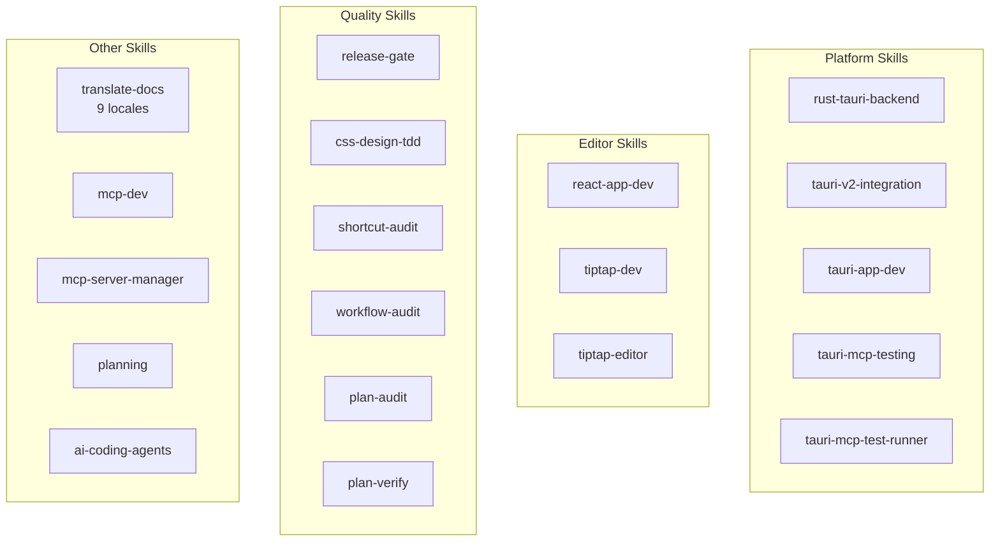

| Categoria | Skills | O Que Habilitam |
|-----------|--------|-----------------|
| **Tauri/Rust** | `rust-tauri-backend`, `tauri-v2-integration`, `tauri-app-dev`, `tauri-mcp-testing`, `tauri-mcp-test-runner` | Desenvolvimento Rust específico de plataforma com convenções Tauri v2 |
| **React/Editor** | `react-app-dev`, `tiptap-dev`, `tiptap-editor` | Padrões do editor Tiptap/ProseMirror, regras de seletores Zustand |
| **Qualidade** | `release-gate`, `css-design-tdd`, `shortcut-audit`, `workflow-audit`, `plan-audit`, `plan-verify` | Verificação de qualidade automatizada em cada nível |
| **Documentação** | `translate-docs` | Tradução para 9 locales com auditoria orientada por subagentes |
| **MCP** | `mcp-dev`, `mcp-server-manager` | Desenvolvimento e configuração de servidores MCP |
| **Planejamento** | `planning` | Geração de planos de implementação com documentação de decisões |
| **Ferramentas IA** | `ai-coding-agents` | Orquestração multi-agente (Codex CLI, Claude Code, Gemini CLI) |

### 7 Comandos Slash (Automação de Fluxos de Trabalho)

| Comando | O Que Faz |
|---------|-----------|
| `/bump` | Incremento de versão em 5 arquivos, commit, tag, push |
| `/fix-issue` | Resolvedor de issues do GitHub de ponta a ponta — buscar, classificar, corrigir, auditar, PR |
| `/merge-prs` | Revisar e mesclar PRs abertas sequencialmente com tratamento de rebase |
| `/fix` | Corrigir problemas corretamente — sem patches, sem atalhos, sem regressões |
| `/repo-clean-up` | Remover execuções de CI falhadas e branches remotos obsoletos |
| `/feature-workflow` | Desenvolvimento de funcionalidades de ponta a ponta com gates e agentes |
| `/test-guide` | Gerar guia de testes manuais |

### O Efeito Composto

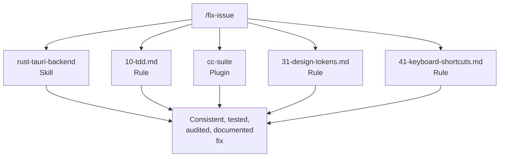

Regras + skills + plugins + comandos formam um sistema composto. Quando você executa `/fix-issue`, ele usa o skill `rust-tauri-backend` para mudanças em Rust, segue a regra `10-tdd.md` para requisitos de testes, invoca `cc-suite` para auditoria, verifica `31-design-tokens.md` para conformidade CSS e valida contra `41-keyboard-shortcuts.md` para sincronização de atalhos de teclado.

Nenhuma peça individual é revolucionária. O efeito composto — 13 regras x 19 skills x 7 plugins x 7 comandos, todos se reforçando mutuamente — é o que faz o sistema funcionar. Cada peça foi adicionada quando uma lacuna foi descoberta, testada em desenvolvimento real e refinada através do uso.

## Para Construtores de Plugins

Se você está pensando em construir plugins para o Claude Code, aqui está o que o VMark nos ensinou:

1. **Construa para si mesmo primeiro.** Os melhores plugins resolvem seus problemas reais, não os hipotéticos.

2. **Dogfooding implacável.** Use seus plugins nos seus projetos reais. O atrito que você descobrir é o atrito que seus usuários vão descobrir.

3. **Hooks precisam de válvulas de escape.** Hooks bloqueantes que não podem ser ignorados serão desabilitados por completo. Torne a aplicação opt-in ou sensível ao contexto.

4. **Verificação cross-model funciona.** Ter uma IA diferente revisando o trabalho da sua IA principal detecta bugs reais. Não é redundante — é ortogonal.

5. **Codifique disciplina, não regras.** Os melhores plugins mudam hábitos. Os hooks bloqueantes do tdd-guardian foram removidos, mas a campanha de cobertura que eles inspiraram foi o investimento de qualidade mais impactante do projeto.

6. **Componha, não crie monolitos.** Sete plugins focados vencem um mega-plugin. Cada um faz uma coisa bem, e eles se compõem em fluxos de trabalho maiores que a soma de suas partes.

7. **Confiança se conquista a cada invocação.** O desenvolvedor confia no cc-suite o suficiente para dizer "corrija tudo" sem revisar os achados. Essa confiança foi construída em 27 sessões e 292 issues resolvidos.

---

*VMark é open source em [github.com/xiaolai/vmark](https://github.com/xiaolai/vmark). Todos os sete plugins estão disponíveis no marketplace `xiaolai` do Claude Code.*
