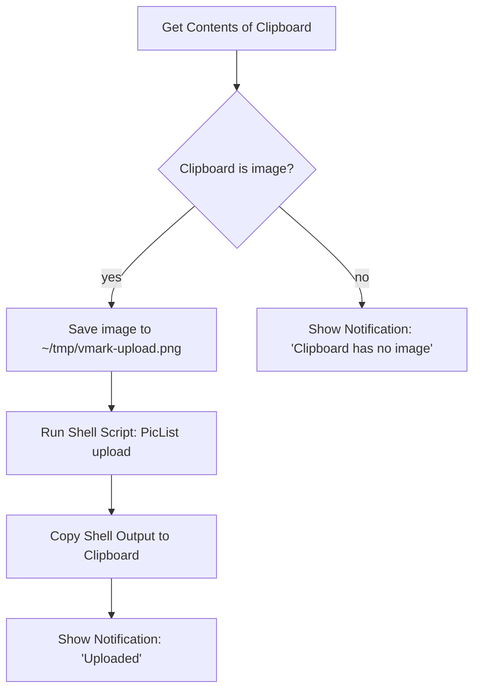

# 云端托管图片

VMark 是一款本地优先的写作工具,既没有内置剪贴板图片上传功能,也不会保存任何云端凭证。如果你希望 Markdown 里出现公开的 CDN 链接(用于发布博客、跨设备同步、向 CMS 投稿),建议在 VMark 之外用系统级自动化工具完成上传,再把结果回传给 VMark。

本页会说明 VMark 为何这样设计、哪些场景下不用额外配置就能直接使用,以及如何用大约十分钟搭好 Shortcuts.app 方案。

[[toc]]

## VMark 已经支持的能力

VMark 处理 Markdown 中的图片引用时,会区分两个方向:

| 方向 | 状态 | 触发方式 | Markdown 中的输出 |
|------|------|----------|-------------------|
| 插入已有的远程 URL | 支持 | 粘贴或输入 `https://…` 链接 | 链接原样保留 |
| Markdown 源文件中含远程 URL | 支持 | 任何人写下 `` | 直接渲染 |
| 插入本地图片 | 支持 | 粘贴、拖拽或插入二进制 | 复制到 `.assets/`,写入相对路径 |
| 插入本地图片*但保存到远程* | **未内置** | (见下文方案) | — |

一句话:如果图片本身就有 URL,直接粘贴即可。VMark 会把它作为 Markdown 图片引用插入,由 Webview 负责拉取。读取这一侧本来就支持云端图片。

## VMark 为什么不内置云端上传

设想中的功能是:VMark 在粘贴时识别出本地图片,上传到远程存储,然后把返回的 URL 写入 Markdown,而不是写入 `./.assets/…` 路径。听上去不复杂,但会让 VMark 的边界从三个关键方向向外扩张:

1. **凭证管理**。原生 S3 兼容上传需要把用户的 access key 和 secret access key 长期保存下来。VMark 目前不保存任何长期密钥——既没有落盘加密方案、也没有接入系统 keychain、没有密钥轮换的相关界面,自然也不存在"密钥被误写进 Markdown"这种故障模式。一旦加入上传功能,就跨过了这条边界。

2. **多服务商适配的长期负担**。S3、Cloudflare R2、Backblaze B2、MinIO、DigitalOcean Spaces 都号称兼容 S3,但每家都有自己的脾气(path-style 与 virtual-hosted 寻址方式、ACL 语义、区域 endpoint、CORS 规则)。让一名维护者长期吃下这一摊接口,对一款写作工具来说成本太高。

3. **组合而非独占**。[PicList](https://github.com/Kuingsmile/PicList) 和 [PicGo](https://github.com/Molunerfinn/PicGo) 这类工具已经把这件事做好了,包括各家服务商的专属配置和凭证管理。macOS Shortcuts.app 和 Keyboard Maestro 又可以把这些工具接入系统里任意一个文本输入框——并不局限于 VMark。把云端上传塞进 VMark,等于重复造一份外部生态已经做得更好的轮子,而且只能在 VMark 里用。

由此得出结论:**VMark 专心做写作工具;图片上传交给用户自己的系统级自动化工具链**。下面的方案就是把这条系统级路径落到实处。

## 方案:Shortcuts.app + PicList(macOS,免费)

Shortcuts.app 自 macOS Monterey(12)起随系统一同发布。PicList 是一款免费开源的图片上传器。两者搭配,可以提供这样一个热键:取出剪贴板里当前的图片,通过 PicList 上传(PicList 已经支持 R2、S3、Imgur 等几十种后端),再把返回的 URL 写回剪贴板。之后在 VMark 中按 `Cmd + V` 即可插入 URL——剩下的事就交给 VMark 现有的远程 URL 识别逻辑。

### 前置条件

1. **安装并配置 PicList**。从 [PicList releases 页面](https://github.com/Kuingsmile/PicList/releases)下载,先运行一次,在 PicList 的 *PicBed Settings* 中至少配置一个图床(R2、S3、Imgur、smms 等)。搭建 Shortcut 之前,先在 PicList 里确认手动上传能成功——这样可以把"PicList 是否正常"和"Shortcut 是否接对"两件事分开排查。

2. **PicList CLI 可用**。PicList 在应用包内提供了 `upload` 子命令。在 macOS 上,二进制文件位于 `/Applications/PicList.app/Contents/MacOS/PicList`。用以下命令验证:

   ```sh
   /Applications/PicList.app/Contents/MacOS/PicList upload --help
   ```

   正常情况下会输出 CLI 帮助信息。如果没有,确认 PicList 是否安装在 `/Applications` 而不是 `~/Applications`(若在后者,请相应调整路径)。

### 搭建这个 Shortcut

打开 `Shortcuts.app`,新建一个 shortcut。依次添加以下动作:



在 Shortcuts 编辑器中的具体步骤:

1. **动作:Get Contents of Clipboard**。从侧边栏拖入,无需配置。

2. **动作:If**。条件设为 *Clipboard is Media › Image*。(若下拉菜单里没有 *Media*,可以改用更宽松的 *Contents › has any value*。)

3. **在 If 分支内——动作:Save File**。配置如下:
   - Service:*Files*
   - Destination:`~/tmp/`(若该文件夹不存在,先在 Finder 里创建一次)。
   - File name:`vmark-upload.png`(固定文件名,后续步骤的路径才可预测)。
   - 关闭 *Ask Where To Save*,以便 shortcut 无人值守运行。

4. **动作:Run Shell Script**。配置如下:
   - Shell:`/bin/zsh`(macOS 默认)。
   - Input:*Pass Input as `stdin`*——这里我们实际想要的是 `as arguments`。(其实两者都行,因为下面的脚本忽略 stdin,直接使用字面量路径。)
   - 脚本内容:

     ```sh
     /Applications/PicList.app/Contents/MacOS/PicList upload "$HOME/tmp/vmark-upload.png" 2>/dev/null | tail -n 1
     ```

   `tail -n 1` 是一道防御措施:PicList 可能在 URL 之前先输出日志行。请对照你的 PicList 版本检查一次实际输出格式;如果 PicList 只返回 URL,`tail` 实际上不起作用,也不会有副作用。

5. **动作:Copy to Clipboard**。把输入设为 *Shell Script Result*。

6. **动作:Show Notification**。Title:`Uploaded`;Body:*Shell Script Result*。这一步可以确认 URL 已写入剪贴板,同时显示具体上传了哪张图。

7. **(可选)Else 分支——动作:Show Notification**。Title:`No image on clipboard`。当热键被触发但剪贴板里其实没有图片时,可借此快速定位问题。

### 绑定全局热键

在 Shortcuts 编辑器中点击 shortcut 的 *(i)* 信息按钮,选择 *Add Keyboard Shortcut*。挑一个不与 VMark 快捷键冲突的组合——`Control + Option + Command + U` 是常见选择(macOS 内部不冲突,助记符是 "Upload")。

### 使用方法

1. 用 `Cmd + Shift + Ctrl + 4` 截图(直接进剪贴板,不落盘),或从任意 App 复制一张图片。
2. 按下你设置的上传热键(`Ctrl + Opt + Cmd + U`)。
3. 等待约 1–3 秒,直到通知弹出。
4. 在 VMark 中按 `Cmd + V` 粘贴,Markdown 中即可得到 ``。

### 常见问题排查

| 现象 | 可能原因 | 解决办法 |
|------|----------|----------|
| Shortcut 已触发,但 PicList 没有运行 | PicList 二进制路径不对 | 确认 `/Applications/PicList.app/Contents/MacOS/PicList` 存在;若装在别处,相应调整路径 |
| 通知出现了,但剪贴板里还是那张图 | Shell 脚本返回为空 | 用一个已知正常的文件路径手动跑一遍 shell 脚本,看看 PicList 实际输出什么 |
| URL 不对 / 末尾带有空白字符 | `tail -n 1` 取到的是日志行,而非 URL | 检查 PicList 的输出,调整解析方式(`grep -oE 'https://[^[:space:]]+' \| tail -n 1` 是更严格的备选) |
| 在 VMark 中 `Cmd + V` 粘贴成纯文本,而不是图片 | URL 末尾的扩展名不在 PicList 认识的图片后缀之列 | 确认上传过程中文件扩展名得到保留(R2/S3 通常会保留;检查你的 bucket key 模板) |

## 替代方案:Keyboard Maestro

[Keyboard Maestro](https://www.keyboardmaestro.com/) 是一款付费的 macOS 自动化工具,能力上限高于 Shortcuts.app。对本工作流而言,它的主要实用优势在于:当剪贴板里是图片时,KM 可以直接拦截 `Cmd + V`,从而把上传和粘贴合并成一次按键,而不是两次(先按热键再按 `Cmd + V`)。

整体配方与 Shortcuts.app 版本如出一辙——取剪贴板图片、存为文件、运行 PicList CLI、替换剪贴板,必要时再模拟一次粘贴。KM 的 *Trigger* 宏更灵活(可以根据剪贴板内容触发,也可以按 App 限定作用域),但上传步骤本质相同。

如果你不是已有的 Keyboard Maestro 用户,Shortcuts.app 是更划算的选择。

## 替代方案:发布前批量处理脚本

对于自建博客或静态站点发布管线的用户来说,最干净的做法往往是:保留 VMark 的默认行为(`.assets/` 相对路径),在构建时运行一个脚本,扫描 Markdown、逐张上传图片、改写路径。这样把"每插入一张图就实时上传"的延迟,换成了"发布时一次批量上传",同时让编辑器界面保持清爽。

一个最简化的草稿(Node.js,伪代码):

```js
// scan-and-upload.js
const fs = require("fs");
const { execSync } = require("child_process");

const md = fs.readFileSync(process.argv[2], "utf8");
const rewritten = md.replace(/!\[(.*?)\]\((\.\/\.assets\/[^)]+)\)/g, (_, alt, path) => {
  const url = execSync(
    `/Applications/PicList.app/Contents/MacOS/PicList upload "${path}"`,
  ).toString().trim();
  return ``;
});
fs.writeFileSync(process.argv[2].replace(/\.md$/, ".published.md"), rewritten);
```

不少静态站点生成器(配合 [Page Bundles](https://gohugo.io/content-management/page-bundles/) 的 Hugo、Jekyll、Astro、Eleventy)在构建时就原生支持相对的 `.assets/` 路径——如果你用的就是这种发布方式,根本不需要任何脚本。

## 已托管的 URL

补充一种最简单的情形:如果图片本身已经有公开 URL,直接粘贴到 VMark 就完成了。剪贴板的图片路径识别器会将其归为 `type: "url"`,并原样写入 URL。不上传、不拷贝到 `.assets/`、不用改任何设置。这是 VMark 支持的最简洁的云端图片工作流,且无需任何额外工具。

## 参见

- [文件与图片设置](./settings.md) —— 自动缩放、复制到 assets、清理孤立资源
- [隐私](./privacy.md) —— VMark 在本地保存什么、什么会离开你的电脑
