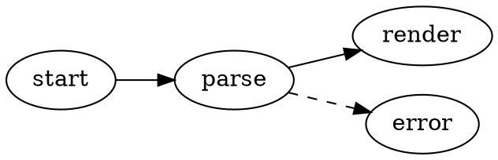
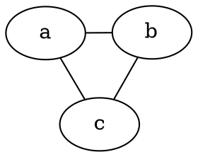

# Graphviz 图表

VMark 可在 Markdown 文档中直接渲染 [Graphviz](https://graphviz.org/) DOT 图。图表由 Graphviz 的 WASM 构建版（[@viz-js/viz](https://github.com/mdaines/viz-js)）在本地渲染——无需网络访问，也不依赖外部可执行程序。

[[toc]]

## 插入图表

通过菜单栏的 **插入 → Graphviz 图表**（或工具栏的插入分组）插入一个模板图表——该快捷键默认未绑定，可在设置中自定义。也可以直接输入带有 `dot` 或 `graphviz` 语言标识符的围栏代码块：

````markdown

````

两种围栏语言的行为完全相同：

| 围栏 | 渲染为 |
|-------|------------|
| ` ```dot ` | Graphviz 图表 |
| ` ```graphviz ` | Graphviz 图表 |

## 编辑模式

- **所见即所得模式**——代码块直接渲染为图表。双击图表即可编辑 DOT 源码，编辑时会实时预览（带防抖）；在编辑标题栏中保存或取消。
- **源码模式**——将光标置于 ` ```dot ` 围栏内，即可看到浮动图表预览（可拖动、调整大小、缩放），与 Mermaid 相同。

## 平移、缩放与导出

渲染后的图表支持与 Mermaid 图表相同的操作：

- **Cmd/Ctrl + 滚动** 缩放，拖动平移，点击重置按钮恢复居中
- 通过导出按钮 **导出为 PNG**（浅色或深色背景）

## 引擎与布局

图表默认使用 `dot` 引擎（层次化/分层布局）进行排布。要使用其他引擎，请在图中设置标准的 Graphviz `layout` 属性——这一设置会随文档一起保存，在其他 Graphviz 工具中同样有效：

````markdown

````

| 引擎 | 布局风格 |
|--------|--------------|
| `dot` | 层次化/分层（默认） |
| `neato` | 弹簧模型（力导向） |
| `fdp` | 力导向，适合较大的图 |
| `sfdp` | 多尺度力导向，适合超大规模的图 |
| `circo` | 环形 |
| `twopi` | 放射状 |
| `osage` | 聚类 |
| `patchwork` | 矩形树图（方形化） |

遇到未知的 `layout` 值时，会像其他 DOT 错误一样显示渲染错误状态。

Graphviz 支持的所有标准 DOT 特性均可使用：子图与聚类、层级（rank）、节点形状、边样式、类 HTML 标签，以及显式颜色。

## 主题适配

- 图表背景是透明的，因此会跟随编辑器主题。
- 默认的节点、边和文字颜色派生自当前主题的设计令牌，因此图表在每个主题（White、Paper、Mint、Sepia、Night、Solarized）中都有原生观感，并会在切换主题时自动更新。
- DOT 源码中的显式颜色始终优先于主题默认值——如果图中自行设置了 `bgcolor`、`color` 或 `fontcolor`，就会严格按源码渲染。

## 错误处理

如果 DOT 源码存在语法错误，代码块会显示渲染错误状态而非图表。修正源码后，预览会自动重新渲染。

## HTML 与 PDF 导出

导出的 HTML 和 PDF 文档会嵌入渲染后的 SVG，因此在 VMark 之外查看时，图表显示效果也完全一致。
