# 用户即开发者

七个 Claude Code 插件是如何在 VMark 的开发烈火中锻造成不可或缺之物的。

## 背景

VMark 是一款基于 Tauri、React 和 Rust 构建的 AI 友好型 Markdown 编辑器。经过 10 周的开发：

| 指标 | 数值 |
|--------|-------|
| 提交数 | 2,180+ |
| 代码库规模 | 305,391 行代码 |
| 测试覆盖率 | 99.96% 行覆盖 |
| 测试与生产代码比 | 1.97:1 |
| 创建并解决的审计问题 | 292 |
| 自动合并的 PR | 84 |
| 文档语言数 | 10 |
| MCP 服务器工具 | 12 |

一位开发者使用 Claude Code 构建了它。在此过程中，这位开发者为 Claude Code 市场创建了七个插件——不是副业项目，而是生存工具。每个插件的存在都是因为某个特定痛点需要一个尚不存在的解决方案。

## 插件一览

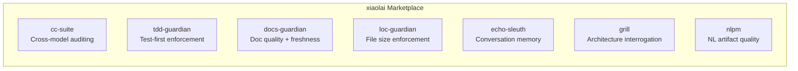

| 插件 | 功能 | 诞生缘由 |
|--------|-------------|-----------|
| [cc-suite](https://github.com/xiaolai/cc-suite) | 通过 OpenAI Codex 进行跨模型代码审计 | "我需要一双不是 Claude 的第二双眼睛" |
| [tdd-guardian](https://github.com/xiaolai/tdd-guardian-for-claude) | 测试优先工作流强制执行 | "忘了写测试，覆盖率又降了" |
| [docs-guardian](https://github.com/xiaolai/docs-guardian-for-claude) | 文档质量与时效审计 | "文档写的是 `com.vmark.app`，但实际标识符是 `app.vmark`" |
| [loc-guardian](https://github.com/xiaolai/loc-guardian-for-claude) | 单文件行数限制强制执行 | "这个文件 800 行了，居然没人注意到" |
| [echo-sleuth](https://github.com/xiaolai/echo-sleuth-for-claude) | 对话历史挖掘与记忆 | "三周前我们关于那个问题做了什么决定？" |
| [grill](https://github.com/xiaolai/grill-for-claude) | 深度多角度代码审查 | "我需要的是架构评审，不只是 lint 检查" |
| [nlpm](https://github.com/xiaolai/nlpm-for-claude) | 自然语言编程产物质量检查 | "我的提示词和技能文件写得到底好不好？" |

## 前后对比

转变在三个月内完成。

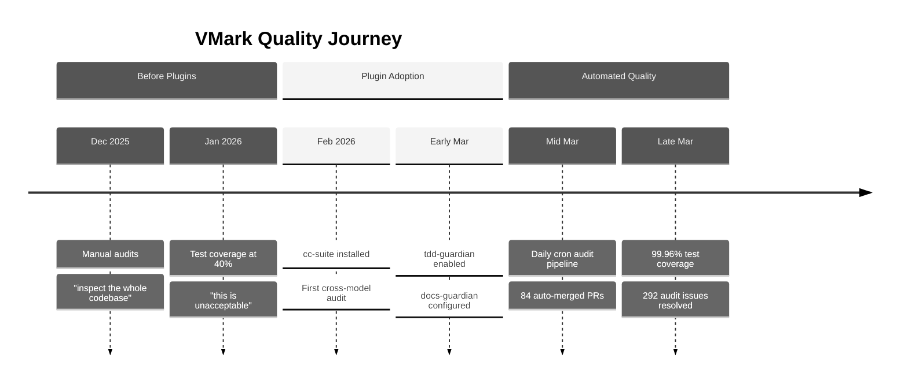

**插件之前**（2025 年 12 月至 2026 年 2 月）：手动代码审计。开发者会说"检查整个代码库，找出可能的 bug 和缺陷。"测试覆盖率徘徊在 40% 左右——被描述为"不可接受"。文档写完就被遗忘了。

**插件之后**（2026 年 3 月）：每次开发会话自动加载 3-4 个插件。自动化审计管道每日运行，无需人工干预即可创建和解决问题。通过 26 个阶段的系统性递增计划，测试覆盖率达到了 99.96%。文档准确性以机械般的精度与代码进行比对验证。

Git 历史记录讲述了这个故事：

| 分类 | 提交数 |
|----------|---------|
| 总提交数 | 2,180+ |
| Codex 审计响应 | 47 |
| 测试/覆盖率 | 52 |
| 安全加固 | 40 |
| 文档 | 128 |
| 覆盖率计划阶段 | 26 |

## cc-suite：第二意见

**使用频率**：28 次插件会话中使用了 27 次。所有会话累计 200+ 次 Codex 调用。

cc-suite 最重要的一点是——它*不是 Claude 审计 Claude 自己的工作*。它将代码发送给 OpenAI 的 Codex 模型进行独立评审。当你与一个 AI 深入开发某个功能时，让一个完全不同的模型来审视结果，能捕获你和你的主力 AI 都遗漏的问题。

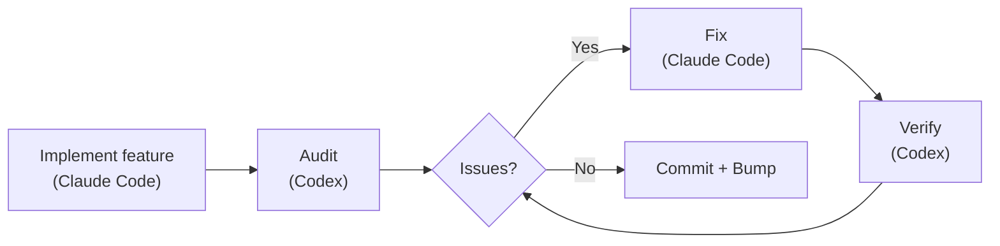

### 实际发现

292 个审计问题。全部 292 个已解决。零遗留。

来自 Git 历史的真实案例：

- **安全**：安全存储迁移的单次审计中发现 9 个问题（[`d1a880a6`](https://github.com/xiaolai/vmark/commit/d1a880a6)）。资源解析器中的符号链接遍历漏洞（[`7dfa872d`](https://github.com/xiaolai/vmark/commit/7dfa872d)）。path-to-regexp 高严重性漏洞（[`8c554cdc`](https://github.com/xiaolai/vmark/commit/8c554cdc)）。

- **无障碍**：每个弹出按钮都缺少 `aria-label`。FindBar、Sidebar、Terminal 和 StatusBar 中的纯图标按钮没有屏幕阅读器文本（[`7acc0bf0`](https://github.com/xiaolai/vmark/commit/7acc0bf0)）。Lint 徽章缺少焦点指示器（[`c4db90d4`](https://github.com/xiaolai/vmark/commit/c4db90d4)）。

- **隐性逻辑 bug**：当多光标范围合并时，主光标索引会静默回退到 0。用户在位置 50 编辑，范围合并后光标突然跳到文档开头。这是审计发现的，不是测试发现的。

- **i18n 规范评审**：Codex 评审了国际化设计规范，发现"macOS 菜单 ID 迁移按照规范中的描述是无法实现的"（[`1208c98d`](https://github.com/xiaolai/vmark/commit/1208c98d)）。在多语言文件中发现了 4 个翻译质量问题（[`af98b5cd`](https://github.com/xiaolai/vmark/commit/af98b5cd)）。

- **多轮审计**：Lint 插件经历了三轮审计——第一轮 8 个问题（[`7482c347`](https://github.com/xiaolai/vmark/commit/7482c347)），第二轮 6 个（[`8bfead81`](https://github.com/xiaolai/vmark/commit/8bfead81)），最后一轮 7 个（[`84cf67f7`](https://github.com/xiaolai/vmark/commit/84cf67f7)）。每一轮，Codex 都发现了修复引入的新问题。

### 自动化管道

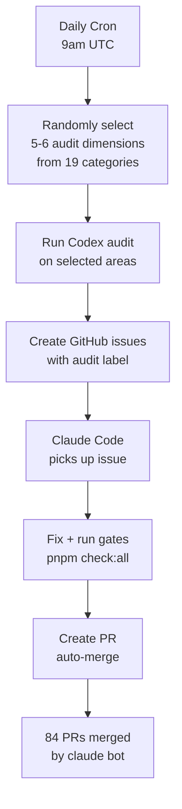

最终形态：每日定时审计，UTC 时间早上 9 点自动运行。它从 19 个审计类别中随机选取 5-6 个维度，检查代码库的不同部分，创建带标签的 GitHub issue，并调度 Claude Code 进行修复。84 个 PR 由 `claude[bot]` 自动创建、自动修复、自动合并——其中许多在开发者醒来之前就已完成。

### 信任信号

当开发者运行审计并得到发现时，他的反应从来不是"让我先看看这些发现"，而是：

> "全部修复。"

这就是一个工具经过数百次验证后所获得的信任水平。

## tdd-guardian：争议之选

**使用频率**：3 次显式会话。42 次会话中有 5,500+ 次后台引用。

tdd-guardian 的故事最有趣，因为它包含了失败。

### 阻塞钩子问题

tdd-guardian 附带了一个 PreToolUse 钩子，如果测试覆盖率未达到阈值，就会阻止提交。理论上这能强制执行测试优先的纪律。实际上：

> "tdd-guardian 那个阻塞钩子，是不是应该去掉，让 tdd guardian 改成手动命令运行？"

问题是真实存在的：状态文件中过期的 SHA 会阻塞无关的提交。开发者不得不手动修补 `state.json` 来解除阻塞。阻塞钩子与已在每个 PR 上运行 `pnpm check:all` 的 CI 门控是冗余的。

钩子被禁用了（[`f2fda819`](https://github.com/xiaolai/vmark/commit/f2fda819)）。但*理念*存活了下来。

### 26 阶段覆盖率攻坚

tdd-guardian 所播下的种子，是驱动了一场非凡的覆盖率攻坚计划的纪律：

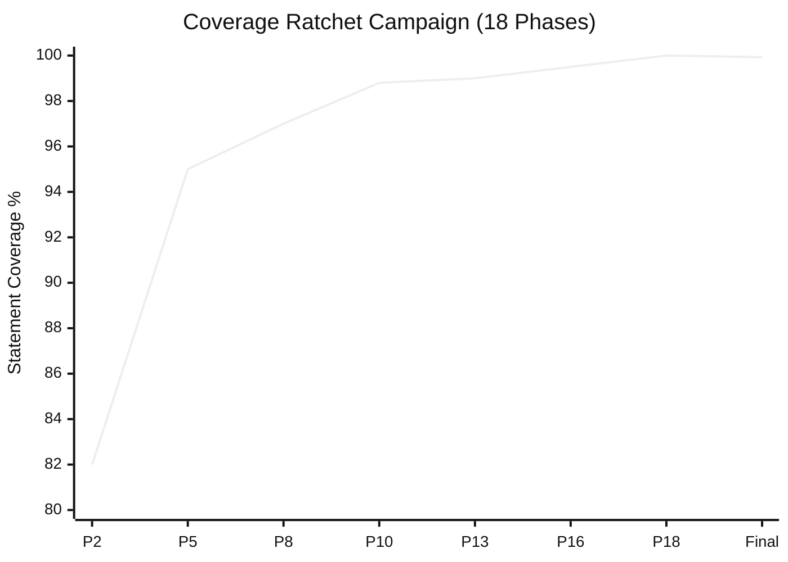

| 阶段 | 提交 | 阈值 |
|-------|--------|-----------|
| 阶段 2 | [`1e5cf94a`](https://github.com/xiaolai/vmark/commit/1e5cf94a) | 82/74/86/83 |
| 阶段 5 | [`4658d75f`](https://github.com/xiaolai/vmark/commit/4658d75f) | 95/87/95/96 |
| 阶段 8 | [`3d7239c3`](https://github.com/xiaolai/vmark/commit/3d7239c3) | 深入 tabEscape、codePreview、formatToolbar |
| 阶段 13 | [`9bec6612`](https://github.com/xiaolai/vmark/commit/9bec6612) | 深入 multiCursor、mermaidPreview、listEscape |
| 阶段 16 | [`730ff139`](https://github.com/xiaolai/vmark/commit/730ff139) | 145 个文件的 v8 注解，99.5/99/99/99.6 |
| 阶段 18 | [`1d996778`](https://github.com/xiaolai/vmark/commit/1d996778) | 递增至 100/99.87/100/100 |
| 最终 | [`fcf5e00d`](https://github.com/xiaolai/vmark/commit/fcf5e00d) | 99.93% 语句 / 99.96% 行 |

从约 40%（"不可接受"）到 99.96% 行覆盖率，经历 18 个阶段，每个阶段都将阈值递增得更高，使覆盖率永远不可能回退。测试与生产代码比达到了 1.97:1——测试代码几乎是应用代码的两倍。

### 教训

最好的强制执行机制是那些改变你的习惯、然后退居幕后的机制。tdd-guardian 的阻塞钩子过于激进，但禁用了它们的开发者，后来编写的测试比任何启用阻塞钩子的人都多。

## docs-guardian：尴尬检测器

**使用频率**：3 次会话。首次审计即发现 2 个严重问题。

### `com.vmark.app` 事件

docs-guardian 的准确性检查器同时读取代码和文档，然后进行比对。在对 VMark 的首次全面审计中，它发现 AI Genies 指南告诉用户他们的精灵存储在：

```
~/Library/Application Support/com.vmark.app/genies/
```

但代码中实际的 Tauri 标识符是 `app.vmark`。真正的路径是：

```
~/Library/Application Support/app.vmark/genies/
```

这在所有三个平台上都是错的，英文指南和所有 9 个翻译版本都是错的。没有测试能捕获这个问题。没有 linter 能捕获这个问题。docs-guardian 捕获了它，因为这正是它的职责：机械地、逐对地比较代码和文档。

### 完整审计影响

```mermaid
%%{init: {"theme": "neutral"}}%%
xychart-beta
    title "Documentation Health Before vs After"
    x-axis ["Accuracy", "Coverage", "Quality", "Overall"]
    y-axis "Score" 0 --> 100
    bar [78, 64, 83, 74]
    bar [95, 91, 88, 91]
```

| 维度 | 之前 | 之后 | 变化 |
|-----------|--------|-------|-------|
| 准确性 | 78/100 | 95/100 | +17 |
| 覆盖率 | 64% | 91% | +27% |
| 质量 | 83/100 | 88/100 | +5 |
| **总体** | **74/100** | **91/100** | **+17** |

在一次会话中发现并记录了 17 个未文档化的功能。Markdown Lint 引擎——包含 15 条规则、快捷键和状态栏徽章——没有任何用户文档。`vmark` 命令行工具完全没有文档。只读模式、通用工具栏、标签页拖拽分离——这些都是已发布但用户无法发现的功能，因为没人写文档。

`config.json` 中的 19 个代码到文档的映射意味着，每当 `shortcutsStore.ts` 发生变化，docs-guardian 就知道 `website/guide/shortcuts.md` 需要更新。文档偏差变得可以机械地检测。

## loc-guardian：300 行规则

**使用频率**：4 次会话。标记 14 个文件，其中 8 个为警告级别。

VMark 的 AGENTS.md 包含这样一条规则："保持代码文件在约 300 行以内（主动拆分）。"

这条规则并非来自某个风格指南。它来自 loc-guardian 的扫描——不断发现 500 行以上的文件，这些文件难以导航、难以测试，也难以让 AI 助手有效地处理。最严重的：`hot_exit/coordinator.rs` 达到了 756 行。

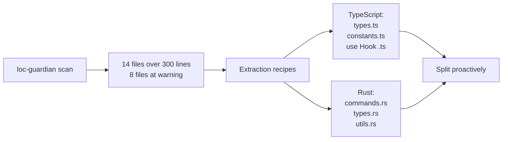

LOC 数据还被用于项目评估——当开发者想了解"这个项目代表了多少人力投入？"时，LOC 报告是起始输入。答案：在 AI 辅助开发下相当于 40-60 万美元的等价投资。

## echo-sleuth：组织记忆

**使用频率**：6 次会话。为一切提供基础设施。

echo-sleuth 是最安静的插件，但可以说是最基础的。它的 JSONL 解析脚本是使对话历史可搜索的基础设施。当任何其他插件需要回忆过去会话中发生了什么时，echo-sleuth 的工具负责实际工作。

这篇文章之所以存在，是因为 echo-sleuth 挖掘了 35+ 个 VMark 会话，找到了每一次插件调用、每一个用户反应和每一个决策点。它提取了 292 个问题数、84 个 PR 数、覆盖率攻坚时间线，以及"狠狠地审视自己"的会话。没有它，"为什么这些插件不可或缺？"的证据将是轶事性的，而非考古学般的。

## grill：严厉的镜子

**安装于**：每个 VMark 会话。**被显式调用进行自我评估。**

grill 最令人难忘的时刻是 3 月 21 日的会话。开发者问道：

> "如果你能更严厉地审视自己，不用担心时间和精力，你会做什么不同的事？"

grill 产出了一份 14 点质量差距分析——一个包含 81 条消息、863 次工具调用的会话，推动了多阶段质量加固计划（[`076dd96c`](https://github.com/xiaolai/vmark/commit/076dd96c)，[`5e47e522`](https://github.com/xiaolai/vmark/commit/5e47e522)）。发现包括：

- Rust 后端测试覆盖率仅为 27%
- 模态对话框中的 WCAG 无障碍缺陷（[`85dc29fa`](https://github.com/xiaolai/vmark/commit/85dc29fa)）
- 104 个文件超出 300 行规范
- 应该使用结构化日志的 Console.error 调用（[`530b5bb7`](https://github.com/xiaolai/vmark/commit/530b5bb7)）

这不是 linter 发现的缺少分号。这是战略性的质量思考，推动了为期一周的投入计划。

## nlpm：成长的阵痛

**调用次数**：显式 0 次。**产生摩擦**：1 次会话。

nlpm 的 PostToolUse 钩子连续三次阻断了 VMark 的编辑会话：

> "PostToolUse:Edit 钩子阻止了继续执行，为什么？"
> "又停了，为什么？！"
> "这是无害的……但太浪费时间了。"

该钩子在检查编辑的文件是否匹配自然语言产物模式。在修复结构性字符保护的 bug 时，这纯粹是噪音。该插件在那次会话中被禁用。

这是诚实的反馈。不是每次插件交互都是正面的。构建了 nlpm 的开发者通过 VMark 发现，文件模式上的 PostToolUse 钩子需要更好的过滤——bug 修复不应触发自然语言产物的检查。

## 五阶段演进

插件的采用并非一蹴而就。它遵循了一条清晰的轨迹：

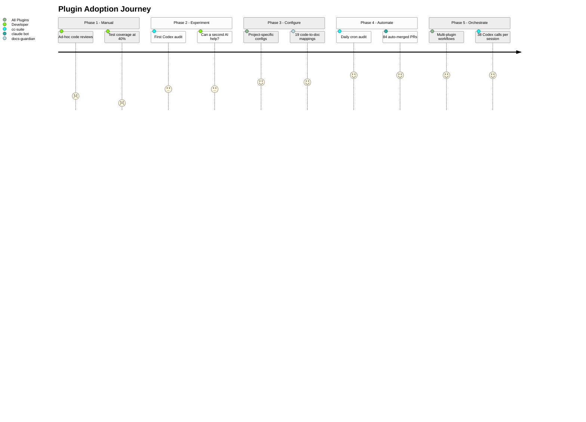

### 第一阶段：手动审计（2026 年 1 月）
> "检查整个代码库，找出可能的 bug 和缺陷"

临时性的评审。没有工具。测试覆盖率 40%。

### 第二阶段：单插件实验（1 月底至 2 月初）
> "让 Codex 审查代码质量"

首次在 MCP 服务器上使用 cc-suite。实验阶段。第二个 AI 能捕获第一个遗漏的东西吗？首次安装：[`e6373c7a`](https://github.com/xiaolai/vmark/commit/e6373c7a)。

### 第三阶段：配置化基础设施（3 月初）
安装插件并配置项目特定的设置。tdd-guardian 以严格阈值启用（[`f775f300`](https://github.com/xiaolai/vmark/commit/f775f300)）。docs-guardian 配置了 19 个代码到文档的映射。loc-guardian 设置了 300 行限制和提取规则。

### 第四阶段：自动化管道（3 月中旬）
每日 UTC 早上 9 点定时审计。问题自动创建、自动修复、自动提 PR、自动合并。84 个 PR 无需人工干预。

### 第五阶段：多插件编排（3 月下旬）
单次会话中组合 loc-guardian 扫描 -> 性能审计 -> 子代理实现 -> cc-suite 审计 -> cc-suite 验证 -> 版本号递增。一次会话 38 次 Codex 调用。插件组合成工作流。

## 反馈循环

最有趣的模式不是任何单个插件，而是这个循环：

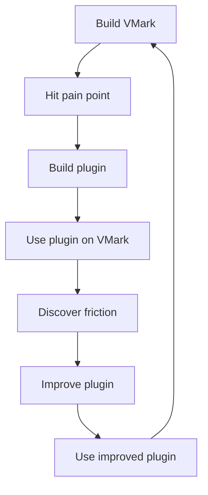

每个插件都诞生于 VMark 的构建过程：

- **cc-suite** 存在是因为一个 AI 审查自己的工作是不够的
- **tdd-guardian** 存在是因为覆盖率在会话之间不断下滑
- **docs-guardian** 存在是因为文档总是与代码产生偏差
- **loc-guardian** 存在是因为文件总是增长到难以维护的大小
- **echo-sleuth** 存在是因为会话是短暂的但决策不是
- **grill** 存在是因为架构问题需要对抗性评审
- **nlpm** 存在是因为提示词和技能文件也是代码

每个插件都在 VMark 的构建过程中得到了改进：

- tdd-guardian 的阻塞钩子被发现过于激进——导致了一项可选启用强制执行的提案
- nlpm 的文件模式匹配被发现过于宽泛——在无关的 bug 修复中造成阻塞
- cc-suite 的命名在会话中发现幽灵引用后被修正
- docs-guardian 的准确性检查器通过发现其他任何工具都无法捕获的 `com.vmark.app` bug 证明了自己的价值

## 分层质量体系

七个插件共同构成了分层的质量保证体系：

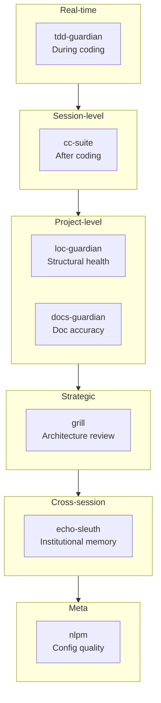

| 层级 | 插件 | 何时生效 | 捕获什么 |
|-------|--------|-------------|-----------------|
| 实时纪律 | tdd-guardian | 编码期间 | 跳过的测试、覆盖率回退 |
| 会话级评审 | cc-suite | 编码之后 | Bug、安全、无障碍 |
| 结构健康 | loc-guardian | 按需 | 文件膨胀、复杂度蔓延 |
| 文档同步 | docs-guardian | 按需 | 过时文档、缺失文档、错误文档 |
| 战略评估 | grill | 定期 | 架构缺陷、测试缺陷、质量债务 |
| 组织记忆 | echo-sleuth | 跨会话 | 丢失的决策、遗忘的上下文 |
| 配置质量 | nlpm | 编辑时 | 低质量提示词、薄弱技能、损坏的规则 |

这不是"可选的工具"。这是使递归 AI 开发值得信赖的治理层——AI 编写代码，AI 审计代码，AI 修复审计发现，AI 验证修复结果。

## 为什么不可或缺

"不可或缺"是一个很强的词。以下是检验标准：没有它们的 VMark 会是什么样子？

**没有 cc-suite**：292 个问题规模的 bug、安全漏洞和无障碍缺陷会不断累积。24 小时内捕获新引入问题的自动化管道将不存在。开发者将依赖手动的定期评审——而 1 月的会话表明，这种评审充其量也只是偶尔进行。

**没有 tdd-guardian**：26 阶段覆盖率攻坚计划可能不会发生。递增阈值的纪律——覆盖率只能上升，永远不能下降——来自 tdd-guardian 灌输的思维方式。99.96% 的覆盖率不是偶然发生的。

**没有 docs-guardian**：用户至今仍在一个不存在的目录中寻找他们的精灵。17 个功能将依然无法被发现。文档准确性将是一种希望，而非一种度量。

**没有 loc-guardian**：文件会逐渐膨胀到 500、800、1000 行。让代码库保持可导航的"300 行规则"将是一个建议，而非一个强制约束。

**没有 echo-sleuth**：每次会话都将从零开始。"我们之前关于菜单快捷键冲突做了什么决定？"需要手动搜索对话日志。

**没有 grill**：Rust 测试缺口（27%）、WCAG 无障碍缺陷、104 个超大文件——这些战略性的质量投入是由 grill 的对抗性分析驱动的，不是由 bug 报告驱动的。

这些插件不可或缺，不是因为它们巧妙。而是因为它们编码了人类（和 AI）在会话之间会遗忘的纪律。覆盖率只能上升。文档必须匹配代码。文件保持小巧。每次发布前都进行审计。这些不是愿望——它们由每天运行的工具强制执行。

## 规则与技能：被编纂的知识

插件只是故事的一半。另一半是随之积累的知识基础设施。

### 13 条规则（1,950 行组织知识）

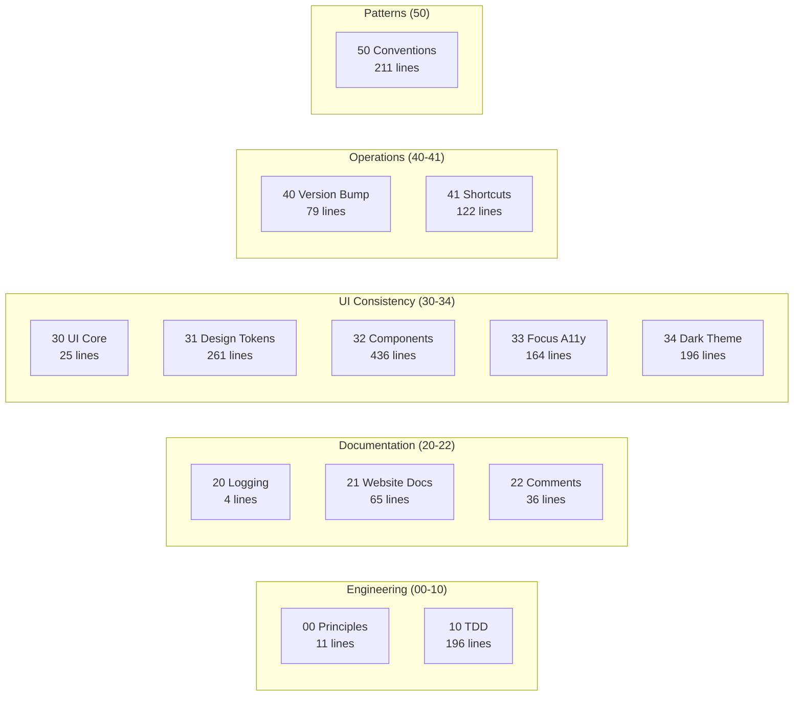

VMark 的 `.claude/rules/` 目录包含 13 个规则文件——不是模糊的指导方针，而是具体的、可执行的规范：

| 规则文件 | 行数 | 编纂内容 |
|-----------|-------|----------------|
| `00-engineering-principles.md` | 11 | 核心规范（禁止 Zustand 解构、300 行限制） |
| `10-tdd.md` | 196 | 5 个测试模式模板、反模式目录、覆盖率门控 |
| `20-logging-and-docs.md` | 4 | 每个主题单一信息源 |
| `21-website-docs.md` | 65 | 代码到文档的映射表（哪些代码变更需要更新哪些文档） |
| `22-comment-maintenance.md` | 36 | 何时更新/不更新注释、防止注释腐化 |
| `30-ui-consistency.md` | 25 | 核心 UI 原则、子规则交叉引用 |
| `31-design-tokens.md` | 261 | 完整的 CSS Token 参考——每种颜色、间距、圆角、阴影 |
| `32-component-patterns.md` | 436 | 弹出框、工具栏、上下文菜单、表格、滚动条模式及代码 |
| `33-focus-indicators.md` | 164 | 按组件类型分类的 6 种焦点模式（WCAG 合规） |
| `34-dark-theme.md` | 196 | 主题检测、覆盖模式、迁移清单 |
| `40-version-bump.md` | 79 | 5 文件版本同步流程及验证脚本 |
| `41-keyboard-shortcuts.md` | 122 | 3 文件同步（Rust/前端/文档）、冲突检查、规范 |
| `50-codebase-conventions.md` | 211 | 开发过程中发现的 10 个未文档化模式 |

这些规则在每次会话开始时被 Claude Code 读取。正因如此，第 2,180 次提交与第 100 次遵循的是同样的规范。

规则 `50-codebase-conventions.md` 尤为值得注意——它记录的是*没有人设计过*的模式。它们在开发过程中自然涌现，然后被编纂：Store 命名规范、Hook 清理模式、插件结构、MCP 桥接处理器签名、CSS 组织方式、错误处理惯用法。

### 19 个项目技能（领域专业知识）

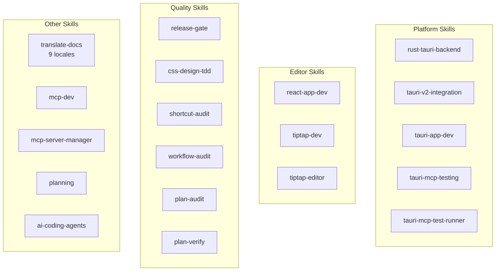

| 分类 | 技能 | 用途 |
|----------|--------|-----------------|
| **Tauri/Rust** | `rust-tauri-backend`、`tauri-v2-integration`、`tauri-app-dev`、`tauri-mcp-testing`、`tauri-mcp-test-runner` | 遵循 Tauri v2 规范的平台特定 Rust 开发 |
| **React/编辑器** | `react-app-dev`、`tiptap-dev`、`tiptap-editor` | Tiptap/ProseMirror 编辑器模式、Zustand 选择器规则 |
| **质量** | `release-gate`、`css-design-tdd`、`shortcut-audit`、`workflow-audit`、`plan-audit`、`plan-verify` | 各层级的自动化质量验证 |
| **文档** | `translate-docs` | 子代理驱动审计的 9 语言翻译 |
| **MCP** | `mcp-dev`、`mcp-server-manager` | MCP 服务器开发与配置 |
| **规划** | `planning` | 带决策记录的实施计划生成 |
| **AI 工具** | `ai-coding-agents` | 多代理编排（Codex CLI、Claude Code、Gemini CLI） |

### 7 个斜杠命令（工作流自动化）

| 命令 | 功能 |
|---------|-------------|
| `/bump` | 跨 5 个文件的版本号递增、提交、打标签、推送 |
| `/fix-issue` | 端到端 GitHub issue 解决器——获取、分类、修复、审计、提 PR |
| `/merge-prs` | 按顺序审查和合并打开的 PR，处理 rebase |
| `/fix` | 正确修复问题——不打补丁、不走捷径、不引入回退 |
| `/repo-clean-up` | 删除失败的 CI 运行和过期的远程分支 |
| `/feature-workflow` | 门控的、代理驱动的端到端功能开发 |
| `/test-guide` | 生成手动测试指南 |

### 复合效应

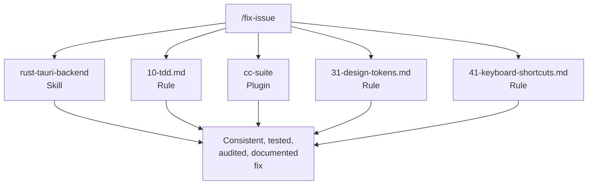

规则 + 技能 + 插件 + 命令构成了复合系统。当你运行 `/fix-issue` 时，它使用 `rust-tauri-backend` 技能处理 Rust 变更，遵循 `10-tdd.md` 规则满足测试要求，调用 `cc-suite` 进行审计，检查 `31-design-tokens.md` 确保 CSS 合规，并根据 `41-keyboard-shortcuts.md` 验证快捷键同步。

没有单独哪一部分是革命性的。复合效应——13 条规则 x 19 个技能 x 7 个插件 x 7 个命令，全部相互强化——才是系统运转的原因。每一部分都是在发现缺口时添加的，在真实开发中测试，并通过使用来完善。

## 给插件构建者的建议

如果你正在考虑构建 Claude Code 插件，以下是 VMark 教给我们的：

1. **先为自己构建。** 最好的插件解决的是你的实际问题，而非假设的问题。

2. **不断自食其果。** 在你的真实项目中使用你的插件。你发现的摩擦就是你的用户将会发现的摩擦。

3. **钩子需要逃生通道。** 无法被覆盖的阻塞钩子最终会被完全禁用。让强制执行成为可选的或上下文感知的。

4. **跨模型验证有效。** 让不同的 AI 审查你主力 AI 的工作能捕获真实 bug。这不是冗余——这是正交的。

5. **编纂纪律，而非规则。** 最好的插件改变习惯。tdd-guardian 的阻塞钩子被移除了，但它们激发的覆盖率攻坚计划是项目中最具影响力的质量投入。

6. **组合，不要大一统。** 七个专注的插件胜过一个巨型插件。每个做好一件事，然后组合成大于各部分之和的工作流。

7. **信任是逐次调用赢得的。** 开发者信任 cc-suite 到可以不审查发现就说"全部修复"的程度。这种信任是经过 27 次会话和 292 个已解决问题建立起来的。

---

*VMark 在 [github.com/xiaolai/vmark](https://github.com/xiaolai/vmark) 开源。全部七个插件可在 `xiaolai` Claude Code 市场获取。*
