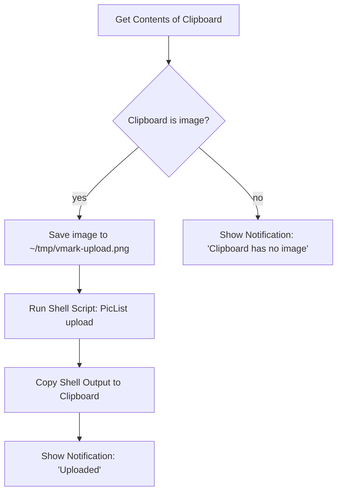

# 雲端託管圖片

VMark 是一款 local-first 的寫作工具,本身不內建剪貼簿圖片上傳功能,也不會保存任何雲端憑證。如果你的 Markdown 需要寫入公開的 CDN 網址(例如部落格發布、跨裝置同步、CMS 投稿),建議在 VMark 之外另外設定一套作業系統層級的自動化流程,再把結果送回 VMark。

這份文件會說明 VMark 為何採用這種設計、哪些情境不必額外設定就能直接使用,以及如何在大約十分鐘內把 Shortcuts.app 的流程串接起來。

[[toc]]

## VMark 已經支援的部分

VMark 處理 Markdown 內的圖片參照時,會區分以下兩種方向:

| 方向 | 狀態 | 觸發方式 | Markdown 內的結果 |
|------|------|----------|-------------------|
| 插入已存在的遠端網址 | 支援 | 貼上或輸入 `https://…` 網址 | 原樣保留網址 |
| Markdown 原始檔含遠端網址 | 支援 | 文中寫下 `` | 直接渲染 |
| 插入本機圖片 | 支援 | 貼上、拖放或插入二進位資料 | 複製到 `.assets/`,寫入相對路徑 |
| 插入本機圖片**但儲存到遠端** | **無內建** | (請參考下方的流程配方) | — |

簡單來說:圖片若已經有網址,直接貼上即可。VMark 會把它視為 Markdown 圖片參照插入,Webview 會去抓取內容。整個讀取路徑天生就對雲端友善。

## 為何 VMark 不內建雲端上傳

要實作這項功能,VMark 必須在貼上時偵測本機圖片、上傳到遠端儲存,再把回傳的網址寫進 Markdown 取代 `./.assets/…` 路徑。聽起來不複雜,但實際上會在三個關鍵面向擴張 VMark 的職責:

1. **長期憑證管理**。原生的 S3-compatible 上傳必須保存使用者的 access key 與 secret access key。VMark 目前不持有任何長期祕鑰——沒有 encryption-at-rest 的設計、沒有 OS keychain 整合、沒有金鑰輪替的操作流程,也沒有「金鑰意外寫進 Markdown」這類失敗情境的防範。一旦加入上傳功能,就等於跨過這條界線。

2. **多家供應商支援的零碎開銷**。S3、Cloudflare R2、Backblaze B2、MinIO、DigitalOcean Spaces 都號稱 S3-compatible,但各自都有獨特的行為差異(path-style 與 virtual-hosted 的定址方式、ACL 語義、區域端點、CORS 規則)。要單一維護者長期扛起這片支援面,對一款寫作工具而言是不小的長期成本。

3. **整合既有工具,而非自行打造**。[PicList](https://github.com/Kuingsmile/PicList) 與 [PicGo](https://github.com/Molunerfinn/PicGo) 這類工具早已把這個問題處理得相當完整,涵蓋各家供應商的設定與憑證儲存。macOS Shortcuts.app 與 Keyboard Maestro 又能把這類工具串接到系統上的任何文字輸入欄位——不限於 VMark。把雲端上傳功能塞進 VMark,只是重複造輪子,而且只有 VMark 內能用。

因此結論很明確:**VMark 專注於寫作工具的本分;圖片上傳交給使用者自己的作業系統自動化工具去處理**。下方的配方會把這條作業系統層級的路徑具體建構出來。

## 配方:Shortcuts.app + PicList(macOS,免費)

Shortcuts.app 從 macOS Monterey(12)起便內建於系統中。PicList 則是免費的開源圖片上傳工具。兩者搭配後,你會得到一組快速鍵:將剪貼簿中的圖片透過 PicList 上傳(PicList 本身已能對接 R2、S3、Imgur 等十多種後端),再把回傳的網址放回剪貼簿。之後在 VMark 裡按 `Cmd + V` 即可貼上網址——VMark 內建的遠端網址偵測機制會接手處理後續。

### 前置條件

1. **PicList 已安裝並完成設定。**請至 [PicList releases 頁面](https://github.com/Kuingsmile/PicList/releases)下載,開啟一次後,在 PicList 的 *PicBed Settings* 內至少設定一個圖床(R2、S3、Imgur、smms 等)。串接 Shortcut 之前,先在 PicList 內手動確認上傳可正常運作——這樣才能把「PicList 本身是否正常」與「Shortcut 是否串對」這兩個問題分開判斷。

2. **PicList CLI 可使用。**PicList 透過 app bundle 提供 `upload` 子指令。在 macOS 上,執行檔位於 `/Applications/PicList.app/Contents/MacOS/PicList`。可用下列指令驗證:

   ```sh
   /Applications/PicList.app/Contents/MacOS/PicList upload --help
   ```

   正常應該會印出 CLI 的說明。若無,請確認 PicList 安裝在 `/Applications`(而非 `~/Applications`——若是後者,請將路徑改成對應位置)。

### 建立 Shortcut

開啟 `Shortcuts.app`,新增一個 shortcut,並依序加入以下動作:



在 Shortcuts 編輯器中的具體步驟如下:

1. **動作:Get Contents of Clipboard。**從側邊欄的動作清單拖入即可,不需額外設定。

2. **動作:If。**設定條件為 *Clipboard is Media › Image*。(若下拉選單中沒有 *Media* 選項,可改用 *Contents › has any value* 作為較寬鬆的判斷。)

3. **If 分支內——動作:Save File。**設定:
   - Service:*Files*
   - Destination:`~/tmp/`(若資料夾不存在,先用 Finder 建立一次)。
   - File name:`vmark-upload.png`(固定檔名可讓下一步的路徑具備可預期性)。
   - 關閉 *Ask Where To Save*,讓 shortcut 能夠無須人工介入即可執行。

4. **動作:Run Shell Script。**設定:
   - Shell:`/bin/zsh`(macOS 預設)。
   - Input:選擇 `as arguments` 即可。(*Pass Input as `stdin`* 也行;下方的指令會忽略 stdin,直接使用寫死的路徑。)
   - Script body:

     ```sh
     /Applications/PicList.app/Contents/MacOS/PicList upload "$HOME/tmp/vmark-upload.png" 2>/dev/null | tail -n 1
     ```

   加上 `tail -n 1` 是為了保險:PicList 可能會在網址前先輸出一些資訊性日誌。請依你手上的 PicList 版本確認實際輸出格式;若 PicList 只回傳網址,`tail` 也不會有副作用。

5. **動作:Copy to Clipboard。**將其輸入設為 *Shell Script Result*。

6. **動作:Show Notification。**Title:`Uploaded`。Body:*Shell Script Result*。這會確認網址已放入剪貼簿,並顯示剛剛上傳的內容。

7. **(選用)Else 分支——動作:Show Notification。**Title:`No image on clipboard`。當快速鍵被按下、剪貼簿卻沒有圖片時,可協助排查。

### 綁定全域快速鍵

在 Shortcuts 編輯器中點選 shortcut 的 *(i)* info 按鈕,然後選 *Add Keyboard Shortcut*。挑一個不會與 VMark 既有快速鍵衝突的組合——`Control + Option + Command + U` 是常見選擇(macOS 上不會衝突,且 U 代表 Upload,容易記憶)。

### 使用方式

1. 用 `Cmd + Shift + Ctrl + 4` 截圖(存到剪貼簿,而非檔案)——或從其他應用程式複製任何圖片。
2. 按下你設定的上傳快速鍵(`Ctrl + Opt + Cmd + U`)。
3. 等待約 1–3 秒後,看到通知出現。
4. 在 VMark 中貼上(`Cmd + V`),Markdown 會得到 ``。

### 可能會卡關的地方

| 現象 | 可能原因 | 解法 |
|------|----------|------|
| Shortcut 有觸發,但 PicList 沒啟動 | PicList 執行檔的路徑不正確 | 確認 `/Applications/PicList.app/Contents/MacOS/PicList` 存在;若安裝於其他位置,請對應修改路徑 |
| 通知有跳出,但剪貼簿仍是原本那張圖片 | shell script 回傳空字串 | 用一個已知可用的檔案路徑手動執行 shell script,看 PicList 實際輸出為何 |
| 網址不正確或結尾多了空白字元 | `tail -n 1` 撈到的是日誌行,而非網址 | 檢視 PicList 的輸出,調整剖析方式(`grep -oE 'https://[^[:space:]]+' \| tail -n 1` 是更嚴謹的替代寫法) |
| 在 VMark 按 `Cmd + V` 貼出來是純文字,而非圖片 | 網址結尾缺少 PicList 認得的圖片副檔名 | 確認上傳過程有保留檔案副檔名(R2/S3 通常會保留;請檢查你 bucket key 的命名樣板) |

## 替代方案:Keyboard Maestro

[Keyboard Maestro](https://www.keyboardmaestro.com/) 是付費的 macOS 自動化工具,功能上限比 Shortcuts.app 更高。在這個流程裡,它真正的優勢是:當剪貼簿內容為圖片時,KM 可以直接攔截 `Cmd + V`,讓你一次按鍵就完成「上傳並貼上」,不必先按上傳快速鍵、再按 `Cmd + V`。

整體架構與 Shortcuts.app 版本相同——取得剪貼簿圖片、存檔、執行 PicList CLI、覆寫剪貼簿,可選擇性再模擬一次貼上。KM 的 *Trigger* 巨集編輯器更具彈性(可用剪貼簿內容當觸發、可限定特定應用程式範圍),但上傳那一步的內容是一樣的。

如果你還不是 Keyboard Maestro 使用者,Shortcuts.app 是更划算的選擇。

## 替代方案:發布前的處理腳本

如果你有自架部落格或靜態網站的發布流程,最乾淨的做法通常是:讓 VMark 維持預設行為(`.assets/` 相對路徑),並在 build 階段執行一支腳本,掃過 Markdown、上傳每張不重複的圖片,再改寫路徑。如此一來,「每張圖逐次上傳的等待」就換成「發布時一次批次上傳」,編輯器本身也能保持乾淨。

最精簡的雛形(Node.js,虛擬碼):

```js
// scan-and-upload.js
const fs = require("fs");
const { execSync } = require("child_process");

const md = fs.readFileSync(process.argv[2], "utf8");
const rewritten = md.replace(/!\[(.*?)\]\((\.\/\.assets\/[^)]+)\)/g, (_, alt, path) => {
  const url = execSync(
    `/Applications/PicList.app/Contents/MacOS/PicList upload "${path}"`,
  ).toString().trim();
  return ``;
});
fs.writeFileSync(process.argv[2].replace(/\.md$/, ".published.md"), rewritten);
```

部分靜態網站產生器(Hugo 搭配 [Page Bundles](https://gohugo.io/content-management/page-bundles/)、Jekyll、Astro、Eleventy)在 build 階段原生就能處理相對的 `.assets/` 路徑——若你採用這類方式發布,連腳本都不必另外寫。

## 已經有網址的圖片

最後補充一個常見情境:若圖片已經位於公開網址上,直接把網址貼進 VMark 就完成了。剪貼簿的圖片路徑偵測器會將其歸類為 `type: "url"`,並直接寫入網址。不必上傳、不必複製到 `.assets/`,也不必調整任何設定。這是 VMark 支援的最簡便的雲端圖片流程,完全不需要其他工具。

## 延伸閱讀

- [Files & Images 設定](./settings.md)——自動縮放、複製到 assets、孤兒檔清理
- [隱私權](./privacy.md)——VMark 在本機保存哪些資料、哪些資料會離開你的機器
