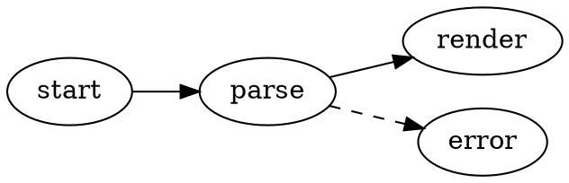
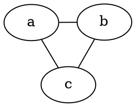

# Graphviz 圖表

VMark 可直接在你的 Markdown 文件中渲染 [Graphviz](https://graphviz.org/) DOT 圖。圖表透過 Graphviz 的 WASM 建置版本（[@viz-js/viz](https://github.com/mdaines/viz-js)）在本機渲染——不需要網路連線，也不依賴外部執行檔。

[[toc]]

## 插入圖表

從選單列使用 **插入 → Graphviz 圖表**（或工具列的插入群組）插入範本圖表——此功能預設未指定快捷鍵，可在設定中自訂。或輸入帶有 `dot` 或 `graphviz` 語言識別符的圍欄程式碼區塊：

````markdown

````

兩種圍欄語言的行為完全相同：

| 圍欄 | 渲染為 |
|-------|------------|
| ` ```dot ` | Graphviz 圖表 |
| ` ```graphviz ` | Graphviz 圖表 |

## 編輯模式

- **所見即所得模式**——程式碼區塊會渲染為圖表。雙擊即可編輯 DOT 原始碼，輸入時會即時預覽（防抖更新）；可從編輯標題列儲存或取消。
- **原始碼模式**——將游標置於 ` ```dot ` 圍欄內即可顯示浮動圖表預覽（拖曳、調整大小、縮放），與 Mermaid 相同。

## 平移、縮放與匯出

渲染後的圖表支援與 Mermaid 圖表相同的控制方式：

- **Cmd/Ctrl + 滾動** 縮放，拖曳可平移，重置按鈕可重新置中
- 透過匯出按鈕 **匯出為 PNG**（明亮或深色背景）

## 引擎與佈局

圖表預設使用 `dot` 引擎（階層式/分層佈局）進行佈局。若要使用其他引擎，請在圖中設定標準的 Graphviz `layout` 屬性——這項設定會保留在文件裡，在其他任何 Graphviz 工具中也同樣適用：

````markdown

````

| 引擎 | 佈局風格 |
|--------|--------------|
| `dot` | 階層式/分層（預設） |
| `neato` | 彈簧模型（力導向） |
| `fdp` | 力導向，適合較大的圖 |
| `sfdp` | 多尺度力導向，適合非常大的圖 |
| `circo` | 環狀 |
| `twopi` | 放射狀 |
| `osage` | 叢集式 |
| `patchwork` | 矩形樹狀圖（squarified） |

未知的 `layout` 值會顯示渲染錯誤狀態，處理方式與其他 DOT 錯誤相同。

Graphviz 支援的所有標準 DOT 功能均可使用：子圖與叢集、rank、節點形狀、邊線樣式、HTML 式標籤，以及明確指定的顏色。

## 主題整合

- 圖表背景為透明，因此會跟隨編輯器主題。
- 預設的節點、邊線與文字顏色衍生自目前主題的設計 token，因此圖表在每個主題（White、Paper、Mint、Sepia、Night、Solarized）中都能自然融入，切換主題時也會自動更新。
- 你在 DOT 原始碼中明確指定的顏色永遠優先於主題預設值——若圖形自行設定了 `bgcolor`、`color` 或 `fontcolor`，就會完全按照原始碼渲染。

## 錯誤處理

若 DOT 原始碼有語法錯誤，區塊會顯示渲染錯誤狀態而非圖表。修正原始碼後，預覽會自動重新渲染。

## HTML 與 PDF 匯出

匯出的 HTML 與 PDF 文件會嵌入渲染後的 SVG，因此圖表在 VMark 之外的顯示效果完全相同。
