# 使用者即開發者

七個 Claude Code 外掛是如何在 VMark 的開發烈火中鍛造成不可或缺之物的。

## 背景

VMark 是一款基於 Tauri、React 和 Rust 打造的 AI 友善 Markdown 編輯器。經過 10 週的開發：

| 指標 | 數值 |
|--------|-------|
| 提交數 | 2,180+ |
| 程式碼規模 | 305,391 行程式碼 |
| 測試覆蓋率 | 99.96% 行覆蓋 |
| 測試與正式碼比 | 1.97:1 |
| 建立並解決的稽核問題 | 292 |
| 自動合併的 PR | 84 |
| 文件語言數 | 10 |
| MCP 伺服器工具 | 12 |

一位開發者使用 Claude Code 打造了它。在此過程中，這位開發者為 Claude Code 市集建立了七個外掛——不是副業專案，而是生存工具。每個外掛的存在都是因為某個特定痛點需要一個尚不存在的解決方案。

## 外掛一覽

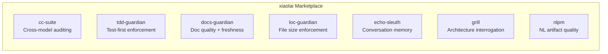

| 外掛 | 功能 | 誕生緣由 |
|--------|-------------|-----------|
| [cc-suite](https://github.com/xiaolai/cc-suite) | 透過 OpenAI Codex 進行跨模型程式碼稽核 | 「我需要一雙不是 Claude 的第二雙眼睛」 |
| [tdd-guardian](https://github.com/xiaolai/tdd-guardian-for-claude) | 測試優先工作流程強制執行 | 「忘了寫測試，覆蓋率又降了」 |
| [docs-guardian](https://github.com/xiaolai/docs-guardian-for-claude) | 文件品質與時效稽核 | 「文件寫的是 `com.vmark.app`，但實際識別碼是 `app.vmark`」 |
| [loc-guardian](https://github.com/xiaolai/loc-guardian-for-claude) | 單檔行數限制強制執行 | 「這個檔案 800 行了，居然沒人注意到」 |
| [echo-sleuth](https://github.com/xiaolai/echo-sleuth-for-claude) | 對話歷史探勘與記憶 | 「三週前我們關於那個問題做了什麼決定？」 |
| [grill](https://github.com/xiaolai/grill-for-claude) | 深度多角度程式碼審查 | 「我需要的是架構評審，不只是 lint 檢查」 |
| [nlpm](https://github.com/xiaolai/nlpm-for-claude) | 自然語言程式設計產物品質檢查 | 「我的提示詞和技能檔寫得到底好不好？」 |

## 前後對比

轉變在三個月內完成。

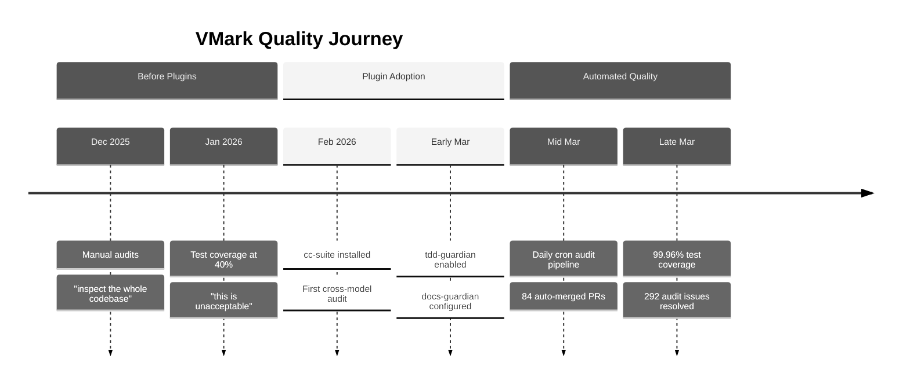

**外掛之前**（2025 年 12 月至 2026 年 2 月）：手動程式碼稽核。開發者會說「檢查整個程式碼庫，找出可能的 bug 和缺陷。」測試覆蓋率徘徊在 40% 左右——被描述為「不可接受」。文件寫完就被遺忘了。

**外掛之後**（2026 年 3 月）：每次開發工作階段自動載入 3-4 個外掛。自動化稽核管線每日執行，無需人工介入即可建立和解決問題。透過 26 個階段的系統性遞增計畫，測試覆蓋率達到了 99.96%。文件準確性以機械般的精度與程式碼進行比對驗證。

Git 歷史記錄講述了這個故事：

| 分類 | 提交數 |
|----------|---------|
| 總提交數 | 2,180+ |
| Codex 稽核回應 | 47 |
| 測試/覆蓋率 | 52 |
| 安全強化 | 40 |
| 文件 | 128 |
| 覆蓋率計畫階段 | 26 |

## cc-suite：第二意見

**使用頻率**：28 次外掛工作階段中使用了 27 次。所有工作階段累計 200+ 次 Codex 呼叫。

cc-suite 最重要的一點是——它*不是 Claude 稽核 Claude 自己的成果*。它將程式碼傳送給 OpenAI 的 Codex 模型進行獨立評審。當你與一個 AI 深入開發某個功能時，讓一個完全不同的模型來審視結果，能捕獲你和你的主力 AI 都遺漏的問題。

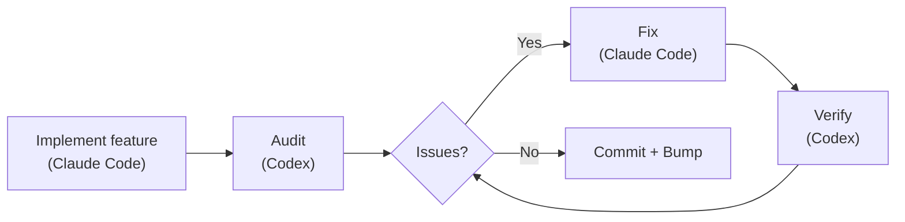

### 實際發現

292 個稽核問題。全部 292 個已解決。零遺留。

來自 Git 歷史的真實案例：

- **安全**：安全儲存遷移的單次稽核中發現 9 個問題（[`d1a880a6`](https://github.com/xiaolai/vmark/commit/d1a880a6)）。資源解析器中的符號連結遍歷漏洞（[`7dfa872d`](https://github.com/xiaolai/vmark/commit/7dfa872d)）。path-to-regexp 高嚴重性漏洞（[`8c554cdc`](https://github.com/xiaolai/vmark/commit/8c554cdc)）。

- **無障礙**：每個彈出按鈕都缺少 `aria-label`。FindBar、Sidebar、Terminal 和 StatusBar 中的純圖示按鈕沒有螢幕閱讀器文字（[`7acc0bf0`](https://github.com/xiaolai/vmark/commit/7acc0bf0)）。Lint 徽章缺少焦點指示器（[`c4db90d4`](https://github.com/xiaolai/vmark/commit/c4db90d4)）。

- **隱性邏輯 bug**：當多游標範圍合併時，主游標索引會靜默回退到 0。使用者在位置 50 編輯，範圍合併後游標突然跳到文件開頭。這是稽核發現的，不是測試發現的。

- **i18n 規格評審**：Codex 評審了國際化設計規格，發現「macOS 選單 ID 遷移按照規格中的描述是無法實現的」（[`1208c98d`](https://github.com/xiaolai/vmark/commit/1208c98d)）。在多語系檔案中發現了 4 個翻譯品質問題（[`af98b5cd`](https://github.com/xiaolai/vmark/commit/af98b5cd)）。

- **多輪稽核**：Lint 外掛經歷了三輪稽核——第一輪 8 個問題（[`7482c347`](https://github.com/xiaolai/vmark/commit/7482c347)），第二輪 6 個（[`8bfead81`](https://github.com/xiaolai/vmark/commit/8bfead81)），最後一輪 7 個（[`84cf67f7`](https://github.com/xiaolai/vmark/commit/84cf67f7)）。每一輪，Codex 都發現了修復引入的新問題。

### 自動化管線

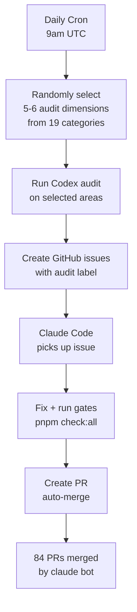

最終型態：每日排程稽核，UTC 時間早上 9 點自動執行。它從 19 個稽核類別中隨機選取 5-6 個維度，檢查程式碼庫的不同部分，建立帶標籤的 GitHub issue，並調度 Claude Code 進行修復。84 個 PR 由 `claude[bot]` 自動建立、自動修復、自動合併——其中許多在開發者醒來之前就已完成。

### 信任訊號

當開發者執行稽核並得到發現時，他的反應從來不是「讓我先看看這些發現」，而是：

> 「全部修復。」

這就是一個工具經過數百次驗證後所獲得的信任水準。

## tdd-guardian：爭議之選

**使用頻率**：3 次顯式工作階段。42 次工作階段中有 5,500+ 次後台參照。

tdd-guardian 的故事最有趣，因為它包含了失敗。

### 阻塞鉤子問題

tdd-guardian 附帶了一個 PreToolUse 鉤子，如果測試覆蓋率未達到閾值，就會阻止提交。理論上這能強制執行測試優先的紀律。實際上：

> 「tdd-guardian 那個阻塞鉤子，是不是應該去掉，讓 tdd guardian 改成手動命令執行？」

問題是真實存在的：狀態檔案中過期的 SHA 會阻塞無關的提交。開發者不得不手動修補 `state.json` 來解除阻塞。阻塞鉤子與已在每個 PR 上執行 `pnpm check:all` 的 CI 門控是重複的。

鉤子被停用了（[`f2fda819`](https://github.com/xiaolai/vmark/commit/f2fda819)）。但*理念*存活了下來。

### 26 階段覆蓋率攻堅

tdd-guardian 所播下的種子，是驅動了一場非凡的覆蓋率攻堅計畫的紀律：

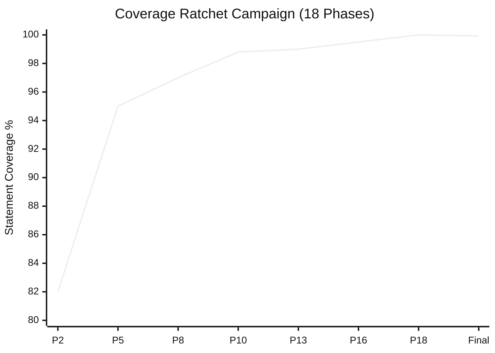

| 階段 | 提交 | 閾值 |
|-------|--------|-----------|
| 階段 2 | [`1e5cf94a`](https://github.com/xiaolai/vmark/commit/1e5cf94a) | 82/74/86/83 |
| 階段 5 | [`4658d75f`](https://github.com/xiaolai/vmark/commit/4658d75f) | 95/87/95/96 |
| 階段 8 | [`3d7239c3`](https://github.com/xiaolai/vmark/commit/3d7239c3) | 深入 tabEscape、codePreview、formatToolbar |
| 階段 13 | [`9bec6612`](https://github.com/xiaolai/vmark/commit/9bec6612) | 深入 multiCursor、mermaidPreview、listEscape |
| 階段 16 | [`730ff139`](https://github.com/xiaolai/vmark/commit/730ff139) | 145 個檔案的 v8 註解，99.5/99/99/99.6 |
| 階段 18 | [`1d996778`](https://github.com/xiaolai/vmark/commit/1d996778) | 遞增至 100/99.87/100/100 |
| 最終 | [`fcf5e00d`](https://github.com/xiaolai/vmark/commit/fcf5e00d) | 99.93% 陳述式 / 99.96% 行 |

從約 40%（「不可接受」）到 99.96% 行覆蓋率，歷經 18 個階段，每個階段都將閾值遞增得更高，使覆蓋率永遠不可能回退。測試與正式碼比達到了 1.97:1——測試程式碼幾乎是應用程式碼的兩倍。

### 教訓

最好的強制執行機制是那些改變你的習慣、然後退居幕後的機制。tdd-guardian 的阻塞鉤子過於激進，但停用了它們的開發者，後來撰寫的測試比任何啟用阻塞鉤子的人都多。

## docs-guardian：尷尬偵測器

**使用頻率**：3 次工作階段。首次稽核即發現 2 個嚴重問題。

### `com.vmark.app` 事件

docs-guardian 的準確性檢查器同時讀取程式碼和文件，然後進行比對。在對 VMark 的首次全面稽核中，它發現 AI Genies 指南告訴使用者他們的精靈存放在：

```
~/Library/Application Support/com.vmark.app/genies/
```

但程式碼中實際的 Tauri 識別碼是 `app.vmark`。真正的路徑是：

```
~/Library/Application Support/app.vmark/genies/
```

這在所有三個平台上都是錯的，英文指南和所有 9 個翻譯版本都是錯的。沒有測試能捕獲這個問題。沒有 linter 能捕獲這個問題。docs-guardian 捕獲了它，因為這正是它的職責：機械地、逐對地比較程式碼和文件。

### 完整稽核影響

```mermaid
%%{init: {"theme": "neutral"}}%%
xychart-beta
    title "Documentation Health Before vs After"
    x-axis ["Accuracy", "Coverage", "Quality", "Overall"]
    y-axis "Score" 0 --> 100
    bar [78, 64, 83, 74]
    bar [95, 91, 88, 91]
```

| 維度 | 之前 | 之後 | 變化 |
|-----------|--------|-------|-------|
| 準確性 | 78/100 | 95/100 | +17 |
| 覆蓋率 | 64% | 91% | +27% |
| 品質 | 83/100 | 88/100 | +5 |
| **整體** | **74/100** | **91/100** | **+17** |

在一次工作階段中發現並記錄了 17 個未文件化的功能。Markdown Lint 引擎——包含 15 條規則、快捷鍵和狀態列徽章——沒有任何使用者文件。`vmark` 命令列工具完全沒有文件。唯讀模式、通用工具列、分頁拖曳分離——這些都是已發布但使用者無法發現的功能，因為沒人寫文件。

`config.json` 中的 19 個程式碼到文件的對映意味著，每當 `shortcutsStore.ts` 發生變化，docs-guardian 就知道 `website/guide/shortcuts.md` 需要更新。文件偏差變得可以機械地偵測。

## loc-guardian：300 行規則

**使用頻率**：4 次工作階段。標記 14 個檔案，其中 8 個為警告等級。

VMark 的 AGENTS.md 包含這樣一條規則：「保持程式碼檔案在約 300 行以內（主動拆分）。」

這條規則並非來自某個風格指南。它來自 loc-guardian 的掃描——不斷發現 500 行以上的檔案，這些檔案難以導覽、難以測試，也難以讓 AI 助手有效地處理。最嚴重的：`hot_exit/coordinator.rs` 達到了 756 行。

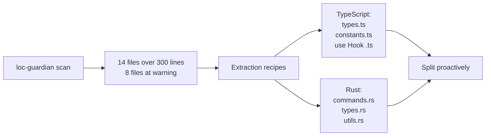

LOC 資料還被用於專案評估——當開發者想了解「這個專案代表了多少人力投入？」時，LOC 報告是起始輸入。答案：在 AI 輔助開發下相當於 40-60 萬美元的等價投資。

## echo-sleuth：組織記憶

**使用頻率**：6 次工作階段。為一切提供基礎建設。

echo-sleuth 是最安靜的外掛，但可以說是最基礎的。它的 JSONL 解析腳本是使對話歷史可搜尋的基礎建設。當任何其他外掛需要回憶過去工作階段中發生了什麼時，echo-sleuth 的工具負責實際工作。

這篇文章之所以存在，是因為 echo-sleuth 探勘了 35+ 個 VMark 工作階段，找到了每一次外掛呼叫、每一個使用者反應和每一個決策點。它提取了 292 個問題數、84 個 PR 數、覆蓋率攻堅時間線，以及「狠狠地審視自己」的工作階段。沒有它，「為什麼這些外掛不可或缺？」的證據將是軼事性的，而非考古學般的。

## grill：嚴厲的鏡子

**安裝於**：每個 VMark 工作階段。**被顯式呼叫進行自我評估。**

grill 最令人難忘的時刻是 3 月 21 日的工作階段。開發者問道：

> 「如果你能更嚴厲地審視自己，不用擔心時間和精力，你會做什麼不同的事？」

grill 產出了一份 14 點品質差距分析——一個包含 81 則訊息、863 次工具呼叫的工作階段，推動了多階段品質強化計畫（[`076dd96c`](https://github.com/xiaolai/vmark/commit/076dd96c)，[`5e47e522`](https://github.com/xiaolai/vmark/commit/5e47e522)）。發現包括：

- Rust 後端測試覆蓋率僅為 27%
- 模態對話方塊中的 WCAG 無障礙缺陷（[`85dc29fa`](https://github.com/xiaolai/vmark/commit/85dc29fa)）
- 104 個檔案超出 300 行規範
- 應該使用結構化日誌的 Console.error 呼叫（[`530b5bb7`](https://github.com/xiaolai/vmark/commit/530b5bb7)）

這不是 linter 發現的缺少分號。這是策略性的品質思考，推動了為期一週的投入計畫。

## nlpm：成長的陣痛

**呼叫次數**：顯式 0 次。**產生摩擦**：1 次工作階段。

nlpm 的 PostToolUse 鉤子連續三次阻斷了 VMark 的編輯工作階段：

> 「PostToolUse:Edit 鉤子阻止了繼續執行，為什麼？」
> 「又停了，為什麼？！」
> 「這是無害的……但太浪費時間了。」

該鉤子在檢查編輯的檔案是否符合自然語言產物模式。在修復結構性字元保護的 bug 時，這純粹是噪音。該外掛在那次工作階段中被停用。

這是誠實的回饋。不是每次外掛互動都是正面的。打造了 nlpm 的開發者透過 VMark 發現，檔案模式上的 PostToolUse 鉤子需要更好的篩選——bug 修復不應觸發自然語言產物的檢查。

## 五階段演進

外掛的採用並非一蹴而就。它遵循了一條清晰的軌跡：

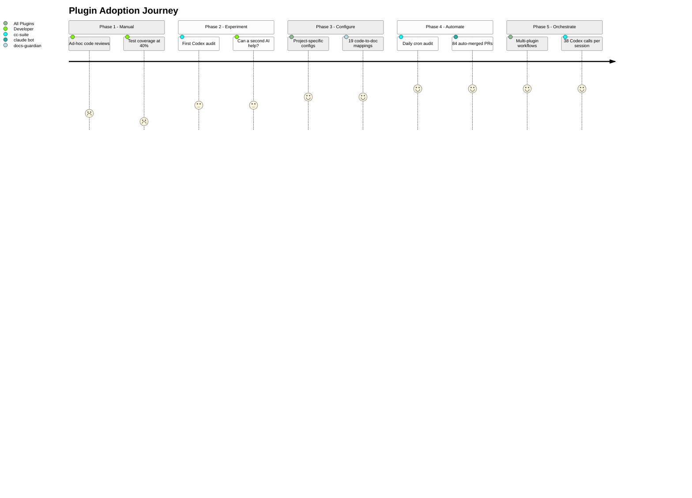

### 第一階段：手動稽核（2026 年 1 月）
> 「檢查整個程式碼庫，找出可能的 bug 和缺陷」

臨時性的評審。沒有工具。測試覆蓋率 40%。

### 第二階段：單外掛實驗（1 月底至 2 月初）
> 「讓 Codex 審查程式碼品質」

首次在 MCP 伺服器上使用 cc-suite。實驗階段。第二個 AI 能捕獲第一個遺漏的東西嗎？首次安裝：[`e6373c7a`](https://github.com/xiaolai/vmark/commit/e6373c7a)。

### 第三階段：配置化基礎建設（3 月初）
安裝外掛並配置專案特定的設定。tdd-guardian 以嚴格閾值啟用（[`f775f300`](https://github.com/xiaolai/vmark/commit/f775f300)）。docs-guardian 配置了 19 個程式碼到文件的對映。loc-guardian 設定了 300 行限制和提取規則。

### 第四階段：自動化管線（3 月中旬）
每日 UTC 早上 9 點排程稽核。問題自動建立、自動修復、自動提 PR、自動合併。84 個 PR 無需人工介入。

### 第五階段：多外掛編排（3 月下旬）
單次工作階段中組合 loc-guardian 掃描 -> 效能稽核 -> 子代理實作 -> cc-suite 稽核 -> cc-suite 驗證 -> 版本號遞增。一次工作階段 38 次 Codex 呼叫。外掛組合成工作流程。

## 回饋循環

最有趣的模式不是任何單個外掛，而是這個循環：

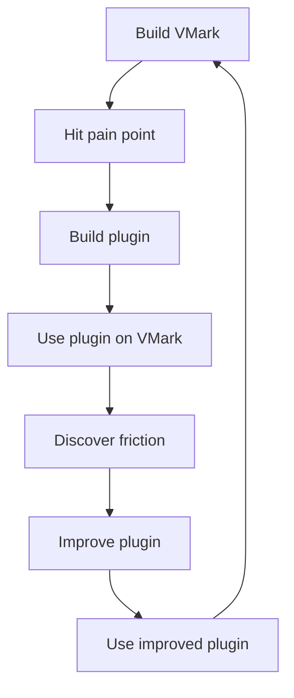

每個外掛都誕生於 VMark 的打造過程：

- **cc-suite** 存在是因為一個 AI 審查自己的成果是不夠的
- **tdd-guardian** 存在是因為覆蓋率在工作階段之間不斷下滑
- **docs-guardian** 存在是因為文件總是與程式碼產生偏差
- **loc-guardian** 存在是因為檔案總是增長到難以維護的大小
- **echo-sleuth** 存在是因為工作階段是短暫的但決策不是
- **grill** 存在是因為架構問題需要對抗性評審
- **nlpm** 存在是因為提示詞和技能檔也是程式碼

每個外掛都在 VMark 的打造過程中得到了改進：

- tdd-guardian 的阻塞鉤子被發現過於激進——導致了一項可選啟用強制執行的提案
- nlpm 的檔案模式比對被發現過於寬泛——在無關的 bug 修復中造成阻塞
- cc-suite 的命名在工作階段中發現幽靈參照後被修正
- docs-guardian 的準確性檢查器透過發現其他任何工具都無法捕獲的 `com.vmark.app` bug 證明了自己的價值

## 分層品質體系

七個外掛共同構成了分層的品質保證體系：

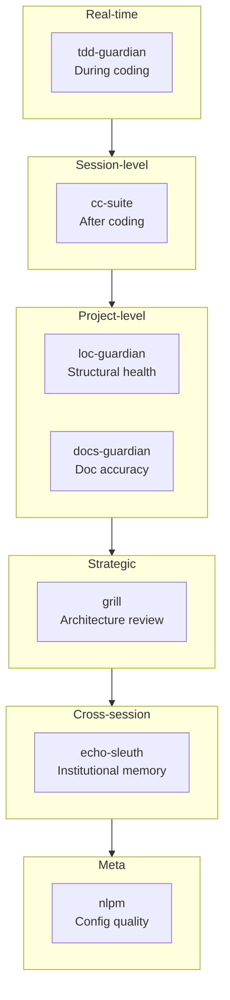

| 層級 | 外掛 | 何時生效 | 捕獲什麼 |
|-------|--------|-------------|-----------------|
| 即時紀律 | tdd-guardian | 編碼期間 | 跳過的測試、覆蓋率回退 |
| 工作階段級評審 | cc-suite | 編碼之後 | Bug、安全、無障礙 |
| 結構健康 | loc-guardian | 按需 | 檔案膨脹、複雜度蔓延 |
| 文件同步 | docs-guardian | 按需 | 過時文件、缺失文件、錯誤文件 |
| 策略評估 | grill | 定期 | 架構缺陷、測試缺陷、品質債務 |
| 組織記憶 | echo-sleuth | 跨工作階段 | 遺失的決策、遺忘的上下文 |
| 配置品質 | nlpm | 編輯時 | 低品質提示詞、薄弱技能、損壞的規則 |

這不是「可選的工具」。這是使遞迴 AI 開發值得信賴的治理層——AI 撰寫程式碼，AI 稽核程式碼，AI 修復稽核發現，AI 驗證修復結果。

## 為什麼不可或缺

「不可或缺」是一個很強的詞。以下是檢驗標準：沒有它們的 VMark 會是什麼樣子？

**沒有 cc-suite**：292 個問題規模的 bug、安全漏洞和無障礙缺陷會不斷累積。24 小時內捕獲新引入問題的自動化管線將不存在。開發者將依賴手動的定期評審——而 1 月的工作階段表明，這種評審充其量也只是偶爾進行。

**沒有 tdd-guardian**：26 階段覆蓋率攻堅計畫可能不會發生。遞增閾值的紀律——覆蓋率只能上升，永遠不能下降——來自 tdd-guardian 灌輸的思維方式。99.96% 的覆蓋率不是偶然發生的。

**沒有 docs-guardian**：使用者至今仍在一個不存在的目錄中尋找他們的精靈。17 個功能將依然無法被發現。文件準確性將是一種希望，而非一種度量。

**沒有 loc-guardian**：檔案會逐漸膨脹到 500、800、1000 行。讓程式碼庫保持可導覽的「300 行規則」將是一個建議，而非一個強制約束。

**沒有 echo-sleuth**：每次工作階段都將從零開始。「我們之前關於選單快捷鍵衝突做了什麼決定？」需要手動搜尋對話紀錄。

**沒有 grill**：Rust 測試缺口（27%）、WCAG 無障礙缺陷、104 個超大檔案——這些策略性的品質投入是由 grill 的對抗性分析驅動的，不是由 bug 報告驅動的。

這些外掛不可或缺，不是因為它們巧妙。而是因為它們編碼了人類（和 AI）在工作階段之間會遺忘的紀律。覆蓋率只能上升。文件必須與程式碼一致。檔案保持精簡。每次發布前都進行稽核。這些不是願望——它們由每天執行的工具強制執行。

## 規則與技能：被編纂的知識

外掛只是故事的一半。另一半是隨之累積的知識基礎建設。

### 13 條規則（1,950 行組織知識）

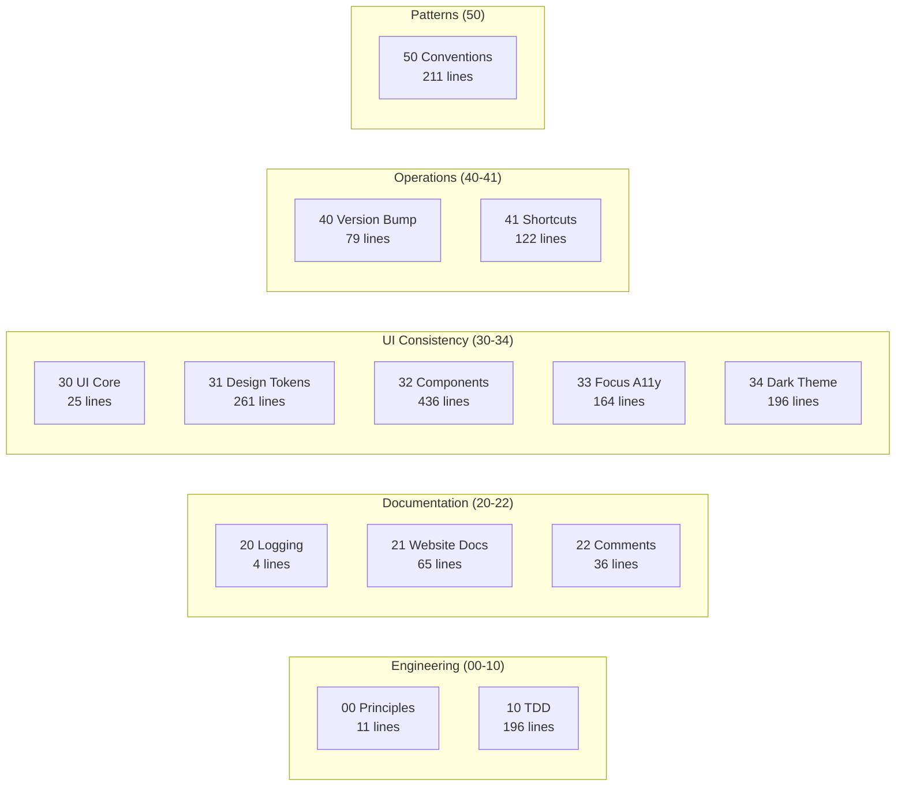

VMark 的 `.claude/rules/` 目錄包含 13 個規則檔案——不是模糊的指導方針，而是具體的、可執行的規範：

| 規則檔案 | 行數 | 編纂內容 |
|-----------|-------|----------------|
| `00-engineering-principles.md` | 11 | 核心規範（禁止 Zustand 解構、300 行限制） |
| `10-tdd.md` | 196 | 5 個測試模式範本、反模式目錄、覆蓋率門控 |
| `20-logging-and-docs.md` | 4 | 每個主題單一資訊來源 |
| `21-website-docs.md` | 65 | 程式碼到文件的對映表（哪些程式碼變更需要更新哪些文件） |
| `22-comment-maintenance.md` | 36 | 何時更新/不更新註解、防止註解腐化 |
| `30-ui-consistency.md` | 25 | 核心 UI 原則、子規則交叉參照 |
| `31-design-tokens.md` | 261 | 完整的 CSS Token 參考——每種色彩、間距、圓角、陰影 |
| `32-component-patterns.md` | 436 | 彈出框、工具列、右鍵選單、表格、捲軸模式及程式碼 |
| `33-focus-indicators.md` | 164 | 按元件類型分類的 6 種焦點模式（WCAG 合規） |
| `34-dark-theme.md` | 196 | 佈景主題偵測、覆蓋模式、遷移清單 |
| `40-version-bump.md` | 79 | 5 檔案版本同步流程及驗證腳本 |
| `41-keyboard-shortcuts.md` | 122 | 3 檔案同步（Rust/前端/文件）、衝突檢查、規範 |
| `50-codebase-conventions.md` | 211 | 開發過程中發現的 10 個未文件化模式 |

這些規則在每次工作階段開始時被 Claude Code 讀取。正因如此，第 2,180 次提交與第 100 次遵循的是同樣的規範。

規則 `50-codebase-conventions.md` 尤為值得注意——它記錄的是*沒有人設計過*的模式。它們在開發過程中自然湧現，然後被編纂：Store 命名規範、Hook 清理模式、外掛結構、MCP 橋接處理器簽章、CSS 組織方式、錯誤處理慣用法。

### 19 個專案技能（領域專業知識）

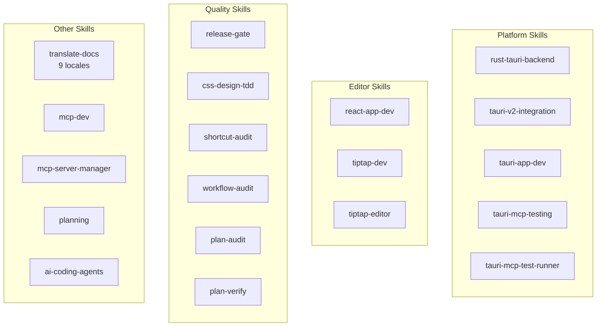

| 分類 | 技能 | 用途 |
|----------|--------|-----------------|
| **Tauri/Rust** | `rust-tauri-backend`、`tauri-v2-integration`、`tauri-app-dev`、`tauri-mcp-testing`、`tauri-mcp-test-runner` | 遵循 Tauri v2 規範的平台特定 Rust 開發 |
| **React/編輯器** | `react-app-dev`、`tiptap-dev`、`tiptap-editor` | Tiptap/ProseMirror 編輯器模式、Zustand 選擇器規則 |
| **品質** | `release-gate`、`css-design-tdd`、`shortcut-audit`、`workflow-audit`、`plan-audit`、`plan-verify` | 各層級的自動化品質驗證 |
| **文件** | `translate-docs` | 子代理驅動稽核的 9 語系翻譯 |
| **MCP** | `mcp-dev`、`mcp-server-manager` | MCP 伺服器開發與配置 |
| **規劃** | `planning` | 附帶決策記錄的實作計畫產生 |
| **AI 工具** | `ai-coding-agents` | 多代理編排（Codex CLI、Claude Code、Gemini CLI） |

### 7 個斜線命令（工作流程自動化）

| 命令 | 功能 |
|---------|-------------|
| `/bump` | 跨 5 個檔案的版本號遞增、提交、打標籤、推送 |
| `/fix-issue` | 端到端 GitHub issue 解決器——取得、分類、修復、稽核、提 PR |
| `/merge-prs` | 依序審查和合併開啟的 PR，處理 rebase |
| `/fix` | 正確修復問題——不打補丁、不走捷徑、不引入回退 |
| `/repo-clean-up` | 刪除失敗的 CI 執行和過期的遠端分支 |
| `/feature-workflow` | 門控的、代理驅動的端到端功能開發 |
| `/test-guide` | 產生手動測試指南 |

### 複合效應

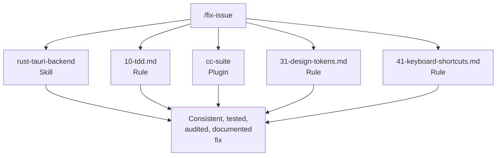

規則 + 技能 + 外掛 + 命令構成了複合系統。當你執行 `/fix-issue` 時，它使用 `rust-tauri-backend` 技能處理 Rust 變更，遵循 `10-tdd.md` 規則滿足測試要求，呼叫 `cc-suite` 進行稽核，檢查 `31-design-tokens.md` 確保 CSS 合規，並根據 `41-keyboard-shortcuts.md` 驗證快捷鍵同步。

沒有單獨哪一部分是革命性的。複合效應——13 條規則 x 19 個技能 x 7 個外掛 x 7 個命令，全部相互強化——才是系統運轉的原因。每一部分都是在發現缺口時新增的，在真實開發中測試，並透過使用來完善。

## 給外掛建構者的建議

如果你正在考慮建構 Claude Code 外掛，以下是 VMark 教給我們的：

1. **先為自己建構。** 最好的外掛解決的是你的實際問題，而非假設的問題。

2. **不斷自食其果。** 在你的真實專案中使用你的外掛。你發現的摩擦就是你的使用者將會發現的摩擦。

3. **鉤子需要逃生通道。** 無法被覆蓋的阻塞鉤子最終會被完全停用。讓強制執行成為可選的或具備上下文感知。

4. **跨模型驗證有效。** 讓不同的 AI 審查你主力 AI 的成果能捕獲真實 bug。這不是冗餘——這是正交的。

5. **編纂紀律，而非規則。** 最好的外掛改變習慣。tdd-guardian 的阻塞鉤子被移除了，但它們激發的覆蓋率攻堅計畫是專案中最具影響力的品質投入。

6. **組合，不要大一統。** 七個專注的外掛勝過一個巨型外掛。每個做好一件事，然後組合成大於各部分之和的工作流程。

7. **信任是逐次呼叫贏得的。** 開發者信任 cc-suite 到可以不審查發現就說「全部修復」的程度。這種信任是經過 27 次工作階段和 292 個已解決問題建立起來的。

---

*VMark 在 [github.com/xiaolai/vmark](https://github.com/xiaolai/vmark) 開源。全部七個外掛可在 `xiaolai` Claude Code 市集取得。*
